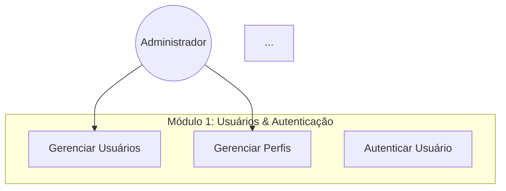

<!-- eef75cae-9da3-4a04-ac7f-c4733521b288 bcef640c-1cf3-498a-b3e2-2cf023cfb07b -->
# Documentação Completa de Modelagem de Dados - WorkConnect

## Objetivo

Criar documentação completa e diagramas profissionais explicando os modelos CONCEITUAL e LÓGICO do banco de dados WorkConnect, incluindo:

- Documentos explicativos simples e concisos
- Diagramas ERD, EER e Casos de Uso em Mermaid.js
- Exportação dos diagramas como imagens (PNG/SVG)

## Estrutura de Arquivos

```
presentation/
├── documentation/
│   ├── models/
│   │   ├── MODELO_CONCEITUAL_COMPLETO.md          # Documento único CONCEITUAL
│   │   ├── MODELO_LOGICO_COMPLETO.md              # Documento único LÓGICO
│   │   ├── MODELO_COMPLETO_CONSOLIDADO.md         # Documento consolidado (CONCEITUAL + LÓGICO)
│   │   └── README.md                              # Índice da documentação
│   └── diagrams/
│       ├── erd-conceitual.md                      # ERD Conceitual (Mermaid)
│       ├── eer-logico.md                          # EER Lógico (Mermaid)
│       ├── casos-de-uso.md                        # Casos de Uso (Mermaid)
│       └── README.md                              # Índice dos diagramas
├── diagrams/
│   ├── exports/
│   │   ├── erd-conceitual.png                     # Export PNG
│   │   ├── erd-conceitual.svg                     # Export SVG
│   │   ├── eer-logico.png                         # Export PNG
│   │   ├── eer-logico.svg                         # Export SVG
│   │   ├── casos-de-uso.png                       # Export PNG
│   │   └── casos-de-uso.svg                       # Export SVG
│   └── mermaid/
│       ├── erd-conceitual.mmd                     # Arquivo Mermaid original
│       ├── eer-logico.mmd                         # Arquivo Mermaid original
│       └── casos-de-uso.mmd                       # Arquivo Mermaid original
└── scripts/
    └── export-diagrams.js                         # Script Node.js para exportar diagramas
```

## Fase 1: Documentação do Modelo Conceitual

### Arquivo: `presentation/documentation/models/MODELO_CONCEITUAL_COMPLETO.md`

**Conteúdo:**

1. **Introdução ao Modelo Conceitual**

   - O que é modelagem conceitual
   - Objetivos e princípios
   - Abordagem do WorkConnect

2. **Entidades e Atributos** (por módulo)

   - Módulo 1: Usuários & Autenticação
     - PERFIL, USUARIO, SESSAO
   - Módulo 2: Inventário (Estoque)
     - CATEGORIA, PRODUTO, FORNECEDOR, ARMAZEM, MOVIMENTACAO_ESTOQUE, ALERTA_REPOSICAO
   - Módulo 3: Vendas
     - CLIENTE, CANAL_VENDA, VENDA, VENDA_ITEM, METODO_PAGAMENTO, PAGAMENTO
   - Módulo 4: Finanças
     - CATEGORIA_FINANCEIRA, CONTA_FINANCEIRA, TRANSACAO_FINANCEIRA
   - Módulo 5: Logística
     - TRANSPORTADORA, MOTORISTA, PEDIDO, PEDIDO_ITEM, ROTA, ENVIO
   - Módulo 6: Relatórios
     - RELATORIO
   - Módulo 7: Auditoria LGPD
     - AUDITORIA_LGPD

3. **Relacionamentos e Cardinalidades**

   - Tipos de relacionamento (1:1, 1:N, N:M)
   - Relacionamentos hierárquicos (self-referencing)
   - Tabelas de junção (junction tables)

4. **Regras de Negócio**

   - Regras de integridade
   - Regras de validação
   - Regras de conformidade LGPD

5. **Normalização**

   - Formas normais aplicadas
   - Decisões de desnormalização (se houver)

**Fonte de dados:** `presentation/erd/conceptual/entities.md`, `presentation/erd/conceptual/relationships.md`, `presentation/erd/conceptual/business-rules.md`

## Fase 2: Documentação do Modelo Lógico

### Arquivo: `presentation/documentation/models/MODELO_LOGICO_COMPLETO.md`

**Conteúdo:**

1. **Introdução ao Modelo Lógico**

   - O que é modelagem lógica
   - Mapeamento Conceitual → Lógico
   - Implementação MySQL

2. **Especificação de Tabelas** (por módulo)

   - Estrutura completa de cada tabela
   - Tipos de dados MySQL
   - Constraints (PRIMARY KEY, FOREIGN KEY, UNIQUE, CHECK)
   - Índices
   - Comentários e documentação

3. **Chaves Estrangeiras e Integridade Referencial**

   - Todas as FK definidas
   - Ações ON DELETE/ON UPDATE
   - Justificativas das ações

4. **Constraints e Validações**

   - CHECK constraints
   - UNIQUE constraints
   - NOT NULL constraints
   - Validações de formato (email, CNPJ, etc.)

5. **Otimizações e Performance**

   - Índices criados
   - Particionamento (se aplicável)
   - Considerações de performance

**Fonte de dados:** `presentation/erd/logical/tables-specification.md`, `presentation/erd/logical/relationships-specification.md`, `presentation/erd/logical/constraints-specification.md`, `database/schema-mysql.sql`

## Fase 3: Documento Consolidado

### Arquivo: `presentation/documentation/models/MODELO_COMPLETO_CONSOLIDADO.md`

**Conteúdo:**

1. **Visão Geral do Sistema**

   - Arquitetura geral
   - Módulos e suas responsabilidades
   - Fluxo de dados

2. **Modelo Conceitual** (resumo)

   - Entidades principais
   - Relacionamentos principais
   - Regras de negócio essenciais

3. **Modelo Lógico** (resumo)

   - Estrutura de tabelas
   - Integridade referencial
   - Constraints principais

4. **Mapeamento Conceitual → Lógico**

   - Como entidades viraram tabelas
   - Como relacionamentos viraram FKs
   - Decisões de implementação

5. **Princípios de Design**

   - Normalização
   - Performance
   - Escalabilidade
   - Conformidade LGPD
   - Manutenibilidade

6. **Estatísticas do Modelo**

   - Número de tabelas por módulo
   - Número de relacionamentos
   - Complexidade geral

## Fase 4: Diagrama ERD Conceitual (Mermaid)

### Arquivo: `presentation/documentation/diagrams/erd-conceitual.md`

**Diagrama Mermaid:**

- Usar sintaxe `erDiagram` do Mermaid
- Mostrar todas as entidades (27 tabelas)
- Mostrar relacionamentos com cardinalidades
- Agrupar por módulos usando cores
- Estilização cuidadosa para melhor visibilidade

**Estrutura:**

```mermaid
erDiagram
    %% Módulo 1: Usuários & Autenticação
    PERFIL ||--o{ USUARIO : "tem"
    USUARIO ||--o{ SESSAO : "possui"
    
    %% Módulo 2: Inventário
    CATEGORIA ||--o{ CATEGORIA : "subcategoria"
    CATEGORIA ||--o{ PRODUTO : "classifica"
    PRODUTO }o--o{ FORNECEDOR : "fornecido por"
    PRODUTO ||--o{ MOVIMENTACAO_ESTOQUE : "tem"
    ...
```

**Estilização:**

- Cores diferentes por módulo
- Labels claros
- Cardinalidades visíveis
- Agrupamento visual

## Fase 5: Diagrama EER Lógico (Mermaid)

### Arquivo: `presentation/documentation/diagrams/eer-logico.md`

**Diagrama Mermaid:**

- Usar sintaxe `erDiagram` do Mermaid
- Mostrar todas as tabelas com tipos de dados principais
- Mostrar chaves primárias (PK)
- Mostrar chaves estrangeiras (FK)
- Mostrar constraints importantes
- Agrupar por módulos

**Estrutura:**

```mermaid
erDiagram
    %% Módulo 1: Usuários & Autenticação
    perfil {
        bigint id PK
        varchar nome UK
        json permissoes
    }
    usuario {
        bigint id PK
        varchar email UK
        bigint perfil_id FK
    }
    perfil ||--o{ usuario : "fk_usuario_perfil"
    ...
```

**Estilização:**

- Cores por módulo
- Destaque para PKs e FKs
- Tipos de dados visíveis
- Constraints indicadas

## Fase 6: Diagrama de Casos de Uso (Mermaid)

### Arquivo: `presentation/documentation/diagrams/casos-de-uso.md`

**Diagrama Mermaid:**

- Usar sintaxe `graph` ou `flowchart` do Mermaid
- Mostrar atores (Administrador, Gerente, Operador, Consulta, Vendedor, Sistema)
- Mostrar casos de uso por módulo
- Mostrar relacionamentos ator ↔ caso de uso
- Agrupar por módulos

**Estrutura:**



**Estilização:**

- Cores por módulo
- Formas diferentes para atores e casos de uso
- Agrupamento visual claro

**Fonte de dados:** `docs/diagrams/use-cases/diagrama-casos-de-uso-estoque.md`, `doc/diagrama-casos-de-uso-estoque.md`

## Fase 7: Script de Exportação

### Arquivo: `presentation/scripts/export-diagrams.js`

**Funcionalidades:**

- Usar `@mermaid-js/mermaid-cli` para exportar diagramas
- Ler arquivos `.md` com código Mermaid
- Exportar para PNG (alta resolução)
- Exportar para SVG (vetorial)
- Salvar em `presentation/diagrams/exports/`

**Dependências:**

- `@mermaid-js/mermaid-cli` (npm package)
- Node.js

**Uso:**

```bash
node presentation/scripts/export-diagrams.js
```

## Fase 8: Documentação de Apoio

### Arquivo: `presentation/documentation/models/README.md`

**Conteúdo:**

- Índice da documentação
- Links para todos os documentos
- Guia de navegação
- Explicação da estrutura

### Arquivo: `presentation/documentation/diagrams/README.md`

**Conteúdo:**

- Índice dos diagramas
- Links para todos os diagramas
- Instruções de visualização
- Instruções de exportação

## Detalhes Técnicos

### Estilização Mermaid

**Cores por Módulo:**

- Módulo 1 (Usuários): `#3b82f6` (azul)
- Módulo 2 (Inventário): `#10b981` (verde)
- Módulo 3 (Vendas): `#f59e0b` (laranja)
- Módulo 4 (Finanças): `#8b5cf6` (roxo)
- Módulo 5 (Logística): `#ec4899` (rosa)
- Módulo 6 (Relatórios): `#6366f1` (índigo)
- Módulo 7 (Auditoria): `#ef4444` (vermelho)

**Aplicação de estilos:**

```mermaid
%% Exemplo de estilo
style PERFIL fill:#3b82f6,color:#fff
style USUARIO fill:#3b82f6,color:#fff
```

### Exportação de Diagramas

**Configuração:**

- PNG: 300 DPI, fundo branco
- SVG: vetorial, fundo transparente
- Tamanho: ajustar para melhor visualização

**Ferramenta:**

- `mmdc` (Mermaid CLI) via `@mermaid-js/mermaid-cli`

## Checklist de Implementação

- [ ] Criar `MODELO_CONCEITUAL_COMPLETO.md`
- [ ] Criar `MODELO_LOGICO_COMPLETO.md`
- [ ] Criar `MODELO_COMPLETO_CONSOLIDADO.md`
- [ ] Criar `erd-conceitual.md` com diagrama Mermaid
- [ ] Criar `eer-logico.md` com diagrama Mermaid
- [ ] Criar `casos-de-uso.md` com diagrama Mermaid
- [ ] Criar `export-diagrams.js`
- [ ] Criar `README.md` para documentação
- [ ] Criar `README.md` para diagramas
- [ ] Executar script de exportação
- [ ] Verificar qualidade dos diagramas exportados
- [ ] Atualizar índices e navegação

## Arquivos de Referência

- `database/schema-mysql.sql` - Schema completo MySQL
- `presentation/erd/conceptual/entities.md` - Entidades conceituais
- `presentation/erd/conceptual/relationships.md` - Relacionamentos conceituais
- `presentation/erd/conceptual/business-rules.md` - Regras de negócio
- `presentation/erd/logical/tables-specification.md` - Especificação de tabelas
- `presentation/erd/logical/relationships-specification.md` - Especificação de FKs
- `presentation/erd/logical/constraints-specification.md` - Especificação de constraints
- `docs/diagrams/use-cases/diagrama-casos-de-uso-estoque.md` - Casos de uso existentes

### To-dos

- [x] Schema MySQL corrigido - compatível com MySQL 9.5+
- [x] Constraints problemáticas removidas (chk_nao_circular)
- [x] TINYINT(1) trocado por BOOLEAN
- [x] DROP TABLE IF EXISTS adicionado para limpeza
- [x] Todas as constraints duplicadas renomeadas para nomes únicos