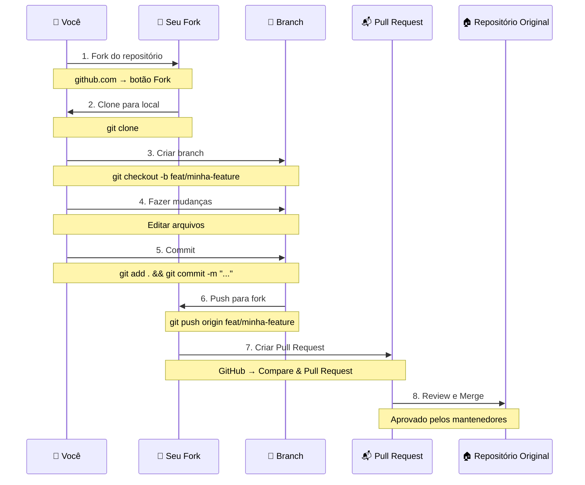

# 🤝 Guia de Contribuição - WorkConnect

Obrigado por seu interesse em contribuir com o WorkConnect! Este guia vai te ajudar a fazer sua primeira contribuição, mesmo que você nunca tenha usado Git/GitHub antes.

---

## 📋 Índice

- [Código de Conduta](#-código-de-conduta)
- [Antes de Começar](#-antes-de-começar)
- [Configuração do Ambiente](#-configuração-do-ambiente)
- [Fluxo de Contribuição](#-fluxo-de-contribuição)
- [Comandos Git Essenciais](#-comandos-git-essenciais)
- [Padrões de Código](#-padrões-de-código)
- [Tipos de Contribuição](#-tipos-de-contribuição)
- [Processo de Pull Request](#-processo-de-pull-request)
- [Templates](#-templates)
- [FAQ](#-faq)

---

## 🤝 Código de Conduta

### Nosso Compromisso

Estamos comprometidos em tornar a participação neste projeto uma experiência livre de assédio para todos, independentemente de:
- Nível de experiência
- Gênero e identidade
- Orientação sexual
- Deficiência
- Aparência pessoal
- Raça ou etnia
- Idade ou religião

### Comportamento Esperado

✅ **Seja respeitoso** com outros contribuidores  
✅ **Aceite críticas construtivas** com gentileza  
✅ **Foque no que é melhor** para o projeto  
✅ **Mostre empatia** com outros membros  
✅ **Seja paciente** com iniciantes

### Comportamento Inaceitável

❌ Linguagem ou imagens sexualizadas  
❌ Comentários insultuosos ou depreciativos  
❌ Assédio público ou privado  
❌ Publicar informações privadas de terceiros  
❌ Outras condutas consideradas inapropriadas

---

## 📖 Antes de Começar

### 1. Leia a Documentação

- [ ] [README.md](./README.md) - Visão geral do projeto
- [ ] [ROADMAP.md](./ROADMAP.md) - Planejamento e fases
- [ ] [Documentação Técnica](./doc/INDEX-DIAGRAMAS.md)

### 2. Entenda o Projeto

- O que o WorkConnect faz?
- Qual módulo você quer contribuir?
- Que tipo de contribuição pretende fazer?

### 3. Verifique Issues Abertas

- [Issues](https://github.com/seu-usuario/workconnect/issues)
- Procure por labels: `good first issue`, `help wanted`
- Comente na Issue antes de começar

---

## 🛠️ Configuração do Ambiente

### Passo 1: Instalar Git

#### Windows
1. Baixe em [git-scm.com](https://git-scm.com/download/win)
2. Execute o instalador
3. Use as opções padrão

#### Mac
```bash
brew install git
```

Ou baixe em [git-scm.com](https://git-scm.com/download/mac)

#### Linux (Ubuntu/Debian)
```bash
sudo apt update
sudo apt install git
```

**Verificar instalação:**
```bash
git --version
```

### Passo 2: Configurar Git

```bash
git config --global user.name "Seu Nome"
git config --global user.email "seu-email@exemplo.com"
```

### Passo 3: Instalar VS Code

1. Baixe em [code.visualstudio.com](https://code.visualstudio.com/)
2. Instale normalmente
3. Abra o VS Code

### Passo 4: Extensões Recomendadas do VS Code

Instale estas extensões:

```
1. Live Server (ritwickdey.LiveServer)
   - Para testar o projeto localmente

2. Prettier (esbenp.prettier-vscode)
   - Formatação automática de código

3. ESLint (dbaeumer.vscode-eslint)
   - Linter para JavaScript

4. HTML CSS Support (ecmel.vscode-html-css)
   - Autocomplete para HTML/CSS

5. GitLens (eamodio.gitlens)
   - Ferramentas Git integradas
```

### Passo 5: Fork e Clone

#### 5.1. Fazer Fork no GitHub
1. Acesse o [repositório original](https://github.com/seu-usuario/workconnect)
2. Clique no botão **"Fork"** no canto superior direito
3. Aguarde o fork ser criado (vai para `seu-usuario/workconnect`)

#### 5.2. Clonar Seu Fork
```bash
git clone https://github.com/SEU-USUARIO/workconnect.git
cd workconnect
```

#### 5.3. Adicionar Repositório Original (Upstream)
```bash
git remote add upstream https://github.com/usuario-original/workconnect.git
```

**Verificar remotes:**
```bash
git remote -v
```

Você deve ver:
```
origin    https://github.com/SEU-USUARIO/workconnect.git (fetch)
origin    https://github.com/SEU-USUARIO/workconnect.git (push)
upstream  https://github.com/usuario-original/workconnect.git (fetch)
upstream  https://github.com/usuario-original/workconnect.git (push)
```

---

## 🔄 Fluxo de Contribuição

### Diagrama Visual do Fluxo



### Fluxo Passo a Passo

#### 1️⃣ Sincronizar com Repositório Original

Antes de começar, sempre sincronize:

```bash
git checkout main
git fetch upstream
git merge upstream/main
git push origin main
```

#### 2️⃣ Criar uma Branch

**Nomenclatura de Branches:**

| Tipo | Prefixo | Exemplo |
|------|---------|---------|
| Nova Feature | `feat/` | `feat/validacao-cpf` |
| Correção de Bug | `fix/` | `fix/corrige-calculo-estoque` |
| Documentação | `docs/` | `docs/atualiza-readme` |
| Melhorias | `improve/` | `improve/performance-graficos` |
| Refatoração | `refactor/` | `refactor/reorganiza-css` |

**Criar e mudar para branch:**

```bash
git checkout -b feat/nome-da-feature
```

#### 3️⃣ Fazer Mudanças

Edite os arquivos necessários no VS Code.

**Dicas:**
- Faça mudanças pequenas e focadas
- Teste localmente antes de commitar
- Siga os [padrões de código](#-padrões-de-código)

#### 4️⃣ Testar Localmente

**Com Live Server:**
1. Abra o arquivo no VS Code
2. Clique direito → "Open with Live Server"
3. Teste todas as funcionalidades modificadas

**Ou diretamente no navegador:**
```bash
# Na pasta do projeto
open app/dash.html  # Mac
start app/dash.html # Windows
xdg-open app/dash.html # Linux
```

#### 5️⃣ Fazer Commit

**Ver arquivos modificados:**
```bash
git status
```

**Adicionar arquivos ao staging:**
```bash
# Adicionar todos
git add .

# Ou adicionar específicos
git add app/dash.html
git add app/dashboard/js/dash.js
```

**Fazer commit com mensagem descritiva:**
```bash
git commit -m "feat: adiciona validação de CPF no cadastro"
```

> **Importante:** Siga o padrão [Conventional Commits](#padrão-de-commits)

#### 6️⃣ Push para Seu Fork

```bash
git push origin feat/nome-da-feature
```

#### 7️⃣ Criar Pull Request

1. Acesse seu fork no GitHub
2. Você verá um banner: **"Compare & pull request"**
3. Clique no botão
4. Preencha o template de PR (veja [Templates](#-templates))
5. Clique em **"Create pull request"**

#### 8️⃣ Code Review

- Aguarde review dos mantenedores
- Responda comentários se houver
- Faça ajustes se solicitado
- Aguarde aprovação e merge

---

## 💻 Comandos Git Essenciais

### Cheatsheet

| Comando | Descrição |
|---------|-----------|
| `git status` | Ver estado dos arquivos (modificados, staged, etc) |
| `git log` | Ver histórico de commits |
| `git log --oneline` | Ver histórico resumido |
| `git diff` | Ver diferenças antes de commitar |
| `git add <arquivo>` | Adicionar arquivo específico ao staging |
| `git add .` | Adicionar todos os arquivos modificados |
| `git commit -m "mensagem"` | Criar commit com mensagem |
| `git push origin <branch>` | Enviar commits para repositório remoto |
| `git pull origin <branch>` | Baixar mudanças do remoto |
| `git checkout <branch>` | Mudar para outra branch |
| `git checkout -b <branch>` | Criar e mudar para nova branch |
| `git branch` | Listar branches locais |
| `git branch -d <branch>` | Deletar branch local |
| `git fetch upstream` | Baixar mudanças do repositório original |
| `git merge upstream/main` | Mesclar mudanças do original |

### Comandos Avançados

#### Desfazer mudanças não commitadas
```bash
git checkout -- <arquivo>
```

#### Desfazer último commit (mantém mudanças)
```bash
git reset --soft HEAD~1
```

#### Ver diferenças de um arquivo específico
```bash
git diff app/dash.html
```

#### Stash (guardar mudanças temporariamente)
```bash
git stash         # Guardar
git stash pop     # Recuperar
git stash list    # Listar stashes
```

---

## 📐 Padrões de Código

### HTML

#### Estrutura Semântica
```html
<!-- ✅ BOM -->
<header>
    <nav>
        <ul>
            <li><a href="#home">Home</a></li>
        </ul>
    </nav>
</header>

<!-- ❌ EVITE -->
<div class="header">
    <div class="nav">
        <div class="menu">...</div>
    </div>
</div>
```

#### Acessibilidade
```html
<!-- ✅ BOM -->
<button aria-label="Fechar modal">
    <i class="fas fa-times"></i>
</button>


<!-- ❌ EVITE -->
<button><i class="fas fa-times"></i></button>

```

#### Indentação
- **Use 4 espaços** para indentação
- Mantenha hierarquia visual clara

```html
<!-- ✅ BOM -->
<div class="card">
    <div class="card-header">
        <h3>Título</h3>
    </div>
    <div class="card-body">
        <p>Conteúdo</p>
    </div>
</div>
```

---

### CSS

#### Use Variáveis CSS
```css
/* ✅ BOM */
.card {
    background-color: var(--cor-fundo-cards);
    color: var(--cor-texto-principal);
}

/* ❌ EVITE */
.card {
    background-color: rgba(41, 37, 36, 0.5);
    color: #f5f5f5;
}
```

#### Nomenclatura (BEM Opcional)
```css
/* ✅ BOM - Classes descritivas */
.card { }
.card-header { }
.card-title { }
.card-body { }

/* ✅ BEM (opcional) */
.card { }
.card__header { }
.card__title { }
.card__body { }
```

#### Organização
```css
/* Agrupe propriedades relacionadas */
.card {
    /* Layout */
    display: flex;
    flex-direction: column;
    
    /* Box Model */
    padding: 1.5rem;
    margin: 1rem;
    
    /* Visual */
    background-color: var(--cor-fundo-cards);
    border-radius: 16px;
    
    /* Tipografia */
    font-family: var(--font-principal);
    color: var(--cor-texto-principal);
    
    /* Efeitos */
    transition: transform 0.3s ease;
}
```

---

### JavaScript

#### ES6+ Moderno
```javascript
// ✅ BOM - Arrow functions, const/let
const calcularTotal = (items) => {
    return items.reduce((total, item) => total + item.valor, 0);
};

// ❌ EVITE - Funções antigas, var
var calcularTotal = function(items) {
    var total = 0;
    for (var i = 0; i < items.length; i++) {
        total += items[i].valor;
    }
    return total;
};
```

#### Funções Puras
```javascript
// ✅ BOM - Função pura (não modifica entrada)
const adicionarDesconto = (valor, desconto) => {
    return valor * (1 - desconto / 100);
};

// ❌ EVITE - Modifica variável global
let valorGlobal = 100;
function aplicarDesconto(desconto) {
    valorGlobal *= (1 - desconto / 100);
}
```

#### Nomenclatura camelCase
```javascript
// ✅ BOM
const nomeCompleto = "João Silva";
const calcularValorTotal = () => {};
const itemVenda = {};

// ❌ EVITE
const nome_completo = "João Silva";
const calcular_valor_total = () => {};
const ItemVenda = {};
```

#### Comentários Úteis
```javascript
// ✅ BOM - Explica o "porquê"
// Multiplicamos por 100 para evitar problemas com float
const precoEmCentavos = preco * 100;

// ❌ EVITE - Explica o "o quê" (óbvio)
// Incrementa i
i++;
```

---

### Padrão de Commits

Usamos **Conventional Commits** para mensagens claras e consistentes.

#### Formato

```
<tipo>(<escopo>): <descrição curta>

[corpo opcional]

[rodapé opcional]
```

#### Tipos

| Tipo | Descrição | Exemplo |
|------|-----------|---------|
| `feat` | Nova funcionalidade | `feat: adiciona validação de email` |
| `fix` | Correção de bug | `fix: corrige cálculo de estoque` |
| `docs` | Documentação | `docs: atualiza README com exemplos` |
| `style` | Formatação, espaços | `style: formata código com Prettier` |
| `refactor` | Refatoração de código | `refactor: simplifica função de export` |
| `test` | Adicionar testes | `test: adiciona teste de validação` |
| `chore` | Tarefas de manutenção | `chore: atualiza dependências` |
| `improve` | Melhorias | `improve: otimiza performance de gráficos` |

#### Exemplos Reais

```bash
# Nova feature
git commit -m "feat: adiciona botão de exportar PDF no relatório"

# Bug fix
git commit -m "fix: corrige bug que duplicava itens na to-do list"

# Documentação
git commit -m "docs: adiciona seção de contribuição no README"

# Melhorias
git commit -m "improve: otimiza carregamento de gráficos com lazy loading"

# Com escopo
git commit -m "feat(dashboard): adiciona widget de alertas de estoque"

# Com corpo explicativo
git commit -m "fix(vendas): corrige cálculo de desconto

O desconto estava sendo aplicado incorretamente quando
havia múltiplos itens na venda. Agora calcula corretamente
o desconto proporcional a cada item."
```

---

## 🎨 Tipos de Contribuição

### 🐛 Reportar Bugs

**Como reportar:**
1. Verifique se o bug já foi reportado
2. Use o template de Issue
3. Seja específico e detalhado
4. Adicione screenshots se possível

**Template:** [Ver abaixo](#template-de-issue-bug-report)

---

### ✨ Sugerir Features

**Como sugerir:**
1. Verifique o [ROADMAP](./ROADMAP.md)
2. Veja se já não foi sugerido
3. Descreva o problema que resolve
4. Proponha uma solução

**Template:** [Ver abaixo](#template-de-issue-feature-request)

---

### 📝 Melhorar Documentação

**O que melhorar:**
- Corrigir erros de digitação
- Clarificar instruções confusas
- Adicionar exemplos práticos
- Traduzir documentação
- Melhorar comentários no código

**Arquivos principais:**
- `README.md`
- `CONTRIBUTING.md`
- `ROADMAP.md`
- `/doc/*.md`
- Comentários em JS/HTML/CSS

---

### 💻 Implementar Código

**Áreas para contribuir:**

#### Iniciante
- Adicionar validações de formulário
- Melhorar mensagens de erro
- Adicionar máscaras de input (CPF, telefone)
- Corrigir bugs simples

#### Intermediário
- Implementar LocalStorage
- CRUD completo de entidades
- Melhorar gráficos interativos
- Sistema de filtros avançados

#### Avançado
- Implementar backend (API REST)
- Integração com banco de dados
- Sistema de autenticação
- Integração RFID

---

### 🎨 Melhorar Design

**O que melhorar:**
- Responsividade mobile
- Acessibilidade (contraste, tamanhos)
- Animações e transições
- Ícones e ilustrações
- Tema claro (opcional)

---

### ✅ Adicionar Testes

**Tipos de teste:**
- Testes unitários (Jest)
- Testes de integração
- Testes E2E (Playwright)
- Testes de acessibilidade

---

## 📬 Processo de Pull Request

### Passo a Passo

#### 1. Verifique sua Branch
```bash
git branch
# Deve estar em feat/sua-feature
```

#### 2. Commit e Push
```bash
git add .
git commit -m "feat: sua mensagem"
git push origin feat/sua-feature
```

#### 3. Abrir PR no GitHub

1. Acesse seu fork no GitHub
2. Clique em **"Compare & pull request"**
3. Preencha o template:
   - Título claro
   - Descrição detalhada
   - Tipo de mudança
   - Como testar
   - Checklist completo

#### 4. Aguardar Review

Mantenedores irão:
- Revisar o código
- Testar funcionalidades
- Fazer comentários se necessário
- Aprovar ou solicitar mudanças

#### 5. Fazer Ajustes (se necessário)

Se mudanças forem solicitadas:

```bash
# Fazer ajustes nos arquivos
git add .
git commit -m "fix: ajusta conforme review"
git push origin feat/sua-feature
```

O PR será atualizado automaticamente.

#### 6. Merge

Após aprovação:
- Mantenedor fará o merge
- Sua branch será mergeada na `main`
- Parabéns! Sua contribuição foi aceita! 🎉

---

## 📋 Templates

### Template de Pull Request

```markdown
## 📝 Descrição

Descreva claramente o que este PR faz.

Exemplo: "Adiciona validação de CPF no formulário de cadastro de clientes"

## 🔧 Tipo de Mudança

Marque com `x` o que se aplica:

- [ ] 🐛 Bug fix (correção de problema)
- [ ] ✨ Nova feature (nova funcionalidade)
- [ ] 💥 Breaking change (mudança que quebra compatibilidade)
- [ ] 📝 Documentação (atualização de docs)
- [ ] 🎨 UI/UX (melhorias visuais)
- [ ] ♻️ Refatoração (melhoria de código sem alterar funcionalidade)
- [ ] ⚡ Performance (otimização)

## 🧪 Como Testar

Descreva os passos para testar sua mudança:

1. Acesse a página `app/cadastro.html`
2. Preencha o campo CPF com `123.456.789-00`
3. Clique em "Salvar"
4. Verifique se a validação funciona

## 📸 Screenshots (se aplicável)

Adicione prints antes/depois se for mudança visual.

## ✅ Checklist

Marque com `x` após completar:

- [ ] Meu código segue os padrões do projeto
- [ ] Fiz self-review do meu código
- [ ] Comentei código complexo quando necessário
- [ ] Atualizei a documentação se necessário
- [ ] Testei localmente todas as funcionalidades
- [ ] Não introduzi novos warnings ou erros
- [ ] Funcionou em diferentes navegadores (Chrome, Firefox, Edge)

## 📎 Issues Relacionadas

Fecha #123 (se aplicável)
Relacionado a #456
```

### Template de Issue (Bug Report)

```markdown
## 🐛 Descrição do Bug

Descreva claramente o bug encontrado.

## 📝 Passos para Reproduzir

1. Acesse '...'
2. Clique em '....'
3. Role até '....'
4. Veja o erro

## ✅ Comportamento Esperado

Descreva o que deveria acontecer.

## ❌ Comportamento Atual

Descreva o que está acontecendo de errado.

## 📸 Screenshots

Adicione prints do erro se possível.

## 💻 Ambiente

- **OS:** Windows 10 / Mac OS / Linux
- **Navegador:** Chrome 118 / Firefox 119 / Edge 118
- **Versão do Projeto:** 1.0.0

## 📎 Informações Adicionais

Qualquer outra informação relevante sobre o bug.
```

### Template de Issue (Feature Request)

```markdown
## ✨ Descrição da Feature

Descreva claramente a funcionalidade que você gostaria de ver implementada.

## 🎯 Problema que Resolve

Explique qual problema esta feature resolve ou qual necessidade atende.

Exemplo: "Atualmente não é possível filtrar vendas por período, o que dificulta a análise mensal."

## 💡 Solução Proposta

Descreva como você imagina que esta feature deveria funcionar.

## 🎨 Alternativas Consideradas

Descreva alternativas que você considerou.

## 📎 Contexto Adicional

Adicione qualquer outra informação, screenshots, mockups, etc.

## 🗺️ Alinhamento com Roadmap

Esta feature está alinhada com:
- [ ] FASE 1 - MVP
- [ ] FASE 2 - Features Avançadas
- [ ] FASE 3 - Backend
- [ ] Outra fase (especificar)
```

---

## ❓ FAQ

### Perguntas Frequentes de Contribuição

#### Como sincronizar meu fork com o repositório original?

```bash
# 1. Baixar mudanças do original
git fetch upstream

# 2. Mudar para main
git checkout main

# 3. Mesclar mudanças
git merge upstream/main

# 4. Enviar para seu fork
git push origin main
```

---

#### Como resolver conflitos?

Quando há conflitos:

```bash
# Git mostrará os arquivos em conflito
git status

# Abra os arquivos e resolva manualmente
# Procure por <<<<<<< HEAD, =======, >>>>>>> 

# Após resolver:
git add .
git commit -m "resolve: conflitos com main"
git push origin sua-branch
```

---

#### Quanto tempo para meu PR ser revisado?

- **PRs simples:** 1-3 dias
- **PRs complexos:** 3-7 dias
- **Dependendo da disponibilidade** dos mantenedores

**Dica:** PRs menores são revisados mais rápido!

---

#### Posso trabalhar em múltiplas features ao mesmo tempo?

Sim, mas use branches separadas:

```bash
git checkout main
git checkout -b feat/feature-1

# Trabalhar em feature 1...

git checkout main
git checkout -b feat/feature-2

# Trabalhar em feature 2...
```

---

#### Como pedir ajuda?

1. **Issues:** Comente na Issue relacionada
2. **Discussions:** Use [GitHub Discussions](https://github.com/seu-usuario/workconnect/discussions)
3. **Email:** Contate os mantenedores

Sempre forneça:
- Contexto da dúvida
- O que você já tentou
- Mensagens de erro (se houver)

---

#### Meu PR foi rejeitado. E agora?

Não desanime! Isso é normal. Motivos comuns:
- Não segue padrões do projeto
- Falta de testes
- Mudança muito grande
- Não alinhado com roadmap

**O que fazer:**
1. Leia os comentários do review
2. Faça os ajustes solicitados
3. Reenvie o PR

Ou:
- Comece com algo menor
- Peça orientação antes de iniciar

---

#### Posso contribuir sem saber programar?

**Sim!** Contribuições valiosas:
- 📝 Melhorar documentação
- 🐛 Reportar bugs detalhadamente
- ✨ Sugerir melhorias
- 🎨 Criar mockups de design
- 📹 Criar tutoriais
- 🌍 Traduzir documentação

---

## 🎉 Parabéns!

Você chegou ao fim do guia! Agora está pronto para fazer sua primeira contribuição.

**Próximos passos:**
1. ✅ Configure seu ambiente
2. ✅ Escolha uma Issue para trabalhar
3. ✅ Siga o fluxo de contribuição
4. ✅ Abra seu primeiro PR

**Lembre-se:** Todo desenvolvedor foi iniciante um dia. Não tenha medo de errar e perguntar!

---

<div align="center">

**Obrigado por contribuir com o WorkConnect! 🙏**

[🏠 Voltar ao README](./README.md) · [🗺️ Ver Roadmap](./ROADMAP.md)

</div>

