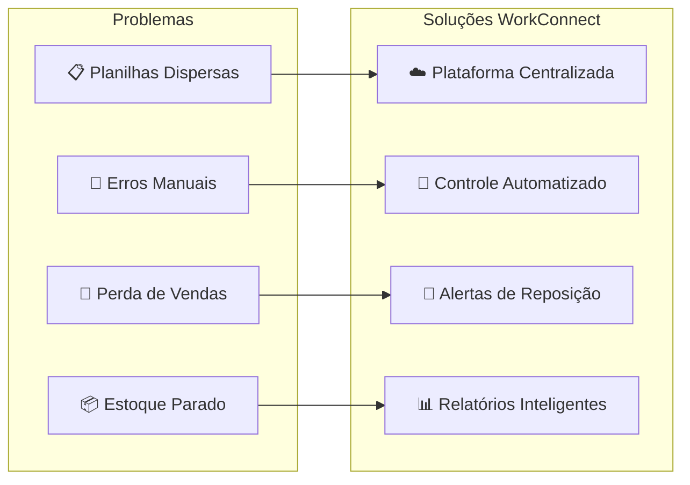
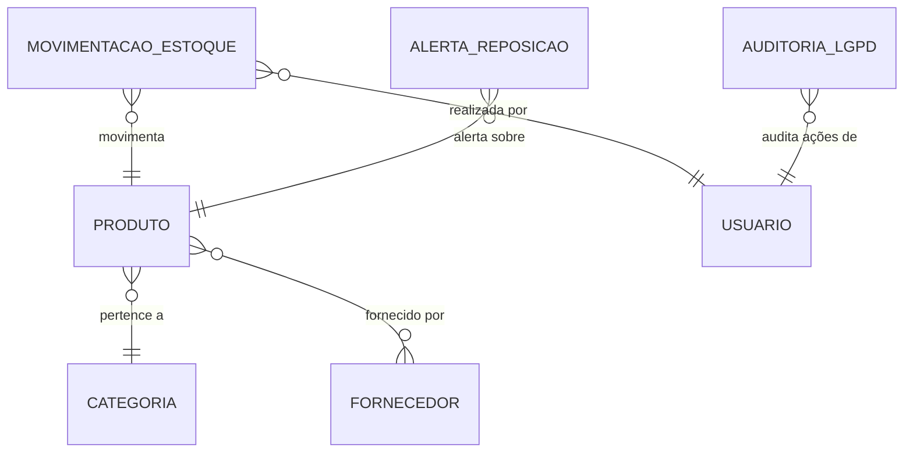
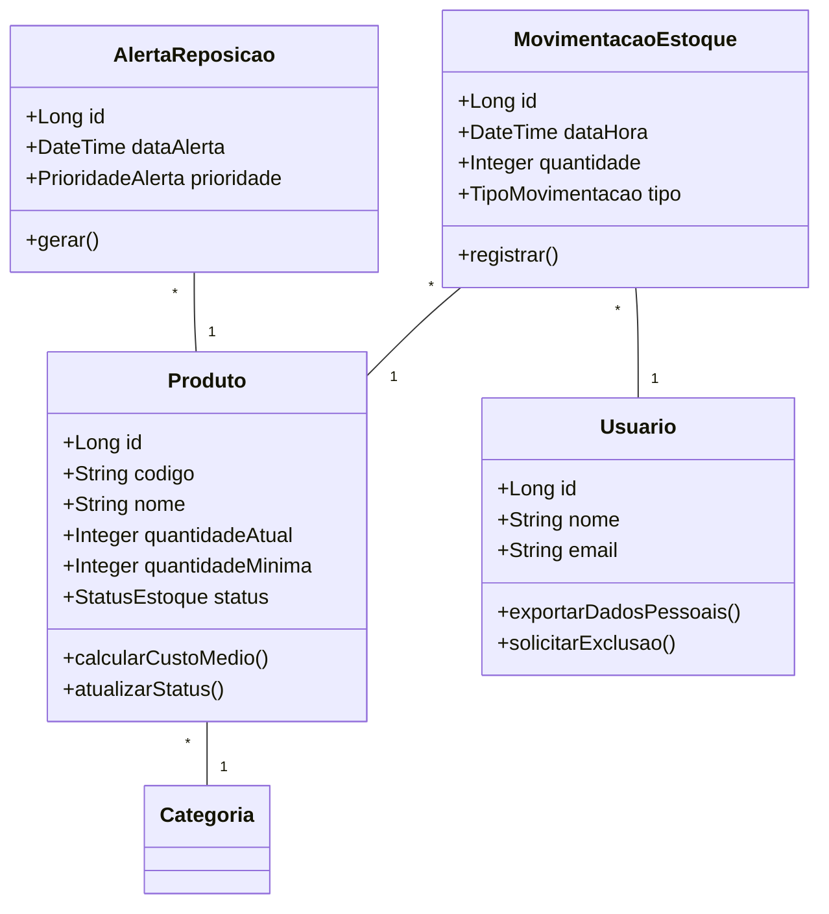

# Documentação Completa do Projeto WorkConnect

## Índice

1.  **Introdução**
    *   O que é o WorkConnect?
    *   Contexto Acadêmico
    *   Público-Alvo
2.  **Análise de Negócio**
    *   O Problema: As Dores das PMEs
    *   A Solução: Como o WorkConnect Resolve
    *   Benefícios Quantificados
3.  **Arquitetura do Sistema**
    *   Visão Geral da Arquitetura
    *   Estrutura de Diretórios
    *   Tecnologias Utilizadas
4.  **Modelagem do Banco de Dados**
    *   Modelo Conceitual (MER)
    *   Diagrama de Classes (UML)
    *   Modelo Físico (DER)
    *   Scripts SQL e Estrutura das Tabelas
5.  **Funcionalidades do Sistema (Casos de Uso)**
    *   Dashboard
    *   Gestão de Produtos
    *   Gestão de Fornecedores
    *   Movimentações de Estoque
    *   Alertas Automáticos
    *   Relatórios
    *   Configurações e LGPD
6.  **Destaques da Implementação de Código**
    *   Estrutura do Frontend (Next.js e React)
    *   Gerenciamento de Estado
    *   Integração com a Base de Dados
7.  **Segurança e Conformidade com a LGPD**
    *   Dados Coletados e Bases Legais
    *   Direitos dos Titulares e Como Exercê-los
    *   Implementação Técnica da Conformidade
    *   Auditoria e Logs
8.  **Conclusão**
    *   Roadmap Futuro
    *   Como Contribuir

---

## 1. Introdução

### O que é o WorkConnect?

O WorkConnect é uma plataforma digital de gestão de estoque, concebida para atender às necessidades específicas de **Pequenas e Médias Empresas (PMEs)**. A solução visa substituir controles manuais e planilhas descentralizadas por um sistema centralizado, inteligente e automatizado. O objetivo principal é eliminar perdas, otimizar o capital de giro imobilizado em estoque e aumentar a eficiência operacional das empresas.

### Contexto Acadêmico

Este projeto foi desenvolvido como **Trabalho de Conclusão de Curso (TCC)** para o curso Técnico em Desenvolvimento de Sistemas do **SENAI (Serviço Nacional de Aprendizagem Industrial)**, durante o período de 2024-2025. Ele representa a aplicação prática dos conhecimentos adquiridos em engenharia de software, modelagem de dados, desenvolvimento de aplicações e conformidade legal.

### Público-Alvo

O sistema é desenhado para PMEs com as seguintes características:

*   **Faturamento Anual:** Entre R$ 360.000 e R$ 4.800.000.
*   **Número de Funcionários:** De 1 a 50 colaboradores.
*   **Setores:** Varejo, Indústria Leve, Serviços e outros que necessitem de controle de inventário.

---

## 2. Análise de Negócio

### O Problema: As Dores das PMEs

PMEs frequentemente enfrentam desafios significativos na gestão de estoque, que impactam diretamente sua lucratividade e competitividade. Os principais problemas identificados são:

| Problema                  | Impacto Direto                                      |
| ------------------------- | --------------------------------------------------- |
| **Dados Fragmentados**    | Informações espalhadas em planilhas, cadernos e e-mails, gerando inconsistência. |
| **Erros de Contagem**     | Divergências entre o estoque físico e o registrado, levando a decisões equivocadas. |
| **Falta de Estoque**      | Perda de vendas e de clientes por não ter o produto disponível quando necessário. |
| **Excesso de Estoque**    | Capital de giro parado em produtos obsoletos ou de baixa rotatividade, aumentando custos. |
| **Processos Manuais**     | Tempo excessivo gasto em tarefas repetitivas de controle, que poderiam ser automatizadas. |

### A Solução: Como o WorkConnect Resolve

O WorkConnect ataca esses problemas com uma abordagem integrada e automatizada:



### Benefícios Quantificados

A implementação do WorkConnect visa proporcionar retornos mensuráveis para as PMEs:

*   **Redução de 40%** nas perdas por falta de estoque.
*   **Economia de 30%** em custos de armazenamento e obsolescência.
*   **Ganho de 15 horas/semana** por funcionário em tarefas de gestão.
*   **Aumento de 99%** na precisão do inventário.
*   **Retorno sobre o Investimento (ROI)** estimado de **150%** no primeiro ano de uso.

---

## 3. Arquitetura do Sistema

### Visão Geral da Arquitetura

O sistema foi planejado com uma arquitetura moderna, escalável e modular, separando as responsabilidades em camadas distintas.

```mermaid
graph TB
    subgraph "👤 Camada de Apresentação"
        Web[🌐 Aplicação Web<br/>Next.js + React]
        Mobile[📱 App Móvel (Futuro)<br/>React Native]
    end

    subgraph "⚙️ Camada de Aplicação (Backend - Futuro)"
        API[🔌 API REST<br/>Node.js + Express]
        Auth[🔐 Autenticação<br/>JWT + OAuth 2.0]
    end

    subgraph "💾 Camada de Dados"
        DB[(🗄️ Banco de Dados<br/>PostgreSQL)]
        Cache[(⚡ Cache<br/>Redis - Opcional)]
    end

    subgraph "🔒 Conformidade"
        LGPD[📜 Auditoria LGPD<br/>Logs + Anonimização]
    end

    Web --> API
    Mobile --> API
    API --> Auth
    API --> DB
    API --> Cache
    API --> LGPD
    LGPD --> DB
```

Atualmente, o projeto está na fase de MVP (Produto Mínimo Viável), com o frontend e a camada de dados sendo o foco principal.

### Estrutura de Diretórios

O projeto segue uma estrutura de diretórios organizada por domínio e responsabilidade:

```
/
├── src/
│   ├── app/                # Rotas e páginas principais (Next.js App Router)
│   │   └── estoque/        # Módulo principal de gestão de estoque
│   ├── components/         # Componentes React reutilizáveis
│   │   └── estoque/        # Componentes específicos do módulo de estoque
│   ├── lib/                # Lógica de negócio, hooks e utilitários
│   │   ├── estoque/
│   │   └── utils/
│   ├── styles/             # Estilos globais
│   └── types/              # Definições de tipos TypeScript
├── database/               # Scripts SQL, migrations e seeds (Planejado)
├── doc/                    # Documentação técnica (Diagramas, etc.)
└── ...                     # Arquivos de configuração (package.json, etc.)
```

### Tecnologias Utilizadas

| Camada    | Tecnologia       | Justificativa                                        |
| --------- | ---------------- | ---------------------------------------------------- |
| Frontend  | **Next.js/React**| Framework moderno para interfaces reativas e componentizadas. |
| Estilização| **CSS Modules**    | Escopo local para estilos, evitando conflitos.     |
| Banco de Dados | **PostgreSQL**   | Banco relacional robusto, com suporte a transações e conformidade ACID. |
| ORM (Planejado)| **Sequelize**    | Mapeamento objeto-relacional para Node.js, facilitando a interação com o banco. |
| Backend (Planejado)| **Node.js/Express**| Ambiente de execução JavaScript no servidor, ideal para APIs REST. |

---

## 4. Modelagem do Banco de Dados

A base de dados é o coração do sistema, projetada para garantir integridade, performance e conformidade.

### Modelo Conceitual (MER)

O modelo conceitual define as principais entidades e seus relacionamentos, focando nas regras de negócio.



### Diagrama de Classes (UML)

O diagrama de classes traduz o modelo conceitual para uma estrutura orientada a objetos, detalhando atributos e métodos.



### Modelo Físico (DER) e Scripts SQL

O modelo físico detalha a implementação no banco de dados, incluindo tipos de dados, chaves, índices e constraints.

**Tabela Principal: `produto`**

```sql
CREATE TABLE produto (
    id BIGSERIAL PRIMARY KEY,
    codigo VARCHAR(50) NOT NULL UNIQUE,
    nome VARCHAR(255) NOT NULL,
    categoria_id BIGINT NOT NULL REFERENCES categoria(id),
    quantidade_atual INTEGER NOT NULL DEFAULT 0 CHECK (quantidade_atual >= 0),
    quantidade_minima INTEGER NOT NULL CHECK (quantidade_minima > 0),
    custo_medio_ponderado DECIMAL(10,2) DEFAULT 0,
    status VARCHAR(20) NOT NULL DEFAULT 'CRITICO',
    ativo BOOLEAN DEFAULT TRUE,
    CONSTRAINT chk_status CHECK (status IN ('OK', 'BAIXO', 'CRITICO'))
);
```

**Tabela Principal: `movimentacao_estoque`**

```sql
CREATE TABLE movimentacao_estoque (
    id BIGSERIAL PRIMARY KEY,
    produto_id BIGINT NOT NULL REFERENCES produto(id),
    usuario_id BIGINT NOT NULL REFERENCES usuario(id),
    tipo VARCHAR(30) NOT NULL,
    quantidade INTEGER NOT NULL CHECK (quantidade > 0),
    preco_unitario DECIMAL(10,2),
    data_hora TIMESTAMP DEFAULT CURRENT_TIMESTAMP,
    CONSTRAINT chk_tipo CHECK (tipo IN (
        'ENTRADA_COMPRA', 'ENTRADA_DEVOLUCAO',
        'SAIDA_VENDA', 'SAIDA_PERDA', 'AJUSTE_INVENTARIO'
    ))
);
```

O sistema também utiliza **Triggers** para automatizar regras de negócio críticas, como:
*   `fn_atualizar_status_produto()`: Recalcula o status (`OK`, `BAIXO`, `CRITICO`) sempre que a quantidade é alterada.
*   `fn_gerar_alerta_reposicao()`: Cria um alerta automaticamente quando `quantidade_atual` fica abaixo de `quantidade_minima`.
*   `fn_calcular_custo_medio()`: Recalcula o custo médio ponderado a cada `ENTRADA_COMPRA`.

---

## 5. Funcionalidades do Sistema (Casos de Uso)

O sistema é dividido em módulos, cada um com funcionalidades específicas para atender às necessidades do usuário.

### Dashboard (UC101, UC102)

*   **Visão Geral:** Métricas-chave como valor total em estoque, número de produtos críticos e distribuição por categoria.
*   **Alertas Visuais:** Destaque imediato para produtos que necessitam de reposição.

### Gestão de Produtos (UC201-UC208)

*   **Cadastro Completo:** Permite registrar produtos com código, nome, categoria, níveis de estoque, localização e mais.
*   **Categorias Hierárquicas:** Organização de produtos em uma estrutura de árvore (ex: Ferramentas > Manuais > Chaves).
*   **Importação em Massa:** Facilita a migração de dados a partir de planilhas Excel.

### Movimentações de Estoque (UC401-UC404)

*   **Registro Detalhado:** Registra todas as entradas (compras, devoluções) e saídas (vendas, perdas), com rastreamento por usuário.
*   **Ajuste de Inventário:** Ferramenta auditada para corrigir discrepâncias entre o estoque físico e o sistema.

### Alertas Automáticos (UC501-UC502)

*   **Geração Inteligente:** O sistema monitora o estoque e cria alertas automaticamente quando um produto atinge o nível mínimo.
*   **Priorização:** Os alertas são classificados por urgência (Urgente, Alta, Média, Baixa) para guiar a ação do gestor.

### Relatórios (UC601-UC605)

*   **Exportação Flexível:** Gera relatórios em PDF, Excel (XLSX) e CSV.
*   **Análises Diversas:** Inclui relatórios de estoque geral, movimentações por período, produtos críticos e desempenho de fornecedores.

### Configurações e LGPD (UC701-UC703)

*   **Gestão de Dados Pessoais:** Permite que os usuários exerçam seus direitos garantidos pela LGPD, como exportar e solicitar a exclusão de seus dados.
*   **Conformidade:** Garante a coleta de consentimento e audita todas as ações relacionadas a dados pessoais.

---

## 6. Destaques da Implementação de Código

### Estrutura do Frontend (`src/app/estoque/page.tsx`)

A página principal de estoque (`page.tsx`) atua como um orquestrador, integrando todos os componentes, hooks e contextos necessários para a funcionalidade da aplicação.

```typescript
// src/app/estoque/page.tsx (Simplificado)
export default function EstoquePage() {
  return (
    <StockDataProvider> // Fornece os dados de estoque para toda a aplicação
      <EstoquePageContent />
    </StockDataProvider>
  );
}

function EstoquePageContent() {
  const [activeTab, setActiveTab] = useState<TabId>('dashboard');
  const stockData = useStockDataContext(); // Hook para acessar os dados

  // Renderiza a aba ativa
  const renderTabContent = () => {
    switch (activeTab) {
      case 'dashboard': return <DashboardTab />;
      case 'produtos': return <ProductsTab />;
      // ... outras abas
    }
  };

  return (
    <div>
      <PageHeader />
      <TabNavigation activeTab={activeTab} onTabChange={setActiveTab} />
      <div className="tab-content">
        {renderTabContent()}
      </div>
    </div>
  );
}
```

### Gerenciamento de Estado (`StockDataContext`)

Utilizamos o Context API do React para gerenciar o estado global dos dados de estoque. O `StockDataProvider` busca os dados (atualmente de um mock, mas preparado para uma API real) e os disponibiliza para todos os componentes filhos através do hook `useStockDataContext`. Isso evita o "prop drilling" e centraliza a lógica de manipulação de dados.

### Hooks Customizados (`useProducts`, `useCharts`)

A lógica de negócio é encapsulada em hooks customizados para promover a reutilização e a separação de responsabilidades.
*   **`useProducts`**: Gerencia a filtragem, seleção e manipulação de produtos.
*   **`useCharts`**: Processa os dados brutos para gerar as informações necessárias para os gráficos do dashboard.

---

## 7. Segurança e Conformidade com a LGPD

A conformidade com a LGPD é um pilar fundamental do projeto.

### Dados Coletados e Bases Legais

*   **Dados:** Nome, email, telefone (opcional), IP de acesso.
*   **Base Legal Principal:** **Consentimento**, obtido de forma explícita no primeiro acesso do usuário.
*   **Base Legal Secundária:** **Legítimo Interesse**, para registrar IPs e logs de acesso para fins de segurança e auditoria.

### Direitos dos Titulares e Como Exercê-los

O sistema implementa todos os direitos previstos no Art. 18 da LGPD:

| Direito             | Implementação no Sistema                               |
| ------------------- | ------------------------------------------------------ |
| **Acesso e Confirmação** | Menu "Meus Dados", que exibe todas as informações do usuário. |
| **Portabilidade**   | Botão "Exportar Meus Dados", que gera um arquivo JSON completo. |
| **Correção**        | Formulário de edição de perfil.                       |
| **Eliminação**      | Solicitação de exclusão, que aciona um processo de **anonimização** após 90 dias. |

### Implementação Técnica da Conformidade

*   **Tabela `auditoria_lgpd`**: Registra todas as ações sensíveis (login, exportação, solicitação de exclusão) com usuário, data/hora e IP.
*   **Processo de Anonimização**: Em vez de deletar o usuário (o que corromperia o histórico de movimentações), o sistema substitui seus dados pessoais por informações genéricas (ex: "Usuário Anônimo #123"), preservando a integridade referencial.
*   **Jobs Automáticos**: Scripts agendados para processar anonimizações pendentes e limpar logs antigos, garantindo a execução das políticas de retenção.

---

## 8. Conclusão

### Roadmap Futuro

O WorkConnect, em seu estado atual, é um MVP robusto. O roadmap futuro inclui:

1.  **Desenvolvimento do Backend**: Construção da API REST em Node.js para substituir os dados mockados.
2.  **Aplicativo Móvel**: Desenvolvimento de um app em React Native para leitura de código de barras e gestão na palma da mão.
3.  **Integrações**: Conexão com plataformas de e-commerce e sistemas de ERP.
4.  **Inteligência Artificial**: Módulos de previsão de demanda baseados no histórico de movimentações.

### Como Contribuir

O projeto é de código aberto e contribuições são bem-vindas. Para mais detalhes, consulte o [Guia de Contribuição](./CONTRIBUTING.md) e o [Roadmap](./ROADMAP.md) completo.