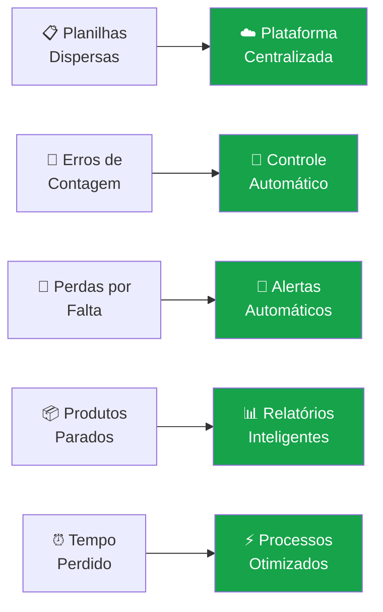
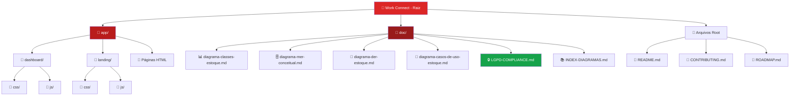
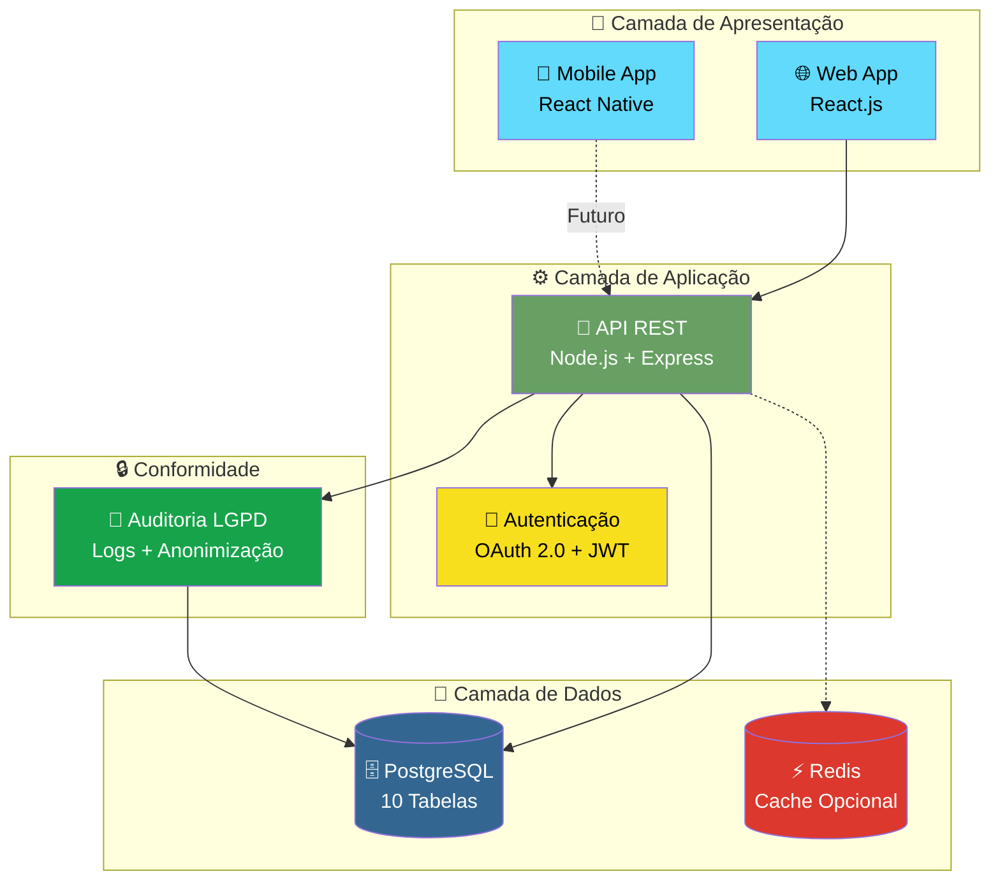
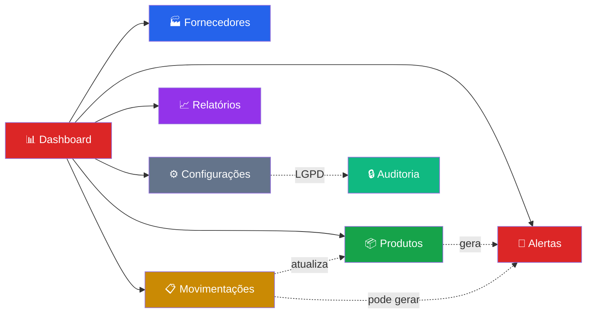

# 📦 Work Connect - Gestão de Estoque para PMEs

```
██╗    ██╗ ██████╗ ██████╗ ██╗  ██╗     ██████╗ ██████╗ ███╗   ██╗███╗   ██╗███████╗ ██████╗████████╗
██║    ██║██╔═══██╗██╔══██╗██║ ██╔╝    ██╔════╝██╔═══██╗████╗  ██║████╗  ██║██╔════╝██╔════╝╚══██╔══╝
██║ █╗ ██║██║   ██║██████╔╝█████╔╝     ██║     ██║   ██║██╔██╗ ██║██╔██╗ ██║█████╗  ██║        ██║   
██║███╗██║██║   ██║██╔══██╗██╔═██╗     ██║     ██║   ██║██║╚██╗██║██║╚██╗██║██╔══╝  ██║        ██║   
╚███╔███╔╝╚██████╔╝██║  ██║██║  ██╗    ╚██████╗╚██████╔╝██║ ╚████║██║ ╚████║███████╗╚██████╗   ██║   
 ╚══╝╚══╝  ╚═════╝ ╚═╝  ╚═╝╚═╝  ╚═╝     ╚═════╝ ╚═════╝ ╚═╝  ╚═══╝╚═╝  ╚═══╝╚══════╝ ╚═════╝   ╚═╝   
```

<div align="center">

[](https://github.com)
[](https://github.com)
[](./LICENSE)
[](https://github.com)
[](./doc/LGPD-COMPLIANCE.md)

**Sistema de Gestão de Estoque Inteligente**

*Elimine perdas, automatize processos e tenha controle total do seu estoque*

[🚀 Demo](https://github.com) · [📖 Documentação](./doc/) · [🤝 Contribuir](./CONTRIBUTING.md) · [🗺️ Roadmap](./ROADMAP.md) · [🔒 LGPD](./doc/LGPD-COMPLIANCE.md)

</div>

---

## 📋 Índice

- [Sobre o Projeto](#-sobre-o-projeto)
- [Problema e Solução](#-problema-e-solução)
- [Tecnologias](#-tecnologias)
- [Estrutura do Projeto](#-estrutura-do-projeto)
- [Arquitetura](#-arquitetura)
- [Funcionalidades](#-funcionalidades)
- [Documentação Técnica](#-documentação-técnica)
- [Começando](#-começando)
- [Como Contribuir](#-como-contribuir)
- [Autores e Licença](#-autores-e-licença)

---

## 🎯 Sobre o Projeto

### O que é o Work Connect?

Work Connect é uma **plataforma digital de gestão de estoque** desenvolvida como Trabalho de Conclusão de Curso (TCC) do SENAI. Focada em **Pequenas e Médias Empresas (PMEs)**, a solução elimina os problemas de controle manual, reduz perdas por falta de produtos e otimiza custos de armazenamento.

### 🎓 Contexto Acadêmico

- **Instituição:** SENAI - Serviço Nacional de Aprendizagem Industrial
- **Curso:** Técnico em Desenvolvimento de Sistemas
- **Período:** 2024-2025
- **Objetivo:** Desenvolver sistema funcional de gestão de estoque com conformidade LGPD

### 🎯 Público-Alvo

**PMEs (Pequenas e Médias Empresas):**
- Faturamento anual: R$ 360.000 a R$ 4.800.000
- Funcionários: 1 a 50 colaboradores
- Setores: Varejo, Indústria Leve, Serviços

---

## 💡 Problema e Solução

### ❌ Problemas Enfrentados por PMEs

| Problema | Impacto | Frequência |
|----------|---------|------------|
| **Fragmentação de dados** | Informações em planilhas dispersas | 68% das PMEs |
| **Erros de contagem física** | Divergências de 20-30% entre físico e registrado | 55% das PMEs |
| **Perdas por falta de estoque** | 15-25% da receita potencial perdida | 42% das PMEs |
| **Produtos obsoletos** | 20-35% do valor do estoque parado | 38% das PMEs |
| **Tempo desperdiçado** | 15-20% do tempo em gestão manual | 72% das PMEs |

### ✅ Como o Work Connect Resolve



### 📊 Benefícios Quantificados

- 📉 **Redução de 40%** nas perdas por falta de estoque
- 💰 **Economia de 30%** em custos de armazenamento
- ⏱️ **Ganho de 15 horas/semana** por funcionário
- 📊 **ROI de 150%** no primeiro ano
- 🎯 **Precisão de 99%** no inventário
- ⚡ **Redução de 30%** no tempo de atualização de estoque

---

## 🛠️ Tecnologias

### Stack Atual (MVP)

#### Frontend
- **HTML5** - Estrutura semântica
- **CSS3** - Design responsivo com variáveis CSS
- **JavaScript (ES6+)** - Interatividade
- **Chart.js** - Gráficos interativos

### Stack Planejada (Roadmap)

#### Frontend (FASE 3)
- **React.js 18+** - Interface dinâmica e componentizada
- **Material-UI / Ant Design** - Biblioteca de componentes
- **React Hook Form** - Validações de formulário
- **Axios** - Requisições HTTP

#### Backend (FASE 3)
- **Node.js 18+ LTS** - Servidor JavaScript
- **Express.js 4.x** - Framework web
- **Sequelize ORM** - Acesso ao banco de dados
- **JWT (jsonwebtoken)** - Autenticação OAuth 2.0
- **Bcrypt** - Criptografia de senhas (SHA-256)

#### Banco de Dados (FASE 3)
- **PostgreSQL 15+** - Banco relacional robusto
- **Redis** (opcional) - Cache para performance

#### DevOps e Deploy (FASE 7)
- **Docker** - Containerização
- **GitHub Actions** - CI/CD
- **AWS/Azure** - Cloud hosting
- **PM2** - Gerenciamento de processos Node.js

#### Mobile (FASE 4)
- **React Native / Flutter** - App nativo
- **Scanner QR Code** - Rastreamento de produtos
- **Modo Offline** - Sincronização automática

---

## 📁 Estrutura do Projeto

### Diagrama de Pastas (Atual)



### Estrutura Detalhada

```
workconnect/
├── 📁 app/                              # Aplicação frontend (MVP atual)
│   ├── 📁 dashboard/                    # Módulo de dashboard
│   │   ├── 📁 css/
│   │   │   ├── common.css               # Estilos globais, variáveis CSS
│   │   │   └── pages.css                # Estilos específicos
│   │   ├── 📁 js/
│   │   │   ├── common.js                # Utilitários (exportar CSV)
│   │   │   └── dash.js                  # Dashboard interativo
│   │   └── 📁 pages/
│   │       └── dash.html                # Dashboard principal
│   ├── 📁 landing/                      # Landing page
│   │   ├── 📁 css/
│   │   │   └── landing.css
│   │   ├── 📁 js/
│   │   │   └── landing.js
│   │   └── index.html
│   ├── dash.html                        # Dashboard
│   ├── estoque.html                     # Gestão de Estoque ⭐
│   ├── financas.html                    # Finanças (básico)
│   ├── vendas.html                      # Vendas (básico)
│   ├── relatorios.html                  # Relatórios
│   └── configuracoes.html               # Configurações + LGPD
├── 📁 doc/                              # Documentação técnica completa
│   ├── diagrama-classes-estoque.md      # 12 Classes UML
│   ├── diagrama-mer-conceitual.md       # 8 Entidades MER
│   ├── diagrama-der-estoque.md          # 10 Tabelas SQL ⭐
│   ├── diagrama-casos-de-uso-estoque.md # 27 Casos de Uso
│   ├── LGPD-COMPLIANCE.md               # Conformidade Legal ⭐
│   ├── INDEX-DIAGRAMAS.md               # Índice Centralizador
│   ├── README-DIAGRAMAS.md              # Guia dos Diagramas
│   └── Requisitos principais do projeto.txt
├── README.md                            # Este arquivo
├── CONTRIBUTING.md                      # Guia de contribuição
├── ROADMAP.md                           # Planejamento completo
└── AGENTS.md                            # Configuração de agentes
```

### Links Rápidos para Navegação

| Diretório | Descrição | Link |
|-----------|-----------|------|
| [`app/`](./app) | Aplicação frontend (MVP em HTML/CSS/JS) | [Explorar →](./app) |
| [`app/dashboard/`](./app/dashboard) | Módulo dashboard com gráficos e métricas | [Explorar →](./app/dashboard) |
| [`app/dashboard/css/`](./app/dashboard/css) | Estilos globais e específicos | [Explorar →](./app/dashboard/css) |
| [`app/dashboard/js/`](./app/dashboard/js) | Scripts interativos (Chart.js, to-do list) | [Explorar →](./app/dashboard/js) |
| [`app/landing/`](./app/landing) | Landing page de apresentação | [Explorar →](./app/landing) |
| [`doc/`](./doc) | **Documentação técnica completa** (diagramas, LGPD) | [Explorar →](./doc) |

---

## 🏗️ Arquitetura

### Arquitetura do Sistema (Planejada)



### Módulos Principais



---

## ✨ Funcionalidades

### 📦 Gestão de Produtos

**Recursos:**
- ✅ Cadastro completo (código, nome, categoria, quantidades)
- ✅ Categorias hierárquicas (ex.: Ferramentas > Parafusos > M5)
- ✅ Controle de níveis mínimos e máximos
- ✅ Cálculo automático de custo médio ponderado
- ✅ Status visual: 🟢 OK | 🟡 BAIXO | 🔴 CRÍTICO
- ✅ Localização física no estoque
- ✅ Prazo de validade
- ✅ Busca inteligente (nome, código, categoria)
- ✅ Importação em massa via Excel

**Tela:** [`app/estoque.html`](./app/estoque.html)  
**Casos de Uso:** [UC201-UC208](./doc/diagrama-casos-de-uso-estoque.md#2-módulo-gestão-de-produtos)

---

### 🏭 Gestão de Fornecedores

**Recursos:**
- ✅ Cadastro de fornecedores (CNPJ, contato, condições)
- ✅ Até 3 fornecedores por produto
- ✅ Priorização: Principal, Secundário, Backup
- ✅ Tempo médio de entrega monitorado
- ✅ Histórico de preços
- ✅ Análise de desempenho

**Casos de Uso:** [UC301-UC304](./doc/diagrama-casos-de-uso-estoque.md#3-módulo-gestão-de-fornecedores)

---

### 📋 Movimentações de Estoque

**Tipos de Movimentação:**
1. **ENTRADA_COMPRA** - Compra de fornecedor
2. **ENTRADA_DEVOLUCAO** - Devolução de cliente
3. **SAIDA_VENDA** - Venda de produto
4. **SAIDA_PERDA** - Perda, roubo ou deterioração
5. **TRANSFERENCIA** - Entre locais (futuro)
6. **AJUSTE_INVENTARIO** - Correções (auditado)

**Recursos:**
- ✅ Registro com documento fiscal
- ✅ Rastreamento por usuário responsável
- ✅ Histórico completo
- ✅ Validação: saída não pode exceder estoque
- ✅ Observação obrigatória para ajustes
- ✅ Atualização automática de quantidade
- ✅ Recálculo de custo médio (entradas)

**Casos de Uso:** [UC401-UC404](./doc/diagrama-casos-de-uso-estoque.md#4-módulo-movimentações)

---

### 🔔 Alertas Automáticos de Reposição

**Como Funciona:**
1. Sistema monitora quantidade vs mínimo continuamente
2. Quando quantidade < quantidade_minima:
   - Sistema gera alerta automaticamente
   - Calcula prioridade:
     - 🔴 **URGENTE**: quantidade = 0
     - 🟠 **ALTA**: quantidade < 30% do mínimo
     - 🟡 **MÉDIA**: quantidade < 70% do mínimo
     - 🟢 **BAIXA**: quantidade = mínimo
   - Sugere quantidade de reposição (mínimo × 2)
3. Alerta aparece no Dashboard com badge colorido
4. Administrador/Gerente visualiza e toma ação
5. Após reposição, alerta é marcado como resolvido

**Recursos:**
- ✅ Geração automática (trigger no banco)
- ✅ 4 níveis de prioridade
- ✅ Sugestão inteligente de quantidade
- ✅ Exibição no Dashboard
- ✅ Histórico de alertas

**Casos de Uso:** [UC501-UC502](./doc/diagrama-casos-de-uso-estoque.md#5-módulo-alertas)  
**Referência Técnica:** [Trigger Alertas](./doc/diagrama-der-estoque.md#trigger-2-gerar-alerta-de-reposição)

---

### 📈 Relatórios

**Tipos de Relatório:**
1. **Estoque Geral** - Visão completa com valores
2. **Movimentação** - Entradas e saídas por período
3. **Produtos Críticos** - Lista de produtos abaixo do mínimo
4. **Consumo por Período** - Análise de saídas
5. **Fornecedores** - Desempenho e comparação

**Formatos de Exportação:**
- 📄 **PDF** - Formatado para impressão
- 📊 **Excel (XLSX)** - Com cálculos e gráficos
- 📋 **CSV** - Dados tabulares simples

**Recursos:**
- ✅ Filtros por período
- ✅ Filtros por categoria
- ✅ Ordenação personalizável
- ✅ Prévia antes de exportar
- ✅ Retenção de 12 meses

**Tela:** [`app/relatorios.html`](./app/relatorios.html)  
**Casos de Uso:** [UC601-UC605](./doc/diagrama-casos-de-uso-estoque.md#6-módulo-relatórios)

---

### 🔒 Conformidade LGPD

**Requisito Legal Obrigatório (Lei nº 13.709/2018)**

**Funcionalidades Implementadas:**
1. ✅ Termo de consentimento no primeiro acesso
2. ✅ Exportação de dados pessoais (JSON)
3. ✅ Solicitação de exclusão de dados
4. ✅ Anonimização após 90 dias
5. ✅ Auditoria completa de acessos
6. ✅ Criptografia de dados sensíveis
7. ✅ Logs retidos por 6 meses

**Direitos do Usuário:**
- 📋 Acessar seus dados
- 📤 Exportar seus dados (portabilidade)
- ✏️ Corrigir dados incorretos
- 🗑️ Solicitar exclusão (esquecimento)
- 🔄 Revogar consentimento

**Documentação Completa:** [📒 LGPD-COMPLIANCE.md](./doc/LGPD-COMPLIANCE.md) (900 linhas)  
**Casos de Uso:** [UC701-UC703](./doc/diagrama-casos-de-uso-estoque.md#7-módulo-configurações-e-lgpd)

---

## 📚 Documentação Técnica

### Diagramas Completos em `/doc`

| Documento | Tipo | Tamanho | Descrição |
|-----------|------|---------|-----------|
| [📊 Classes UML](./doc/diagrama-classes-estoque.md) | Classes | 400 linhas | 12 classes focadas em estoque |
| [🗄️ MER Conceitual](./doc/diagrama-mer-conceitual.md) | MER | 320 linhas | 8 entidades, 20 regras |
| [💾 DER Físico](./doc/diagrama-der-estoque.md) | DER SQL | 900 linhas | 10 tabelas + triggers + views |
| [👥 Casos de Uso](./doc/diagrama-casos-de-uso-estoque.md) | UML | 700 linhas | 27 casos especificados |
| [🔒 LGPD](./doc/LGPD-COMPLIANCE.md) | Legal | 900 linhas | Conformidade completa |
| [📚 Índice](./doc/INDEX-DIAGRAMAS.md) | Índice | 600 linhas | Navegação centralizada |

### Quando Usar Cada Documento

| Situação | Documento |
|----------|-----------|
| 🏗️ Planejando banco de dados | [MER Conceitual](./doc/diagrama-mer-conceitual.md) |
| 💻 Implementando SQL | [DER Físico](./doc/diagrama-der-estoque.md) |
| 🎯 Desenvolvendo funcionalidades | [Casos de Uso](./doc/diagrama-casos-de-uso-estoque.md) |
| 🏛️ Entendendo arquitetura | [Classes UML](./doc/diagrama-classes-estoque.md) |
| ⚖️ Auditoria de conformidade | [LGPD](./doc/LGPD-COMPLIANCE.md) |
| 🗺️ Navegando documentação | [Índice](./doc/INDEX-DIAGRAMAS.md) |

---

## 🚀 Começando

### Pré-requisitos

- **Navegador moderno** (Chrome, Firefox, Edge, Safari)
- **Editor de código** (VS Code recomendado)
- **Git** (para clonar o repositório)

### Instalação Rápida (3 Passos)

#### 1️⃣ Clone o Repositório

```bash
git clone https://github.com/seu-usuario/workconnect.git
cd workconnect
```

#### 2️⃣ Abra no VS Code

```bash
code .
```

#### 3️⃣ Execute Localmente

**Opção A: Live Server (Recomendado)**
1. Instale extensão [Live Server](https://marketplace.visualstudio.com/items?itemName=ritwickdey.LiveServer)
2. Clique direito em `app/landing/index.html`
3. Selecione "Open with Live Server"

**Opção B: Diretamente no Navegador**
1. Navegue até `app/landing/`
2. Abra `index.html` no navegador
3. Ou acesse [`app/dash.html`](./app/dash.html) para o dashboard

### Testando o Sistema

✅ **Landing Page:**
- Navegação suave entre seções
- FAQ interativo
- Botão "Acessar Dashboard" funcional

✅ **Dashboard:**
- Gráficos renderizando (Chart.js)
- Métricas de estoque
- To-do list (adicionar, marcar, remover)

✅ **Estoque:**
- Lista de produtos com status
- Alertas de produtos críticos
- Exportação CSV

---

## 📊 Planos e Preços (SaaS)

### Modelo de Negócio

| Plano | Preço/Mês | Produtos | Usuários | Recursos |
|-------|-----------|----------|----------|----------|
| **💎 Básico** | R$ 149 | Até 500 | Até 5 | Alertas básicos, Relatórios PDF |
| **🚀 Profissional** | R$ 299 | Até 2.000 | Até 15 | + Relatórios Excel, API, Suporte |
| **⭐ Empresarial** | R$ 599 | Ilimitado | Ilimitado | + Integração ERP, Multi-loja, Suporte Premium |

### ROI Esperado

- 💰 **Retorno:** 150% no primeiro ano
- ⏱️ **Break-even:** 5-8 meses
- 📉 **Redução de custos:** 20-30% em gestão de estoque

---

## 🤝 Como Contribuir

Adoramos contribuições! Este é um projeto de TCC colaborativo.

### Guia Completo

📖 **Leia:** [CONTRIBUTING.md](./CONTRIBUTING.md) (completo com Git, padrões, templates)

**Inclui:**
- Configuração do ambiente (Git, VS Code)
- Fluxo Git detalhado (fork, branch, commit, PR)
- Padrões de código (HTML, CSS, JavaScript)
- Conventional Commits
- Templates de Issues e PRs
- FAQ completa

### Roadmap e Tarefas

🗺️ **Veja:** [ROADMAP.md](./ROADMAP.md) (8 fases de desenvolvimento)

**Fases:**
1. ✅ MVP - Interface HTML (70% concluído)
2. 📅 Frontend Avançado - CRUD, validações
3. 📅 Backend - Node.js + PostgreSQL + LGPD
4. 📅 Mobile - QR Codes, offline
5. 📅 Integrações - ERPs, KPIs avançados
6. 📅 Testes - Automatizados, performance
7. 📅 Deploy - Cloud, CI/CD
8. 📅 TCC - Documentação final, apresentação

### Áreas Prioritárias

| Área | Nível | Descrição |
|------|-------|-----------|
| 🐛 **Bugs** | Iniciante | Corrigir pequenos problemas |
| 📝 **Docs** | Iniciante | Melhorar documentação |
| ✅ **Validações** | Intermediário | Validar CPF, CNPJ, email |
| 💾 **LocalStorage** | Intermediário | Persistência local |
| 🔧 **Backend** | Avançado | API REST + PostgreSQL |
| 📱 **Mobile** | Avançado | React Native + QR codes |
| 🔒 **LGPD** | Crítico | Conformidade legal |

---

## 👥 Autores do TCC

### Equipe de Desenvolvimento

1. **Patrick Lima de Santana**
2. **Rafael Nascimento De Oliveira Bastos**
3. **Antonio Lucas da Silva da Conceição Lima**
4. **Rodrigo Santos de Oliveira Riquelme Damasceno Neri**
5. **Matheus Mendes Conceição Santana Santos**

### Orientação

**Orientador:** [Nome do Professor/Orientador]

### Agradecimentos

- Professores e coordenação do SENAI
- Colegas de turma pela colaboração
- Comunidade open-source pelas ferramentas
- PMEs que inspiraram o projeto

---

## 📄 Licença

Este projeto está licenciado sob a **MIT License** - veja [LICENSE](./LICENSE) para detalhes.

**Documentação:** © 2025 SENAI - TCC  
**Software:** Código aberto (MIT)

---

## 📞 Contato e Suporte

### Canais de Comunicação

- 📧 **Email:** contato.workconnect@exemplo.com
- 💬 **Discussions:** [GitHub Discussions](https://github.com/seu-usuario/workconnect/discussions)
- 🐛 **Reportar Bug:** [Criar Issue](https://github.com/seu-usuario/workconnect/issues/new?template=bug_report.md)
- ✨ **Sugerir Feature:** [Criar Issue](https://github.com/seu-usuario/workconnect/issues/new?template=feature_request.md)

### Precisa de Ajuda?

1. ✅ Verifique a [documentação técnica](./doc/)
2. ✅ Leia o [guia de contribuição](./CONTRIBUTING.md)
3. ✅ Procure em [Issues existentes](https://github.com/seu-usuario/workconnect/issues)
4. ✅ Abra uma nova Issue detalhada

---

<div align="center">

## 🌟 Estrelas e Contribuições

[](https://github.com/seu-usuario/workconnect)
[](https://github.com/seu-usuario/workconnect/fork)
[](https://github.com/seu-usuario/workconnect/graphs/contributors)

---

**Desenvolvido com ❤️ para o TCC SENAI 2024-2025**

**Work Connect - Gestão de Estoque Simplificada para PMEs**

[⬆ Voltar ao Topo](#-work-connect---gestão-de-estoque-para-pmes)

</div>
