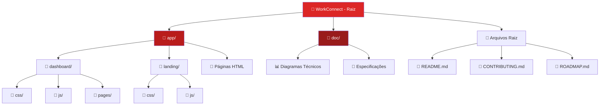
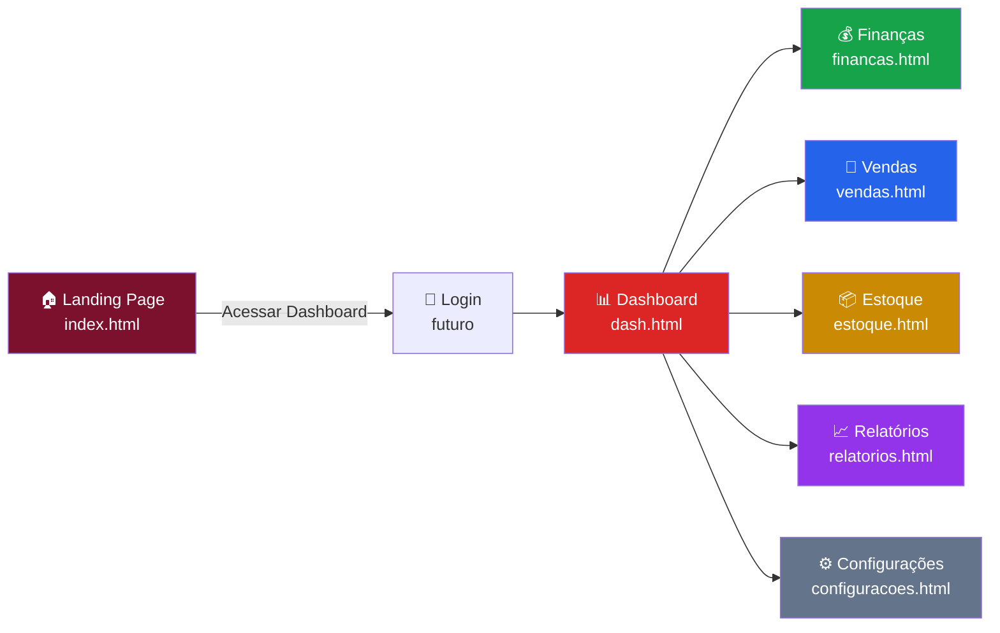
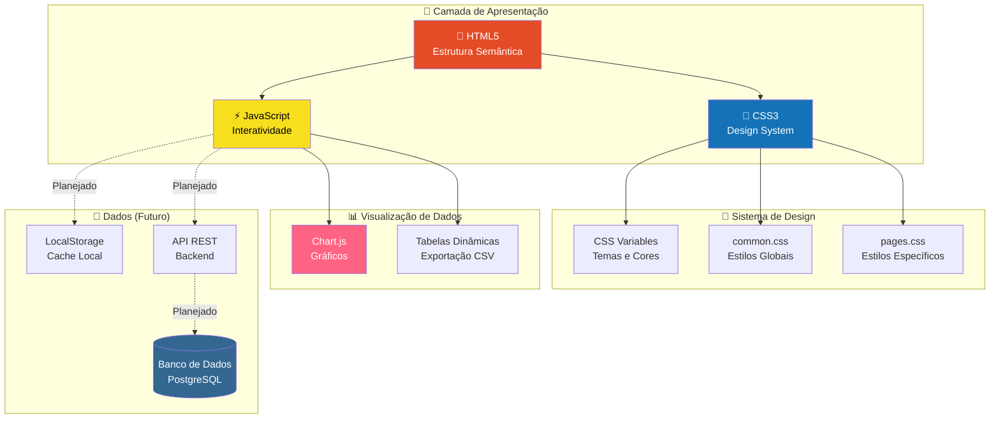
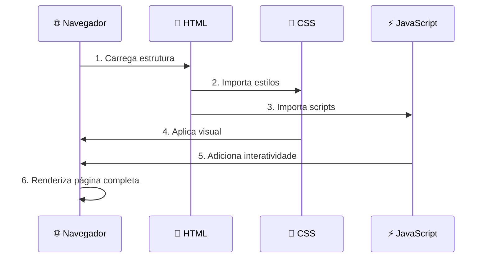
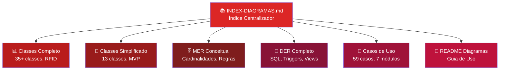

# 🏢 WorkConnect - Sistema de Gestão Empresarial

```
██╗    ██╗ ██████╗ ██████╗ ██╗  ██╗     ██████╗ ██████╗ ███╗   ██╗███╗   ██╗███████╗ ██████╗████████╗
██║    ██║██╔═══██╗██╔══██╗██║ ██╔╝    ██╔════╝██╔═══██╗████╗  ██║████╗  ██║██╔════╝██╔════╝╚══██╔══╝
██║ █╗ ██║██║   ██║██████╔╝█████╔╝     ██║     ██║   ██║██╔██╗ ██║██╔██╗ ██║█████╗  ██║        ██║   
██║███╗██║██║   ██║██╔══██╗██╔═██╗     ██║     ██║   ██║██║╚██╗██║██║╚██╗██║██╔══╝  ██║        ██║   
╚███╔███╔╝╚██████╔╝██║  ██║██║  ██╗    ╚██████╗╚██████╔╝██║ ╚████║██║ ╚████║███████╗╚██████╗   ██║   
 ╚══╝╚══╝  ╚═════╝ ╚═╝  ╚═╝╚═╝  ╚═╝     ╚═════╝ ╚═════╝ ╚═╝  ╚═══╝╚═╝  ╚═══╝╚══════╝ ╚═════╝   ╚═╝   
```

<div align="center">

[](https://github.com)
[](https://github.com)
[](./LICENSE)
[](https://github.com)

**Menos Gestão, Mais Crescimento.**

[🚀 Demo](https://github.com) · [📖 Documentação](./doc/) · [🤝 Contribuir](./CONTRIBUTING.md) · [🗺️ Roadmap](./ROADMAP.md)

</div>

---

## 📋 Índice

- [Sobre o Projeto](#-sobre-o-projeto)
- [Demonstração](#-demonstração)
- [Estrutura do Projeto](#-estrutura-do-projeto)
- [Navegação pela Codebase](#-navegação-pela-codebase)
- [Arquitetura Técnica](#-arquitetura-técnica)
- [Conceitos Básicos](#-conceitos-básicos-para-iniciantes)
- [Documentação Técnica](#-documentação-técnica)
- [Começando](#-começando)
- [Como Contribuir](#-como-contribuir)
- [Licença e Créditos](#-licença-e-créditos)

---

## 🎯 Sobre o Projeto

### O que é o WorkConnect?

WorkConnect é um **sistema completo de gestão empresarial** desenvolvido como Trabalho de Conclusão de Curso (TCC) do SENAI. O projeto visa simplificar a rotina de pequenas e médias empresas, centralizando **finanças, vendas e estoque** em uma única plataforma intuitiva e poderosa.

### 🎓 Contexto Acadêmico

- **Instituição:** SENAI
- **Curso:** Técnico em Desenvolvimento de Sistemas
- **Período:** 2024-2025
- **Objetivo:** Criar um sistema funcional de gestão com automação de estoque via RFID

### 🎯 Problema que Resolve

Muitas empresas enfrentam:
- ❌ Planilhas complexas e desorganizadas
- ❌ Falta de controle sobre fluxo de caixa
- ❌ Dificuldade em acompanhar vendas e estoque
- ❌ Horas gastas em tarefas manuais repetitivas
- ❌ Perda de vendas por falta de produtos

**WorkConnect soluciona isso com:**
- ✅ Dashboard centralizado com visão em tempo real
- ✅ Automação de processos de entrada/saída
- ✅ Alertas automáticos de reposição
- ✅ Rastreamento via RFID/Código de Barras
- ✅ Relatórios inteligentes e exportáveis
- ✅ Interface moderna e intuitiva

### 🛠️ Tecnologias Utilizadas

#### Frontend
- **HTML5** - Estrutura semântica
- **CSS3** - Design responsivo com variáveis CSS
- **JavaScript (ES6+)** - Interatividade e lógica
- **Chart.js** - Gráficos interativos

#### Ferramentas
- **Git/GitHub** - Controle de versão
- **VS Code** - Editor de código
- **Live Server** - Servidor de desenvolvimento
- **Mermaid** - Diagramas técnicos

#### Planejado (Próximas Fases)
- **Backend:** Node.js + Express
- **Banco de Dados:** PostgreSQL/MySQL
- **Autenticação:** JWT
- **RFID:** Integração com leitores

---

## 🎬 Demonstração

### Telas Principais

#### 🏠 Landing Page
Interface de apresentação do sistema com design moderno e responsivo.

**Arquivo:** [`app/landing/index.html`](./app/landing/index.html)

#### 📊 Dashboard
Visão geral do negócio com métricas em tempo real, gráficos e tarefas.

**Arquivo:** [`app/dash.html`](./app/dash.html)

#### 💰 Finanças
Gestão completa de receitas, despesas e fluxo de caixa.

**Arquivo:** [`app/financas.html`](./app/financas.html)

#### 🛒 Vendas
Controle de vendas, clientes e canais de venda.

**Arquivo:** [`app/vendas.html`](./app/vendas.html)

#### 📦 Estoque
Gerenciamento de produtos, movimentações e alertas.

**Arquivo:** [`app/estoque.html`](./app/estoque.html)

---

## 📁 Estrutura do Projeto

### Diagrama de Pastas



### Estrutura Detalhada

```
workconnect/
├── 📁 app/                              # Aplicação principal
│   ├── 📁 dashboard/                    # Módulos do dashboard
│   │   ├── 📁 css/                      # Estilos do dashboard
│   │   │   ├── common.css               # → Estilos globais, variáveis CSS
│   │   │   └── pages.css                # → Estilos específicos por página
│   │   ├── 📁 js/                       # Scripts do dashboard
│   │   │   ├── common.js                # → Utilitários (exportar CSV)
│   │   │   └── dash.js                  # → Dashboard interativo
│   │   └── 📁 pages/                    # Páginas individuais
│   │       └── dash.html                # → Dashboard principal
│   ├── 📁 landing/                      # Landing page
│   │   ├── 📁 css/
│   │   │   └── landing.css              # → Estilos da landing
│   │   ├── 📁 js/
│   │   │   └── landing.js               # → FAQ accordion
│   │   └── index.html                   # → Página inicial
│   ├── dash.html                        # → Dashboard
│   ├── financas.html                    # → Módulo Financeiro
│   ├── vendas.html                      # → Módulo de Vendas
│   ├── estoque.html                     # → Módulo de Estoque
│   ├── relatorios.html                  # → Módulo de Relatórios
│   └── configuracoes.html               # → Configurações
├── 📁 doc/                              # Documentação técnica
│   ├── diagrama-classes-completo.md     # → Classes UML (Completo)
│   ├── diagrama-classes-simplificado.md # → Classes UML (Simplificado)
│   ├── diagrama-mer-conceitual.md       # → MER Conceitual
│   ├── diagrama-der-completo.md         # → DER com SQL
│   ├── diagrama-casos-de-uso.md         # → 59 Casos de Uso
│   ├── INDEX-DIAGRAMAS.md               # → Índice Centralizador
│   ├── README-DIAGRAMAS.md              # → Guia dos Diagramas
│   └── Requisitos principais do projeto.txt
├── README.md                            # → Este arquivo
├── CONTRIBUTING.md                      # → Guia de contribuição
├── ROADMAP.md                           # → Planejamento completo
└── AGENTS.md                            # → Configuração de agentes
```

### Links Rápidos para Navegação

| Diretório | Descrição | Link |
|-----------|-----------|------|
| [`app/`](./app) | Aplicação principal com todos os módulos | [Explorar →](./app) |
| [`app/dashboard/`](./app/dashboard) | Estilos e scripts do dashboard | [Explorar →](./app/dashboard) |
| [`app/dashboard/css/`](./app/dashboard/css) | Arquivos CSS globais e específicos | [Explorar →](./app/dashboard/css) |
| [`app/dashboard/js/`](./app/dashboard/js) | Scripts JavaScript interativos | [Explorar →](./app/dashboard/js) |
| [`app/landing/`](./app/landing) | Landing page de apresentação | [Explorar →](./app/landing) |
| [`doc/`](./doc) | Documentação técnica completa | [Explorar →](./doc) |

---

## 🗺️ Navegação pela Codebase

### Fluxo de Navegação do Sistema



### Módulos Principais

#### 🏠 Landing Page
**Arquivo:** [`app/landing/index.html`](./app/landing/index.html)

Página de apresentação do sistema com:
- Seção Hero com call-to-action
- Problemas que o sistema resolve
- Benefícios e transformações
- Prova social e resultados
- FAQ interativo
- Oferta de lançamento

**Estilos:** [`app/landing/css/landing.css`](./app/landing/css/landing.css)  
**Scripts:** [`app/landing/js/landing.js`](./app/landing/js/landing.js)

---

#### 📊 Dashboard
**Arquivo:** [`app/dash.html`](./app/dash.html)

Central de comando com:
- Métricas do mês (Vendas, Novos Clientes, Alertas)
- Gráfico de Fluxo de Caixa (Chart.js)
- Lista de Tarefas interativa
- Transações recentes
- Exportação CSV

**Interatividade:** [`app/dashboard/js/dash.js`](./app/dashboard/js/dash.js)

---

#### 💰 Finanças
**Arquivo:** [`app/financas.html`](./app/financas.html)

Gestão financeira completa:
- Saldo atual e projeções
- Receitas e despesas do mês
- Gráfico de evolução do saldo
- Gráfico de despesas por categoria
- Lançamentos recentes

---

#### 🛒 Vendas
**Arquivo:** [`app/vendas.html`](./app/vendas.html)

Controle de vendas:
- Total vendido e ticket médio
- Número de vendas e taxa de conversão
- Gráfico de vendas por dia
- Gráfico de vendas por canal
- Produtos mais vendidos
- Últimas vendas registradas

---

#### 📦 Estoque
**Arquivo:** [`app/estoque.html`](./app/estoque.html)

Gerenciamento de estoque:
- Itens em estoque e itens críticos
- Valor total em estoque
- Gráfico de evolução (6 meses)
- Entradas/Saídas semanais
- Alertas de estoque baixo/crítico
- Tabela de produtos com status

---

#### 📈 Relatórios
**Arquivo:** [`app/relatorios.html`](./app/relatorios.html)

Relatórios parametrizáveis:
- Filtros por tipo e período
- KPIs do período selecionado
- Gráfico Receita x Despesa
- Tabela de transações
- Exportação CSV

---

#### ⚙️ Configurações
**Arquivo:** [`app/configuracoes.html`](./app/configuracoes.html)

Configurações do sistema:
- Perfil do usuário
- Preferências (idioma, tema, notificações)
- Integrações (bancos, sistemas)
- Permissões de usuários

---

## 🏗️ Arquitetura Técnica

### Arquitetura de Componentes



### Organização do CSS

#### [`app/dashboard/css/common.css`](./app/dashboard/css/common.css)
**Estilos Globais e Reutilizáveis**

```css
:root {
    --cor-fundo-principal: #181415;
    --cor-fundo-cards: rgba(41, 37, 36, 0.5);
    --cor-borda-cards: rgba(255, 255, 255, 0.1);
    --cor-primaria-vermelho: #dc2626;
    --cor-secundaria-vermelho: #b91c1c;
    --cor-sucesso-verde: #16a34a;
    --cor-texto-principal: #f5f5f5;
    --cor-texto-secundario: #a3a3a3;
    --cor-texto-titulo: #ffffff;
    --font-principal: 'Inter', sans-serif;
}
```

**Contém:**
- Reset CSS
- Variáveis CSS (cores, fontes)
- Sidebar e navegação
- Cards e widgets
- Tabelas de dados
- Badges de status
- Botões de ação
- Media queries para responsividade

#### [`app/dashboard/css/pages.css`](./app/dashboard/css/pages.css)
**Estilos Específicos por Página**

**Contém:**
- To-do list (Dashboard)
- Alertas de estoque
- Filtros de relatórios
- Perfil de usuário
- Preferências e integrações

### Organização do JavaScript

#### [`app/dashboard/js/common.js`](./app/dashboard/js/common.js)
**Utilitários Globais**

```javascript
// Exportar tabela para CSV
function exportTableToCSV(tableId, filename) {
    // ... implementação
}
```

**Contém:**
- Função de exportação CSV
- Utilitários reutilizáveis

#### [`app/dashboard/js/dash.js`](./app/dashboard/js/dash.js)
**Dashboard Interativo**

```javascript
// Gráfico de Fluxo de Caixa com Chart.js
const fluxoCaixaChart = new Chart(ctx, {
    type: 'line',
    data: { /* ... */ },
    options: { /* ... */ }
});

// To-do list interativa
let todos = [ /* ... */ ];
function renderTodos() { /* ... */ }
```

**Contém:**
- Inicialização de gráficos Chart.js
- Lógica da to-do list
- Interatividade de tarefas
- Exportação de tabelas

---

## 🎓 Conceitos Básicos (Para Iniciantes)

### O que é HTML, CSS e JavaScript?

#### 📄 HTML (HyperText Markup Language)
**O que faz:** Define a estrutura e conteúdo da página.

```html
<div class="card">
    <h3>Vendas do Mês</h3>
    <span class="metric-value">R$ 22.750,80</span>
</div>
```

**Pense em:** Esqueleto de uma casa (estrutura, paredes, divisões).

---

#### 🎨 CSS (Cascading Style Sheets)
**O que faz:** Define a aparência visual (cores, tamanhos, posicionamento).

```css
.card {
    background: var(--cor-fundo-cards);
    border-radius: 16px;
    padding: 1.5rem;
}
```

**Pense em:** Decoração da casa (pintura, móveis, acabamento).

---

#### ⚡ JavaScript
**O que faz:** Adiciona interatividade e lógica dinâmica.

```javascript
function calcularTotal(items) {
    return items.reduce((total, item) => total + item.valor, 0);
}
```

**Pense em:** Sistemas da casa (elétrica, hidráulica, automação).

---

### Como os Arquivos se Conectam?



**Exemplo em `dash.html`:**

```html
<!DOCTYPE html>
<html>
<head>
    <!-- Importa estilos CSS -->
    <link rel="stylesheet" href="dashboard/css/common.css">
    <link rel="stylesheet" href="dashboard/css/pages.css">
</head>
<body>
    <!-- Estrutura HTML -->
    <div class="card">...</div>
    
    <!-- Importa scripts JavaScript -->
    <script src="https://cdn.jsdelivr.net/npm/chart.js"></script>
    <script src="dashboard/js/dash.js"></script>
</body>
</html>
```

---

### Variáveis CSS Customizáveis

Para personalizar o tema, edite as variáveis em [`common.css`](./app/dashboard/css/common.css):

```css
:root {
    /* Cores principais */
    --cor-primaria-vermelho: #dc2626;    /* Vermelho principal */
    --cor-secundaria-vermelho: #b91c1c;  /* Vermelho escuro */
    --cor-sucesso-verde: #16a34a;        /* Verde de sucesso */
    
    /* Cores de fundo */
    --cor-fundo-principal: #181415;      /* Fundo escuro */
    --cor-fundo-cards: rgba(41, 37, 36, 0.5);  /* Cards translúcidos */
    
    /* Cores de texto */
    --cor-texto-principal: #f5f5f5;      /* Texto claro */
    --cor-texto-secundario: #a3a3a3;     /* Texto secundário */
    --cor-texto-titulo: #ffffff;         /* Títulos brancos */
    
    /* Fontes */
    --font-principal: 'Inter', sans-serif;
}
```

---

### Estrutura de Dados (Exemplo)

**To-do List (`dash.js`):**

```javascript
let todos = [
    { 
        text: "Enviar relatório financeiro", 
        done: false 
    },
    { 
        text: "Repor estoque de produto A", 
        done: true 
    }
];
```

**Transações Recentes (HTML estático, futuro: API):**

```javascript
const transacoes = [
    {
        data: "15/06/2025",
        cliente: "Maria Silva",
        descricao: "Venda de produto A",
        valor: 1200.00,
        status: "Pago"
    }
];
```

---

## 📚 Documentação Técnica

### Diagramas Completos

Toda a documentação técnica detalhada está disponível em [`/doc`](./doc):

| Documento | Descrição | Link |
|-----------|-----------|------|
| 📊 **Diagramas de Classes** | Modelagem UML completa (35+ classes) | [Ver →](./doc/diagrama-classes-completo.md) |
| 🎨 **Diagramas de Classes (Simplificado)** | Versão MVP alinhada com HTML atual | [Ver →](./doc/diagrama-classes-simplificado.md) |
| 🗄️ **MER Conceitual** | Modelo Entidade-Relacionamento com cardinalidades | [Ver →](./doc/diagrama-mer-conceitual.md) |
| 💾 **DER Completo** | Diagrama físico com SQL, índices e triggers | [Ver →](./doc/diagrama-der-completo.md) |
| 👥 **Casos de Uso** | 59 casos de uso especificados | [Ver →](./doc/diagrama-casos-de-uso.md) |
| 📚 **Índice de Diagramas** | Navegação completa pela documentação | [Ver →](./doc/INDEX-DIAGRAMAS.md) |
| 📖 **Guia dos Diagramas** | Como usar cada diagrama | [Ver →](./doc/README-DIAGRAMAS.md) |
| 📝 **Requisitos do Projeto** | Especificações originais do TCC | [Ver →](./doc/Requisitos%20principais%20do%20projeto.txt) |

### Estrutura da Documentação



### Quando Usar Cada Documento

| Situação | Documento Recomendado |
|----------|-----------------------|
| 🏗️ Planejando banco de dados | [MER Conceitual](./doc/diagrama-mer-conceitual.md) |
| 💻 Implementando tabelas SQL | [DER Completo](./doc/diagrama-der-completo.md) |
| 🎯 Desenvolvendo funcionalidades | [Casos de Uso](./doc/diagrama-casos-de-uso.md) |
| 🏛️ Entendendo arquitetura | [Classes Completo](./doc/diagrama-classes-completo.md) |
| 🚀 Começando no projeto | [Classes Simplificado](./doc/diagrama-classes-simplificado.md) |
| 🗺️ Navegando documentação | [Índice](./doc/INDEX-DIAGRAMAS.md) |

---

## 🚀 Começando

### Pré-requisitos

- **Navegador moderno** (Chrome, Firefox, Edge, Safari)
- **Editor de código** (VS Code recomendado)
- **Git** (para clonar o repositório)

### Instalação (3 Passos Simples)

#### 1️⃣ Clone o Repositório

```bash
git clone https://github.com/seu-usuario/workconnect.git
cd workconnect
```

#### 2️⃣ Abra no Editor

```bash
code .
```

Ou abra manualmente a pasta no VS Code.

#### 3️⃣ Execute Localmente

**Opção A: Live Server (VS Code)**
1. Instale a extensão [Live Server](https://marketplace.visualstudio.com/items?itemName=ritwickdey.LiveServer)
2. Clique com botão direito em `app/landing/index.html`
3. Selecione "Open with Live Server"

**Opção B: Diretamente no Navegador**
1. Navegue até a pasta `app/landing/`
2. Abra `index.html` no navegador
3. Ou acesse diretamente [`app/dash.html`](./app/dash.html) para o dashboard

### Testando Funcionalidades

✅ **Landing Page:**
- [ ] Navegação suave entre seções
- [ ] FAQ interativo (abrir/fechar)
- [ ] Botão "Acessar Dashboard" funcional

✅ **Dashboard:**
- [ ] Gráficos renderizando corretamente
- [ ] To-do list (adicionar, marcar, remover)
- [ ] Exportar tabela para CSV

✅ **Módulos:**
- [ ] Navegação entre páginas via sidebar
- [ ] Gráficos específicos de cada módulo
- [ ] Tabelas com dados de exemplo

---

## 🤝 Como Contribuir

Adoramos contribuições! Este projeto é colaborativo e aberto para todos os níveis de experiência.

### Guias de Contribuição

📖 **Leia o guia completo:** [CONTRIBUTING.md](./CONTRIBUTING.md)

Inclui:
- Configuração do ambiente
- Fluxo Git detalhado
- Padrões de código
- Processo de Pull Request
- Templates de Issues e PRs
- FAQ de contribuição

### Roadmap de Desenvolvimento

🗺️ **Veja o planejamento completo:** [ROADMAP.md](./ROADMAP.md)

Inclui:
- 12 fases de desenvolvimento
- MVP até sistema completo
- Checklists detalhadas
- Priorização de tarefas
- Referências técnicas

### Áreas Prioritárias

| Área | Nível | Descrição |
|------|-------|-----------|
| 🐛 **Bug Fixes** | Iniciante | Corrigir pequenos bugs reportados |
| 📝 **Documentação** | Iniciante | Melhorar comentários e docs |
| 🎨 **UI/UX** | Intermediário | Melhorar design e usabilidade |
| ✅ **Validações** | Intermediário | Adicionar validações de formulário |
| 💾 **LocalStorage** | Intermediário | Persistência de dados local |
| 🔧 **Backend** | Avançado | Implementar API REST |
| 📡 **RFID** | Avançado | Integração com hardware |

### Issues Abertas

🐛 [Ver Issues](https://github.com/seu-usuario/workconnect/issues)

---

## 📄 Licença e Créditos

### Licença

Este projeto está licenciado sob a **MIT License** - veja o arquivo [LICENSE](./LICENSE) para detalhes.

### Autores do TCC

- **Lucas** - Desenvolvedor Principal
- **[Nome]** - Desenvolvedor
- **[Nome]** - Desenvolvedor

### Instituição

**SENAI - Serviço Nacional de Aprendizagem Industrial**  
Curso Técnico em Desenvolvimento de Sistemas  
2024-2025

### Orientação

**Orientador:** [Nome do Professor/Orientador]

### Agradecimentos

Agradecimentos especiais a:
- Professores e coordenação do SENAI
- Colegas de turma pela colaboração
- Comunidade open-source pelas ferramentas
- Empresas que inspiraram o projeto

---

## 📞 Contato e Suporte

### Canais de Comunicação

- 📧 **Email:** lucas@exemplo.com
- 💬 **Discussões:** [GitHub Discussions](https://github.com/seu-usuario/workconnect/discussions)
- 🐛 **Reportar Bug:** [Criar Issue](https://github.com/seu-usuario/workconnect/issues/new)
- ✨ **Sugerir Feature:** [Criar Issue](https://github.com/seu-usuario/workconnect/issues/new)

### Precisa de Ajuda?

1. Verifique a [documentação](./doc/)
2. Leia o [guia de contribuição](./CONTRIBUTING.md)
3. Procure em [Issues existentes](https://github.com/seu-usuario/workconnect/issues)
4. Abra uma nova Issue detalhada

---

<div align="center">

**Desenvolvido com ❤️ para o TCC SENAI 2024-2025**

[⬆ Voltar ao Topo](#-workconnect---sistema-de-gestão-empresarial)

</div>

