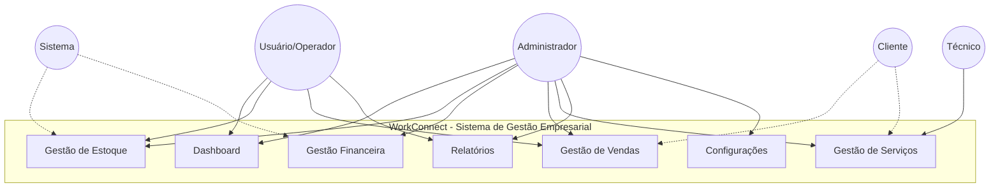
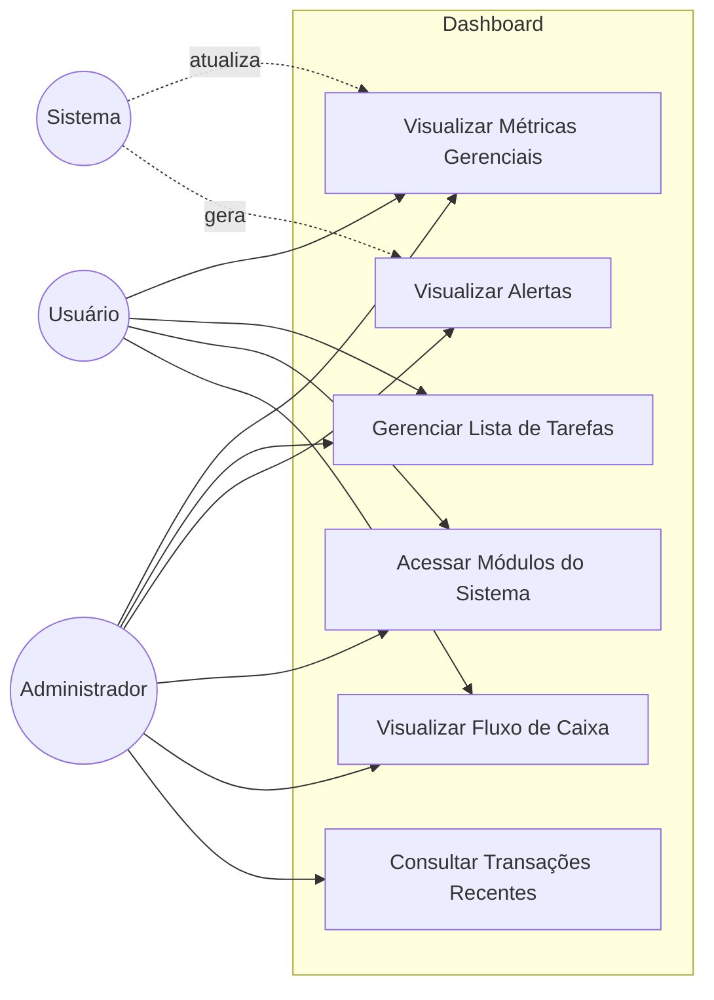
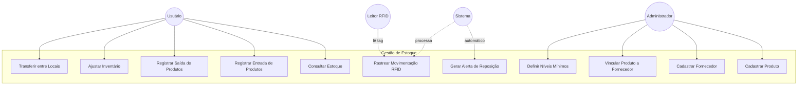
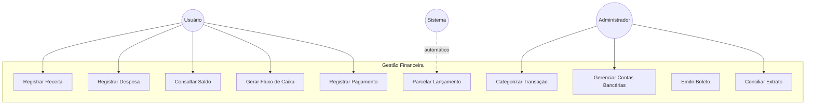
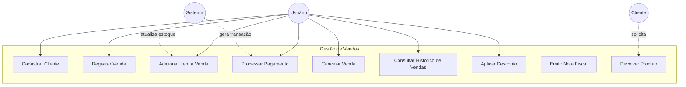
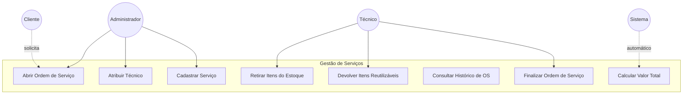
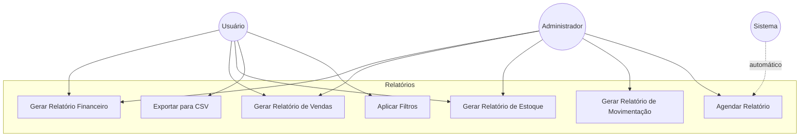
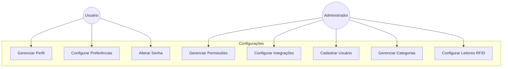

# Diagramas de Casos de Uso - WorkConnect
## Modelagem Completa de Requisitos Funcionais

**Versão:** Completa com todas as funcionalidades  
**Foco:** Requisitos funcionais e interações dos atores  
**Propósito:** Documentação de casos de uso do sistema

---

## Diagrama Geral do Sistema



---

## 1. Módulo Dashboard



### Especificação de Casos de Uso - Dashboard

#### UC101 - Visualizar Métricas Gerenciais
**Ator Principal:** Usuário, Administrador  
**Pré-condições:** Usuário autenticado  
**Fluxo Principal:**
1. Sistema exibe dashboard com métricas do período
2. Usuário visualiza: Vendas do Mês, Novos Clientes, Alertas de Estoque
3. Sistema exibe gráficos de tendências
4. Usuário pode filtrar por período

**Pós-condições:** Métricas atualizadas exibidas

#### UC102 - Gerenciar Lista de Tarefas
**Ator Principal:** Usuário  
**Pré-condições:** Usuário autenticado  
**Fluxo Principal:**
1. Usuário acessa lista de tarefas
2. Usuário adiciona nova tarefa
3. Sistema salva tarefa
4. Usuário marca tarefa como concluída
5. Sistema atualiza status

**Fluxo Alternativo:**
- 4a. Usuário remove tarefa
- Sistema exclui tarefa

#### UC103 - Visualizar Alertas
**Ator Principal:** Administrador  
**Pré-condições:** Existem alertas pendentes  
**Fluxo Principal:**
1. Sistema exibe alertas de estoque crítico
2. Sistema exibe alertas de estoque baixo
3. Administrador visualiza detalhes do alerta
4. Administrador marca alerta como visualizado

**Inclui:** UC201 (Consultar Estoque)

---

## 2. Módulo Gestão de Estoque



### Especificação de Casos de Uso - Estoque

#### UC201 - Cadastrar Produto
**Ator Principal:** Administrador  
**Pré-condições:** Categoria de produto existe  
**Fluxo Principal:**
1. Administrador acessa cadastro de produtos
2. Administrador informa: nome, código, valor, categoria
3. Administrador define níveis mínimo e máximo
4. Sistema valida código único
5. Sistema cria produto
6. Sistema cria registro em Item Estoque

**Fluxo Alternativo:**
- 4a. Código duplicado
  - Sistema exibe erro
  - Retorna ao passo 2

**Extensões:**
- 4b. Administrador vincula Tag RFID
- 4c. Administrador vincula Código de Barras

#### UC203 - Registrar Entrada de Produtos
**Ator Principal:** Usuário  
**Pré-condições:** Produto cadastrado  
**Fluxo Principal:**
1. Usuário acessa registro de movimentação
2. Usuário seleciona produto
3. Usuário informa quantidade de entrada
4. Usuário informa tipo (Compra/Devolução)
5. Usuário informa fornecedor (se compra)
6. Sistema atualiza quantidade em estoque
7. Sistema cria movimentação
8. Sistema atualiza status do estoque

**Inclui:** UC202 (Consultar Estoque)

#### UC206 - Gerar Alerta de Reposição
**Ator Principal:** Sistema (automático)  
**Pré-condições:** Quantidade abaixo do mínimo  
**Fluxo Principal:**
1. Sistema detecta quantidade < nível mínimo
2. Sistema calcula quantidade sugerida
3. Sistema define prioridade do alerta
4. Sistema cria alerta de reposição
5. Sistema envia notificação para responsáveis

**Regras de Negócio:**
- Quantidade = 0: Prioridade URGENTE
- Quantidade < 30% do mínimo: Prioridade ALTA
- Caso contrário: Prioridade MÉDIA

#### UC207 - Rastrear Movimentação RFID
**Ator Principal:** Sistema, Leitor RFID  
**Pré-condições:** Tag RFID ativa, Leitor configurado  
**Fluxo Principal:**
1. Leitor RFID detecta tag
2. Leitor envia código para sistema
3. Sistema identifica produto pela tag
4. Sistema identifica usuário no local
5. Sistema determina tipo de movimento (entrada/saída)
6. Sistema registra histórico de leitura
7. Sistema cria movimentação automática
8. Sistema atualiza quantidade em estoque

**Estende:** UC203, UC204

---

## 3. Módulo Gestão Financeira



### Especificação de Casos de Uso - Financeiro

#### UC301 - Registrar Receita
**Ator Principal:** Usuário  
**Pré-condições:** Usuário autenticado, Categoria existe  
**Fluxo Principal:**
1. Usuário acessa registro de receitas
2. Usuário informa: data, valor, descrição
3. Usuário seleciona categoria
4. Usuário seleciona conta bancária
5. Usuário informa forma de pagamento
6. Sistema cria transação tipo RECEITA
7. Sistema atualiza saldo da conta

**Fluxo Alternativo:**
- 6a. Receita parcelada
  - Inclui UC306 (Parcelar Lançamento)

**Extensões:**
- Receita vinculada a venda (automático)

#### UC304 - Gerar Fluxo de Caixa
**Ator Principal:** Usuário, Administrador  
**Pré-condições:** Transações registradas  
**Fluxo Principal:**
1. Usuário acessa fluxo de caixa
2. Usuário define período (início e fim)
3. Sistema busca transações no período
4. Sistema calcula total de receitas
5. Sistema calcula total de despesas
6. Sistema calcula saldo do período
7. Sistema gera gráfico de evolução

**Pós-condições:** Relatório de fluxo exibido

#### UC306 - Parcelar Lançamento
**Ator Principal:** Usuário  
**Pré-condições:** Transação criada  
**Fluxo Principal:**
1. Usuário define número de parcelas
2. Sistema divide valor total
3. Sistema calcula vencimento de cada parcela
4. Sistema cria lançamento financeiro
5. Sistema vincula parcelas à transação original
6. Sistema gera transações futuras

**Inclui:** UC301 ou UC302

---

## 4. Módulo Gestão de Vendas



### Especificação de Casos de Uso - Vendas

#### UC402 - Registrar Venda
**Ator Principal:** Usuário (Vendedor)  
**Pré-condições:** Cliente cadastrado  
**Fluxo Principal:**
1. Usuário inicia nova venda
2. Usuário seleciona cliente
3. Usuário seleciona canal de venda
4. Sistema gera número da venda
5. Sistema cria venda com status PENDENTE
6. Usuário adiciona itens (UC403)
7. Usuário processa pagamento (UC404)

**Inclui:** UC403, UC404

#### UC403 - Adicionar Item à Venda
**Ator Principal:** Usuário  
**Pré-condições:** Venda iniciada, Produto em estoque  
**Fluxo Principal:**
1. Usuário busca produto por código ou nome
2. Sistema exibe produto e estoque disponível
3. Usuário informa quantidade
4. Sistema valida disponibilidade em estoque
5. Usuário define preço (ou usa padrão)
6. Sistema calcula subtotal
7. Sistema adiciona item à venda
8. Sistema reserva quantidade no estoque
9. Sistema atualiza valor total da venda

**Fluxo Alternativo:**
- 4a. Estoque insuficiente
  - Sistema exibe erro
  - Retorna ao passo 3

**Extensões:**
- 6a. Usuário aplica desconto (UC407)

#### UC404 - Processar Pagamento
**Ator Principal:** Usuário  
**Pré-condições:** Venda com itens  
**Fluxo Principal:**
1. Sistema exibe valor total
2. Usuário seleciona forma de pagamento
3. Usuário confirma pagamento
4. Sistema atualiza status da venda para PAGO
5. Sistema libera itens reservados
6. Sistema cria movimentações de estoque (saída)
7. Sistema cria transação financeira (receita)
8. Sistema atualiza saldo da conta

**Inclui:** UC204 (Registrar Saída), UC301 (Registrar Receita)

#### UC405 - Cancelar Venda
**Ator Principal:** Usuário, Administrador  
**Pré-condições:** Venda registrada  
**Fluxo Principal:**
1. Usuário seleciona venda
2. Usuário solicita cancelamento
3. Sistema valida permissão
4. Usuário informa motivo
5. Sistema atualiza status para CANCELADO
6. Sistema estorna movimentações de estoque
7. Sistema estorna transação financeira
8. Sistema libera itens reservados

**Regra de Negócio:**
- Apenas Administrador pode cancelar vendas pagas

---

## 5. Módulo Gestão de Serviços (Versão Completa)



### Especificação de Casos de Uso - Serviços

#### UC501 - Abrir Ordem de Serviço
**Ator Principal:** Administrador  
**Pré-condições:** Cliente cadastrado  
**Fluxo Principal:**
1. Administrador acessa abertura de OS
2. Administrador seleciona cliente
3. Administrador descreve problema
4. Sistema gera número da OS
5. Sistema cria OS com status ABERTA
6. Administrador atribui técnico (UC502)

**Inclui:** UC502

#### UC503 - Retirar Itens do Estoque
**Ator Principal:** Técnico  
**Pré-condições:** OS atribuída, Itens em estoque  
**Fluxo Principal:**
1. Técnico acessa OS
2. Técnico entra no almoxarifado
3. Sistema detecta entrada via RFID (opcional)
4. Técnico seleciona itens necessários
5. Sistema registra itens utilizados
6. Sistema cria movimentação de saída
7. Sistema atualiza quantidade em estoque
8. Sistema vincula movimentação à OS

**Extensões:**
- 3a. Rastreamento RFID automático (UC207)

#### UC505 - Finalizar Ordem de Serviço
**Ator Principal:** Técnico  
**Pré-condições:** OS em andamento  
**Fluxo Principal:**
1. Técnico descreve solução aplicada
2. Técnico informa tempo gasto
3. Sistema calcula valor dos itens utilizados
4. Sistema calcula valor dos serviços
5. Sistema calcula valor total (UC508)
6. Técnico confirma finalização
7. Sistema atualiza status para FINALIZADA
8. Sistema cria transação financeira

**Inclui:** UC508, UC301 (Registrar Receita)

---

## 6. Módulo Relatórios



### Especificação de Casos de Uso - Relatórios

#### UC601 - Gerar Relatório Financeiro
**Ator Principal:** Usuário, Administrador  
**Pré-condições:** Transações registradas  
**Fluxo Principal:**
1. Usuário acessa módulo de relatórios
2. Usuário seleciona tipo "Financeiro"
3. Usuário define período (início e fim)
4. Usuário aplica filtros opcionais (UC607)
5. Sistema busca transações
6. Sistema calcula totais por categoria
7. Sistema gera gráficos
8. Sistema exibe relatório

**Extensões:**
- 8a. Usuário exporta para CSV (UC605)

**Inclui:** UC607 (opcional)

#### UC605 - Exportar para CSV
**Ator Principal:** Usuário  
**Pré-condições:** Relatório gerado  
**Fluxo Principal:**
1. Usuário clica em "Exportar CSV"
2. Sistema formata dados em CSV
3. Sistema gera arquivo
4. Sistema oferece download
5. Usuário baixa arquivo

---

## 7. Módulo Configurações



### Especificação de Casos de Uso - Configurações

#### UC703 - Gerenciar Permissões
**Ator Principal:** Administrador  
**Pré-condições:** Perfil de usuário existe  
**Fluxo Principal:**
1. Administrador acessa gerenciamento de permissões
2. Administrador seleciona perfil
3. Sistema exibe permissões atuais
4. Administrador adiciona/remove permissões por módulo
5. Administrador define ações permitidas (criar, ler, editar, excluir)
6. Sistema salva configurações
7. Sistema aplica permissões aos usuários do perfil

**Regras de Negócio:**
- Perfil Administrador: todas as permissões
- Perfil Operador: sem acesso a configurações
- Perfil Visualizador: apenas leitura

---

## Relações entre Casos de Uso

### Relacionamento «include» (Inclusão)

Caso de uso sempre executa outro:

- **UC402** (Registrar Venda) **«include»** UC403 (Adicionar Item)
- **UC402** (Registrar Venda) **«include»** UC404 (Processar Pagamento)
- **UC404** (Processar Pagamento) **«include»** UC204 (Registrar Saída)
- **UC404** (Processar Pagamento) **«include»** UC301 (Registrar Receita)
- **UC501** (Abrir OS) **«include»** UC502 (Atribuir Técnico)
- **UC505** (Finalizar OS) **«include»** UC508 (Calcular Valor)
- **UC601** (Relatório Financeiro) **«include»** UC607 (Aplicar Filtros)

### Relacionamento «extend» (Extensão)

Caso de uso opcionalmente estende outro:

- **UC207** (Rastrear RFID) **«extend»** UC203 (Registrar Entrada)
- **UC207** (Rastrear RFID) **«extend»** UC204 (Registrar Saída)
- **UC407** (Aplicar Desconto) **«extend»** UC403 (Adicionar Item)
- **UC605** (Exportar CSV) **«extend»** UC601 (Relatório Financeiro)
- **UC306** (Parcelar) **«extend»** UC301 (Registrar Receita)

### Generalização

Casos de uso especializados de um genérico:

- **UC301** (Registrar Receita) → Generalização de Registrar Transação
- **UC302** (Registrar Despesa) → Generalização de Registrar Transação
- **UC203** (Registrar Entrada) → Generalização de Registrar Movimentação
- **UC204** (Registrar Saída) → Generalização de Registrar Movimentação

---

## Matriz de Rastreabilidade

| Módulo | Caso de Uso | Entidades Relacionadas | Complexidade |
|--------|-------------|------------------------|--------------|
| Dashboard | UC101 | Usuario, MetricaDashboard | Baixa |
| Dashboard | UC102 | Usuario, TodoItem | Baixa |
| Estoque | UC201 | Produto, ItemEstoque, Categoria | Média |
| Estoque | UC203 | Produto, MovimentacaoEstoque, Usuario | Média |
| Estoque | UC207 | TagRFID, LeitorRFID, HistoricoLeitura | Alta |
| Financeiro | UC301 | Transacao, Categoria, ContaBancaria | Média |
| Financeiro | UC304 | Transacao | Média |
| Financeiro | UC306 | LancamentoFinanceiro, Transacao | Alta |
| Vendas | UC402 | Venda, Cliente, Usuario, Canal | Alta |
| Vendas | UC403 | ItemVenda, Produto | Média |
| Vendas | UC404 | Venda, Transacao, Movimentacao | Alta |
| Serviços | UC501 | OrdemServico, Cliente | Média |
| Serviços | UC503 | ItemUtilizado, Produto, MovimentacaoEstoque | Alta |
| Serviços | UC505 | OrdemServico, Transacao | Alta |
| Relatórios | UC601 | Relatorio, FiltroRelatorio, Transacao | Média |
| Configurações | UC703 | Perfil, Permissao | Média |

---

## Fluxos Integrados Completos

### Fluxo 1: Processo Completo de Venda

```
1. UC401: Cadastrar Cliente (se novo)
2. UC402: Registrar Venda
   ├─> UC403: Adicionar Item à Venda (múltiplos)
   │   └─> UC407: Aplicar Desconto (opcional)
   └─> UC404: Processar Pagamento
       ├─> UC204: Registrar Saída (automático)
       └─> UC301: Registrar Receita (automático)
3. Sistema atualiza Dashboard (UC101)
```

### Fluxo 2: Processo Completo de Ordem de Serviço

```
1. UC501: Abrir Ordem de Serviço
   └─> UC502: Atribuir Técnico
2. UC503: Retirar Itens do Estoque
   └─> UC207: Rastrear RFID (automático)
   └─> UC204: Registrar Saída (automático)
3. UC504: Devolver Itens Reutilizáveis
   └─> UC203: Registrar Entrada (automático)
4. UC505: Finalizar Ordem de Serviço
   ├─> UC508: Calcular Valor Total
   └─> UC301: Registrar Receita (automático)
5. Sistema atualiza Dashboard (UC101)
```

### Fluxo 3: Processo de Alerta e Reposição

```
1. UC204: Registrar Saída
2. UC206: Gerar Alerta (automático - Sistema)
   └─> Sistema cria NotificacaoSistema
3. UC103: Visualizar Alertas (Administrador)
4. UC203: Registrar Entrada (reposição)
5. Sistema resolve alerta
```

---

## Total de Casos de Uso por Módulo

| Módulo | Casos de Uso | Complexidade Geral |
|--------|--------------|-------------------|
| Dashboard | 6 | Baixa |
| Gestão de Estoque | 11 | Alta |
| Gestão Financeira | 10 | Média-Alta |
| Gestão de Vendas | 9 | Alta |
| Gestão de Serviços | 8 | Alta |
| Relatórios | 7 | Média |
| Configurações | 8 | Média |
| **TOTAL** | **59** | - |

---

**Documento gerado para:** WorkConnect - Sistema de Gestão Empresarial  
**Data:** 2025  
**Tipo:** Diagramas de Casos de Uso  
**Versão:** 1.0 - Cobertura Completa

