# Diagrama de Classes Completo - WorkConnect
## Sistema de Controle e Automação de Estoque com RFID/Código de Barras

**Versão:** Técnica Completa e Robusta  
**Baseado em:** Especificações do projeto e requisitos funcionais  
**Propósito:** Modelagem de banco de dados para implementação completa

---

## Diagrama de Classes

```mermaid
classDiagram
    %% ========================================
    %% MÓDULO DE USUÁRIOS E AUTENTICAÇÃO
    %% ========================================
    
    class Usuario {
        +Long id
        +String nome
        +String email
        +String senha
        +String telefone
        +String fotoPerfil
        +DateTime dataCriacao
        +DateTime ultimoAcesso
        +Boolean ativo
        +autenticar()
        +alterarSenha()
        +atualizarPerfil()
    }
    
    class Perfil {
        +Long id
        +String nome
        +String descricao
        +DateTime dataCriacao
        +adicionarPermissao()
        +removerPermissao()
    }
    
    class Permissao {
        +Long id
        +String modulo
        +String acao
        +String descricao
        +validar()
    }
    
    %% ========================================
    %% MÓDULO DE ESTOQUE COMPLETO
    %% ========================================
    
    class Produto {
        +Long id
        +String nome
        +String descricao
        +String codigo
        +Decimal valorUnitario
        +String unidadeMedida
        +Integer nivelMinimo
        +Integer nivelMaximo
        +DateTime dataCadastro
        +Boolean ativo
        +calcularValorTotal()
        +verificarDisponibilidade()
    }
    
    class ItemEstoque {
        +Long id
        +Integer quantidade
        +Integer quantidadeReservada
        +Integer quantidadeDisponivel
        +DateTime dataUltimaMovimentacao
        +String localizacao
        +StatusEstoque status
        +calcularQuantidadeDisponivel()
        +reservarQuantidade()
        +liberarQuantidade()
    }
    
    class CategoriaEstoque {
        +Long id
        +String nome
        +String descricao
        +String codigo
        +Boolean ativo
        +listarProdutos()
    }
    
    class FornecedorEstoque {
        +Long id
        +String razaoSocial
        +String nomeFantasia
        +String cnpj
        +String telefone
        +String email
        +String endereco
        +Boolean ativo
        +registrarCompra()
        +avaliar()
    }
    
    %% ========================================
    %% MÓDULO RFID E CÓDIGO DE BARRAS
    %% ========================================
    
    class TagRFID {
        +Long id
        +String codigoRFID
        +String tipoTag
        +DateTime dataAtivacao
        +DateTime dataExpiracao
        +Boolean ativo
        +validar()
        +desativar()
    }
    
    class CodigoBarras {
        +Long id
        +String codigo
        +String tipoBarras
        +DateTime dataCriacao
        +Boolean ativo
        +gerar()
        +validar()
    }
    
    class LeitorRFID {
        +Long id
        +String identificador
        +String localizacao
        +String tipoLeitor
        +DateTime dataInstalacao
        +Boolean ativo
        +registrarLeitura()
        +verificarStatus()
    }
    
    class HistoricoLeitura {
        +Long id
        +DateTime dataHoraLeitura
        +String tipoMovimento
        +String observacao
        +registrar()
        +consultar()
    }
    
    %% ========================================
    %% MÓDULO DE MOVIMENTAÇÃO
    %% ========================================
    
    class MovimentacaoEstoque {
        +Long id
        +DateTime dataHora
        +Integer quantidade
        +TipoMovimentacao tipo
        +String observacao
        +String numeroDocumento
        +Boolean automatica
        +registrar()
        +estornar()
        +validar()
    }
    
    class TipoMovimentacao {
        <<enumeration>>
        ENTRADA_COMPRA
        ENTRADA_DEVOLUCAO
        SAIDA_VENDA
        SAIDA_USO_SERVICO
        SAIDA_PERDA
        TRANSFERENCIA
        AJUSTE_INVENTARIO
    }
    
    class LocalEstoque {
        +Long id
        +String nome
        +String codigo
        +String endereco
        +String tipoLocal
        +Boolean principal
        +verificarCapacidade()
        +listarItens()
    }
    
    %% ========================================
    %% MÓDULO DE ALERTAS E NOTIFICAÇÕES
    %% ========================================
    
    class AlertaReposicao {
        +Long id
        +DateTime dataAlerta
        +Integer quantidadeSugerida
        +String prioridade
        +Boolean visualizado
        +DateTime dataResolucao
        +gerar()
        +marcarResolvido()
        +notificar()
    }
    
    class NotificacaoSistema {
        +Long id
        +String titulo
        +String mensagem
        +DateTime dataEnvio
        +Boolean lida
        +String tipo
        +enviar()
        +marcarLida()
    }
    
    %% ========================================
    %% MÓDULO DE MANUTENÇÃO E SERVIÇOS
    %% ========================================
    
    class OrdemServico {
        +Long id
        +String numeroOS
        +DateTime dataAbertura
        +DateTime dataFechamento
        +String descricaoProblema
        +String solucao
        +StatusOS status
        +Decimal valorTotal
        +abrir()
        +atribuirTecnico()
        +finalizar()
        +calcularTotal()
    }
    
    class Tecnico {
        +Long id
        +String nome
        +String especialidade
        +String telefone
        +Boolean disponivel
        +retirarItens()
        +devolverItens()
        +finalizarOS()
    }
    
    class ServicoManutencao {
        +Long id
        +String descricao
        +Decimal valorServico
        +Integer tempoEstimado
        +registrar()
    }
    
    class ItemUtilizado {
        +Long id
        +Integer quantidade
        +Decimal valorUnitario
        +Boolean devolvido
        +registrar()
        +marcarDevolucao()
    }
    
    %% ========================================
    %% MÓDULO FINANCEIRO
    %% ========================================
    
    class Transacao {
        +Long id
        +DateTime data
        +Decimal valor
        +String descricao
        +TipoTransacao tipo
        +StatusTransacao status
        +String numeroDocumento
        +registrar()
        +estornar()
    }
    
    class TipoTransacao {
        <<enumeration>>
        RECEITA
        DESPESA
    }
    
    class StatusTransacao {
        <<enumeration>>
        PAGO
        RECEBIDO
        PENDENTE
        ATRASADO
        CANCELADO
    }
    
    class ContaBancaria {
        +Long id
        +String banco
        +String agencia
        +String conta
        +Decimal saldo
        +Boolean ativa
        +atualizarSaldo()
        +registrarMovimento()
    }
    
    class CategoriaFinanceira {
        +Long id
        +String nome
        +String descricao
        +TipoCategoria tipo
        +listarTransacoes()
    }
    
    class LancamentoFinanceiro {
        +Long id
        +DateTime dataLancamento
        +DateTime dataVencimento
        +Decimal valor
        +Boolean recorrente
        +Integer parcelas
        +registrar()
        +parcelar()
    }
    
    %% ========================================
    %% MÓDULO DE VENDAS
    %% ========================================
    
    class Venda {
        +Long id
        +String numeroVenda
        +DateTime dataVenda
        +Decimal valorTotal
        +Decimal desconto
        +StatusVenda status
        +String formaPagamento
        +registrar()
        +calcularTotal()
        +cancelar()
    }
    
    class StatusVenda {
        <<enumeration>>
        PENDENTE
        PAGO
        ATRASADO
        CANCELADO
    }
    
    class ItemVenda {
        +Long id
        +Integer quantidade
        +Decimal valorUnitario
        +Decimal desconto
        +Decimal subtotal
        +calcularSubtotal()
    }
    
    class Cliente {
        +Long id
        +String nome
        +String cpfCnpj
        +String telefone
        +String email
        +String endereco
        +DateTime dataCadastro
        +Boolean ativo
        +registrar()
        +atualizar()
    }
    
    class CanalVenda {
        +Long id
        +String nome
        +String descricao
        +Boolean ativo
        +listarVendas()
    }
    
    %% ========================================
    %% MÓDULO DE RELATÓRIOS
    %% ========================================
    
    class Relatorio {
        +Long id
        +String titulo
        +TipoRelatorio tipo
        +DateTime dataGeracao
        +DateTime periodoInicio
        +DateTime periodoFim
        +String formato
        +gerar()
        +exportar()
        +agendar()
    }
    
    class TipoRelatorio {
        <<enumeration>>
        FINANCEIRO
        VENDAS
        ESTOQUE
        MOVIMENTACAO
        SERVICOS
    }
    
    class FiltroRelatorio {
        +Long id
        +String campo
        +String operador
        +String valor
        +aplicar()
    }
    
    %% ========================================
    %% RELACIONAMENTOS
    %% ========================================
    
    %% Usuários
    Usuario "1" --> "1" Perfil : possui
    Perfil "1" --> "*" Permissao : contém
    
    %% Estoque
    Produto "1" --> "1" ItemEstoque : possui
    Produto "*" --> "1" CategoriaEstoque : pertence
    Produto "*" --> "*" FornecedorEstoque : fornecido por
    ItemEstoque "1" --> "1" LocalEstoque : armazenado em
    
    %% RFID/Código de Barras
    Produto "1" --> "0..1" TagRFID : identificado por
    Produto "1" --> "0..1" CodigoBarras : identificado por
    TagRFID "*" --> "*" LeitorRFID : lido por
    LeitorRFID "1" --> "*" HistoricoLeitura : registra
    HistoricoLeitura "*" --> "1" TagRFID : referencia
    HistoricoLeitura "*" --> "1" Usuario : realizado por
    
    %% Movimentação
    MovimentacaoEstoque "*" --> "1" Produto : movimenta
    MovimentacaoEstoque "*" --> "1" Usuario : realizado por
    MovimentacaoEstoque "*" --> "1" LocalEstoque : origem/destino
    
    %% Alertas
    AlertaReposicao "*" --> "1" Produto : referencia
    NotificacaoSistema "*" --> "1" Usuario : enviada para
    
    %% Manutenção/Serviços
    OrdemServico "*" --> "1" Cliente : solicitada por
    OrdemServico "*" --> "1" Tecnico : atribuída a
    OrdemServico "1" --> "*" ItemUtilizado : utiliza
    OrdemServico "1" --> "*" ServicoManutencao : contém
    ItemUtilizado "*" --> "1" Produto : referencia
    MovimentacaoEstoque "*" --> "0..1" OrdemServico : vinculada a
    
    %% Financeiro
    Transacao "*" --> "1" CategoriaFinanceira : classificada em
    Transacao "*" --> "1" ContaBancaria : registrada em
    Transacao "*" --> "0..1" Usuario : criada por
    LancamentoFinanceiro "1" --> "1" Transacao : gera
    Venda "1" --> "0..1" Transacao : gera
    OrdemServico "1" --> "0..1" Transacao : gera
    
    %% Vendas
    Venda "*" --> "1" Cliente : realizada para
    Venda "*" --> "1" Usuario : realizada por
    Venda "*" --> "1" CanalVenda : realizada em
    Venda "1" --> "*" ItemVenda : contém
    ItemVenda "*" --> "1" Produto : referencia
    MovimentacaoEstoque "*" --> "0..1" Venda : vinculada a
    
    %% Relatórios
    Relatorio "*" --> "1" Usuario : gerado por
    Relatorio "1" --> "*" FiltroRelatorio : aplicado
```

---

## Legenda e Explicações

### Módulos do Sistema

1. **Usuários e Autenticação**
   - Controle de acesso com perfis e permissões granulares
   - Rastreamento de atividades do usuário

2. **Estoque Completo**
   - Gestão detalhada de produtos, categorias e fornecedores
   - Controle de níveis mínimos e máximos
   - Localização física dos itens

3. **RFID e Código de Barras**
   - Identificação automática de produtos
   - Leitores fixos em pontos estratégicos (entrada/saída)
   - Histórico completo de todas as leituras

4. **Movimentação**
   - Registro automático via RFID ou manual
   - Múltiplos tipos de movimentação
   - Rastreabilidade completa

5. **Alertas e Notificações**
   - Alertas automáticos de reposição
   - Notificações em tempo real
   - Sistema de priorização

6. **Manutenção e Serviços**
   - Gestão completa de ordens de serviço
   - Controle de itens utilizados por técnico
   - Integração com estoque e financeiro

7. **Financeiro**
   - Gestão de receitas e despesas
   - Múltiplas contas bancárias
   - Lançamentos recorrentes e parcelados

8. **Vendas**
   - Gestão de vendas multicanal
   - Controle de clientes
   - Integração automática com estoque e financeiro

9. **Relatórios**
   - Geração de relatórios parametrizados
   - Múltiplos formatos de exportação
   - Agendamento automático

### Tipos de Dados Utilizados

- **Long**: Identificadores únicos (chaves primárias)
- **String**: Textos e descritivos
- **Integer**: Números inteiros (quantidades)
- **Decimal**: Valores monetários e medidas precisas
- **DateTime**: Datas e horários
- **Boolean**: Valores verdadeiro/falso

### Cardinalidades

- **1 : 1** - Um para um (obrigatório)
- **0..1** - Zero ou um (opcional)
- **1 : *** - Um para muitos
- **\* : *** - Muitos para muitos

---

## Fluxo de Exemplo: Saída de Item para Serviço

1. Técnico entra no almoxarifado
2. Leitor RFID identifica automaticamente os itens retirados
3. Sistema registra MovimentacaoEstoque (tipo: SAIDA_USO_SERVICO)
4. ItemUtilizado é criado vinculado à OrdemServico
5. ItemEstoque é atualizado (quantidade reduzida)
6. Se quantidade < nivelMinimo, AlertaReposicao é gerado
7. NotificacaoSistema é enviada ao responsável
8. Após serviço, itens reutilizáveis são devolvidos
9. Nova MovimentacaoEstoque (tipo: ENTRADA_DEVOLUCAO) é registrada
10. Histórico completo fica disponível para auditoria

---

## Notas de Implementação

### Banco de Dados
- Recomenda-se uso de banco relacional (PostgreSQL, MySQL)
- Implementar índices em campos de busca frequente
- Considerar particionamento de tabelas históricas
- Backup automático diário

### Performance
- Cache de consultas frequentes (níveis de estoque)
- Processamento assíncrono de leituras RFID
- Filas para geração de relatórios pesados

### Segurança
- Criptografia de senhas (bcrypt)
- Auditoria completa de todas as operações
- Validação de permissões em todas as transações
- Logs de acesso e modificações

### Integrações
- API REST para leitores RFID
- Webhooks para notificações
- Integração com sistemas bancários (OFX)
- Exportação para sistemas contábeis

---

**Documento gerado para:** WorkConnect - Sistema de Gestão Empresarial  
**Data:** 2025  
**Versão:** 1.0 - Completa e Robusta

