# Diagrama de Classes - Work Connect
## Sistema de Gestão de Estoque para PMEs

**Versão:** Core - Focado em Estoque  
**Baseado em:** Especificações do TCC e análise de requisitos de PMEs  
**Propósito:** Modelagem para sistema de gestão de estoque com conformidade LGPD

---

## Diagrama de Classes

```mermaid
classDiagram
    %% ========================================
    %% MÓDULO DE USUÁRIOS E AUTENTICAÇÃO
    %% ========================================
    
    class Usuario {
        +Long id
        +String nome
        +String email
        +String hashSenha
        +String telefone
        +String fotoPerfil
        +DateTime dataCriacao
        +DateTime ultimoAcesso
        +Boolean ativo
        +Boolean consentimentoLGPD
        +DateTime dataConsentimento
        +DateTime dataExclusaoSolicitada
        +autenticar()
        +alterarSenha()
        +exportarDadosPessoais()
        +solicitarExclusao()
    }
    
    class Perfil {
        +Long id
        +String nome
        +String descricao
        +JSON permissoes
        +DateTime dataCriacao
        +validarPermissao()
    }
    
    class TipoPerfil {
        <<enumeration>>
        ADMINISTRADOR
        GERENTE
        OPERADOR
        CONSULTA
    }
    
    %% ========================================
    %% MÓDULO DE PRODUTOS E CATEGORIAS
    %% ========================================
    
    class Produto {
        +Long id
        +String codigo
        +String nome
        +String descricao
        +Integer quantidadeAtual
        +Integer quantidadeMinima
        +Integer quantidadeMaxima
        +Decimal precoAquisicao
        +Decimal custoMedioPonderado
        +String unidadeMedida
        +Date prazoValidade
        +String localizacaoFisica
        +StatusEstoque status
        +DateTime dataCadastro
        +Boolean ativo
        +calcularCustoMedio()
        +verificarDisponibilidade()
        +atualizarStatus()
    }
    
    class Categoria {
        +Long id
        +String nome
        +String descricao
        +Long categoriaPaiId
        +Boolean ativo
        +listarProdutos()
        +obterHierarquia()
    }
    
    class StatusEstoque {
        <<enumeration>>
        OK
        BAIXO
        CRITICO
    }
    
    %% ========================================
    %% MÓDULO DE FORNECEDORES
    %% ========================================
    
    class Fornecedor {
        +Long id
        +String razaoSocial
        +String nomeFantasia
        +String cnpj
        +String telefone
        +String email
        +String endereco
        +Integer tempoMedioEntregaDias
        +String condicoesPagamento
        +Boolean ativo
        +DateTime dataCadastro
        +registrar()
        +avaliarDesempenho()
    }
    
    class ProdutoFornecedor {
        +Long id
        +Long produtoId
        +Long fornecedorId
        +Decimal precoAtual
        +Integer prazoEntregaDias
        +Integer prioridade
        +DateTime dataUltimaAtualizacao
        +definirPrincipal()
        +atualizarPreco()
    }
    
    %% ========================================
    %% MÓDULO DE MOVIMENTAÇÃO
    %% ========================================
    
    class MovimentacaoEstoque {
        +Long id
        +DateTime dataHora
        +Integer quantidade
        +TipoMovimentacao tipo
        +String documentoFiscal
        +String observacao
        +String localOrigem
        +String localDestino
        +registrar()
        +validar()
        +estornar()
    }
    
    class TipoMovimentacao {
        <<enumeration>>
        ENTRADA_COMPRA
        ENTRADA_DEVOLUCAO
        SAIDA_VENDA
        SAIDA_PERDA
        TRANSFERENCIA
        AJUSTE_INVENTARIO
    }
    
    %% ========================================
    %% MÓDULO DE ALERTAS
    %% ========================================
    
    class AlertaReposicao {
        +Long id
        +DateTime dataAlerta
        +Integer quantidadeSugerida
        +PrioridadeAlerta prioridade
        +Boolean visualizado
        +DateTime dataResolucao
        +String observacao
        +gerar()
        +marcarVisualizado()
        +marcarResolvido()
    }
    
    class PrioridadeAlerta {
        <<enumeration>>
        BAIXA
        MEDIA
        ALTA
        URGENTE
    }
    
    %% ========================================
    %% MÓDULO DE RELATÓRIOS
    %% ========================================
    
    class Relatorio {
        +Long id
        +String titulo
        +TipoRelatorio tipo
        +DateTime dataGeracao
        +Date periodoInicio
        +Date periodoFim
        +FormatoRelatorio formato
        +String caminhoArquivo
        +gerar()
        +exportar()
        +excluir()
    }
    
    class TipoRelatorio {
        <<enumeration>>
        ESTOQUE_GERAL
        MOVIMENTACAO
        PRODUTOS_CRITICOS
        CONSUMO_PERIODO
        FORNECEDORES
    }
    
    class FormatoRelatorio {
        <<enumeration>>
        PDF
        XLSX
        CSV
    }
    
    %% ========================================
    %% MÓDULO DE AUDITORIA LGPD
    %% ========================================
    
    class AuditoriaLGPD {
        +Long id
        +String acao
        +DateTime dataHora
        +String ipOrigem
        +String dadosAcessados
        +String justificativa
        +registrar()
        +consultar()
    }
    
    class AcaoLGPD {
        <<enumeration>>
        ACESSO_DADOS
        EXPORTACAO_DADOS
        EXCLUSAO_DADOS
        ANONIMIZACAO
        CONSENTIMENTO
    }
    
    %% ========================================
    %% RELACIONAMENTOS
    %% ========================================
    
    %% Usuários
    Usuario "1" --> "1" Perfil : possui
    
    %% Produtos e Categorias
    Produto "*" --> "1" Categoria : pertence
    Categoria "1" --> "*" Categoria : categoria_pai (hierarquia)
    
    %% Produtos e Fornecedores (N:M)
    Produto "*" --> "*" Fornecedor : fornecido_por
    ProdutoFornecedor "*" --> "1" Produto : vincula
    ProdutoFornecedor "*" --> "1" Fornecedor : vincula
    
    %% Movimentação
    MovimentacaoEstoque "*" --> "1" Produto : movimenta
    MovimentacaoEstoque "*" --> "1" Usuario : realizada_por
    
    %% Alertas
    AlertaReposicao "*" --> "1" Produto : referencia
    
    %% Relatórios
    Relatorio "*" --> "1" Usuario : gerado_por
    
    %% Auditoria LGPD
    AuditoriaLGPD "*" --> "1" Usuario : referencia
```



---

## Legenda e Explicações

### Módulos do Sistema

#### 1. **Usuários e Autenticação**
Controle de acesso com **conformidade LGPD obrigatória**:
- 4 perfis de acesso (Admin, Gerente, Operador, Consulta)
- Autenticação OAuth 2.0
- Criptografia SHA-256 para senhas
- Rastreamento de consentimento LGPD
- Direito à exclusão de dados

#### 2. **Produtos e Categorias**
Gestão completa de produtos com controle de níveis:
- Código único por produto
- Categorias hierárquicas (ex.: Ferramentas > Parafusos > M5)
- Controle de quantidade atual vs mínima vs máxima
- Cálculo automático de custo médio ponderado
- Status visual: OK (verde), BAIXO (amarelo), CRÍTICO (vermelho)
- Localização física no estoque

#### 3. **Fornecedores**
Gestão de fornecedores com análise de desempenho:
- Até 3 fornecedores por produto
- Priorização (1=principal, 2=secundário, 3=backup)
- Tempo médio de entrega monitorado
- Condições de pagamento registradas
- Histórico de preços

#### 4. **Movimentação de Estoque**
Registro de todas as entradas e saídas:
- 6 tipos de movimentação
- Vínculo com documento fiscal
- Rastreamento por usuário responsável
- Transferência entre locais
- Ajustes de inventário auditados

#### 5. **Alertas de Reposição**
Sistema automático de notificações:
- Geração automática quando quantidade < mínimo
- 4 níveis de prioridade (URGENTE se quantidade = 0)
- Sugestão inteligente de quantidade
- Rastreamento de resolução

#### 6. **Relatórios**
Geração de relatórios em múltiplos formatos:
- PDF, Excel (XLSX), CSV
- 5 tipos de relatórios predefinidos
- Filtros por período
- Retenção de dados: 12 meses

#### 7. **Auditoria LGPD** 
Conformidade com Lei Geral de Proteção de Dados:
- Log completo de acessos a dados pessoais
- Registro de exportações
- Histórico de consentimentos
- Processos de exclusão rastreáveis

---

## Tipos de Dados Utilizados

- **Long**: Identificadores únicos (chaves primárias)
- **String**: Textos e descritivos
- **Integer**: Números inteiros (quantidades)
- **Decimal**: Valores monetários (precisão 10,2)
- **DateTime**: Datas e horários completos
- **Date**: Apenas datas (sem hora)
- **Boolean**: Valores verdadeiro/falso
- **JSON**: Estruturas flexíveis (permissões)

---

## Cardinalidades

- **1 : 1** - Um para um (obrigatório)
- **1 : *** - Um para muitos
- **\* : *** - Muitos para muitos (através de tabela associativa)

---

## Fluxos de Exemplo

### Exemplo 1: Cadastro de Produto Completo

```
1. Administrador acessa cadastro de produtos
2. Preenche dados obrigatórios:
   - Código único (validado em tempo real)
   - Nome do produto
   - Categoria
   - Quantidade mínima (> 0)
   - Preço de aquisição
3. Preenche dados opcionais:
   - Descrição
   - Prazo de validade
   - Localização física
   - Imagem do produto
4. Sistema cria Produto com status OK
5. Sistema inicializa quantidade_atual = 0
6. Administrador vincula fornecedores (até 3)
7. Define fornecedor principal (prioridade = 1)
8. Sistema salva ProdutoFornecedor
```

### Exemplo 2: Entrada de Mercadoria com Atualização de Custo

```
1. Operador acessa registro de movimentação
2. Busca produto por código ou nome
3. Sistema exibe:
   - Estoque atual
   - Quantidade mínima
   - Últimas movimentações
4. Operador informa:
   - Tipo: ENTRADA_COMPRA
   - Quantidade: 100 unidades
   - Fornecedor
   - Documento fiscal: NF-123456
   - Preço unitário: R$ 15,00
5. Sistema cria MovimentacaoEstoque
6. Sistema atualiza Produto.quantidadeAtual (+100)
7. Sistema recalcula custoMedioPonderado:
   - (estoque_anterior * custo_anterior + entrada * preco_entrada) / estoque_novo
8. Sistema atualiza Produto.status para OK
9. Sistema registra AuditoriaLGPD (acesso a dados do fornecedor)
```

### Exemplo 3: Geração Automática de Alerta

```
1. Sistema detecta saída de produto
2. Após atualizar quantidade, verifica:
   - quantidade_atual < quantidade_minima?
3. Se SIM:
   - Sistema calcula prioridade:
     * URGENTE se quantidade_atual = 0
     * ALTA se quantidade_atual < 30% do mínimo
     * MÉDIA se quantidade_atual < 70% do mínimo
   - Sistema calcula quantidade_sugerida (mínimo * 2)
4. Sistema cria AlertaReposicao
5. Sistema exibe alerta no Dashboard
6. Administrador/Gerente visualiza alerta
7. Toma ação (criar pedido de compra)
8. Marca alerta como resolvido
```

### Exemplo 4: Exportação de Dados Pessoais (LGPD)

```
1. Usuário acessa "Meus Dados"
2. Clica em "Exportar Meus Dados"
3. Sistema valida identidade
4. Sistema gera arquivo JSON com:
   - Dados cadastrais
   - Histórico de movimentações
   - Logs de acesso
5. Sistema registra em AuditoriaLGPD:
   - acao = EXPORTACAO_DADOS
   - data_hora = now()
   - ip_origem = request.ip
6. Sistema envia email com link de download
7. Arquivo expira em 48 horas
```

---

## Conformidade LGPD

### Dados Pessoais Tratados

| Campo | Base Legal | Finalidade |
|-------|------------|------------|
| Nome | Consentimento | Identificação do usuário |
| Email | Consentimento | Login e comunicação |
| Telefone | Consentimento | Contato para alertas |
| IP de Acesso | Legítimo Interesse | Segurança do sistema |
| Histórico de Ações | Legítimo Interesse | Auditoria e integridade |

### Direitos dos Titulares Implementados

- ✅ **Direito de Acesso**: Visualizar todos os dados armazenados
- ✅ **Direito à Portabilidade**: Exportar dados em formato JSON
- ✅ **Direito à Exclusão**: Solicitar remoção de dados
- ✅ **Direito à Revogação**: Retirar consentimento a qualquer momento

### Processos LGPD

1. **Coleta de Consentimento:**
   - Termo de aceite explícito no primeiro login
   - Checkbox específico para cada finalidade
   - Campo `consentimentoLGPD = true` no banco

2. **Anonimização de Dados:**
   - Após 90 dias da solicitação de exclusão
   - Mantém registros com dados anonimizados
   - Histórico preservado: "Usuário Anônimo #12345"

3. **Auditoria Completa:**
   - Toda ação sobre dados pessoais é logada
   - Registro de quem acessou, quando e o quê
   - Logs retidos por 6 meses

---

## Notas de Implementação

### Tecnologias

**Frontend:**
- React.js 18+ para interface dinâmica
- Material-UI ou Ant Design para componentes
- Chart.js para gráficos
- React Hook Form para validações

**Backend:**
- Node.js 18+ LTS
- Express.js 4.x para API REST
- Sequelize ORM para PostgreSQL
- Bcrypt para hashing de senhas (SHA-256)
- jsonwebtoken para OAuth 2.0

**Banco de Dados:**
- PostgreSQL 15+ (integridade referencial)
- Sequelize migrations
- Índices em campos de busca
- Backup automático diário

### Performance

- **Cache de estoque:** Redis para consultas frequentes
- **Processamento assíncrono:** Filas (Bull/BullMQ) para relatórios
- **Índices:** Código produto, data movimentação, status

### Segurança

- **Autenticação:** OAuth 2.0 com tokens JWT
- **Criptografia:** AES-256 para dados sensíveis
- **HTTPS:** Obrigatório em produção
- **LGPD:** Auditoria completa de acessos

### Escalabilidade

- **Suporte:** Até 50 usuários simultâneos por instância
- **Capacidade:** 10.000+ produtos por empresa
- **Multi-tenant:** Isolamento por empresa (campo tenant_id)
- **Cloud:** AWS/Azure com auto-scaling

---

## Público-Alvo

### PMEs (Pequenas e Médias Empresas)

- **Faturamento:** R$ 360.000 a R$ 4.800.000/ano
- **Funcionários:** 1-50 colaboradores
- **Setores:** Varejo, indústria leve, serviços
- **Necessidades:**
  - Controle de estoque simples e eficiente
  - Redução de perdas (15-25% da receita)
  - Automação de processos manuais
  - Relatórios para tomada de decisão

### Benefícios Quantificados

- 📉 **Redução de 40%** nas perdas por falta de estoque
- 💰 **Economia de 30%** em custos de armazenamento
- ⏱️ **Ganho de 15 horas/semana** por funcionário
- 📊 **ROI de 150%** no primeiro ano
- 🎯 **Precisão de 99%** no inventário

---

**Documento gerado para:** Work Connect - Sistema de Gestão de Estoque  
**Data:** 2025  
**Versão:** 1.0 - Core (Estoque + LGPD)  
**Autores:** Patrick Lima, Rafael Bastos, Lucas Lima, Rodrigo Neri, Matheus Santos

