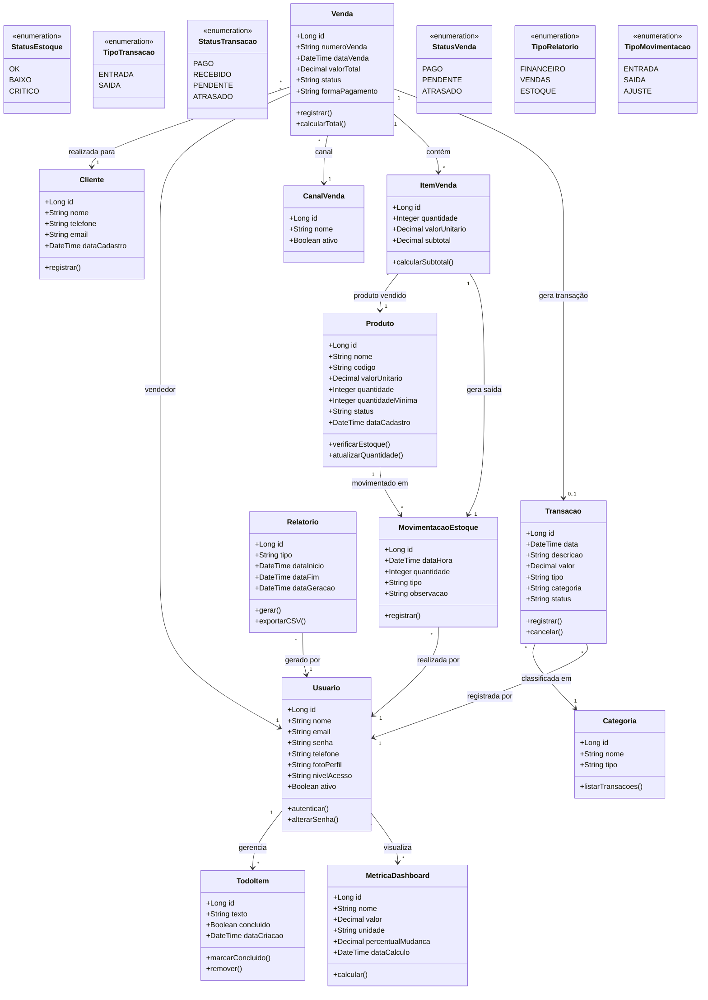

# Diagrama de Classes Simplificado - WorkConnect
## Sistema de Gestão Empresarial

**Versão:** Simplificada e Compreensível  
**Baseado em:** Contexto atual da aplicação (interface HTML)  
**Propósito:** Modelagem de banco de dados para implementação inicial

---

## Diagrama de Classes



---

## Legenda e Explicações

### Módulos Implementados

#### 1. Dashboard
Tela principal com visão geral do negócio:
- **MetricaDashboard**: Métricas como vendas do mês, novos clientes, alertas de estoque
- **TodoItem**: Lista de tarefas do usuário

#### 2. Finanças
Gestão simplificada de receitas e despesas:
- **Transacao**: Lançamentos financeiros (entradas e saídas)
- **Categoria**: Classificação das transações (Fornecedores, Salários, Impostos, Receitas)
- **Status**: Pago, Recebido, Pendente, Atrasado

#### 3. Vendas
Controle de vendas e clientes:
- **Venda**: Registro de vendas realizadas
- **ItemVenda**: Produtos vendidos em cada venda
- **Cliente**: Cadastro de clientes
- **CanalVenda**: Loja Física ou Online

#### 4. Estoque
Controle básico de produtos:
- **Produto**: Itens em estoque com quantidade e valor
- **MovimentacaoEstoque**: Entradas e saídas
- **Status**: OK (acima do mínimo), Baixo (próximo ao mínimo), Crítico (abaixo do mínimo)

#### 5. Relatórios
Geração e exportação de dados:
- **Relatorio**: Relatórios por período
- **Tipos**: Financeiro, Vendas, Estoque
- **Exportação**: CSV para análise externa

### Alinhamento com Interface HTML

#### Dashboard (`dash.html`)
- Exibe métricas: Vendas do Mês, Novos Clientes, Alertas de Estoque
- Gráfico de Fluxo de Caixa (últimos 30 dias)
- Lista de Tarefas (TodoItem)
- Tabela de Transações Recentes

#### Finanças (`financas.html`)
- Saldo Atual, Receitas e Despesas do Mês
- Gráfico de Evolução do Saldo
- Gráfico de Despesas por Categoria
- Tabela de Lançamentos

#### Vendas (`vendas.html`)
- Total Vendido, Ticket Médio, Número de Vendas
- Gráfico de Vendas por Dia
- Gráfico de Vendas por Canal
- Produtos Mais Vendidos
- Tabela de Últimas Vendas

#### Estoque (`estoque.html`)
- Itens em Estoque, Itens Críticos, Valor Total
- Gráfico de Evolução do Estoque
- Gráfico de Entradas/Saídas
- Alertas de Estoque
- Tabela de Produtos

#### Relatórios (`relatorios.html`)
- Filtros: Tipo, Período (De/Até)
- KPIs do Período
- Gráficos comparativos
- Exportação CSV

#### Configurações (`configuracoes.html`)
- Perfil do Usuário
- Preferências (Idioma, Tema, Notificações)
- Integrações (Bancos, Sistemas)
- Permissões de Usuários

---

## Estrutura de Dados Simplificada

### Exemplos de Registros

#### Produto
```
id: 1
nome: "Produto A"
codigo: "PROD001"
valorUnitario: 150.00
quantidade: 25
quantidadeMinima: 10
status: "OK"
```

#### Transacao
```
id: 1
data: "2025-06-15"
descricao: "Venda de produto A"
valor: 1200.00
tipo: "ENTRADA"
categoria: "Receitas"
status: "PAGO"
```

#### Venda
```
id: 1
numeroVenda: "V-001"
dataVenda: "2025-06-15"
cliente: "Maria Silva"
valorTotal: 1200.00
status: "PAGO"
formaPagamento: "Cartão"
```

---

## Fluxo Básico: Registro de Venda

1. **Usuário** acessa módulo de Vendas
2. Seleciona **Cliente** (ou cadastra novo)
3. Adiciona **ItemVenda** (seleciona Produto e quantidade)
4. Sistema calcula **subtotal** de cada item
5. Sistema calcula **valorTotal** da venda
6. **Venda** é registrada com status "PENDENTE"
7. Para cada ItemVenda:
   - **MovimentacaoEstoque** (tipo: SAIDA) é criada
   - **Produto.quantidade** é reduzida
   - Se quantidade < quantidadeMinima, status muda para "BAIXO" ou "CRITICO"
8. **Transacao** financeira (tipo: ENTRADA) é gerada
9. Status da Venda muda para "PAGO" quando pagamento confirmado
10. Dados aparecem no Dashboard e Relatórios

---

## Simplificações em Relação à Versão Completa

1. **Sem RFID/Código de Barras**: Entrada manual de dados
2. **Sem Módulo de Serviços**: Foco em vendas de produtos
3. **Sem Alertas Automáticos**: Verificação visual de status
4. **Categoria Financeira Simples**: Sem hierarquia complexa
5. **Movimentação Básica**: Apenas entrada/saída/ajuste
6. **Relatórios Simples**: Sem filtros avançados
7. **Perfil de Usuário Único**: Sem sistema complexo de permissões

---

## Extensões Futuras

Para evolução do sistema, considerar:
- Integração com leitores RFID/Código de Barras
- Sistema de alertas automáticos
- Módulo de ordens de serviço
- Controle de múltiplos locais de estoque
- Sistema avançado de permissões
- Relatórios customizáveis
- Integração bancária automática
- API para terceiros

---

## Notas de Implementação

### Banco de Dados Recomendado
- **Desenvolvimento**: SQLite (simples e rápido)
- **Produção**: PostgreSQL ou MySQL

### Tabelas Principais
```sql
usuarios
produtos
transacoes
categorias
vendas
itens_venda
clientes
canais_venda
movimentacoes_estoque
relatorios
metricas_dashboard
todo_items
```

### Índices Importantes
- `produtos.codigo` (busca rápida)
- `vendas.dataVenda` (relatórios)
- `transacoes.data` (relatórios)
- `clientes.nome` (busca)

### Validações Essenciais
- Quantidade em estoque ≥ 0
- Valores monetários ≥ 0
- Datas de venda ≤ data atual
- Email único por usuário
- Código único por produto

---

**Documento gerado para:** WorkConnect - Sistema de Gestão Empresarial  
**Data:** 2025  
**Versão:** 1.0 - Simplificada

