# Diagrama Entidade-Relacionamento (DER) Completo - WorkConnect
## Modelo Lógico de Banco de Dados - Sistema Completo

📍 **Navegação:**
🏠 [README Principal](../README.md) | 📚 [Índice Diagramas](./INDEX-DIAGRAMAS.md) | 📖 [Tutorial](../TUTORIAL_CONTRIBUICAO_COMPLETO.md)

---

**Versão:** 1.0.0 - Sistema Completo  
**Foco:** Modelo lógico completo com todos os módulos integrados  
**Propósito:** Documentação completa do modelo de dados do WorkConnect

---

## Visão Geral do Sistema

O WorkConnect é um sistema de gestão empresarial completo que integra os seguintes módulos:

1. **Usuários & Autenticação** - Gestão de usuários, perfis e sessões
2. **Inventário (Estoque)** - Gestão de produtos, categorias, fornecedores e movimentações
3. **Vendas** - Gestão de clientes, vendas, itens e pagamentos
4. **Finanças** - Gestão de contas, transações e categorias financeiras
5. **Logística** - Gestão de armazéns, pedidos, envios e rotas
6. **Relatórios** - Geração e gestão de relatórios
7. **Auditoria LGPD** - Conformidade com LGPD

---

## Diagrama ER Completo

```mermaid
erDiagram
    %% ========================================
    %% MÓDULO 1: USUÁRIOS E AUTENTICAÇÃO
    %% ========================================
    
    PERFIL ||--o{ USUARIO : "possui"
    USUARIO ||--o{ SESSAO : "tem"
    
    %% ========================================
    %% MÓDULO 2: INVENTÁRIO (ESTOQUE)
    %% ========================================
    
    CATEGORIA ||--o{ PRODUTO : "classifica"
    CATEGORIA ||--o| CATEGORIA : "categoria_pai"
    PRODUTO }o--o{ FORNECEDOR : "fornecido_por"
    PRODUTO }o--|| ARMAZEM : "armazenado_em"
    PRODUTO ||--o{ MOVIMENTACAO_ESTOQUE : "movimenta"
    PRODUTO ||--o{ ALERTA_REPOSICAO : "gera"
    PRODUTO ||--o{ VENDA_ITEM : "vendido_em"
    PRODUTO ||--o{ PEDIDO_ITEM : "pedido_em"
    USUARIO ||--o{ MOVIMENTACAO_ESTOQUE : "registra"
    
    %% ========================================
    %% MÓDULO 3: VENDAS
    %% ========================================
    
    CLIENTE ||--o{ VENDA : "compra"
    USUARIO ||--o{ VENDA : "vende"
    CANAL_VENDA ||--o{ VENDA : "através_de"
    VENDA ||--o{ VENDA_ITEM : "contém"
    VENDA ||--o{ PAGAMENTO : "paga_com"
    METODO_PAGAMENTO ||--o{ PAGAMENTO : "usado_em"
    VENDA ||--o| PEDIDO : "gera"
    VENDA ||--o{ TRANSACAO_FINANCEIRA : "gera_receita"
    
    %% ========================================
    %% MÓDULO 4: FINANÇAS
    %% ========================================
    
    CONTA_FINANCEIRA ||--o{ TRANSACAO_FINANCEIRA : "registra"
    CATEGORIA_FINANCEIRA ||--o{ TRANSACAO_FINANCEIRA : "classifica"
    CATEGORIA_FINANCEIRA ||--o| CATEGORIA_FINANCEIRA : "categoria_pai"
    FORNECEDOR ||--o{ TRANSACAO_FINANCEIRA : "gera_despesa"
    USUARIO ||--o{ TRANSACAO_FINANCEIRA : "registra"
    
    %% ========================================
    %% MÓDULO 5: LOGÍSTICA
    %% ========================================
    
    ARMAZEM ||--o{ PEDIDO : "processa"
    CLIENTE ||--o{ PEDIDO : "recebe"
    USUARIO ||--o{ PEDIDO : "cria"
    PEDIDO ||--o{ PEDIDO_ITEM : "contém"
    PEDIDO ||--o{ ENVIO : "enviado_por"
    TRANSPORTADORA ||--o{ ENVIO : "transporta"
    ROTA ||--o{ ENVIO : "incluído_em"
    MOTORISTA ||--o{ ROTA : "executa"
    USUARIO ||--o| ARMAZEM : "responsável_por"
    
    %% ========================================
    %% MÓDULO 6: RELATÓRIOS
    %% ========================================
    
    USUARIO ||--o{ RELATORIO : "gera"
    
    %% ========================================
    %% MÓDULO 7: AUDITORIA
    %% ========================================
    
    USUARIO ||--o{ AUDITORIA_LGPD : "auditado"
    
    %% ========================================
    %% ENTIDADES
    %% ========================================
    
    PERFIL {
        BIGINT id PK
        VARCHAR nome UK
        TEXT descricao
        JSONB permissoes
        TIMESTAMP data_criacao
    }
    
    USUARIO {
        BIGINT id PK
        VARCHAR nome
        VARCHAR email UK
        VARCHAR hash_senha
        VARCHAR telefone
        VARCHAR foto_perfil
        BIGINT perfil_id FK
        BOOLEAN ativo
        BOOLEAN consentimento_lgpd
        TIMESTAMP data_consentimento
        TIMESTAMP data_exclusao_solicitada
        TIMESTAMP data_criacao
        TIMESTAMP ultimo_acesso
    }
    
    SESSAO {
        BIGINT id PK
        BIGINT usuario_id FK
        VARCHAR token UK
        VARCHAR ip_address
        TEXT user_agent
        TIMESTAMP data_criacao
        TIMESTAMP data_expiracao
        BOOLEAN ativo
    }
    
    CATEGORIA {
        BIGINT id PK
        VARCHAR nome
        TEXT descricao
        BIGINT categoria_pai_id FK
        BOOLEAN ativo
        TIMESTAMP data_criacao
    }
    
    PRODUTO {
        BIGINT id PK
        VARCHAR codigo UK
        VARCHAR nome
        TEXT descricao
        BIGINT categoria_id FK
        INTEGER quantidade_atual
        INTEGER quantidade_minima
        INTEGER quantidade_maxima
        DECIMAL preco_aquisicao
        DECIMAL preco_venda
        DECIMAL custo_medio_ponderado
        VARCHAR unidade_medida
        DATE prazo_validade
        VARCHAR localizacao_fisica
        BIGINT armazem_id FK
        VARCHAR status
        BOOLEAN ativo
        TIMESTAMP data_cadastro
        TIMESTAMP data_atualizacao
    }
    
    FORNECEDOR {
        BIGINT id PK
        VARCHAR razao_social
        VARCHAR nome_fantasia
        VARCHAR cnpj UK
        VARCHAR telefone
        VARCHAR email
        TEXT endereco
        VARCHAR cidade
        VARCHAR estado
        VARCHAR cep
        INTEGER tempo_medio_entrega_dias
        TEXT condicoes_pagamento
        DECIMAL avaliacao
        BOOLEAN ativo
        TIMESTAMP data_cadastro
    }
    
    PRODUTO_FORNECEDOR {
        BIGINT id PK
        BIGINT produto_id FK
        BIGINT fornecedor_id FK
        DECIMAL preco_atual
        INTEGER prazo_entrega_dias
        INTEGER prioridade
        TIMESTAMP data_vinculo
        TIMESTAMP data_ultima_atualizacao
    }
    
    MOVIMENTACAO_ESTOQUE {
        BIGINT id PK
        BIGINT produto_id FK
        BIGINT usuario_id FK
        VARCHAR tipo
        INTEGER quantidade
        DECIMAL preco_unitario
        VARCHAR documento_fiscal
        TEXT observacao
        VARCHAR local_origem
        VARCHAR local_destino
        BIGINT venda_id FK
        TIMESTAMP data_hora
    }
    
    ALERTA_REPOSICAO {
        BIGINT id PK
        BIGINT produto_id FK
        TIMESTAMP data_alerta
        INTEGER quantidade_sugerida
        VARCHAR prioridade
        BOOLEAN visualizado
        TIMESTAMP data_visualizacao
        TIMESTAMP data_resolucao
        TEXT observacao
    }
    
    CLIENTE {
        BIGINT id PK
        VARCHAR nome
        VARCHAR tipo
        VARCHAR cpf
        VARCHAR cnpj
        VARCHAR email
        VARCHAR telefone
        VARCHAR celular
        TEXT endereco
        VARCHAR cidade
        VARCHAR estado
        VARCHAR cep
        DATE data_nascimento
        TEXT observacoes
        BOOLEAN ativo
        TIMESTAMP data_cadastro
        TIMESTAMP data_atualizacao
    }
    
    CANAL_VENDA {
        BIGINT id PK
        VARCHAR nome UK
        TEXT descricao
        VARCHAR tipo
        BOOLEAN ativo
        TIMESTAMP data_criacao
    }
    
    VENDA {
        BIGINT id PK
        VARCHAR numero_venda UK
        BIGINT cliente_id FK
        BIGINT usuario_id FK
        BIGINT canal_venda_id FK
        TIMESTAMP data_venda
        DATE data_entrega
        DECIMAL subtotal
        DECIMAL desconto
        DECIMAL acrescimo
        DECIMAL total
        VARCHAR status
        TEXT observacoes
        TIMESTAMP data_criacao
        TIMESTAMP data_atualizacao
    }
    
    VENDA_ITEM {
        BIGINT id PK
        BIGINT venda_id FK
        BIGINT produto_id FK
        INTEGER quantidade
        DECIMAL preco_unitario
        DECIMAL desconto
        DECIMAL total_item
        TIMESTAMP data_criacao
    }
    
    METODO_PAGAMENTO {
        BIGINT id PK
        VARCHAR nome UK
        TEXT descricao
        VARCHAR tipo
        BOOLEAN ativo
        TIMESTAMP data_criacao
    }
    
    PAGAMENTO {
        BIGINT id PK
        BIGINT venda_id FK
        BIGINT metodo_pagamento_id FK
        DECIMAL valor
        TIMESTAMP data_pagamento
        DATE data_vencimento
        VARCHAR status
        VARCHAR codigo_transacao
        TEXT observacoes
        TIMESTAMP data_criacao
    }
    
    CATEGORIA_FINANCEIRA {
        BIGINT id PK
        VARCHAR nome
        TEXT descricao
        VARCHAR tipo
        BIGINT categoria_pai_id FK
        BOOLEAN ativo
        TIMESTAMP data_criacao
    }
    
    CONTA_FINANCEIRA {
        BIGINT id PK
        VARCHAR nome
        TEXT descricao
        VARCHAR tipo
        VARCHAR banco
        VARCHAR agencia
        VARCHAR conta
        DECIMAL saldo_inicial
        DECIMAL saldo_atual
        BOOLEAN ativo
        TIMESTAMP data_criacao
    }
    
    TRANSACAO_FINANCEIRA {
        BIGINT id PK
        BIGINT conta_financeira_id FK
        BIGINT categoria_financeira_id FK
        VARCHAR tipo
        VARCHAR descricao
        DECIMAL valor
        DATE data_transacao
        DATE data_vencimento
        DATE data_pagamento
        VARCHAR status
        BIGINT venda_id FK
        BIGINT fornecedor_id FK
        TEXT observacoes
        BIGINT usuario_id FK
        TIMESTAMP data_criacao
        TIMESTAMP data_atualizacao
    }
    
    ARMAZEM {
        BIGINT id PK
        VARCHAR nome
        TEXT descricao
        TEXT endereco
        VARCHAR cidade
        VARCHAR estado
        VARCHAR cep
        INTEGER capacidade
        INTEGER capacidade_atual
        BIGINT responsavel_id FK
        BOOLEAN ativo
        TIMESTAMP data_criacao
    }
    
    PEDIDO {
        BIGINT id PK
        VARCHAR numero_pedido UK
        BIGINT venda_id FK
        BIGINT cliente_id FK
        BIGINT armazem_id FK
        VARCHAR status
        VARCHAR prioridade
        TIMESTAMP data_pedido
        DATE data_previsao_entrega
        TEXT observacoes
        BIGINT usuario_id FK
        TIMESTAMP data_criacao
        TIMESTAMP data_atualizacao
    }
    
    PEDIDO_ITEM {
        BIGINT id PK
        BIGINT pedido_id FK
        BIGINT produto_id FK
        INTEGER quantidade
        INTEGER quantidade_separada
        TEXT observacoes
        TIMESTAMP data_criacao
    }
    
    TRANSPORTADORA {
        BIGINT id PK
        VARCHAR razao_social
        VARCHAR nome_fantasia
        VARCHAR cnpj UK
        VARCHAR telefone
        VARCHAR email
        TEXT endereco
        VARCHAR cidade
        VARCHAR estado
        VARCHAR cep
        BOOLEAN ativo
        TIMESTAMP data_cadastro
    }
    
    MOTORISTA {
        BIGINT id PK
        VARCHAR nome
        VARCHAR cpf UK
        VARCHAR cnh
        VARCHAR telefone
        VARCHAR email
        BOOLEAN ativo
        TIMESTAMP data_cadastro
    }
    
    ROTA {
        BIGINT id PK
        VARCHAR nome
        TEXT descricao
        BIGINT motorista_id FK
        DATE data_rota
        VARCHAR status
        INTEGER total_paradas
        INTEGER paradas_concluidas
        TEXT observacoes
        TIMESTAMP data_criacao
        TIMESTAMP data_atualizacao
    }
    
    ENVIO {
        BIGINT id PK
        BIGINT pedido_id FK
        BIGINT transportadora_id FK
        BIGINT rota_id FK
        VARCHAR codigo_rastreamento
        VARCHAR status
        DATE data_envio
        DATE data_previsao_entrega
        DATE data_entrega
        TEXT observacoes
        TIMESTAMP data_criacao
        TIMESTAMP data_atualizacao
    }
    
    RELATORIO {
        BIGINT id PK
        BIGINT usuario_id FK
        VARCHAR titulo
        VARCHAR tipo
        DATE periodo_inicio
        DATE periodo_fim
        VARCHAR formato
        VARCHAR caminho_arquivo
        JSONB parametros
        TIMESTAMP data_geracao
        TIMESTAMP data_expiracao
    }
    
    AUDITORIA_LGPD {
        BIGINT id PK
        BIGINT usuario_id FK
        VARCHAR acao
        TIMESTAMP data_hora
        VARCHAR ip_origem
        TEXT dados_acessados
        TEXT justificativa
    }
```

---

## Descrição das Entidades

### Módulo 1: Usuários & Autenticação

#### PERFIL
Gerencia os perfis de acesso do sistema (Administrador, Gerente, Operador, Vendedor, Consulta).

**Atributos Principais:**
- `nome`: Nome do perfil (único)
- `permissoes`: JSONB com permissões detalhadas

#### USUARIO
Usuários do sistema com conformidade LGPD.

**Atributos Principais:**
- `email`: Email único para login
- `hash_senha`: Senha criptografada
- `consentimento_lgpd`: Flag de consentimento
- `data_exclusao_solicitada`: Data de solicitação de exclusão (LGPD)

#### SESSAO
Sessões ativas dos usuários para controle de autenticação.

---

### Módulo 2: Inventário (Estoque)

#### PRODUTO
Produtos do estoque com controle de níveis e preços.

**Atributos Principais:**
- `codigo`: Código único do produto (SKU)
- `quantidade_atual`: Quantidade em estoque
- `quantidade_minima`: Nível mínimo para alertas
- `status`: Calculado automaticamente (OK, BAIXO, CRITICO)
- `custo_medio_ponderado`: Calculado automaticamente

#### CATEGORIA
Categorias hierárquicas de produtos (suporta subcategorias).

#### FORNECEDOR
Fornecedores de produtos com informações de contato e avaliação.

#### MOVIMENTACAO_ESTOQUE
Histórico completo de todas as movimentações (entradas, saídas, transferências).

**Tipos de Movimentação:**
- ENTRADA_COMPRA
- ENTRADA_DEVOLUCAO
- SAIDA_VENDA
- SAIDA_PERDA
- TRANSFERENCIA
- AJUSTE_INVENTARIO

#### ALERTA_REPOSICAO
Alertas automáticos quando estoque < mínimo.

---

### Módulo 3: Vendas

#### CLIENTE
Clientes do sistema (pessoas físicas e jurídicas).

**Tipos:**
- FISICA: Pessoa física (requer CPF)
- JURIDICA: Pessoa jurídica (requer CNPJ)

#### VENDA
Vendas realizadas no sistema.

**Status:**
- PENDENTE
- CONFIRMADA
- EM_PREPARACAO
- ENVIADA
- ENTREGUE
- CANCELADA

#### VENDA_ITEM
Itens de cada venda (produtos vendidos).

#### CANAL_VENDA
Canais de venda (Loja Física, Online, Telefone, Outro).

#### PAGAMENTO
Pagamentos das vendas com múltiplos métodos.

#### METODO_PAGAMENTO
Métodos de pagamento disponíveis (Dinheiro, Cartão, PIX, etc.).

---

### Módulo 4: Finanças

#### CONTA_FINANCEIRA
Contas financeiras (Caixa, Banco, Cartão).

**Tipos:**
- CAIXA
- BANCO
- CARTAO
- OUTRO

#### TRANSACAO_FINANCEIRA
Transações financeiras (receitas e despesas).

**Tipos:**
- RECEITA
- DESPESA

**Status:**
- PENDENTE
- PAGO
- VENCIDO
- CANCELADO

#### CATEGORIA_FINANCEIRA
Categorias hierárquicas de receitas e despesas.

---

### Módulo 5: Logística

#### ARMAZEM
Armazéns e locais de estoque.

**Atributos:**
- `capacidade`: Capacidade total
- `capacidade_atual`: Calculada automaticamente

#### PEDIDO
Pedidos de logística (separação e envio).

**Status:**
- PENDENTE
- SEPARACAO
- EMPACOTAMENTO
- ENVIADO
- EM_TRANSITO
- ENTREGUE
- CANCELADO

#### PEDIDO_ITEM
Itens de cada pedido com controle de separação.

#### ENVIO
Envios e rastreamento de entregas.

#### TRANSPORTADORA
Transportadoras para envios.

#### MOTORISTA
Motoristas para entregas.

#### ROTA
Rotas de entrega com múltiplas paradas.

---

### Módulo 6: Relatórios

#### RELATORIO
Relatórios gerados pelo sistema.

**Tipos:**
- ESTOQUE_GERAL
- MOVIMENTACAO
- PRODUTOS_CRITICOS
- VENDAS
- FINANCEIRO
- LOGISTICA
- CLIENTES

**Formatos:**
- PDF
- XLSX
- CSV
- JSON

---

### Módulo 7: Auditoria

#### AUDITORIA_LGPD
Auditoria completa para conformidade LGPD.

**Ações:**
- ACESSO_DADOS
- EXPORTACAO_DADOS
- EXCLUSAO_DADOS
- ANONIMIZACAO
- CONSENTIMENTO

---

## Relacionamentos Principais

### 1:N (Um para Muitos)

- **PERFIL → USUARIO**: Um perfil pode ter muitos usuários
- **CATEGORIA → PRODUTO**: Uma categoria pode ter muitos produtos
- **PRODUTO → MOVIMENTACAO_ESTOQUE**: Um produto tem muitas movimentações
- **CLIENTE → VENDA**: Um cliente pode fazer muitas compras
- **VENDA → VENDA_ITEM**: Uma venda tem muitos itens
- **VENDA → PAGAMENTO**: Uma venda pode ter múltiplos pagamentos
- **CONTA_FINANCEIRA → TRANSACAO_FINANCEIRA**: Uma conta tem muitas transações
- **PEDIDO → PEDIDO_ITEM**: Um pedido tem muitos itens
- **MOTORISTA → ROTA**: Um motorista pode ter muitas rotas

### N:M (Muitos para Muitos)

- **PRODUTO ↔ FORNECEDOR**: Via `PRODUTO_FORNECEDOR`
  - Um produto pode ter múltiplos fornecedores
  - Um fornecedor pode fornecer múltiplos produtos
  - Prioridade: 1=Principal, 2=Secundário, 3=Backup

### Hierárquicos (Auto-relacionamento)

- **CATEGORIA → CATEGORIA**: Categorias podem ter subcategorias
- **CATEGORIA_FINANCEIRA → CATEGORIA_FINANCEIRA**: Categorias financeiras hierárquicas

### Integrações entre Módulos

- **VENDA → MOVIMENTACAO_ESTOQUE**: Vendas confirmadas geram movimentações de saída
- **VENDA → TRANSACAO_FINANCEIRA**: Pagamentos geram receitas
- **VENDA → PEDIDO**: Vendas podem gerar pedidos de logística
- **FORNECEDOR → TRANSACAO_FINANCEIRA**: Compras geram despesas
- **PRODUTO → ARMAZEM**: Produtos são armazenados em armazéns

---

## Regras de Negócio Principais

### Inventário

1. **Status Automático**: Status do produto é calculado automaticamente baseado no percentual em relação ao mínimo
2. **Custo Médio**: Custo médio ponderado é recalculado a cada entrada de compra
3. **Alertas**: Alertas são gerados automaticamente quando estoque < mínimo
4. **Movimentações**: Movimentações atualizam automaticamente a quantidade do produto

### Vendas

1. **Total Automático**: Total da venda é calculado automaticamente baseado nos itens
2. **Estoque**: Vendas confirmadas geram movimentações de saída automaticamente
3. **Pagamentos**: Pagamentos confirmados geram transações financeiras de receita

### Finanças

1. **Saldo Automático**: Saldo das contas é atualizado automaticamente com transações pagas
2. **Integração**: Transações podem ser vinculadas a vendas ou fornecedores

### Logística

1. **Status Automático**: Status do pedido é atualizado baseado na separação de itens
2. **Capacidade**: Capacidade atual do armazém é calculada automaticamente

### LGPD

1. **Consentimento**: Usuários devem dar consentimento explícito
2. **Auditoria**: Todas as ações sobre dados pessoais são auditadas
3. **Anonimização**: Dados são anonimizados (não deletados) após 90 dias da solicitação

---

## Índices e Performance

### Índices Principais

- **Busca Full-Text**: Produtos e clientes usam GIN indexes para busca rápida
- **Foreign Keys**: Todos os FKs têm índices
- **Datas**: Índices em colunas de data para relatórios
- **Status**: Índices em colunas de status para filtros

### Views para Performance

- `vw_estoque_completo`: Estoque com informações agregadas
- `vw_produtos_criticos`: Produtos que precisam atenção
- `vw_vendas_resumo`: Resumo de vendas
- `vw_fluxo_caixa_diario`: Fluxo de caixa
- `vw_dashboard_geral`: Métricas gerais

---

## Triggers Automáticos

1. **Atualizar Status do Produto**: Calcula status baseado em percentual
2. **Gerar Alerta de Reposição**: Gera alertas quando estoque < mínimo
3. **Calcular Custo Médio**: Recalcula custo médio a cada entrada
4. **Atualizar Quantidade**: Atualiza quantidade ao registrar movimentação
5. **Atualizar Total da Venda**: Recalcula total ao modificar itens
6. **Criar Movimentação de Venda**: Cria movimentação ao confirmar venda
7. **Criar Transação de Pagamento**: Cria transação ao confirmar pagamento
8. **Atualizar Saldo da Conta**: Atualiza saldo com transações
9. **Atualizar Capacidade do Armazém**: Recalcula capacidade atual
10. **Atualizar Status do Pedido**: Atualiza status baseado em separação
11. **Auditoria LGPD**: Registra ações sobre dados pessoais

---

## Conformidade LGPD

### Implementações

1. **Consentimento Explícito**: Campo `consentimento_lgpd` obrigatório
2. **Auditoria Completa**: Todas as ações são registradas
3. **Anonimização**: Dados são anonimizados após 90 dias
4. **Exportação de Dados**: Função para exportar dados do usuário
5. **Exclusão**: Processo de exclusão com período de cancelamento

---

## Arquivos do Schema

- `database/schema.sql`: Schema completo (tabelas, constraints, índices)
- `database/triggers.sql`: Triggers e funções
- `database/views.sql`: Views para dashboard e relatórios
- `database/seed.sql`: Dados de exemplo
- `database/migrations/001_initial_schema.sql`: Script de migração

---

**Documento gerado para:** WorkConnect - Sistema de Gestão Empresarial Completo  
**Data:** 2025-01-12  
**Tipo:** Diagrama Entidade-Relacionamento (DER) Completo  
**Versão:** 1.0.0 - Sistema Completo  
**Stack:** PostgreSQL 15+ | Node.js  
**Autores:** Equipe WorkConnect  
**Instituição:** SENAI - Curso Técnico em Desenvolvimento de Sistemas

