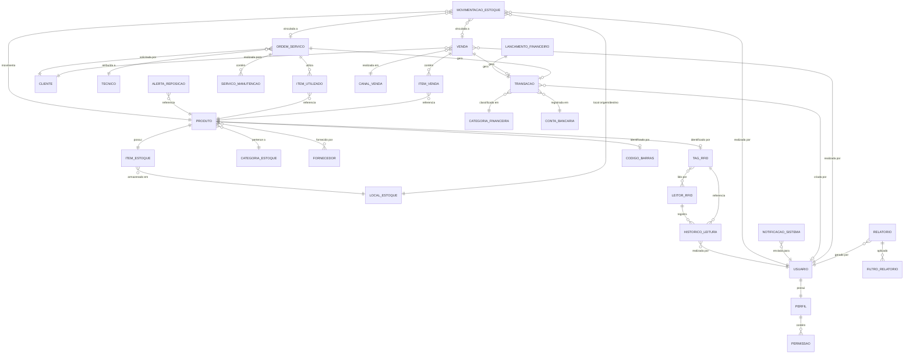
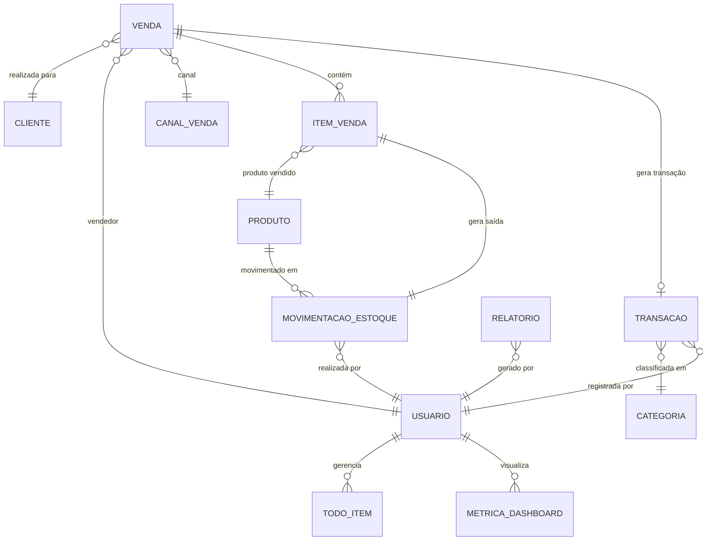

# Modelo Conceitual (MER) - WorkConnect
## Modelo Entidade-Relacionamento Conceitual

**Versão:** Conceitual de Alto Nível  
**Foco:** Entidades, Relacionamentos e Cardinalidades  
**Propósito:** Compreensão do modelo de negócio e regras

---

## Diagrama MER Conceitual - Versão Completa



---

## Diagrama MER Conceitual - Versão Simplificada



---

## Legenda de Cardinalidades

### Símbolos Utilizados

| Símbolo | Significado | Exemplo |
|---------|-------------|---------|
| `||--||` | Um para Um (1:1) obrigatório | PRODUTO tem 1 ITEM_ESTOQUE |
| `||--o\|` | Um para Zero ou Um (1:0..1) | PRODUTO pode ter 1 TAG_RFID |
| `||--o{` | Um para Muitos (1:N) | VENDA contém N ITEM_VENDA |
| `}o--||` | Muitos para Um (N:1) | N PRODUTOS pertencem a 1 CATEGORIA |
| `}o--o{` | Muitos para Muitos (N:M) | N PRODUTOS de N FORNECEDORES |
| `}o--o\|` | Muitos para Zero ou Um (N:0..1) | N MOVIMENTACOES podem ter 1 VENDA |

### Interpretação

- **`||`** = Obrigatório (deve existir)
- **`o|`** = Opcional (pode ou não existir)
- **`{`** = Muitos (zero ou mais)

---

## Regras de Negócio Expressas

### Versão Completa

#### 1. Controle de Acesso
- **RN01**: Todo USUARIO deve possuir exatamente UM PERFIL
- **RN02**: Um PERFIL pode conter MÚLTIPLAS PERMISSOES
- **RN03**: Permissões controlam acesso aos módulos do sistema

#### 2. Gestão de Estoque
- **RN04**: Todo PRODUTO deve ter exatamente UM ITEM_ESTOQUE
- **RN05**: Todo PRODUTO deve pertencer a UMA CATEGORIA
- **RN06**: Um PRODUTO pode ter MÚLTIPLOS FORNECEDORES
- **RN07**: Produtos são armazenados em UM LOCAL_ESTOQUE específico
- **RN08**: Quantidade em ITEM_ESTOQUE nunca pode ser negativa

#### 3. Rastreamento RFID
- **RN09**: PRODUTO pode ter NO MÁXIMO UMA TAG_RFID ativa
- **RN10**: PRODUTO pode ter NO MÁXIMO UM CODIGO_BARRAS
- **RN11**: TAG_RFID pode ser lida por MÚLTIPLOS LEITORES
- **RN12**: LEITOR_RFID registra HISTÓRICO de todas as leituras
- **RN13**: HISTORICO_LEITURA sempre vincula TAG, LEITOR e USUARIO

#### 4. Movimentação
- **RN14**: Toda MOVIMENTACAO_ESTOQUE deve ter UM PRODUTO
- **RN15**: Toda MOVIMENTACAO deve ser realizada por UM USUARIO
- **RN16**: MOVIMENTACAO pode estar vinculada a VENDA ou ORDEM_SERVICO
- **RN17**: LOCAL_ESTOQUE registra origem/destino da movimentação

#### 5. Alertas
- **RN18**: ALERTA_REPOSICAO gerado quando quantidade < nível mínimo
- **RN19**: NOTIFICACAO enviada para USUARIOS responsáveis
- **RN20**: Alertas podem ter prioridades diferentes

#### 6. Ordens de Serviço
- **RN21**: ORDEM_SERVICO deve ter UM CLIENTE e UM TECNICO
- **RN22**: OS pode utilizar MÚLTIPLOS ITENS do estoque
- **RN23**: OS pode conter MÚLTIPLOS SERVICOS_MANUTENCAO
- **RN24**: ITEM_UTILIZADO reduz quantidade em ITEM_ESTOQUE
- **RN25**: Itens devolvidos geram MOVIMENTACAO de entrada

#### 7. Financeiro
- **RN26**: Toda TRANSACAO deve ter UMA CATEGORIA
- **RN27**: Toda TRANSACAO deve estar em UMA CONTA_BANCARIA
- **RN28**: VENDA gera TRANSACAO tipo RECEITA automaticamente
- **RN29**: ORDEM_SERVICO gera TRANSACAO ao finalizar
- **RN30**: LANCAMENTO_FINANCEIRO pode gerar múltiplas parcelas

#### 8. Vendas
- **RN31**: VENDA deve ter UM CLIENTE obrigatoriamente
- **RN32**: VENDA deve ter UM USUARIO (vendedor)
- **RN33**: VENDA deve ter UM CANAL_VENDA
- **RN34**: ITEM_VENDA automaticamente gera MOVIMENTACAO de saída
- **RN35**: Cancelamento de VENDA estorna MOVIMENTACAO

#### 9. Relatórios
- **RN36**: RELATORIO deve ser gerado por UM USUARIO
- **RN37**: RELATORIO pode ter MÚLTIPLOS FILTROS aplicados
- **RN38**: Relatórios podem ser agendados para geração automática

### Versão Simplificada

#### Regras Essenciais
- **RN-S01**: USUARIO gerencia suas próprias TODO_ITEMS
- **RN-S02**: PRODUTO tem controle básico de quantidade
- **RN-S03**: VENDA gera TRANSACAO e MOVIMENTACAO automaticamente
- **RN-S04**: ITEM_VENDA reduz quantidade de PRODUTO
- **RN-S05**: CATEGORIA classifica TRANSACOES em receitas/despesas

---

## Relacionamentos Detalhados

### Relacionamentos 1:1 (Um para Um)

| Entidade A | Entidade B | Descrição |
|------------|------------|-----------|
| USUARIO | PERFIL | Cada usuário possui um perfil único |
| PRODUTO | ITEM_ESTOQUE | Cada produto tem um registro de estoque |
| LANCAMENTO_FINANCEIRO | TRANSACAO | Cada lançamento gera uma transação |

### Relacionamentos 1:N (Um para Muitos)

| Entidade Um | Entidade Muitos | Descrição |
|-------------|-----------------|-----------|
| PERFIL | PERMISSAO | Um perfil tem múltiplas permissões |
| CATEGORIA_ESTOQUE | PRODUTO | Uma categoria contém múltiplos produtos |
| LOCAL_ESTOQUE | ITEM_ESTOQUE | Um local armazena múltiplos itens |
| LEITOR_RFID | HISTORICO_LEITURA | Um leitor registra múltiplas leituras |
| CLIENTE | VENDA | Um cliente realiza múltiplas vendas |
| CLIENTE | ORDEM_SERVICO | Um cliente solicita múltiplas OS |
| VENDA | ITEM_VENDA | Uma venda contém múltiplos itens |
| ORDEM_SERVICO | ITEM_UTILIZADO | Uma OS utiliza múltiplos itens |
| CONTA_BANCARIA | TRANSACAO | Uma conta tem múltiplas transações |
| CATEGORIA_FINANCEIRA | TRANSACAO | Uma categoria agrupa múltiplas transações |
| USUARIO | RELATORIO | Um usuário gera múltiplos relatórios |

### Relacionamentos N:M (Muitos para Muitos)

| Entidade A | Entidade B | Tabela Associativa | Descrição |
|------------|------------|-------------------|-----------|
| PRODUTO | FORNECEDOR | PRODUTO_FORNECEDOR | Produtos têm múltiplos fornecedores |
| TAG_RFID | LEITOR_RFID | HISTORICO_LEITURA | Tags lidas por múltiplos leitores |

### Relacionamentos Opcionais (0..1)

| Entidade | Entidade Opcional | Descrição |
|----------|-------------------|-----------|
| PRODUTO | TAG_RFID | Produto pode ter tag RFID |
| PRODUTO | CODIGO_BARRAS | Produto pode ter código de barras |
| VENDA | TRANSACAO | Venda pode gerar transação |
| ORDEM_SERVICO | TRANSACAO | OS pode gerar transação |
| MOVIMENTACAO_ESTOQUE | VENDA | Movimentação pode estar vinculada a venda |
| MOVIMENTACAO_ESTOQUE | ORDEM_SERVICO | Movimentação pode estar vinculada a OS |

---

## Integridade Referencial

### Exclusão em Cascata (ON DELETE CASCADE)

Quando entidade pai é excluída, entidades filhas também são excluídas:

- **VENDA → ITEM_VENDA**: Ao excluir venda, exclui todos os itens
- **ORDEM_SERVICO → ITEM_UTILIZADO**: Ao excluir OS, exclui itens utilizados
- **PERFIL → PERMISSAO**: Ao excluir perfil, remove permissões
- **RELATORIO → FILTRO_RELATORIO**: Ao excluir relatório, remove filtros

### Exclusão Restrita (ON DELETE RESTRICT)

Não permite exclusão se houver dependências:

- **PRODUTO**: Não pode excluir se houver movimentações
- **CLIENTE**: Não pode excluir se houver vendas ou OS
- **CATEGORIA**: Não pode excluir se houver produtos ou transações
- **USUARIO**: Não pode excluir se houver registros criados

### Exclusão com Anulação (ON DELETE SET NULL)

Ao excluir, referências são anuladas:

- **TECNICO → ORDEM_SERVICO**: Se técnico sai, OS fica sem atribuição
- **CANAL_VENDA → VENDA**: Se canal desativado, venda mantém histórico

### Soft Delete (Exclusão Lógica)

Entidades que nunca são excluídas fisicamente:

- **USUARIO**: Campo `ativo = false`
- **PRODUTO**: Campo `ativo = false`
- **CLIENTE**: Campo `ativo = false`
- **VENDA**: Campo `status = 'CANCELADO'`
- **ORDEM_SERVICO**: Campo `status = 'CANCELADO'`

---

## Exemplos de Leitura

### Exemplo 1: Fluxo de Venda
```
1. USUARIO (vendedor) cria uma VENDA
2. VENDA é vinculada a um CLIENTE
3. VENDA é vinculada a um CANAL_VENDA
4. USUARIO adiciona múltiplos ITEM_VENDA
5. Cada ITEM_VENDA referencia um PRODUTO
6. Para cada ITEM_VENDA:
   - Sistema cria MOVIMENTACAO_ESTOQUE (saída)
   - Sistema atualiza quantidade em ITEM_ESTOQUE
7. Sistema cria TRANSACAO (receita)
8. TRANSACAO é vinculada a CONTA_BANCARIA
9. TRANSACAO é classificada em CATEGORIA_FINANCEIRA
```

### Exemplo 2: Ordem de Serviço
```
1. CLIENTE solicita serviço
2. Sistema cria ORDEM_SERVICO
3. USUARIO atribui TECNICO
4. TECNICO retira itens do almoxarifado
5. Sistema cria ITEM_UTILIZADO para cada item
6. Sistema cria MOVIMENTACAO_ESTOQUE (saída)
7. LEITOR_RFID registra saída automaticamente
8. Sistema gera HISTORICO_LEITURA
9. TECNICO finaliza serviço
10. Itens reutilizáveis são devolvidos
11. Sistema cria MOVIMENTACAO_ESTOQUE (entrada)
12. Sistema cria TRANSACAO (receita do serviço)
```

### Exemplo 3: Alerta de Reposição
```
1. MOVIMENTACAO_ESTOQUE reduz quantidade
2. Sistema verifica se quantidade < nível_minimo
3. Se SIM, sistema cria ALERTA_REPOSICAO
4. Sistema cria NOTIFICACAO_SISTEMA
5. NOTIFICACAO é enviada para USUARIOS responsáveis
6. USUARIO visualiza alerta no Dashboard
7. USUARIO registra compra (MOVIMENTACAO entrada)
8. Sistema marca ALERTA_REPOSICAO como resolvido
```

---

## Diferenças entre Versões

| Aspecto | Versão Completa | Versão Simplificada |
|---------|-----------------|---------------------|
| **Entidades** | 25+ entidades | 10 entidades |
| **Rastreamento** | RFID + Código Barras | Manual |
| **Serviços** | Ordens de Serviço completas | Não incluso |
| **Alertas** | Automáticos | Manual |
| **Movimentação** | Múltiplos tipos | Básica (entrada/saída) |
| **Financeiro** | Completo com parcelamento | Básico |
| **Complexidade** | Alta (sistema industrial) | Baixa (MVP comercial) |

---

**Documento gerado para:** WorkConnect - Sistema de Gestão Empresarial  
**Data:** 2025  
**Tipo:** Modelo Conceitual (MER)  
**Versão:** 1.0

