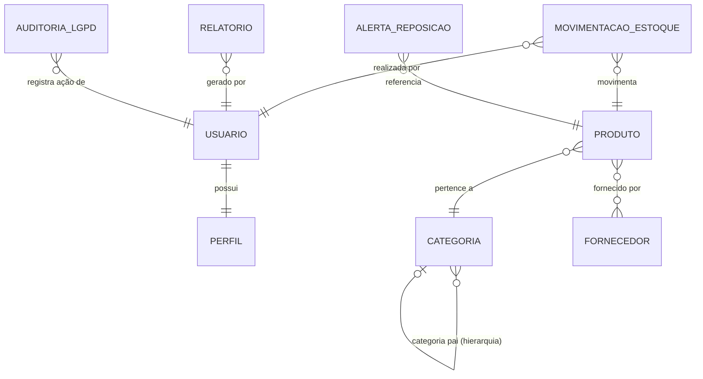

# Modelo Conceitual (MER) - Work Connect
## Modelo Entidade-Relacionamento para Gestão de Estoque

**Versão:** Conceitual Focado em Estoque  
**Foco:** Entidades, Relacionamentos e Cardinalidades para PMEs  
**Propósito:** Compreensão do modelo de negócio com conformidade LGPD

---

## Diagrama MER Conceitual - Work Connect



---

## Legenda de Cardinalidades

### Símbolos Utilizados

| Símbolo | Significado | Exemplo |
|---------|-------------|---------|
| `||--||` | Um para Um (1:1) obrigatório | USUARIO possui 1 PERFIL |
| `||--o\|` | Um para Zero ou Um (1:0..1) | CATEGORIA pode ter 1 categoria pai |
| `||--o{` | Um para Muitos (1:N) | PRODUTO tem N MOVIMENTACOES |
| `}o--||` | Muitos para Um (N:1) | N PRODUTOS pertencem a 1 CATEGORIA |
| `}o--o{` | Muitos para Muitos (N:M) | N PRODUTOS de N FORNECEDORES |

### Interpretação

- **`||`** = Obrigatório (deve existir)
- **`o|`** = Opcional (pode ou não existir)
- **`{`** = Muitos (zero ou mais)

---

## Regras de Negócio do Work Connect

### 15 Regras Principais (Focadas em Gestão de Estoque)

#### 1. Controle de Acesso e Usuários
- **RN01**: Todo USUARIO deve possuir exatamente UM PERFIL
- **RN02**: Perfis disponíveis: ADMINISTRADOR, GERENTE, OPERADOR, CONSULTA
- **RN03**: Apenas ADMINISTRADOR pode alterar perfis e permissões

#### 2. Gestão de Produtos e Estoque
- **RN04**: Todo PRODUTO deve pertencer a UMA CATEGORIA
- **RN05**: Código do PRODUTO deve ser ÚNICO no sistema
- **RN06**: Quantidade em PRODUTO nunca pode ser NEGATIVA
- **RN07**: Status do PRODUTO é calculado automaticamente:
  - OK: quantidade > 70% do mínimo
  - BAIXO: quantidade entre 30-70% do mínimo
  - CRITICO: quantidade < 30% do mínimo

#### 3. Fornecedores
- **RN08**: Um PRODUTO pode ter de 1 a 3 FORNECEDORES vinculados
- **RN09**: Apenas UM fornecedor pode ser PRINCIPAL (prioridade = 1)
- **RN10**: Custo médio ponderado é recalculado a cada ENTRADA_COMPRA

#### 4. Movimentações
- **RN11**: Toda MOVIMENTACAO_ESTOQUE deve ter UM PRODUTO e UM USUARIO
- **RN12**: Saída NÃO pode exceder quantidade disponível
- **RN13**: Ajustes de inventário devem ter observação obrigatória

#### 5. Alertas Automáticos
- **RN14**: ALERTA_REPOSICAO é gerado automaticamente quando quantidade < quantidade_minima
- **RN15**: Prioridade do alerta:
  - URGENTE: quantidade = 0
  - ALTA: quantidade < 30% do mínimo
  - MÉDIA: quantidade < 70% do mínimo
  - BAIXA: quantidade = mínimo

#### 6. Conformidade LGPD (Lei Geral de Proteção de Dados)
- **RN16**: Usuário deve dar consentimento explícito para tratamento de dados pessoais
- **RN17**: Toda ação sobre dados pessoais deve ser registrada em AUDITORIA_LGPD
- **RN18**: Usuário pode solicitar EXCLUSÃO de seus dados a qualquer momento
- **RN19**: Dados devem ser ANONIMIZADOS (não deletados) após solicitação de exclusão
- **RN20**: Logs de auditoria LGPD devem ser retidos por 6 meses mínimo

---

## Relacionamentos Detalhados

### Relacionamentos 1:1 (Um para Um)

| Entidade A | Entidade B | Descrição |
|------------|------------|-----------|
| USUARIO | PERFIL | Cada usuário possui um perfil único de acesso |

### Relacionamentos 1:N (Um para Muitos)

| Entidade Um | Entidade Muitos | Descrição |
|-------------|-----------------|-----------|
| CATEGORIA | PRODUTO | Uma categoria contém múltiplos produtos |
| CATEGORIA | CATEGORIA | Categorias hierárquicas (pai-filho) |
| PRODUTO | MOVIMENTACAO_ESTOQUE | Um produto tem múltiplas movimentações registradas |
| PRODUTO | ALERTA_REPOSICAO | Um produto pode gerar múltiplos alertas ao longo do tempo |
| USUARIO | MOVIMENTACAO_ESTOQUE | Um usuário registra múltiplas movimentações |
| USUARIO | RELATORIO | Um usuário gera múltiplos relatórios |
| USUARIO | AUDITORIA_LGPD | Ações do usuário são auditadas para conformidade LGPD |

### Relacionamentos N:M (Muitos para Muitos)

| Entidade A | Entidade B | Tabela Associativa | Descrição |
|------------|------------|-------------------|-----------|
| PRODUTO | FORNECEDOR | PRODUTO_FORNECEDOR | Produtos têm 1-3 fornecedores com prioridade definida |

### Relacionamentos Hierárquicos

| Entidade | Auto-Relacionamento | Descrição |
|----------|-------------------|-----------|
| CATEGORIA | categoria_pai_id | Categorias hierárquicas (ex.: Ferramentas > Parafusos > M5) |

---

## Integridade Referencial

### Exclusão Restrita (ON DELETE RESTRICT)

Não permite exclusão se houver dependências ativas:

- **PRODUTO**: Não pode excluir se houver movimentações ou alertas
- **FORNECEDOR**: Não pode excluir se houver produtos vinculados
- **CATEGORIA**: Não pode excluir se houver produtos ou subcategorias
- **USUARIO**: Não pode excluir fisicamente (apenas anonimizar - LGPD)
- **PERFIL**: Não pode excluir se houver usuários com esse perfil

### Soft Delete (Exclusão Lógica)

Entidades que nunca são excluídas fisicamente (conformidade LGPD e auditoria):

- **USUARIO**: Campo `ativo = false` + anonimização de dados pessoais
- **PRODUTO**: Campo `ativo = false` (mantém histórico)
- **FORNECEDOR**: Campo `ativo = false` (preserva relacionamentos históricos)
- **CATEGORIA**: Campo `ativo = false` (mantém integridade referencial)

### Anonimização LGPD

Quando usuário solicita exclusão:

1. Campo `data_exclusao_solicitada` é preenchido
2. Após 90 dias (período de cancelamento):
   - `nome` → "Usuário Anônimo #ID"
   - `email` → "anonimo_ID@sistema.local"
   - `telefone` → NULL
   - `foto_perfil` → NULL
   - Mantém: `id`, histórico de movimentações
3. Registro em AUDITORIA_LGPD
4. Sistema envia confirmação de exclusão

---

## Exemplos de Fluxos (Work Connect)

### Exemplo 1: Cadastro Completo de Produto
```
1. USUARIO (Administrador) acessa cadastro de produtos
2. Preenche dados obrigatórios:
   - Nome: "Parafuso M5"
   - Código: "PARA-M5-001" (validado como único)
   - CATEGORIA: "Ferramentas > Parafusos"
   - Quantidade mínima: 50 unidades
   - Preço de aquisição: R$ 0,50
3. Sistema cria PRODUTO com:
   - quantidade_atual = 0
   - status = CRITICO
4. USUARIO vincula FORNECEDORES:
   - Fornecedor A (prioridade=1, principal)
   - Fornecedor B (prioridade=2, backup)
5. Sistema cria registros em PRODUTO_FORNECEDOR
6. USUARIO define localização física: "Setor A - Prateleira 3"
```

### Exemplo 2: Entrada de Mercadoria com Cálculo de Custo Médio
```
1. USUARIO (Operador) acessa registro de movimentações
2. Busca produto "PARA-M5-001"
3. Sistema exibe: Estoque atual = 10, Custo médio = R$ 0,50
4. USUARIO registra entrada:
   - Tipo: ENTRADA_COMPRA
   - Quantidade: 100 unidades
   - Fornecedor: Fornecedor A
   - Preço unitário: R$ 0,45
   - Documento fiscal: NF-12345
5. Sistema cria MOVIMENTACAO_ESTOQUE
6. Sistema atualiza PRODUTO:
   - quantidade_atual: 10 → 110
   - custo_medio_ponderado: (10×0,50 + 100×0,45)/110 = R$ 0,45
   - status: CRITICO → OK
7. Sistema registra em AUDITORIA_LGPD (acesso ao fornecedor)
```

### Exemplo 3: Geração Automática de Alerta
```
1. USUARIO registra saída de 95 unidades do produto
2. Sistema cria MOVIMENTACAO_ESTOQUE (tipo: SAIDA_VENDA)
3. Sistema atualiza PRODUTO:
   - quantidade_atual: 110 → 15
4. Sistema verifica: 15 < 50 (quantidade_minima)
5. Sistema calcula prioridade:
   - 15 < 30% de 50 (15 unidades) → ALTA
6. Sistema cria ALERTA_REPOSICAO:
   - quantidade_sugerida = 100 (mínimo × 2)
   - prioridade = ALTA
7. Sistema exibe alerta no Dashboard (badge vermelho)
8. USUARIO (Administrador) visualiza alerta
9. USUARIO marca como resolvido após fazer pedido ao fornecedor
```

### Exemplo 4: Exportação de Dados Pessoais (LGPD)
```
1. USUARIO acessa "Meus Dados" nas configurações
2. Clica em "Exportar Meus Dados"
3. Sistema valida identidade (senha ou 2FA)
4. Sistema coleta todos os dados pessoais:
   - Cadastro básico (nome, email, telefone)
   - Histórico de movimentações realizadas
   - Logs de acesso ao sistema
5. Sistema gera arquivo JSON estruturado
6. Sistema registra em AUDITORIA_LGPD:
   - acao = EXPORTACAO_DADOS
   - data_hora = agora
   - ip_origem = 192.168.1.100
7. Sistema envia email com link seguro de download
8. Link expira em 48 horas
9. Sistema mantém log da exportação por 6 meses
```

---

## Público-Alvo e Contexto

### PMEs (Pequenas e Médias Empresas)

| Característica | Especificação |
|----------------|---------------|
| **Faturamento Anual** | R$ 360.000 a R$ 4.800.000 |
| **Funcionários** | 1 a 50 colaboradores |
| **Setores** | Varejo, Indústria Leve, Serviços |
| **Problemas Enfrentados** | Fragmentação de dados, erros de contagem (20-30%), perdas por falta de estoque |

### Benefícios Quantificados

- 📉 Redução de 40% nas perdas por falta de estoque
- 💰 Economia de 30% em custos de armazenamento
- ⏱️ Ganho de 15 horas/semana por funcionário
- 📊 ROI de 150% no primeiro ano
- 🎯 Precisão de inventário > 99%

---

## Planos de Preços e Escalabilidade

### Modelo de Negócio (SaaS)

| Plano | Preço/Mês | Produtos | Usuários | Recursos |
|-------|-----------|----------|----------|----------|
| **Básico** | R$ 149 | Até 500 | Até 5 | Alertas, Relatórios PDF |
| **Profissional** | R$ 299 | Até 2.000 | Até 15 | + Relatórios Avançados, API |
| **Empresarial** | R$ 599 | Ilimitado | Ilimitado | + Integração ERP, Suporte Premium |

### Capacidade Técnica

- **Produtos por empresa:** 10.000+ (escalável)
- **Usuários simultâneos:** 50 por instância
- **Movimentações/dia:** 10.000+ (com cache)
- **Tempo de resposta:** < 2 segundos
- **Uptime garantido:** 99,5%

---

**Documento gerado para:** Work Connect - Sistema de Gestão de Estoque para PMEs  
**Data:** 2025  
**Tipo:** Modelo Conceitual (MER)  
**Versão:** 1.0 - Focado em Estoque + LGPD  
**Autores:** Patrick Lima, Rafael Bastos, Lucas Lima, Rodrigo Neri, Matheus Santos  
**Instituição:** SENAI - Curso Técnico em Desenvolvimento de Sistemas

