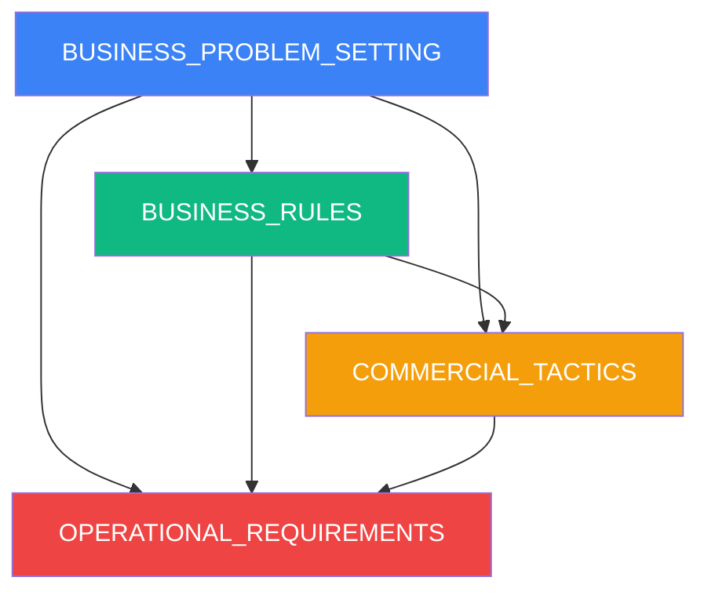

# Documentação Estratégica - Work Connect
## Business Strategy Documentation

📍 **Navegação:**
🏠 [README Principal](../../README.md) | 📚 [Documentação Técnica](../) | 📖 [Tutorial](../../TUTORIAL_CONTRIBUICAO_COMPLETO.md)

---

**Versão:** 1.0  
**Data:** Janeiro 2025  
**Propósito:** Documentação estratégica completa para TCC e planejamento de negócio  
**Público-Alvo:** Acadêmicos, Investidores, Stakeholders, Equipe de Negócio

---

## Visão Geral

Esta seção contém a documentação estratégica completa do Work Connect, cobrindo aspectos de negócio, regras operacionais, táticas comerciais e requisitos operacionais. Esta documentação serve tanto para a apresentação do TCC quanto para o planejamento de um possível lançamento comercial real.

---

## Documentos Disponíveis

### 1. [Business Problem Setting](./BUSINESS_PROBLEM_SETTING.md)

**Descrição:** Análise estratégica completa do problema de negócio, mercado, oportunidades e proposta de valor.

**Conteúdo:**
- Executive Summary
- Market Context & PME Landscape
- Problem Statement (5 problemas críticos)
- Impact Analysis (impacto financeiro quantificado)
- Root Cause Analysis
- Market Opportunity Size (TAM, SAM, SOM)
- Competitive Landscape
- Target Customer Personas
- Value Proposition Framework
- Problem-Solution Fit Validation

**Ideal para:**
- Apresentação do TCC (justificativa do problema)
- Pitch para investidores
- Validação de mercado
- Definição de estratégia de produto

**Tamanho:** ~15.000 palavras | ~60 páginas

---

### 2. [Business Rules](./BUSINESS_RULES.md)

**Descrição:** Documentação completa de todas as regras de negócio que governam o sistema.

**Conteúdo:**
- Business Rules Overview
- Inventory Management Rules (status, custos, movimentações)
- User Access & Permissions Rules (perfis, autenticação)
- Pricing & Subscription Rules (planos, cobrança, upgrades)
- Data Management Rules (LGPD, retenção, anonimização)
- Operational Rules (alertas, relatórios, exportações)
- Business Logic Rules (categorias, fornecedores, transações)
- Validações e Exceções

**Ideal para:**
- Desenvolvimento técnico
- Validação de requisitos
- Documentação para desenvolvedores
- Apresentação técnica do TCC

**Tamanho:** ~12.000 palavras | ~50 páginas

---

### 3. [Commercial Tactics](./COMMERCIAL_TACTICS.md)

**Descrição:** Estratégia comercial completa incluindo go-to-market, precificação, vendas e marketing.

**Conteúdo:**
- Go-to-Market Strategy (4 fases)
- Pricing Strategy & Rationale (value-based pricing)
- Sales Strategy (funil de vendas, canais)
- Marketing Strategy (segmentação, conteúdo, canais digitais)
- Customer Acquisition Tactics (trial, referências, parcerias)
- Retention & Growth Tactics (customer success, upsell)
- Revenue Optimization (experimentos, feature gating)
- Métricas e KPIs Comerciais
- Projeção Financeira (5 anos)

**Ideal para:**
- Planejamento de lançamento comercial
- Estratégia de vendas e marketing
- Projeções financeiras
- Apresentação para investidores

**Tamanho:** ~14.000 palavras | ~55 páginas

---

### 4. [Operational Requirements](./OPERATIONAL_REQUIREMENTS.md)

**Descrição:** Requisitos operacionais, SLAs, especificações de performance e operações de suporte.

**Conteúdo:**
- Service Level Agreements (SLAs) - uptime, tempo de resposta, suporte
- Performance Requirements (capacidade, relatórios, busca)
- Support Operations (canais, níveis, escalação)
- Security & Compliance Operations (segurança, LGPD, backup)
- Quality Assurance Operations (testes, bugs, releases)
- Customer Success Operations (onboarding, acompanhamento)
- Infrastructure Operations (cloud, monitoramento)
- Métricas e KPIs Operacionais

**Ideal para:**
- Planejamento de infraestrutura
- Definição de SLAs com clientes
- Operações de suporte
- Apresentação técnica do TCC

**Tamanho:** ~13.000 palavras | ~52 páginas

---

## Como Usar Esta Documentação

### Para Apresentação do TCC

1. **Comece com:** [Business Problem Setting](./BUSINESS_PROBLEM_SETTING.md)
   - Justifica o problema
   - Define o mercado
   - Apresenta a oportunidade

2. **Continue com:** [Business Rules](./BUSINESS_RULES.md)
   - Mostra como o sistema funciona
   - Demonstra conhecimento técnico
   - Valida requisitos

3. **Complemente com:** [Operational Requirements](./OPERATIONAL_REQUIREMENTS.md)
   - Mostra viabilidade técnica
   - Define qualidade e performance
   - Demonstra profissionalismo

4. **Opcional:** [Commercial Tactics](./COMMERCIAL_TACTICS.md)
   - Mostra viabilidade comercial
   - Demonstra pensamento estratégico
   - Adiciona valor ao TCC

### Para Planejamento de Negócio Real

1. **Validação:** [Business Problem Setting](./BUSINESS_PROBLEM_SETTING.md)
   - Valida problema e mercado
   - Define personas
   - Estima oportunidade

2. **Desenvolvimento:** [Business Rules](./BUSINESS_RULES.md)
   - Guia desenvolvimento técnico
   - Define regras de negócio
   - Garante consistência

3. **Lançamento:** [Commercial Tactics](./COMMERCIAL_TACTICS.md)
   - Define estratégia de go-to-market
   - Planeja vendas e marketing
   - Projeta receita

4. **Operações:** [Operational Requirements](./OPERATIONAL_REQUIREMENTS.md)
   - Define SLAs
   - Planeja infraestrutura
   - Estabelece processos

---

## Métricas Principais Resumidas

### Mercado
- **TAM:** R$ 108-270 bilhões/ano
- **SAM:** R$ 5,4 bilhões/ano (1,5 milhões de PMEs)
- **SOM (Ano 5):** R$ 269 milhões/ano (75.000 clientes, 5% market share)

### Problema
- **68% das PMEs** enfrentam fragmentação de dados
- **55% têm erros** de 20-30% no inventário
- **42% perdem** 15-25% da receita por falta de estoque
- **Perda média:** R$ 469k-828k/ano por PME

### Solução
- **Redução de 40%** nas perdas por falta
- **Economia de 30%** em custos de armazenamento
- **Ganho de 15 horas/semana** por funcionário
- **ROI de 150%** no primeiro ano

### Precificação
- **Básico:** R$ 149/mês (500 produtos, 5 usuários)
- **Profissional:** R$ 299/mês (2.000 produtos, 15 usuários)
- **Empresarial:** R$ 599/mês (ilimitado)

### Projeção (5 Anos)
- **Ano 1:** 500 clientes, R$ 1,8M ARR
- **Ano 3:** 8.000 clientes, R$ 28,7M ARR
- **Ano 5:** 75.000 clientes, R$ 269M ARR

### Operações
- **Uptime:** 99,5% (máximo 3,6h downtime/mês)
- **Tempo de Resposta:** < 2s (P95)
- **Suporte:** < 4h resposta (email)
- **Capacidade:** 10.000+ produtos, 50 usuários simultâneos

---

## Cross-References

### Entre Documentos Estratégicos



**Relacionamentos:**
- **Problem Setting → Business Rules:** Problema define regras necessárias
- **Problem Setting → Commercial Tactics:** Mercado define estratégia comercial
- **Problem Setting → Operational Requirements:** Escala define requisitos operacionais
- **Business Rules → Commercial Tactics:** Regras definem o que pode ser vendido
- **Business Rules → Operational Requirements:** Regras definem o que precisa ser operado
- **Commercial Tactics → Operational Requirements:** Estratégia comercial define SLAs necessários

### Com Documentação Técnica

- [Diagrama MER](../diagrama-mer-conceitual.md) - Modelo de dados referenciado em Business Rules
- [Diagrama DER](../diagrama-der-estoque.md) - Estrutura de banco referenciada em Business Rules
- [Casos de Uso](../diagrama-casos-de-uso-estoque.md) - Fluxos referenciados em Business Rules
- [LGPD Compliance](../LGPD-COMPLIANCE.md) - Conformidade referenciada em Business Rules e Operational Requirements

---

## Estrutura de Arquivos

```
doc/strategic/
├── README.md (este arquivo)
├── BUSINESS_PROBLEM_SETTING.md
├── BUSINESS_RULES.md
├── COMMERCIAL_TACTICS.md
└── OPERATIONAL_REQUIREMENTS.md
```

---

## Versão e Histórico

**Versão 1.0** - Janeiro 2025
- Criação inicial da documentação estratégica completa
- 4 documentos principais
- ~54.000 palavras totais
- ~217 páginas totais

---

## Autores e Contribuições

**Equipe Work Connect:**
- Patrick Lima
- Rafael Bastos
- Lucas Lima
- Rodrigo Neri
- Matheus Santos

**Instituição:** SENAI - Curso Técnico em Desenvolvimento de Sistemas  
**Período:** 2024-2025  
**Projeto:** Trabalho de Conclusão de Curso (TCC)

---

## Licença e Uso

Esta documentação foi criada como parte do Trabalho de Conclusão de Curso (TCC) do SENAI. Pode ser usada para:
- Apresentação acadêmica
- Referência em outros projetos
- Planejamento de negócio (com adaptações)

**Nota:** Esta é uma documentação de um caso fictício para fins acadêmicos. Qualquer uso comercial requer validação adicional e adaptação às condições reais de mercado.

---

**Última atualização:** Janeiro 2025  
**Próxima revisão:** Conforme necessário

