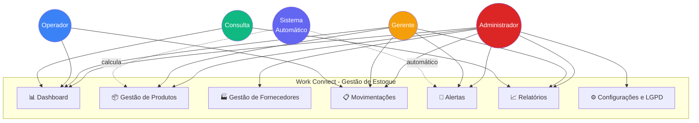
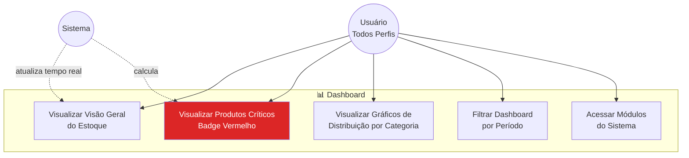
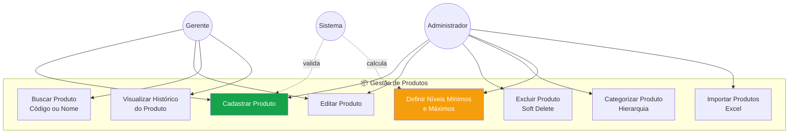
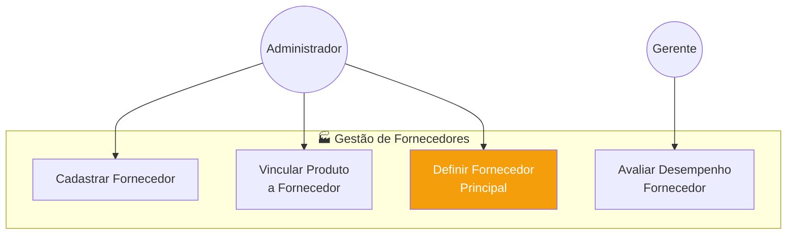
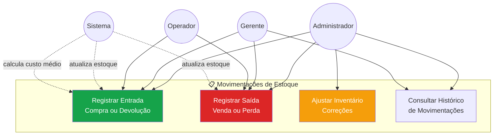
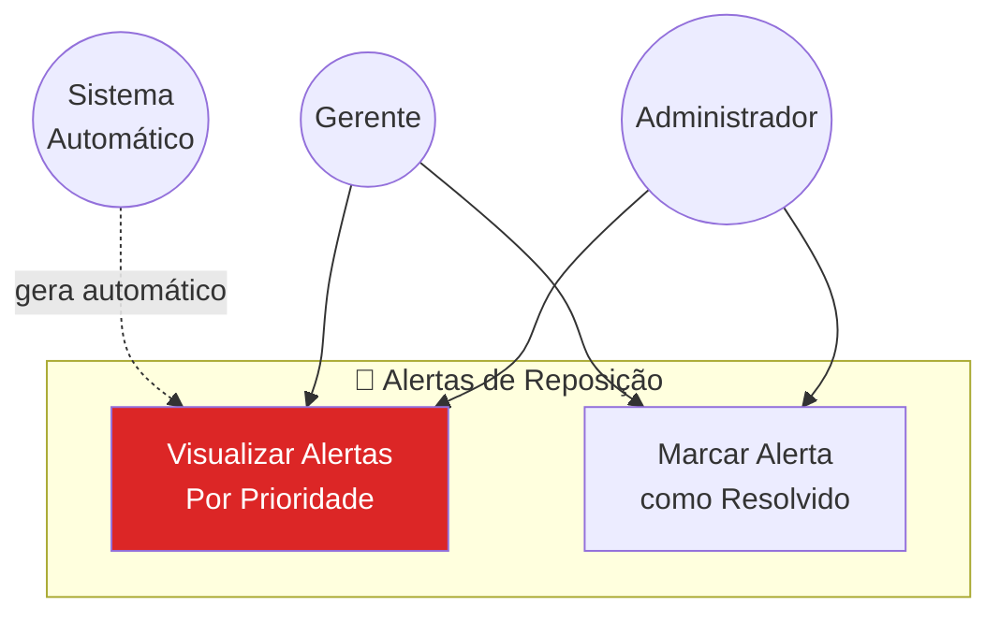
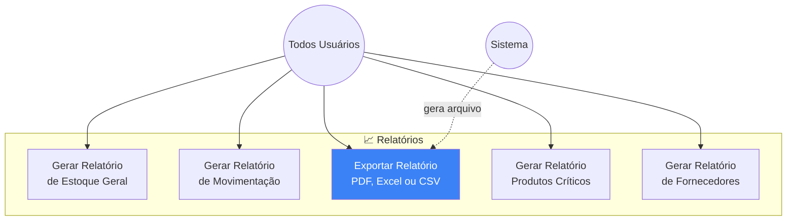
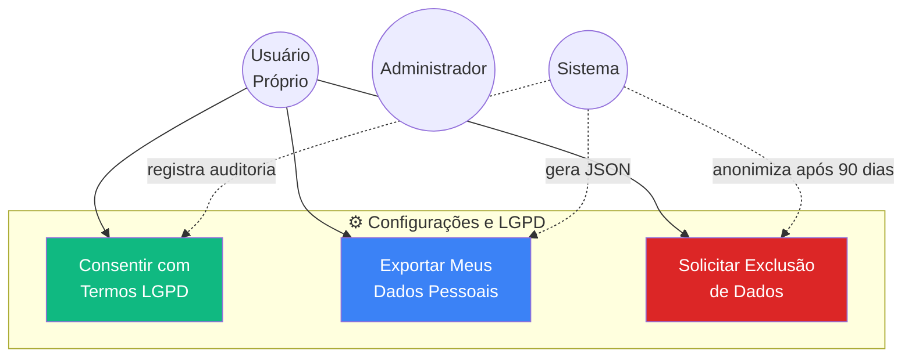

# Diagramas de Casos de Uso - Work Connect
## Sistema de Gestão de Estoque para PMEs

📍 **Navegação:**
🏠 [README Principal](../README.md) | 📚 [Índice Diagramas](./INDEX-DIAGRAMAS.md) | 📖 [Tutorial](../TUTORIAL_CONTRIBUICAO_COMPLETO.md)

---

**Versão:** Completa - Focada em Gestão de Estoque  
**Foco:** Requisitos funcionais com conformidade LGPD  
**Propósito:** Documentação de 27 casos de uso do sistema

---

## Diagrama Geral do Sistema



---

## 1. Módulo Dashboard



### Especificações - Dashboard

#### UC101 - Visualizar Visão Geral do Estoque
**Ator:** Todos (Admin, Gerente, Operador, Consulta)  
**Pré-condições:** Usuário autenticado  
**Fluxo Principal:**
1. Sistema exibe dashboard com métricas principais:
   - Total de produtos cadastrados
   - Produtos com status CRÍTICO (vermelho)
   - Produtos com status BAIXO (amarelo)
   - Produtos com status OK (verde)
   - Valor total em estoque (soma de quantidade × custo médio)
2. Sistema exibe gráfico de pizza: Distribuição por categoria
3. Sistema exibe gráfico de barras: Movimentações do mês (entradas vs saídas)
4. Usuário visualiza top 5 produtos mais críticos

**Pós-condições:** Dashboard atualizado exibido

**Referência:** [View vw_dashboard_alertas](./diagrama-der-estoque.md#view-4-dashboard-de-alertas)

---

#### UC102 - Visualizar Produtos Críticos
**Ator:** Admin, Gerente  
**Pré-condições:** Existem produtos com status BAIXO ou CRÍTICO  
**Fluxo Principal:**
1. Sistema lista produtos abaixo do mínimo
2. Sistema destaca visualmente:
   - Badge vermelho: CRÍTICO (< 30% do mínimo)
   - Badge amarelo: BAIXO (30-70% do mínimo)
3. Para cada produto crítico, sistema exibe:
   - Nome e código
   - Quantidade atual vs mínima
   - Fornecedor principal
   - Tempo estimado de entrega
4. Usuário pode clicar em "Repor Agora" (link para registrar compra)

**Pós-condições:** Lista de produtos críticos exibida

**Extensão:** UC401 (Registrar Entrada)

**Referência:** [View vw_produtos_criticos](./diagrama-der-estoque.md#view-2-produtos-críticos-para-dashboard)

---

## 2. Módulo Gestão de Produtos



### Especificações - Produtos

#### UC201 - Cadastrar Produto
**Ator:** Administrador, Gerente  
**Pré-condições:** Categoria existe  
**Fluxo Principal:**
1. Usuário acessa "Novo Produto"
2. Usuário preenche dados obrigatórios:
   - Código (validado como único em tempo real)
   - Nome
   - Categoria (seleção da árvore hierárquica)
   - Quantidade mínima (> 0)
   - Quantidade máxima (> mínimo)
   - Preço de aquisição
   - Unidade de medida (UN, KG, L, M, etc)
3. Usuário preenche dados opcionais:
   - Descrição
   - Prazo de validade
   - Localização física (ex.: "Setor A - Prateleira 3")
4. Sistema valida:
   - Código único
   - Quantidade máxima > mínima
   - Valores numéricos positivos
5. Sistema cria Produto com:
   - quantidade_atual = 0
   - status = CRITICO
   - custo_medio_ponderado = preco_aquisicao
6. Sistema exibe mensagem: "Produto cadastrado com sucesso"

**Fluxo Alternativo:**
- 4a. Código duplicado
  - Sistema exibe erro: "Código já existe no sistema"
  - Retorna ao passo 2

**Pós-condições:** Produto cadastrado no sistema

**Referência:** [Tabela PRODUTO](./diagrama-der-estoque.md#3-tabela-produto)

---

#### UC206 - Definir Níveis Mínimos e Máximos
**Ator:** Administrador  
**Pré-condições:** Produto cadastrado  
**Fluxo Principal:**
1. Administrador acessa edição do produto
2. Administrador define:
   - Quantidade mínima (nível de alerta)
   - Quantidade máxima (capacidade de armazenamento)
3. Sistema valida: máximo > mínimo
4. Sistema calcula automaticamente o status atual:
   - Se quantidade_atual > 70% do mínimo → OK
   - Se quantidade_atual entre 30-70% → BAIXO
   - Se quantidade_atual < 30% → CRÍTICO
5. Sistema atualiza produto
6. Se novo status = CRÍTICO ou BAIXO:
   - Sistema gera AlertaReposicao (trigger automático)

**Regra de Negócio:** RN07 (Status calculado automaticamente)

**Pós-condições:** Níveis definidos, status atualizado

---

#### UC208 - Importar Produtos (Excel)
**Ator:** Administrador  
**Pré-condições:** Arquivo Excel formatado corretamente  
**Fluxo Principal:**
1. Administrador acessa "Importar Produtos"
2. Sistema exibe template Excel para download
3. Administrador faz upload do arquivo preenchido
4. Sistema valida estrutura do arquivo:
   - Colunas obrigatórias presentes
   - Tipos de dados corretos
   - Códigos únicos
5. Sistema exibe prévia dos dados (primeiras 10 linhas)
6. Administrador confirma importação
7. Sistema processa em lote:
   - Valida cada linha
   - Cria produtos válidos
   - Registra erros em log
8. Sistema exibe resumo:
   - X produtos importados com sucesso
   - Y produtos com erro (detalhes no log)

**Fluxo Alternativo:**
- 4a. Arquivo inválido
  - Sistema exibe erros detalhados
  - Administrador corrige e reenvia

**Pós-condições:** Produtos importados em massa

**Referência:** [sp_importar_produtos_excel](./diagrama-der-estoque.md#script-de-importação)

---

## 3. Módulo Gestão de Fornecedores



### Especificações - Fornecedores

#### UC301 - Cadastrar Fornecedor
**Ator:** Administrador  
**Pré-condições:** Nenhuma  
**Fluxo Principal:**
1. Administrador acessa "Novo Fornecedor"
2. Administrador preenche:
   - Razão Social
   - Nome Fantasia
   - CNPJ (validado em tempo real)
   - Telefone
   - Email
   - Endereço
   - Tempo médio de entrega (dias)
   - Condições de pagamento
3. Sistema valida CNPJ:
   - Formato: XX.XXX.XXX/XXXX-XX
   - Dígitos verificadores
   - Unicidade
4. Sistema cria Fornecedor
5. Sistema exibe: "Fornecedor cadastrado"

**Fluxo Alternativo:**
- 3a. CNPJ inválido ou duplicado
  - Sistema exibe erro específico
  - Retorna ao passo 2

**Pós-condições:** Fornecedor disponível para vinculação

---

#### UC302 - Vincular Produto a Fornecedor
**Ator:** Administrador  
**Pré-condições:** Produto e Fornecedor cadastrados  
**Fluxo Principal:**
1. Administrador acessa edição do produto
2. Administrador clica em "Adicionar Fornecedor"
3. Sistema valida: produto já tem < 3 fornecedores
4. Administrador seleciona fornecedor
5. Administrador informa:
   - Preço atual (R$)
   - Prazo de entrega específico (dias)
   - Prioridade (1=Principal, 2=Secundário, 3=Backup)
6. Sistema valida:
   - Se prioridade = 1, verifica se já não existe principal
   - Preço > 0
7. Sistema cria registro em ProdutoFornecedor
8. Sistema exibe fornecedores vinculados (lista)

**Fluxo Alternativo:**
- 3a. Produto já tem 3 fornecedores
  - Sistema exibe: "Limite de fornecedores atingido"
  - Sugere remover um existente
- 6a. Já existe fornecedor principal
  - Sistema pergunta: "Trocar fornecedor principal?"
  - Se SIM: atualiza prioridade do anterior para 2

**Pós-condições:** Fornecedor vinculado ao produto

**Referência:** [Tabela PRODUTO_FORNECEDOR](./diagrama-der-estoque.md#6-tabela-produto_fornecedor-associativa-nm)

---

#### UC303 - Definir Fornecedor Principal
**Ator:** Administrador  
**Pré-condições:** Produto tem ≥ 2 fornecedores  
**Fluxo Principal:**
1. Administrador acessa lista de fornecedores do produto
2. Sistema exibe fornecedores com indicação visual:
   - ⭐ Principal (prioridade 1)
   - Secundário (prioridade 2)
   - Backup (prioridade 3)
3. Administrador clica em "Definir como Principal" em outro fornecedor
4. Sistema atualiza prioridades:
   - Anterior principal → prioridade 2
   - Novo principal → prioridade 1
5. Sistema salva alterações

**Regra de Negócio:** Apenas 1 fornecedor pode ser principal (RN09)

**Pós-condições:** Fornecedor principal atualizado

---

## 4. Módulo Movimentações



### Especificações - Movimentações

#### UC401 - Registrar Entrada (Compra ou Devolução)
**Ator:** Administrador, Gerente, Operador  
**Pré-condições:** Produto cadastrado  
**Fluxo Principal:**
1. Usuário acessa "Nova Movimentação"
2. Usuário seleciona tipo: ENTRADA_COMPRA
3. Usuário busca produto (por código ou nome)
4. Sistema exibe:
   - Dados do produto
   - Estoque atual
   - Quantidade mínima
   - Status atual
   - Fornecedor principal sugerido
5. Usuário informa:
   - Quantidade a adicionar
   - Preço unitário da compra
   - Fornecedor
   - Número do documento fiscal
   - Observações (opcional)
6. Sistema valida:
   - Quantidade > 0
   - Preço ≥ 0
7. Sistema chama **sp_registrar_movimentacao()**:
   - Cria registro em MOVIMENTACAO_ESTOQUE
   - Atualiza PRODUTO.quantidade_atual (+quantidade)
   - Recalcula custo_medio_ponderado (trigger)
   - Atualiza status (trigger: OK se >= 70% do mínimo)
8. Sistema exibe confirmação:
   - "Entrada registrada com sucesso"
   - Nova quantidade: X unidades
   - Novo status: [OK/BAIXO/CRÍTICO]

**Fluxo Alternativo:**
- 7a. Se produto estava em alerta e agora status = OK
  - Sistema marca AlertaReposicao como resolvido
  - Sistema exibe: "Alerta de reposição resolvido automaticamente"

**Pós-condições:** 
- Estoque atualizado
- Custo médio recalculado
- Status atualizado

**Referência:** [sp_registrar_movimentacao](./diagrama-der-estoque.md#procedure-1-registrar-movimentação-completa)

---

#### UC402 - Registrar Saída (Venda ou Perda)
**Ator:** Administrador, Gerente, Operador  
**Pré-condições:** Produto com estoque > 0  
**Fluxo Principal:**
1. Usuário acessa "Nova Movimentação"
2. Usuário seleciona tipo: SAIDA_VENDA ou SAIDA_PERDA
3. Usuário busca produto
4. Sistema exibe:
   - Estoque disponível
   - Alertas ativos (se houver)
5. Usuário informa:
   - Quantidade a retirar
   - Observação (obrigatória se PERDA)
6. Sistema valida:
   - Quantidade ≤ estoque disponível
7. Sistema chama **sp_registrar_movimentacao()**:
   - Cria movimentação
   - Atualiza quantidade (-quantidade)
   - Atualiza status
   - **Gera alerta se necessário** (trigger)
8. Sistema exibe confirmação e possível alerta

**Fluxo Alternativo:**
- 6a. Quantidade > estoque
  - Sistema exibe erro: "Estoque insuficiente. Disponível: X"
  - Retorna ao passo 5

**Pós-condições:**
- Estoque reduzido
- Possível alerta gerado

**Inclui:** UC501 (se alerta gerado)

---

#### UC403 - Ajustar Inventário
**Ator:** Administrador  
**Pré-condições:** Produto cadastrado  
**Fluxo Principal:**
1. Administrador acessa "Ajustar Inventário"
2. Administrador busca produto
3. Sistema exibe:
   - Quantidade registrada no sistema
   - Campo para "Quantidade real contada"
4. Administrador informa quantidade física real
5. Sistema calcula diferença
6. Sistema exibe confirmação:
   - Diferença: +X ou -X unidades
   - "Tem certeza? Essa ação será auditada"
7. Administrador preenche **observação obrigatória** (min 10 caracteres)
8. Administrador confirma com senha
9. Sistema:
   - Cria MOVIMENTACAO tipo AJUSTE_INVENTARIO
   - Atualiza quantidade para valor real
   - Registra observação
   - Loga ação com usuário e timestamp

**Fluxo Alternativo:**
- 7a. Observação vazia ou curta
  - Sistema exibe erro: "Observação obrigatória para ajustes (mínimo 10 caracteres)"

**Regra de Negócio:** RN13 (Ajuste requer observação obrigatória)

**Pós-condições:** Estoque ajustado e auditado

---

## 5. Módulo Alertas



### Especificações - Alertas

#### UC501 - Visualizar Alertas de Reposição
**Ator:** Administrador, Gerente (automático pelo Sistema)  
**Pré-condições:** Nenhuma (pode não ter alertas)  
**Fluxo Principal:**
1. Sistema gera alerta automaticamente quando:
   - Produto tem quantidade < quantidade_minima
   - Não existe alerta não visualizado criado nas últimas 24h
2. Sistema calcula:
   - Prioridade (URGENTE, ALTA, MÉDIA, BAIXA)
   - Quantidade sugerida (quantidade_minima × 2)
3. Sistema cria registro em ALERTA_REPOSICAO
4. Usuário acessa Dashboard ou módulo de Alertas
5. Sistema lista alertas ordenados por:
   - Prioridade (URGENTE primeiro)
   - Data do alerta (mais antigos primeiro)
6. Para cada alerta, sistema exibe:
   - Badge colorido de prioridade
   - Nome do produto
   - Estoque atual vs mínimo
   - Quantidade sugerida de reposição
   - Fornecedor principal
   - Botões: "Repor Agora" | "Marcar como Resolvido"

**Pós-condições:** Alertas visíveis para ação

**Referência:** [Trigger Gerar Alerta](./diagrama-der-estoque.md#trigger-2-gerar-alerta-de-reposição)

---

## 6. Módulo Relatórios



### Especificações - Relatórios

#### UC601 - Gerar Relatório de Estoque Geral
**Ator:** Todos  
**Pré-condições:** Produtos cadastrados  
**Fluxo Principal:**
1. Usuário acessa "Relatórios"
2. Usuário seleciona tipo: "Estoque Geral"
3. Usuário define período de referência (data)
4. Usuário seleciona filtros opcionais:
   - Categoria específica
   - Status (OK, BAIXO, CRÍTICO, Todos)
   - Ordenação (Nome, Código, Quantidade, Status)
5. Usuário clica em "Gerar Relatório"
6. Sistema consulta view `vw_estoque_completo`
7. Sistema exibe prévia do relatório na tela
8. Sistema oferece opções de exportação

**Extensão:** UC603 (Exportar)

**Pós-condições:** Relatório exibido

---

#### UC603 - Exportar Relatório (PDF, Excel, CSV)
**Ator:** Todos  
**Pré-condições:** Relatório gerado  
**Fluxo Principal:**
1. Usuário visualiza relatório
2. Usuário clica em botão de exportação:
   - 📄 PDF - Formatado para impressão
   - 📊 Excel - Com cálculos e gráficos
   - 📋 CSV - Dados tabulares simples
3. Sistema gera arquivo no formato selecionado:
   - **PDF:** Usa biblioteca jsPDF com cabeçalho/rodapé
   - **Excel:** Usa biblioteca XLSX com formatação
   - **CSV:** Formato UTF-8 com separador `;`
4. Sistema salva referência em tabela RELATORIO
5. Sistema define data de expiração (12 meses)
6. Sistema oferece download imediato
7. Usuário baixa arquivo

**Bibliotecas Utilizadas:**
- PDF: `pdfmake` ou `jsPDF`
- Excel: `xlsx` ou `exceljs`
- CSV: Nativo JavaScript

**Pós-condições:** Arquivo gerado e disponível para download

---

## 7. Módulo Configurações e LGPD



### Especificações - LGPD

#### UC701 - Consentir com Termos LGPD
**Ator:** Usuário (primeiro login)  
**Pré-condições:** Usuário criado, não deu consentimento ainda  
**Fluxo Principal:**
1. Usuário faz login pela primeira vez
2. Sistema exibe modal de consentimento LGPD:
   - Texto completo dos termos
   - Lista de dados que serão coletados
   - Finalidades de tratamento
   - Direitos do titular
3. Sistema exige ações explícitas:
   - ☑️ Checkbox: "Li e aceito os termos"
   - ☑️ Checkbox: "Autorizo o tratamento dos meus dados"
4. Usuário marca ambos checkboxes
5. Usuário clica em "Aceitar e Continuar"
6. Sistema:
   - Atualiza `consentimento_lgpd = TRUE`
   - Registra `data_consentimento = NOW()`
   - Cria log em AUDITORIA_LGPD
7. Sistema libera acesso ao sistema

**Fluxo Alternativo:**
- 5a. Usuário clica em "Não Aceito"
  - Sistema exibe: "O consentimento é necessário para usar o sistema"
  - Sistema faz logout
  - Usuário não pode acessar até aceitar

**Regra de Negócio:** RN16 (Consentimento explícito obrigatório)

**Pós-condições:** Consentimento registrado, acesso liberado

---

#### UC702 - Exportar Meus Dados Pessoais (Direito LGPD)
**Ator:** Usuário (próprio)  
**Pré-condições:** Usuário autenticado  
**Fluxo Principal:**
1. Usuário acessa "Configurações" → "Meus Dados"
2. Usuário clica em "Exportar Meus Dados"
3. Sistema exibe aviso:
   - "Você receberá um arquivo JSON com todos os seus dados"
   - "O link expirará em 48 horas"
4. Usuário confirma identidade (senha ou 2FA)
5. Sistema chama **sp_exportar_dados_usuario()**:
   - Coleta dados cadastrais
   - Coleta histórico de movimentações
   - Coleta logs de acesso
6. Sistema gera arquivo JSON estruturado
7. Sistema registra em AUDITORIA_LGPD
8. Sistema envia email com link seguro
9. Usuário baixa arquivo dentro de 48h

**Estrutura do JSON:**
```json
{
  "dados_cadastrais": {
    "nome": "João Silva",
    "email": "joao@empresa.com",
    "telefone": "(11) 98765-4321",
    "data_criacao": "2025-01-15T10:30:00Z"
  },
  "perfil": {
    "nome": "OPERADOR",
    "descricao": "Registra movimentações"
  },
  "historico_movimentacoes": [
    {
      "data": "2025-01-20T14:30:00Z",
      "produto": "Parafuso M5",
      "tipo": "SAIDA_VENDA",
      "quantidade": 50
    }
  ],
  "logs_acesso": [
    {
      "data_hora": "2025-01-20T08:00:00Z",
      "acao": "LOGIN",
      "ip": "192.168.1.100"
    }
  ]
}
```

**Regra de Negócio:** RN18 (Direito à portabilidade)

**Pós-condições:** Dados exportados, auditoria registrada

**Referência:** [sp_exportar_dados_usuario](./diagrama-der-estoque.md#procedure-2-exportar-dados-lgpd)

---

#### UC703 - Solicitar Exclusão de Dados (Direito ao Esquecimento)
**Ator:** Usuário (próprio)  
**Pré-condições:** Usuário autenticado  
**Fluxo Principal:**
1. Usuário acessa "Configurações" → "Privacidade"
2. Usuário clica em "Solicitar Exclusão dos Meus Dados"
3. Sistema exibe aviso importante:
   - "Seus dados serão anonimizados após 90 dias"
   - "Você terá 90 dias para cancelar esta solicitação"
   - "Histórico de movimentações será mantido de forma anônima"
4. Usuário lê e confirma
5. Usuário confirma identidade (senha)
6. Sistema:
   - Atualiza `data_exclusao_solicitada = NOW()`
   - Registra em AUDITORIA_LGPD
   - Envia email de confirmação
7. Sistema exibe:
   - "Solicitação registrada"
   - "Seus dados serão anonimizados em: [data + 90 dias]"
   - "Para cancelar, acesse este menu novamente"
8. Após 90 dias, job automático:
   - Executa **sp_anonimizar_usuario()**
   - Anonimiza dados pessoais
   - Mantém histórico com "Usuário Anônimo #ID"

**Fluxo Alternativo:**
- 8a. Usuário cancela dentro de 90 dias
  - Sistema limpa `data_exclusao_solicitada = NULL`
  - Sistema registra cancelamento em auditoria

**Regra de Negócio:** RN19 (Anonimização, não deleção)

**Pós-condições:** Solicitação registrada, anonimização agendada

**Referência:** [sp_anonimizar_usuario](./diagrama-der-estoque.md#procedure-3-anonimizar-usuário-lgpd)

---

## Relacionamentos entre Casos de Uso

### «include» (Inclusão Obrigatória)

| Caso Base | Inclui | Descrição |
|-----------|--------|-----------|
| UC401 | UC501 | Entrada pode gerar resolução de alerta |
| UC402 | UC501 | Saída pode gerar novo alerta |
| UC601 | UC603 | Relatório inclui opção de exportar |

### «extend» (Extensão Opcional)

| Caso Base | Estende | Condição |
|-----------|---------|----------|
| UC102 | UC401 | Botão "Repor Agora" leva a registro de entrada |
| UC501 | UC302 | Alerta mostra dados do fornecedor |
| UC702 | UC703 | Exportação pode preceder exclusão |

---

## Matriz de Rastreabilidade

| Módulo | Caso de Uso | Entidades | Complexidade | Prioridade |
|--------|-------------|-----------|--------------|------------|
| Dashboard | UC101 | Produto, Categoria, Alerta | Baixa | Alta |
| Dashboard | UC102 | Produto, Alerta, Fornecedor | Média | Alta |
| Produtos | UC201 | Produto, Categoria | Média | Alta |
| Produtos | UC206 | Produto | Baixa | Alta |
| Produtos | UC208 | Produto, Categoria | Alta | Média |
| Fornecedores | UC301 | Fornecedor | Baixa | Alta |
| Fornecedores | UC302 | Produto, Fornecedor, ProdutoFornecedor | Média | Alta |
| Movimentações | UC401 | Movimentacao, Produto, Usuario | Alta | Alta |
| Movimentações | UC402 | Movimentacao, Produto, Usuario | Alta | Alta |
| Movimentações | UC403 | Movimentacao, Produto, Usuario | Alta | Média |
| Alertas | UC501 | AlertaReposicao, Produto | Baixa | Alta |
| Alertas | UC502 | AlertaReposicao | Baixa | Média |
| Relatórios | UC601 | Relatorio, Produto | Média | Média |
| Relatórios | UC603 | Relatorio | Média | Alta |
| LGPD | UC701 | Usuario, AuditoriaLGPD | Média | Crítica |
| LGPD | UC702 | Usuario, AuditoriaLGPD | Alta | Crítica |
| LGPD | UC703 | Usuario, AuditoriaLGPD | Alta | Crítica |

---

## Fluxos Integrados Completos

### Fluxo 1: Processo Completo de Reposição de Estoque

```
1. UC402: Operador registra SAIDA_VENDA de 95 unidades
   └─> Sistema atualiza quantidade: 110 → 15
   └─> Sistema detecta: 15 < 50 (mínimo)
   
2. UC501: Sistema gera ALERTA_REPOSICAO (automático)
   ├─> Prioridade: ALTA (15 < 30% de 50)
   ├─> Quantidade sugerida: 100
   └─> Exibe no Dashboard com badge vermelho
   
3. UC102: Gerente visualiza produtos críticos no Dashboard
   └─> Vê alerta do produto
   └─> Clica em "Repor Agora"
   
4. UC401: Gerente registra ENTRADA_COMPRA
   ├─> Quantidade: 100
   ├─> Fornecedor: Principal (prioridade 1)
   ├─> Preço: R$ 0,45
   └─> Sistema atualiza: 15 → 115
   
5. Sistema marca AlertaReposicao como resolvido
6. Sistema recalcula custo_medio_ponderado
7. Sistema atualiza status: CRITICO → OK
8. Dashboard é atualizado automaticamente
```

### Fluxo 2: Processo de Conformidade LGPD

```
1. UC701: Novo usuário faz primeiro login
   └─> Sistema exibe termo de consentimento
   └─> Usuário aceita termos
   └─> Sistema registra consentimento + timestamp
   └─> AUDITORIA_LGPD registra ação
   
2. UC702: Após 6 meses, usuário solicita exportação
   └─> Sistema valida identidade
   └─> sp_exportar_dados_usuario() gera JSON
   └─> AUDITORIA_LGPD registra exportação
   └─> Sistema envia email com link
   └─> Usuário baixa arquivo
   
3. UC703: Usuário decide sair da empresa
   └─> Solicita exclusão de dados
   └─> Sistema registra data_exclusao_solicitada
   └─> AUDITORIA_LGPD registra solicitação
   └─> Sistema envia email de confirmação
   
4. Após 90 dias (job automático):
   └─> job_anonimizar_usuarios() executa
   └─> sp_anonimizar_usuario() anonimiza dados
   └─> nome → "Usuário Anônimo #123"
   └─> email → "anonimo_123@sistema.local"
   └─> AUDITORIA_LGPD registra anonimização
   └─> Histórico de movimentações é preservado
```

### Fluxo 3: Importação em Massa de Produtos

```
1. UC208: Administrador baixa template Excel
   └─> Arquivo com colunas: codigo, nome, categoria, minimo, maximo, preco
   
2. Administrador preenche planilha com 100 produtos
   
3. Administrador faz upload do arquivo
   └─> Sistema valida estrutura
   └─> Sistema exibe prévia (10 linhas)
   
4. Administrador confirma importação
   └─> sp_importar_produtos_excel() processa
   ├─> 95 produtos importados com sucesso
   ├─> 5 produtos com erro (código duplicado)
   └─> Sistema exibe resumo detalhado
   
5. Sistema gera log de importação
6. Produtos aparecem no sistema imediatamente
7. Produtos com quantidade = 0 geram alertas URGENTES
```

---

## Total de Casos de Uso por Módulo

| Módulo | Casos de Uso | Prioridade | Complexidade |
|--------|--------------|------------|--------------|
| Dashboard | 5 | Alta | Baixa |
| Gestão de Produtos | 8 | Alta | Média |
| Gestão de Fornecedores | 4 | Alta | Média |
| Movimentações | 4 | Alta | Alta |
| Alertas | 2 | Alta | Baixa |
| Relatórios | 5 | Média | Média |
| LGPD e Configurações | 3 | **Crítica** | Alta |
| **TOTAL** | **27** | - | - |

---

## Atores do Sistema

### Perfis e Permissões

| Ator | Descrição | Permissões |
|------|-----------|------------|
| **Administrador** | Acesso total ao sistema | Todos os módulos (criar, ler, editar, excluir) |
| **Gerente** | Visualiza tudo, não altera configurações | Produtos (criar, editar), Movimentações (criar), Relatórios (gerar) |
| **Operador** | Registra movimentações apenas | Movimentações (criar), Produtos (visualizar) |
| **Consulta** | Apenas visualização | Todos os módulos (apenas leitura) |
| **Sistema** | Processos automáticos | Gerar alertas, calcular status, anonimizar dados LGPD |

---

## Métricas de Sucesso dos Casos de Uso

### Operacionais

- **UC401/UC402 (Movimentações):** Redução de 30% no tempo de registro
- **UC501 (Alertas):** 95% de precisão na identificação de produtos críticos
- **UC601-603 (Relatórios):** Geração em < 5 segundos para até 1.000 produtos
- **UC208 (Importação):** Processar 1.000 produtos em < 30 segundos

### Usabilidade

- **UC201 (Cadastro):** Usuário completa em < 2 minutos
- **UC601 (Relatório):** < 3 cliques para gerar relatório básico
- **UC702 (Exportação LGPD):** Download em < 10 segundos

### Conformidade

- **UC701 (Consentimento):** 100% dos usuários com consentimento registrado
- **UC702 (Exportação):** < 48 horas para disponibilizar dados
- **UC703 (Exclusão):** Anonimização em exatos 90 dias

---

## Público-Alvo e Contexto de Uso

### PMEs (Pequenas e Médias Empresas)

**Perfil:**
- Faturamento: R$ 360k a R$ 4.8M/ano
- Funcionários: 1-50
- Setores: Varejo, Indústria Leve, Serviços

**Problemas Resolvidos:**
- ❌ Fragmentação de dados (planilhas dispersas)
- ❌ Erros de contagem física (20-30% divergência)
- ❌ Perdas por falta de estoque (15-25% da receita)
- ❌ Produtos obsoletos acumulados (custo 20-35%)
- ❌ Tempo desperdiçado (15-20% do tempo dos funcionários)

**Benefícios Quantificados:**
- ✅ Redução de 40% nas perdas por falta
- ✅ Economia de 30% em custos de armazenamento
- ✅ Ganho de 15 horas/semana por funcionário
- ✅ ROI de 150% no primeiro ano
- ✅ Precisão de inventário > 99%

---

**Documento gerado para:** Work Connect - Sistema de Gestão de Estoque  
**Data:** 2025  
**Tipo:** Diagramas de Casos de Uso  
**Versão:** 1.0 - Estoque + LGPD  
**Total de Casos:** 27 casos de uso especificados  
**Autores:** Patrick Lima, Rafael Bastos, Lucas Lima, Rodrigo Neri, Matheus Santos  
**Instituição:** SENAI - Curso Técnico em Desenvolvimento de Sistemas

