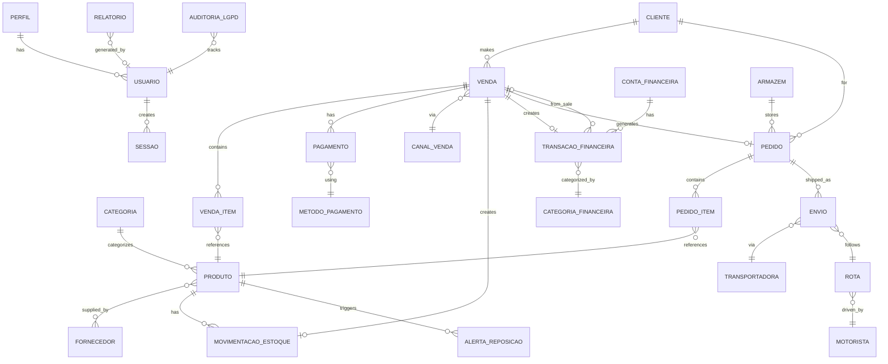
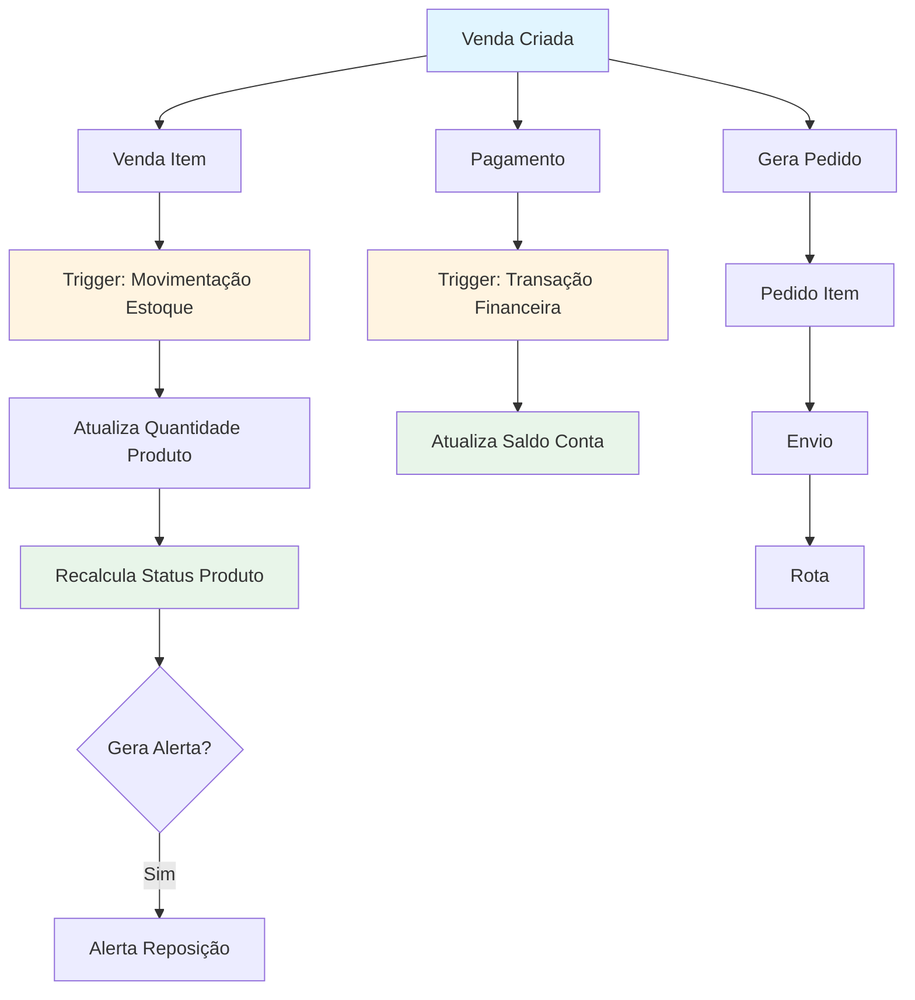
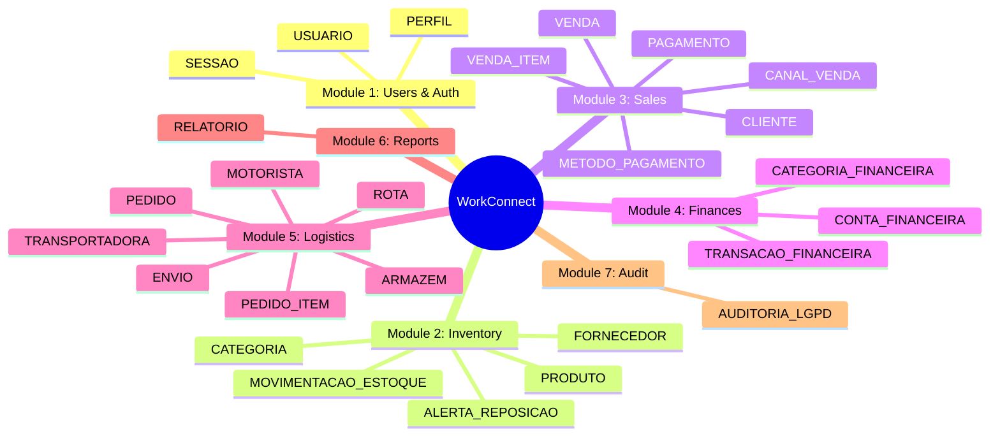
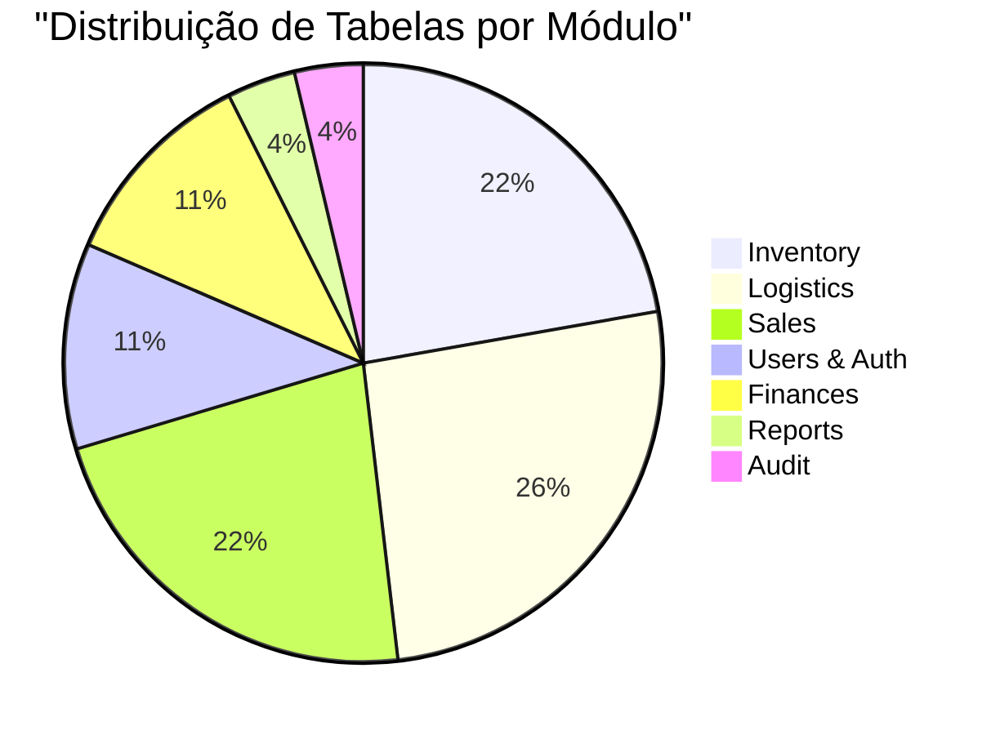

# WorkConnect - Diagrama de Arquitetura

## Diagrama ER Simplificado (Mermaid)

## Fluxo de Integração (Mermaid)

## Módulos e Tabelas (Mermaid)

## Estatísticas (Mermaid)

## Como Usar

Estes diagramas Mermaid podem ser visualizados em:
- GitHub (renderiza automaticamente)
- Mermaid Live Editor: https://mermaid.live/
- VS Code com extensão Mermaid
- Documentação Markdown compatível

## Exportar como Imagem

1. Copie o código Mermaid
2. Cole em https://mermaid.live/
3. Exporte como PNG/SVG
4. Salve em `presentation/diagrams/`

