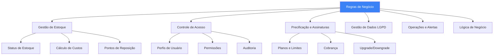

# Business Rules - Work Connect
## Regras de Negócio e Lógica Operacional

📍 **Navegação:**
🏠 [README Principal](../../README.md) | 📚 [Documentação Estratégica](./) | 📖 [Problema de Negócio](./BUSINESS_PROBLEM_SETTING.md)

---

**Versão:** 1.0 - Regras Completas  
**Data:** Janeiro 2025  
**Propósito:** Documentação completa de todas as regras de negócio do sistema  
**Público-Alvo:** Desenvolvedores, Analistas de Negócio, Stakeholders

---

## Executive Summary

Este documento define todas as **regras de negócio** que governam o funcionamento do Work Connect, incluindo regras de estoque, controle de acesso, precificação, conformidade LGPD e lógica operacional. Estas regras são implementadas no sistema e devem ser seguidas rigorosamente para garantir consistência, conformidade legal e experiência do usuário adequada.

**Total de Regras Documentadas:** 45+ regras principais organizadas em 6 categorias.

---

## 1. Business Rules Overview

### 1.1 Categorias de Regras



### 1.2 Princípios Fundamentais

1. **Consistência:** Regras aplicadas uniformemente em todo o sistema
2. **Conformidade:** Todas as regras respeitam LGPD e legislação brasileira
3. **Transparência:** Regras visíveis e documentadas para usuários
4. **Auditabilidade:** Todas as ações são registradas para auditoria
5. **Flexibilidade:** Regras configuráveis quando apropriado (ex: níveis mínimos)

---

## 2. Inventory Management Rules

### 2.1 Regras de Status de Estoque

#### RN-EST-001: Cálculo Automático de Status

**Regra:**
O status do produto é calculado automaticamente com base na relação entre `quantidade_atual` e `quantidade_minima`.

**Fórmula:**
```
percentual = (quantidade_atual / quantidade_minima) × 100

Se percentual > 70%  → Status = "OK" (Verde)
Se 30% ≤ percentual ≤ 70% → Status = "BAIXO" (Amarelo)
Se percentual < 30% → Status = "CRÍTICO" (Vermelho)
```

**Exceções:**
- Se `quantidade_atual = 0` → Status = "CRÍTICO" (independente do percentual)
- Se `quantidade_atual < 0` → Sistema impede (validação de integridade)

**Frequência de Atualização:**
- Em tempo real: A cada movimentação de estoque
- Batch: Verificação diária às 00:00 para garantir consistência

**Exemplo:**
```
Produto: Parafuso M6
quantidade_minima: 100 unidades
quantidade_atual: 45 unidades

percentual = (45 / 100) × 100 = 45%
Status = "BAIXO" (Amarelo)
```

#### RN-EST-002: Validação de Quantidades

**Regra:**
- `quantidade_atual` nunca pode ser negativa
- `quantidade_minima` deve ser > 0
- `quantidade_maxima` deve ser > `quantidade_minima`

**Validações:**
```sql
CHECK (quantidade_atual >= 0)
CHECK (quantidade_minima > 0)
CHECK (quantidade_maxima > quantidade_minima)
```

**Ação em Violação:**
- Sistema bloqueia a operação
- Exibe mensagem de erro clara ao usuário
- Registra tentativa em log de auditoria

#### RN-EST-003: Código Único de Produto

**Regra:**
O campo `codigo` do produto deve ser único no sistema (por empresa/tenant).

**Validação:**
- Verificação no momento do cadastro
- Verificação no momento da edição (se código foi alterado)
- Case-insensitive (ex: "ABC123" = "abc123")

**Ação em Duplicata:**
- Sistema bloqueia cadastro/edição
- Sugere código alternativo (ex: "ABC123-2")
- Exibe lista de produtos com código similar

### 2.2 Regras de Cálculo de Custos

#### RN-EST-004: Custo Médio Ponderado (CMP)

**Regra:**
O custo médio ponderado é recalculado automaticamente a cada entrada de compra.

**Fórmula:**
```
CMP_novo = ((quantidade_anterior × CMP_anterior) + (quantidade_entrada × preco_unitario_entrada)) / (quantidade_anterior + quantidade_entrada)
```

**Quando Aplicar:**
- ✅ Entrada de compra (tipo: ENTRADA_COMPRA)
- ❌ Entrada por ajuste (tipo: ENTRADA_AJUSTE) - mantém CMP anterior
- ❌ Saída - mantém CMP anterior

**Exemplo:**
```
Situação Inicial:
- quantidade_atual: 100 unidades
- custo_medio_ponderado: R$ 10,00

Nova Compra:
- quantidade_entrada: 50 unidades
- preco_unitario: R$ 12,00

CMP_novo = ((100 × 10,00) + (50 × 12,00)) / (100 + 50)
CMP_novo = (1.000 + 600) / 150
CMP_novo = R$ 10,67
```

#### RN-EST-005: Valor Total em Estoque

**Regra:**
O valor total do estoque é calculado como:
```
valor_total = quantidade_atual × custo_medio_ponderado
```

**Atualização:**
- Calculado em tempo real
- Exibido no dashboard
- Usado em relatórios financeiros

### 2.3 Regras de Pontos de Reposição

#### RN-EST-006: Ponto de Reposição (Reorder Point)

**Regra:**
O ponto de reposição é calculado automaticamente baseado em:
- `quantidade_minima` (definida pelo usuário)
- `tempo_medio_entrega` do fornecedor principal (em dias)
- `consumo_medio_diario` (calculado dos últimos 30 dias)

**Fórmula (Opcional - Futuro):**
```
ponto_reposicao = (consumo_medio_diario × tempo_medio_entrega) + estoque_seguranca
```

**Atualmente:**
- Ponto de reposição = `quantidade_minima` (configuração manual)

#### RN-EST-007: Quantidade de Reposição Sugerida

**Regra:**
Quando estoque atinge nível mínimo, sistema sugere quantidade de compra.

**Fórmula:**
```
quantidade_sugerida = quantidade_maxima - quantidade_atual
```

**Validação:**
- Quantidade sugerida deve ser > 0
- Usuário pode ajustar manualmente antes de criar pedido

### 2.4 Regras de Movimentações

#### RN-EST-008: Validação de Saída

**Regra:**
Uma saída de estoque não pode exceder a quantidade disponível.

**Validação:**
```sql
IF tipo_movimentacao = 'SAIDA' THEN
    IF quantidade_movimentacao > quantidade_atual THEN
        ERRO: "Quantidade insuficiente em estoque"
    END IF
END IF
```

**Exceções:**
- Ajuste de inventário pode resultar em quantidade negativa (com justificativa obrigatória)
- Ajuste negativo requer aprovação de administrador

#### RN-EST-009: Observação Obrigatória em Ajustes

**Regra:**
Toda movimentação do tipo `AJUSTE` (entrada ou saída) deve ter campo `observacao` preenchido.

**Validação:**
```sql
IF tipo_movimentacao LIKE '%AJUSTE%' THEN
    IF observacao IS NULL OR observacao = '' THEN
        ERRO: "Observação obrigatória para ajustes de inventário"
    END IF
END IF
```

**Finalidade:**
- Auditoria e rastreabilidade
- Justificativa para divergências
- Conformidade com boas práticas de gestão

#### RN-EST-010: Histórico de Movimentações

**Regra:**
Todas as movimentações são registradas permanentemente e não podem ser deletadas.

**Campos Obrigatórios:**
- `produto_id` (FK)
- `usuario_id` (FK)
- `tipo_movimentacao` (ENUM)
- `quantidade` (INTEGER)
- `data_movimentacao` (TIMESTAMP)
- `observacao` (TEXT - opcional, exceto ajustes)

**Campos Opcionais:**
- `fornecedor_id` (FK - para entradas de compra)
- `preco_unitario` (DECIMAL - para entradas de compra)
- `numero_documento` (VARCHAR - nota fiscal, etc.)

---

## 3. User Access & Permissions Rules

### 3.1 Regras de Perfis de Usuário

#### RN-ACC-001: Perfil Obrigatório

**Regra:**
Todo usuário deve possuir exatamente um perfil atribuído.

**Validação:**
- Campo `perfil_id` é obrigatório (NOT NULL)
- Relacionamento 1:1 entre USUARIO e PERFIL
- Não é possível criar usuário sem perfil

#### RN-ACC-002: Perfis Disponíveis

**Regra:**
O sistema possui 4 perfis pré-definidos e imutáveis:

| Perfil | Código | Descrição |
|--------|--------|-----------|
| **Administrador** | ADMIN | Acesso total ao sistema |
| **Gerente** | GERENTE | Visualiza tudo, não altera configurações |
| **Operador** | OPERADOR | Registra movimentações apenas |
| **Consulta** | CONSULTA | Apenas visualização (read-only) |

**Restrições:**
- Perfis não podem ser deletados
- Perfis não podem ser renomeados
- Apenas ADMIN pode alterar perfis de outros usuários

#### RN-ACC-003: Permissões por Perfil

**Regra:**
Cada perfil possui um conjunto específico de permissões definidas em JSON.

**Estrutura de Permissões:**
```json
{
  "produtos": {
    "criar": true/false,
    "ler": true/false,
    "editar": true/false,
    "excluir": true/false
  },
  "movimentacoes": {
    "criar": true/false,
    "ler": true/false,
    "editar": false,  // Movimentações nunca podem ser editadas
    "excluir": false  // Movimentações nunca podem ser excluídas
  },
  "relatorios": {
    "gerar": true/false,
    "exportar": true/false
  },
  "configuracoes": {
    "acessar": true/false,
    "alterar": true/false
  },
  "usuarios": {
    "criar": true/false,
    "editar": true/false,
    "excluir": true/false
  }
}
```

**Matriz de Permissões:**

| Funcionalidade | ADMIN | GERENTE | OPERADOR | CONSULTA |
|----------------|-------|---------|----------|----------|
| **Produtos** |
| Criar | ✅ | ✅ | ❌ | ❌ |
| Editar | ✅ | ✅ | ❌ | ❌ |
| Excluir | ✅ | ❌ | ❌ | ❌ |
| Visualizar | ✅ | ✅ | ✅ | ✅ |
| **Movimentações** |
| Criar | ✅ | ✅ | ✅ | ❌ |
| Visualizar | ✅ | ✅ | ✅ | ✅ |
| Editar/Excluir | ❌ | ❌ | ❌ | ❌ |
| **Relatórios** |
| Gerar | ✅ | ✅ | ❌ | ✅ |
| Exportar | ✅ | ✅ | ❌ | ✅ |
| **Configurações** |
| Acessar | ✅ | ❌ | ❌ | ❌ |
| Alterar | ✅ | ❌ | ❌ | ❌ |
| **Usuários** |
| Criar/Editar | ✅ | ❌ | ❌ | ❌ |
| Visualizar | ✅ | ✅ | ✅ | ✅ |

#### RN-ACC-004: Validação de Permissões

**Regra:**
Toda ação do usuário deve ser validada contra suas permissões antes da execução.

**Fluxo:**
1. Usuário solicita ação (ex: criar produto)
2. Sistema verifica perfil do usuário
3. Sistema consulta permissões do perfil
4. Se permitido → executa ação
5. Se negado → retorna erro 403 (Forbidden)

**Implementação:**
- Validação no backend (nunca confiar apenas no frontend)
- Middleware de autenticação/autorização
- Log de tentativas de acesso negado

### 3.2 Regras de Autenticação

#### RN-ACC-005: Email Único

**Regra:**
O campo `email` deve ser único no sistema (por tenant/empresa).

**Validação:**
- Verificação no cadastro
- Verificação na edição
- Case-insensitive (ex: "João@Email.com" = "joão@email.com")

#### RN-ACC-006: Senha Segura

**Regra:**
Senhas devem atender aos seguintes critérios:
- Mínimo 8 caracteres
- Pelo menos 1 letra maiúscula
- Pelo menos 1 letra minúscula
- Pelo menos 1 número
- Pelo menos 1 caractere especial (!@#$%^&*)

**Armazenamento:**
- Senhas nunca armazenadas em texto plano
- Hash SHA-256 com salt único por usuário
- Campo `hash_senha` no banco de dados

#### RN-ACC-007: Sessão e Timeout

**Regra:**
- Sessão expira após 30 minutos de inatividade
- Token JWT válido por 24 horas
- Refresh token válido por 7 dias
- Logout invalida todos os tokens

---

## 4. Pricing & Subscription Rules

### 4.1 Regras de Planos

#### RN-PRC-001: Planos Disponíveis

**Regra:**
O sistema oferece 3 planos de assinatura:

| Plano | Preço Mensal | Produtos | Usuários | Recursos |
|-------|--------------|----------|----------|----------|
| **Básico** | R$ 149 | Até 500 | Até 5 | Alertas, Relatórios PDF |
| **Profissional** | R$ 299 | Até 2.000 | Até 15 | + Relatórios Avançados, API |
| **Empresarial** | R$ 599 | Ilimitado | Ilimitado | + Integração ERP, Suporte Premium |

**Características:**
- Preços em R$ (Reais brasileiros)
- Cobrança mensal recorrente
- Todos os planos incluem: Dashboard, Alertas básicos, Suporte por email

#### RN-PRC-002: Limites por Plano

**Regra:**
O sistema valida limites antes de permitir ações.

**Validações:**
- **Produtos:** Contagem de produtos ativos não pode exceder limite do plano
- **Usuários:** Contagem de usuários ativos não pode exceder limite do plano
- **Exportações:** Limite de exportações por mês (Básico: 10, Profissional: 100, Empresarial: Ilimitado)

**Ação em Limite Atingido:**
- Sistema bloqueia ação (ex: criar novo produto)
- Exibe mensagem: "Limite do plano atingido. Faça upgrade para continuar."
- Oferece botão de upgrade direto

#### RN-PRC-003: Período de Trial

**Regra:**
Novos usuários têm direito a 14 dias de trial gratuito.

**Características:**
- Trial inclui acesso ao plano Profissional
- Sem necessidade de cartão de crédito
- Após 14 dias, usuário deve escolher plano ou conta é suspensa
- Dados preservados por 30 dias após término do trial

**Validação:**
- Data de criação da conta + 14 dias = data de expiração do trial
- Sistema envia email de aviso 3 dias antes do término

### 4.2 Regras de Cobrança

#### RN-PRC-004: Ciclo de Cobrança

**Regra:**
- Cobrança mensal no mesmo dia do mês da assinatura
- Primeira cobrança: Imediata (após trial ou na assinatura direta)
- Próximas cobranças: Dia X de cada mês (onde X = dia da primeira cobrança)

**Exemplo:**
```
Assinatura: 15/01/2025
Primeira cobrança: 15/01/2025
Próximas cobranças: 15/02/2025, 15/03/2025, etc.
```

#### RN-PRC-005: Proration (Rateio)

**Regra:**
Ao fazer upgrade ou downgrade, o sistema calcula rateio proporcional.

**Fórmula de Upgrade:**
```
dias_restantes = dias_no_mes - dia_atual
valor_credito = (preco_plano_antigo / dias_no_mes) × dias_restantes
valor_novo = preco_plano_novo
valor_cobrado = valor_novo - valor_credito
```

**Fórmula de Downgrade:**
```
dias_restantes = dias_no_mes - dia_atual
valor_credito = (preco_plano_antigo / dias_no_mes) × dias_restantes
valor_novo = preco_plano_novo
valor_credito_proximo_mes = valor_credito - valor_novo
```

**Exemplo de Upgrade:**
```
Data: 10/01/2025 (mês com 31 dias)
Plano atual: Básico (R$ 149)
Novo plano: Profissional (R$ 299)
Dias restantes: 21 dias

Valor crédito: (149 / 31) × 21 = R$ 100,94
Valor cobrado: 299 - 100,94 = R$ 198,06
```

#### RN-PRC-006: Falha no Pagamento

**Regra:**
Em caso de falha no pagamento:
1. Sistema tenta cobrar novamente após 3 dias
2. Se falhar novamente, conta é suspensa (não deletada)
3. Dados preservados por 30 dias
4. Após 30 dias, conta é cancelada permanentemente

**Notificações:**
- Email imediato ao falhar pagamento
- Email de aviso antes de suspender (7 dias)
- Email de cancelamento (30 dias)

### 4.3 Regras de Upgrade/Downgrade

#### RN-PRC-007: Upgrade Imediato

**Regra:**
Upgrade pode ser feito a qualquer momento e é efetivado imediatamente.

**Processo:**
1. Usuário solicita upgrade
2. Sistema calcula proration
3. Sistema cobra diferença proporcional
4. Limites são aumentados imediatamente
5. Recursos adicionais ficam disponíveis

#### RN-PRC-008: Downgrade no Final do Ciclo

**Regra:**
Downgrade é efetivado no final do ciclo de cobrança atual.

**Processo:**
1. Usuário solicita downgrade
2. Sistema marca para efetivar no final do mês
3. Usuário mantém acesso ao plano atual até o fim do mês
4. No dia da próxima cobrança, plano é alterado
5. Limites são reduzidos
6. Dados excedentes são preservados (mas não acessíveis até upgrade)

**Validação:**
- Se usuário tem mais produtos/usuários que o limite do novo plano, sistema avisa
- Usuário deve reduzir antes de fazer downgrade (ou dados ficam inacessíveis)

---

## 5. Data Management Rules (LGPD)

### 5.1 Regras de Consentimento

#### RN-LGPD-001: Consentimento Explícito

**Regra:**
Todo usuário deve dar consentimento explícito para tratamento de dados pessoais.

**Implementação:**
- Checkbox obrigatório no cadastro: "Aceito o tratamento de meus dados pessoais conforme LGPD"
- Campo `consentimento_lgpd` (BOOLEAN) = TRUE
- Campo `data_consentimento` (TIMESTAMP) = data/hora atual
- Sem consentimento, cadastro não pode ser concluído

**Renovação:**
- Consentimento deve ser renovado a cada 12 meses
- Sistema envia email solicitando renovação 30 dias antes do vencimento

#### RN-LGPD-002: Base Legal do Tratamento

**Regra:**
O sistema trata dados pessoais com base em:
1. **Consentimento do titular** (art. 7º, I, LGPD)
2. **Execução de contrato** (art. 7º, V, LGPD) - necessário para prestação do serviço
3. **Legítimo interesse** (art. 7º, IX, LGPD) - segurança e prevenção de fraudes

**Registro:**
- Base legal registrada em `AUDITORIA_LGPD`
- Alterações na base legal são registradas

### 5.2 Regras de Retenção de Dados

#### RN-LGPD-003: Período de Retenção

**Regra:**
Dados pessoais são retidos enquanto:
- Conta estiver ativa
- Houver obrigação legal (ex: documentos fiscais: 5 anos)
- Após cancelamento: 90 dias (período de recuperação)

**Tabela de Retenção:**

| Tipo de Dado | Período de Retenção | Base Legal |
|--------------|---------------------|------------|
| Dados cadastrais | Enquanto conta ativa + 90 dias | Contrato |
| Dados de movimentações | 5 anos | Obrigação fiscal |
| Logs de acesso | 6 meses | Segurança |
| Dados anonimizados | Permanentemente | Estatísticas |

#### RN-LGPD-004: Anonimização Após Exclusão

**Regra:**
Quando usuário solicita exclusão, dados são anonimizados (não deletados) após 90 dias.

**Processo:**
1. Usuário solicita exclusão
2. Campo `data_exclusao_solicitada` é preenchido
3. Conta é suspensa imediatamente
4. Após 90 dias, dados são anonimizados:
   - Nome → "Usuário Anonimizado"
   - Email → "anonimizado_[hash]@workconnect.com"
   - Telefone → NULL
   - Foto → Removida
5. Dados anonimizados são mantidos para estatísticas e auditoria

**Exceção:**
- Dados que devem ser mantidos por obrigação legal (ex: movimentações fiscais) não são anonimizados

### 5.3 Regras de Exportação de Dados

#### RN-LGPD-005: Direito de Portabilidade

**Regra:**
Usuário tem direito de solicitar exportação de seus dados pessoais.

**Prazo:**
- Sistema deve disponibilizar dados em até 48 horas
- Formato: JSON estruturado ou CSV

**Dados Incluídos:**
- Dados cadastrais (nome, email, telefone)
- Histórico de movimentações realizadas
- Logs de acesso ao sistema
- Preferências e configurações

**Processo:**
1. Usuário solicita exportação
2. Sistema gera arquivo JSON estruturado
3. Sistema registra em `AUDITORIA_LGPD`
4. Sistema envia email com link seguro de download
5. Link expira em 48 horas
6. Sistema mantém log da exportação por 6 meses

#### RN-LGPD-006: Auditoria de Ações LGPD

**Regra:**
Toda ação relacionada a dados pessoais deve ser registrada em `AUDITORIA_LGPD`.

**Ações Auditadas:**
- Consentimento dado/revogado
- Exportação de dados
- Solicitação de exclusão
- Anonimização realizada
- Acesso a dados pessoais (por administradores)

**Campos Obrigatórios:**
- `usuario_id` (FK)
- `acao` (ENUM: CONSENTIMENTO, EXPORTACAO, EXCLUSAO, ANONIMIZACAO, ACESSO)
- `data_hora` (TIMESTAMP)
- `ip_origem` (VARCHAR)
- `detalhes` (JSON - informações adicionais)

**Retenção:**
- Logs de auditoria são mantidos por 6 meses (mínimo legal)

---

## 6. Operational Rules

### 6.1 Regras de Alertas

#### RN-OP-001: Geração Automática de Alertas

**Regra:**
Alertas de reposição são gerados automaticamente quando quantidade atinge níveis críticos.

**Triggers:**
- A cada movimentação de estoque
- Verificação diária batch (00:00)

**Níveis de Prioridade:**

| Prioridade | Condição | Cor | Ação |
|------------|----------|-----|------|
| **URGENTE** | quantidade = 0 | 🔴 Vermelho | Notificação imediata |
| **ALTA** | quantidade < 30% do mínimo | 🟠 Laranja | Notificação diária |
| **MÉDIA** | quantidade < 70% do mínimo | 🟡 Amarelo | Notificação semanal |
| **BAIXA** | quantidade = mínimo | 🔵 Azul | Notificação mensal |

**Fórmula:**
```
percentual = (quantidade_atual / quantidade_minima) × 100

Se quantidade_atual = 0 → Prioridade = URGENTE
Se percentual < 30% → Prioridade = ALTA
Se 30% ≤ percentual < 70% → Prioridade = MÉDIA
Se percentual = 100% → Prioridade = BAIXA
```

#### RN-OP-002: Notificações de Alertas

**Regra:**
Alertas são enviados por:
- **Email:** Para administradores e gerentes
- **Dashboard:** Badge vermelho com contador
- **Notificação push:** (futuro - app mobile)

**Frequência:**
- URGENTE: Imediata
- ALTA: Diária (resumo às 08:00)
- MÉDIA: Semanal (segunda-feira às 08:00)
- BAIXA: Mensal (dia 1º às 08:00)

**Desativação:**
- Alerta é desativado automaticamente quando estoque é reposto acima do nível mínimo

### 6.2 Regras de Relatórios

#### RN-OP-003: Geração de Relatórios

**Regra:**
Relatórios podem ser gerados por usuários com permissão.

**Tipos de Relatórios:**
- Relatório de Estoque (produtos, quantidades, valores)
- Relatório de Movimentações (entradas/saídas por período)
- Relatório de Produtos Críticos
- Relatório Financeiro (valor total em estoque)

**Limites por Plano:**
- **Básico:** 10 relatórios/mês
- **Profissional:** 100 relatórios/mês
- **Empresarial:** Ilimitado

**Formato:**
- PDF (todos os planos)
- Excel/CSV (Profissional e Empresarial)
- JSON/API (apenas Empresarial)

#### RN-OP-004: Performance de Relatórios

**Regra:**
Relatórios devem ser gerados em tempo aceitável.

**SLAs:**
- Até 1.000 produtos: < 5 segundos
- Até 5.000 produtos: < 15 segundos
- Até 10.000 produtos: < 30 segundos

**Otimizações:**
- Cache de relatórios frequentes (24 horas)
- Processamento assíncrono para relatórios grandes
- Notificação por email quando relatório estiver pronto

### 6.3 Regras de Exportação

#### RN-OP-005: Limites de Exportação

**Regra:**
Exportações têm limites por plano para evitar abuso.

| Plano | Exportações/Mês | Formato |
|-------|-----------------|---------|
| **Básico** | 10 | CSV apenas |
| **Profissional** | 100 | CSV, Excel |
| **Empresarial** | Ilimitado | CSV, Excel, JSON, API |

**Contagem:**
- Cada exportação de tabela = 1 exportação
- Exportação de relatório = 1 exportação
- Exportação de dados LGPD = não conta (direito do usuário)

---

## 7. Business Logic Rules

### 7.1 Regras de Categorização

#### RN-BL-001: Categoria Obrigatória

**Regra:**
Todo produto deve pertencer a uma categoria.

**Validação:**
- Campo `categoria_id` é obrigatório (NOT NULL)
- Categoria deve existir e estar ativa
- Não é possível criar produto sem categoria

#### RN-BL-002: Hierarquia de Categorias

**Regra:**
Categorias podem ter hierarquia (categoria pai).

**Estrutura:**
```
Categoria Raiz
  └── Subcategoria 1
      └── Sub-subcategoria 1.1
  └── Subcategoria 2
```

**Restrições:**
- Máximo de 3 níveis de profundidade
- Categoria não pode ser pai de si mesma (validação de ciclo)
- Ao deletar categoria pai, produtos são movidos para categoria raiz

### 7.2 Regras de Fornecedores

#### RN-BL-003: Fornecedores por Produto

**Regra:**
Um produto pode ter de 1 a 3 fornecedores vinculados.

**Validação:**
- Mínimo: 1 fornecedor (obrigatório)
- Máximo: 3 fornecedores
- Apenas 1 fornecedor pode ser principal (prioridade = 1)

**Tabela de Relacionamento:**
- `PRODUTO_FORNECEDOR` (N:M)
- Campos: `produto_id`, `fornecedor_id`, `prioridade` (1, 2, 3), `preco_padrao`

#### RN-BL-004: Fornecedor Principal

**Regra:**
O fornecedor com `prioridade = 1` é considerado principal.

**Uso:**
- Sugestão automática em compras
- Cálculo de tempo médio de entrega
- Alertas de reposição consideram fornecedor principal

### 7.3 Regras de Transações

#### RN-BL-005: Imutabilidade de Movimentações

**Regra:**
Movimentações de estoque não podem ser editadas ou deletadas.

**Justificativa:**
- Integridade de dados
- Auditoria e rastreabilidade
- Conformidade fiscal

**Alternativa:**
- Criar movimentação de ajuste para corrigir erros
- Movimentação de ajuste requer observação obrigatória

#### RN-BL-006: Rastreabilidade Completa

**Regra:**
Toda movimentação deve ser rastreável até o usuário que a realizou.

**Campos Obrigatórios:**
- `usuario_id` (FK) - quem realizou
- `data_movimentacao` (TIMESTAMP) - quando
- `tipo_movimentacao` (ENUM) - o quê
- `quantidade` (INTEGER) - quanto

**Auditoria:**
- Logs de todas as alterações
- Histórico de movimentações preservado permanentemente

---

## 8. Validações e Exceções

### 8.1 Validações de Integridade

#### Validação-001: Integridade Referencial

**Regra:**
Todas as foreign keys devem ser validadas antes de inserção/atualização.

**Exemplos:**
- `produto_id` em `MOVIMENTACAO_ESTOQUE` deve existir em `PRODUTO`
- `usuario_id` em `MOVIMENTACAO_ESTOQUE` deve existir em `USUARIO`
- `categoria_id` em `PRODUTO` deve existir em `CATEGORIA`

**Ação em Violação:**
- Erro 400 (Bad Request)
- Mensagem clara: "Referência inválida: [entidade] não encontrada"

#### Validação-002: Constraints de Banco

**Regra:**
Constraints de banco de dados são a última linha de defesa.

**Constraints Implementadas:**
- UNIQUE: `codigo` em PRODUTO, `email` em USUARIO
- CHECK: `quantidade_atual >= 0`, `quantidade_minima > 0`
- NOT NULL: Campos obrigatórios
- FOREIGN KEY: Integridade referencial

### 8.2 Tratamento de Exceções

#### Exceção-001: Estoque Insuficiente

**Cenário:**
Usuário tenta fazer saída maior que quantidade disponível.

**Tratamento:**
1. Sistema valida antes de executar
2. Retorna erro 400 (Bad Request)
3. Mensagem: "Quantidade insuficiente. Disponível: [X], Solicitado: [Y]"
4. Sugere ajuste de inventário se necessário

#### Exceção-002: Limite do Plano Atingido

**Cenário:**
Usuário tenta criar produto/usuário além do limite do plano.

**Tratamento:**
1. Sistema valida limite antes de criar
2. Retorna erro 403 (Forbidden)
3. Mensagem: "Limite do plano [PLANO] atingido. Faça upgrade para continuar."
4. Oferece botão de upgrade direto

---

## 9. Referências e Cross-References

### 9.1 Documentos Relacionados

- [Problema de Negócio](./BUSINESS_PROBLEM_SETTING.md) - Contexto e justificativa
- [Táticas Comerciais](./COMMERCIAL_TACTICS.md) - Estratégia de precificação
- [Requisitos Operacionais](./OPERATIONAL_REQUIREMENTS.md) - SLAs e performance
- [Diagrama MER](../diagrama-mer-conceitual.md) - Modelo de dados
- [Diagrama DER](../diagrama-der-estoque.md) - Estrutura de banco
- [Casos de Uso](../diagrama-casos-de-uso-estoque.md) - Fluxos de usuário
- [LGPD Compliance](../LGPD-COMPLIANCE.md) - Conformidade legal detalhada

### 9.2 Implementação Técnica

**Backend:**
- Validações em controllers (Express.js)
- Constraints no banco de dados (PostgreSQL)
- Triggers para cálculos automáticos
- Middleware de autenticação/autorização

**Frontend:**
- Validações em formulários (React Hook Form)
- Feedback visual de erros
- Mensagens de erro claras e acionáveis

---

**Documento gerado para:** Work Connect - Sistema de Gestão de Estoque para PMEs  
**Versão:** 1.0  
**Data:** Janeiro 2025  
**Autores:** Equipe Work Connect  
**Instituição:** SENAI - Curso Técnico em Desenvolvimento de Sistemas

