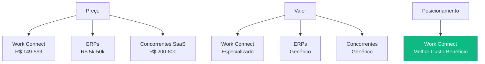

# Commercial Tactics - Work Connect
## Estratégia Comercial e Táticas de Go-to-Market

📍 **Navegação:**
🏠 [README Principal](../../README.md) | 📚 [Documentação Estratégica](./) | 📖 [Problema de Negócio](./BUSINESS_PROBLEM_SETTING.md)

---

**Versão:** 1.0 - Estratégia Completa  
**Data:** Janeiro 2025  
**Propósito:** Estratégia comercial completa para lançamento e crescimento  
**Público-Alvo:** Equipe de Vendas, Marketing, Investidores, Stakeholders

---

## Executive Summary

Este documento define a estratégia comercial completa do Work Connect, incluindo go-to-market, precificação, vendas, marketing, aquisição de clientes, retenção e otimização de receita. A estratégia é focada em PMEs brasileiras e visa alcançar **75.000 clientes e R$ 269 milhões em receita anual** em 5 anos.

**Objetivos Principais:**
- **Ano 1:** 500 clientes, R$ 1,8M em receita
- **Ano 3:** 8.000 clientes, R$ 28,7M em receita
- **Ano 5:** 75.000 clientes, R$ 269M em receita
- **Market Share:** 5% do SAM (Serviceable Available Market)

---

## 1. Go-to-Market Strategy

### 1.1 Estratégia de Entrada no Mercado

#### Fase 1: Validação (Meses 1-6)

**Objetivo:** Validar product-market fit com 50-100 clientes beta.

**Táticas:**
- Beta testers gratuitos (6 meses)
- Coleta intensiva de feedback
- Iteração rápida baseada em dados
- Casos de sucesso documentados

**Métricas de Sucesso:**
- NPS > 50
- Taxa de conversão trial → pago > 25%
- Churn mensal < 10%

#### Fase 2: Lançamento (Meses 7-12)

**Objetivo:** Lançamento público com foco em aquisição.

**Táticas:**
- Lançamento oficial com evento/press release
- Programa de early adopters (50% desconto primeiro ano)
- Parcerias estratégicas (contadores, consultores)
- Conteúdo educativo (blog, YouTube)

**Métricas de Sucesso:**
- 500 clientes pagantes
- CAC (Custo de Aquisição) < R$ 500
- LTV/CAC ratio > 3:1

#### Fase 3: Escala (Anos 2-3)

**Objetivo:** Escalar aquisição e otimizar operações.

**Táticas:**
- Marketing digital escalável (Google Ads, Facebook Ads)
- Programa de afiliados
- Expansão de canais de vendas
- Automação de onboarding

**Métricas de Sucesso:**
- 8.000 clientes
- CAC < R$ 400
- Churn mensal < 5%

#### Fase 4: Dominação (Anos 4-5)

**Objetivo:** Liderança de mercado e expansão.

**Táticas:**
- Brand awareness (mídia, eventos)
- Expansão para novos segmentos
- Produtos complementares
- Aquisições estratégicas

**Métricas de Sucesso:**
- 75.000 clientes
- Market share de 5%
- LTV > R$ 5.000

### 1.2 Modelo de Negócio

**SaaS (Software as a Service) - Assinatura Recorrente**

**Características:**
- Receita recorrente mensal
- Baixo custo marginal por cliente
- Escalabilidade alta
- Previsibilidade de receita

**Vantagens:**
- Cash flow previsível
- Relacionamento de longo prazo
- Oportunidades de upsell
- Dados de uso para melhorias

---

## 2. Pricing Strategy & Rationale

### 2.1 Estratégia de Precificação

#### Modelo: Value-Based Pricing

**Filosofia:**
Precificar baseado no valor entregue ao cliente, não no custo de produção.

**Justificativa:**
- Cliente economiza R$ 469k-828k/ano em perdas
- ROI de 150% no primeiro ano
- Preço de R$ 149-599/mês é 0,1-0,2% do valor economizado

#### Análise de Willingness to Pay

| Preço Mensal | % PMEs que Pagariam | Receita Potencial/Mês | Conclusão |
|--------------|---------------------|----------------------|-----------|
| R$ 99 | 85% | Alto volume, baixa margem | ❌ Margem insuficiente |
| R$ 149 | 70% | Volume bom, margem adequada | ✅ Plano Básico |
| R$ 299 | 45% | Volume médio, margem boa | ✅ Plano Profissional |
| R$ 599 | 20% | Volume baixo, margem alta | ✅ Plano Empresarial |

**Conclusão:** Estrutura de 3 planos (R$ 149/299/599) maximiza receita total.

### 2.2 Estrutura de Preços

#### Plano Básico - R$ 149/mês

**Público-Alvo:**
- Microempresas (R$ 360k-1.2M/ano)
- 1-5 funcionários
- Estoque simples (< 500 produtos)

**Inclui:**
- Até 500 produtos
- Até 5 usuários
- Alertas básicos
- Relatórios PDF (10/mês)
- Suporte por email
- Dashboard básico

**Justificativa de Preço:**
- Acessível para microempresas
- Cobre custos operacionais
- Margem de 60-70%

#### Plano Profissional - R$ 299/mês

**Público-Alvo:**
- Pequenas empresas (R$ 1.2M-4.8M/ano)
- 6-15 funcionários
- Estoque médio (500-2.000 produtos)

**Inclui:**
- Até 2.000 produtos
- Até 15 usuários
- Alertas avançados
- Relatórios Excel/PDF (100/mês)
- API de integração
- Suporte prioritário
- Dashboard avançado

**Justificativa de Preço:**
- 2x o Básico, mas 4x mais produtos
- Valor percebido alto (API, relatórios avançados)
- Margem de 70-75%

#### Plano Empresarial - R$ 599/mês

**Público-Alvo:**
- Médias empresas (R$ 4.8M+/ano)
- 16-50 funcionários
- Estoque grande (2.000+ produtos)

**Inclui:**
- Produtos ilimitados
- Usuários ilimitados
- Todos os recursos
- Integração ERP
- Suporte premium (chat, telefone)
- Onboarding dedicado
- SLA garantido

**Justificativa de Preço:**
- Para empresas que precisam de escala
- ROI ainda positivo (R$ 599 vs. R$ 469k+ economizados)
- Margem de 75-80%

### 2.3 Análise de Elasticidade de Preço

**Elasticidade Estimada:**
- **Básico (R$ 149):** Elasticidade = -1,2 (demanda elástica)
  - Aumento de 10% no preço → Redução de 12% na demanda
- **Profissional (R$ 299):** Elasticidade = -0,8 (demanda inelástica)
  - Aumento de 10% no preço → Redução de 8% na demanda
- **Empresarial (R$ 599):** Elasticidade = -0,5 (demanda muito inelástica)
  - Aumento de 10% no preço → Redução de 5% na demanda

**Conclusão:**
- Planos superiores têm menor sensibilidade a preço
- Foco em valor, não em preço baixo
- Oportunidade de aumentar preços no futuro

### 2.4 Posicionamento Competitivo

**Posicionamento:**
- **Não competir em preço** (há opções mais baratas)
- **Competir em valor** (especialização + ROI)
- **Competir em simplicidade** (fácil de usar)

---

## 3. Sales Strategy

### 3.1 Funil de Vendas

#### Estágio 1: Awareness (Consciência)

**Objetivo:** Gerar conhecimento sobre o problema e a solução.

**Canais:**
- Conteúdo educativo (blog, YouTube)
- Google Ads (palavras-chave: "sistema de estoque", "controle de estoque")
- Redes sociais (LinkedIn, Facebook)
- Parcerias (contadores, consultores)

**Métricas:**
- 10.000 visitantes/mês (Ano 1)
- 50.000 visitantes/mês (Ano 3)

#### Estágio 2: Interest (Interesse)

**Objetivo:** Converter visitantes em leads qualificados.

**Táticas:**
- E-books gratuitos ("Guia Completo de Gestão de Estoque")
- Webinars ("Como reduzir perdas em 40%")
- Calculadora de ROI online
- Trial gratuito de 14 dias

**Métricas:**
- Taxa de conversão: 5% (visitante → lead)
- 500 leads/mês (Ano 1)
- 2.500 leads/mês (Ano 3)

#### Estágio 3: Consideration (Consideração)

**Objetivo:** Educar leads sobre a solução.

**Táticas:**
- Email marketing (nurturing)
- Demonstrações personalizadas
- Casos de sucesso
- Comparativos com concorrentes

**Métricas:**
- Taxa de conversão: 20% (lead → trial)
- 100 trials/mês (Ano 1)
- 500 trials/mês (Ano 3)

#### Estágio 4: Purchase (Compra)

**Objetivo:** Converter trials em clientes pagantes.

**Táticas:**
- Onboarding personalizado
- Suporte durante trial
- Ofertas de lançamento (desconto)
- Garantia de satisfação

**Métricas:**
- Taxa de conversão: 25% (trial → pago)
- 25 clientes/mês (Ano 1)
- 125 clientes/mês (Ano 3)

#### Estágio 5: Retention (Retenção)

**Objetivo:** Manter clientes e aumentar valor.

**Táticas:**
- Customer success
- Atualizações regulares
- Comunidade de usuários
- Programa de referência

**Métricas:**
- Churn mensal: < 5%
- LTV: R$ 3.000-5.000

### 3.2 Canais de Vendas

#### Canal 1: Vendas Diretas Online (Self-Service)

**Características:**
- Cliente se cadastra e assina sozinho
- Sem intervenção humana
- Baixo custo de aquisição

**Público-Alvo:**
- Plano Básico (R$ 149)
- Empresas pequenas
- Decisão rápida

**Processo:**
1. Cliente acessa site
2. Testa trial gratuito
3. Assina plano online
4. Onboarding automatizado

**Métricas:**
- 60% das vendas (Ano 1)
- CAC: R$ 200-300

#### Canal 2: Vendas Assistidas (Inside Sales)

**Características:**
- Equipe de vendas interna
- Contato por email/telefone
- Foco em planos Profissional e Empresarial

**Público-Alvo:**
- Planos Profissional (R$ 299) e Empresarial (R$ 599)
- Empresas médias
- Decisão mais complexa

**Processo:**
1. Lead qualificado
2. Contato por vendedor
3. Demonstração personalizada
4. Proposta comercial
5. Fechamento

**Métricas:**
- 30% das vendas (Ano 1)
- CAC: R$ 500-800
- Taxa de conversão: 40%

#### Canal 3: Parceiros (Channel Partners)

**Características:**
- Contadores, consultores, integradores
- Comissão de 20-30%
- Alcance ampliado

**Público-Alvo:**
- Clientes dos parceiros
- Recomendação de confiança

**Processo:**
1. Parceiro indica Work Connect
2. Cliente se cadastra com código do parceiro
3. Parceiro recebe comissão recorrente

**Métricas:**
- 10% das vendas (Ano 1)
- CAC: R$ 100-200 (comissão)
- Taxa de conversão: 50% (recomendação)

### 3.3 Táticas de Conversão

#### Tática 1: Trial Gratuito de 14 Dias

**Justificativa:**
- Reduz barreira de entrada
- Cliente experimenta antes de comprar
- Aumenta taxa de conversão

**Implementação:**
- Acesso completo ao plano Profissional
- Sem necessidade de cartão de crédito
- Onboarding guiado
- Suporte durante trial

**Métricas Esperadas:**
- Taxa de conversão: 25-30%
- Time to value: < 7 dias

#### Tática 2: Ofertas de Lançamento

**Justificativa:**
- Acelera adoção inicial
- Gera momentum
- Casos de sucesso rápidos

**Ofertas:**
- **Early Adopters (Meses 1-6):** 50% desconto primeiro ano
- **Ano 1:** 30% desconto primeiro ano
- **Ano 2+:** 20% desconto primeiro ano (apenas novos clientes)

**Métricas Esperadas:**
- Aumento de 40% na taxa de conversão
- Redução de 20% no CAC

#### Tática 3: Garantia de Satisfação

**Justificativa:**
- Reduz risco percebido
- Aumenta confiança
- Diferencial competitivo

**Garantia:**
- "30 dias de garantia ou seu dinheiro de volta"
- Sem perguntas
- Reembolso total

**Métricas Esperadas:**
- Taxa de conversão: +15%
- Taxa de reembolso: < 2%

---

## 4. Marketing Strategy

### 4.1 Segmentação de Audiência

#### Segmento 1: Proprietários de PMEs

**Características:**
- 35-50 anos
- Proprietário/Gerente Geral
- Faturamento: R$ 360k-4.8M/ano
- Setores: Varejo, Indústria Leve, Serviços

**Canais:**
- Google Ads (busca)
- LinkedIn (B2B)
- Facebook (grupos de empresários)
- Email marketing

**Mensagem:**
> "Pare de perder vendas por falta de estoque. Reduza perdas em 40% e ganhe 150% de ROI no primeiro ano."

#### Segmento 2: Gerentes de Estoque

**Características:**
- 28-45 anos
- Gerente de Estoque/Logística
- Reporta ao proprietário
- Busca ferramentas profissionais

**Canais:**
- LinkedIn (profissionais)
- Grupos do Facebook
- Fóruns especializados
- Email marketing

**Mensagem:**
> "Automatize seu controle de estoque e ganhe 15 horas por semana. Alertas automáticos, relatórios instantâneos."

#### Segmento 3: Contadores e Consultores

**Características:**
- Prestam serviços para PMEs
- Buscam soluções para clientes
- Influenciadores de decisão

**Canais:**
- LinkedIn (B2B)
- Eventos profissionais
- Parcerias diretas
- Programa de afiliados

**Mensagem:**
> "Ofereça gestão de estoque profissional para seus clientes. Programa de parceiros com comissão recorrente."

### 4.2 Estratégia de Conteúdo

#### Conteúdo Educativo (Inbound Marketing)

**Objetivo:** Atrair leads através de conteúdo valioso.

**Tipos de Conteúdo:**

1. **Blog Posts (2x/semana)**
   - "Como calcular ponto de reposição"
   - "5 erros comuns em gestão de estoque"
   - "ROI de sistemas de estoque: guia completo"

2. **E-books (1x/mês)**
   - "Guia Completo de Gestão de Estoque para PMEs"
   - "Como reduzir perdas em 40%: case studies"
   - "Checklist de LGPD para sistemas de estoque"

3. **Webinars (1x/mês)**
   - "Workshop: Gestão de Estoque na Prática"
   - "Como escolher o sistema certo"
   - "LGPD: o que sua empresa precisa saber"

4. **Vídeos YouTube (1x/semana)**
   - Tutoriais de uso
   - Cases de sucesso
   - Dicas rápidas

**Métricas:**
- 10.000 visitantes/mês (Ano 1)
- 50.000 visitantes/mês (Ano 3)
- Taxa de conversão: 5% (visitante → lead)

#### Conteúdo de Vendas

**Objetivo:** Converter leads em clientes.

**Materiais:**
- Landing pages otimizadas
- Comparativos com concorrentes
- Calculadora de ROI
- Casos de sucesso
- Demonstrações em vídeo

### 4.3 Canais de Marketing Digital

#### Canal 1: Google Ads (Search)

**Estratégia:**
- Palavras-chave de alta intenção
- Foco em conversão (não apenas tráfego)
- Landing pages otimizadas

**Palavras-Chave:**
- "sistema de estoque"
- "controle de estoque"
- "software de estoque"
- "gestão de estoque PME"

**Orçamento:**
- R$ 10.000/mês (Ano 1)
- R$ 50.000/mês (Ano 3)

**Métricas:**
- CPC: R$ 5-10
- Taxa de conversão: 3-5%
- CAC: R$ 200-400

#### Canal 2: Facebook/Instagram Ads

**Estratégia:**
- Remarketing (visitantes que não converteram)
- Lookalike audiences (similar a clientes existentes)
- Vídeos educativos

**Orçamento:**
- R$ 5.000/mês (Ano 1)
- R$ 25.000/mês (Ano 3)

**Métricas:**
- CPC: R$ 2-5
- Taxa de conversão: 2-4%
- CAC: R$ 150-300

#### Canal 3: LinkedIn Ads

**Estratégia:**
- B2B targeting (proprietários, gerentes)
- Conteúdo profissional
- Foco em planos Profissional e Empresarial

**Orçamento:**
- R$ 3.000/mês (Ano 1)
- R$ 15.000/mês (Ano 3)

**Métricas:**
- CPC: R$ 10-20
- Taxa de conversão: 5-8%
- CAC: R$ 300-600

#### Canal 4: SEO (Search Engine Optimization)

**Estratégia:**
- Conteúdo otimizado para busca
- Link building
- Autoridade de domínio

**Métricas:**
- 30% do tráfego orgânico (Ano 1)
- 50% do tráfego orgânico (Ano 3)
- CAC: R$ 50-100 (muito baixo)

---

## 5. Customer Acquisition Tactics

### 5.1 Estratégia de Trial Gratuito

#### Características do Trial

**Duração:** 14 dias

**Acesso:**
- Plano Profissional completo
- Todos os recursos disponíveis
- Sem limitações

**Sem Cartão de Crédito:**
- Reduz barreira de entrada
- Aumenta taxa de início de trial
- Cliente experimenta sem compromisso

**Onboarding Guiado:**
- Tutorial interativo
- Setup assistido
- Primeiros passos em 10 minutos

#### Processo de Conversão

**Dia 1-3: Onboarding**
- Email de boas-vindas
- Tutorial passo a passo
- Primeira movimentação registrada

**Dia 4-7: Engajamento**
- Dicas por email
- Alertas de produtos críticos
- Primeiro relatório gerado

**Dia 8-11: Valor**
- Economia calculada
- ROI projetado
- Casos de sucesso

**Dia 12-14: Conversão**
- Oferta especial (desconto)
- Lembrete de término do trial
- Chamada para ação clara

**Métricas Esperadas:**
- Taxa de início de trial: 20% (lead → trial)
- Taxa de conversão: 25% (trial → pago)
- Time to value: < 7 dias

### 5.2 Programa de Referência

#### Estrutura do Programa

**Para Clientes:**
- Indique um amigo → Ganhe 1 mês grátis
- Indique 3 amigos → Ganhe 3 meses grátis
- Sem limite de indicações

**Para Parceiros:**
- Comissão de 20% recorrente
- Dashboard de comissões
- Pagamento mensal

**Métricas Esperadas:**
- 15% dos novos clientes vêm de referência
- CAC reduzido em 30% (referências)
- LTV aumentado (clientes referidos são mais engajados)

### 5.3 Parcerias Estratégicas

#### Tipo 1: Contadores

**Justificativa:**
- Contadores têm relacionamento com PMEs
- Confiança estabelecida
- Influência na decisão

**Estrutura:**
- Programa de parceiros
- Comissão de 25% recorrente
- Materiais de marketing
- Treinamento

**Métricas Esperadas:**
- 100 parceiros (Ano 1)
- 500 parceiros (Ano 3)
- 10% das vendas via parceiros

#### Tipo 2: Consultores de Gestão

**Justificativa:**
- Consultores recomendam soluções
- Clientes confiam em recomendações
- Oportunidade de upsell

**Estrutura:**
- Programa de parceiros
- Comissão de 30% recorrente
- Suporte dedicado
- Co-marketing

#### Tipo 3: Integradores de Sistemas

**Justificativa:**
- Integram Work Connect com outros sistemas
- Alcance ampliado
- Valor agregado

**Estrutura:**
- API documentada
- Suporte técnico
- Co-marketing
- Revenue share

---

## 6. Retention & Growth Tactics

### 6.1 Estratégias de Retenção

#### Tática 1: Customer Success

**Objetivo:** Garantir que clientes alcancem valor e sucesso.

**Atividades:**
- Onboarding personalizado
- Check-ins regulares (30, 60, 90 dias)
- Identificação de riscos de churn
- Ações proativas

**Métricas:**
- Churn reduzido em 40%
- NPS aumentado em 20 pontos
- LTV aumentado em 30%

#### Tática 2: Atualizações Regulares

**Objetivo:** Manter produto relevante e valioso.

**Frequência:**
- Atualizações mensais (features, correções)
- Novos recursos trimestrais
- Comunicação proativa

**Impacto:**
- Clientes veem valor contínuo
- Reduz risco de churn
- Aumenta satisfação

#### Tática 3: Comunidade de Usuários

**Objetivo:** Criar senso de comunidade e suporte mútuo.

**Atividades:**
- Fórum de usuários
- Grupos no Facebook/LinkedIn
- Eventos presenciais (futuro)
- Webinars exclusivos

**Impacto:**
- Reduz carga de suporte
- Aumenta engajamento
- Gera casos de sucesso

### 6.2 Estratégias de Crescimento (Upsell/Cross-sell)

#### Upsell: Upgrade de Plano

**Oportunidades:**
- Cliente atinge limite de produtos/usuários
- Cliente precisa de recursos avançados (API, integração)
- Cliente cresce (faturamento aumenta)

**Processo:**
1. Identificar oportunidade (automático ou manual)
2. Contato proativo
3. Demonstração de valor
4. Oferta especial (desconto)
5. Conversão

**Métricas Esperadas:**
- 15% dos clientes fazem upgrade/ano
- Receita adicional: R$ 50-100/cliente/ano

#### Cross-sell: Produtos Complementares

**Oportunidades Futuras:**
- App mobile (premium)
- Integração ERP (premium)
- Consultoria (serviço)
- Treinamento (serviço)

### 6.3 Redução de Churn

#### Identificação de Riscos

**Sinais de Risco:**
- Uso baixo (< 5 logins/mês)
- Nenhuma movimentação em 30 dias
- Suporte frequente com problemas
- Feedback negativo

**Ações Proativas:**
- Contato do customer success
- Oferta de ajuda/treinamento
- Desconto temporário
- Pesquisa de satisfação

#### Processo de Cancelamento

**Objetivo:** Reverter cancelamento quando possível.

**Processo:**
1. Cliente solicita cancelamento
2. Formulário de feedback (por que está cancelando?)
3. Oferta de retenção (desconto, recursos adicionais)
4. Se confirmar: processo de cancelamento
5. Pesquisa pós-cancelamento

**Métricas Esperadas:**
- 30% dos cancelamentos são revertidos
- Churn reduzido em 20%

---

## 7. Revenue Optimization

### 7.1 Experimentos de Precificação

#### Experimento 1: Teste A/B de Preços

**Hipótese:** Aumentar preço do Básico de R$ 149 para R$ 169 aumenta receita.

**Metodologia:**
- 50% dos novos visitantes veem R$ 149
- 50% dos novos visitantes veem R$ 169
- Medir: taxa de conversão, receita total

**Métricas:**
- Se receita total aumentar → implementar novo preço
- Se receita total diminuir → manter preço atual

#### Experimento 2: Plano Intermediário

**Hipótese:** Adicionar plano de R$ 219 entre Básico e Profissional aumenta conversão.

**Justificativa:**
- Alguns clientes acham R$ 149 muito básico
- Mas R$ 299 muito caro
- Plano intermediário captura essa fatia

**Métricas:**
- Taxa de conversão aumenta?
- Receita média por cliente aumenta?
- Churn diminui?

### 7.2 Feature Gating (Limitação por Plano)

#### Estratégia Atual

**Básico:**
- Funcionalidades core
- Limitações: produtos (500), usuários (5), exportações (10/mês)

**Profissional:**
- Todas do Básico
- Adicionais: API, relatórios avançados, mais exportações

**Empresarial:**
- Todas do Profissional
- Adicionais: Integração ERP, suporte premium, ilimitado

#### Oportunidades Futuras

**Features Premium:**
- App mobile (todos os planos pagam extra)
- Integração com marketplaces (premium)
- IA para previsão de demanda (premium)
- Multi-loja (premium)

### 7.3 Estratégia de Vendas Enterprise

#### Público-Alvo Enterprise

**Características:**
- Faturamento: R$ 10M+/ano
- Funcionários: 50-200
- Múltiplas lojas/filiais
- Necessidades customizadas

**Estratégia:**
- Vendas consultivas (não self-service)
- Propostas customizadas
- Preços negociados (R$ 1.000-5.000/mês)
- SLA garantido
- Suporte dedicado

**Métricas Esperadas:**
- 5% dos clientes (mas 30% da receita)
- LTV: R$ 20.000-50.000
- Churn: < 2%

---

## 8. Métricas e KPIs Comerciais

### 8.1 Métricas de Aquisição

| Métrica | Target Ano 1 | Target Ano 3 | Target Ano 5 |
|---------|--------------|--------------|--------------|
| **CAC (Custo de Aquisição)** | R$ 400 | R$ 300 | R$ 250 |
| **Taxa de Conversão (Trial → Pago)** | 25% | 30% | 35% |
| **Tempo Médio de Conversão** | 10 dias | 8 dias | 7 dias |
| **Novos Clientes/Mês** | 42 | 125 | 1.250 |

### 8.2 Métricas de Retenção

| Métrica | Target Ano 1 | Target Ano 3 | Target Ano 5 |
|---------|--------------|--------------|--------------|
| **Churn Mensal** | 8% | 5% | 3% |
| **Churn Anual** | 60% | 45% | 30% |
| **LTV (Lifetime Value)** | R$ 2.000 | R$ 3.500 | R$ 5.000 |
| **LTV/CAC Ratio** | 5:1 | 12:1 | 20:1 |

### 8.3 Métricas de Crescimento

| Métrica | Target Ano 1 | Target Ano 3 | Target Ano 5 |
|---------|--------------|--------------|--------------|
| **MRR (Monthly Recurring Revenue)** | R$ 150k | R$ 2.4M | R$ 22.4M |
| **ARR (Annual Recurring Revenue)** | R$ 1.8M | R$ 28.7M | R$ 269M |
| **Taxa de Crescimento Mensal** | 15% | 10% | 5% |
| **NPS (Net Promoter Score)** | 40 | 50 | 60 |

### 8.4 Métricas de Eficiência

| Métrica | Target Ano 1 | Target Ano 3 | Target Ano 5 |
|---------|--------------|--------------|--------------|
| **Payback Period** | 3 meses | 2 meses | 1.5 meses |
| **Magic Number** | 0.5 | 0.8 | 1.2 |
| **CAC Payback** | 90 dias | 60 dias | 45 dias |

**Definições:**
- **Payback Period:** Tempo para recuperar CAC
- **Magic Number:** (Novo ARR no trimestre) / (CAC do trimestre anterior)
- **CAC Payback:** Tempo para LTV > CAC

---

## 9. Projeção Financeira

### 9.1 Projeção de Receita (5 Anos)

| Ano | Clientes | MRR | ARR | Crescimento |
|-----|----------|-----|-----|-------------|
| **Ano 1** | 500 | R$ 150k | R$ 1,8M | - |
| **Ano 2** | 2.500 | R$ 750k | R$ 9,0M | 400% |
| **Ano 3** | 8.000 | R$ 2,4M | R$ 28,7M | 219% |
| **Ano 4** | 25.000 | R$ 7,5M | R$ 89,7M | 212% |
| **Ano 5** | 75.000 | R$ 22,4M | R$ 269,1M | 200% |

**Premissas:**
- Preço médio: R$ 299/mês
- Churn mensal: 8% (Ano 1) → 3% (Ano 5)
- Upsell rate: 15%/ano
- Preço aumenta 5%/ano

### 9.2 Projeção de Custos

| Categoria | Ano 1 | Ano 3 | Ano 5 |
|-----------|-------|-------|-------|
| **Marketing** | R$ 200k | R$ 1,5M | R$ 8M |
| **Vendas** | R$ 150k | R$ 800k | R$ 3M |
| **Suporte** | R$ 100k | R$ 500k | R$ 2M |
| **Desenvolvimento** | R$ 300k | R$ 1,2M | R$ 4M |
| **Infraestrutura** | R$ 50k | R$ 300k | R$ 1,5M |
| **Total** | R$ 800k | R$ 4,3M | R$ 18,5M |

### 9.3 Projeção de Lucro

| Ano | Receita | Custos | Lucro | Margem |
|-----|---------|--------|-------|--------|
| **Ano 1** | R$ 1,8M | R$ 800k | R$ 1,0M | 56% |
| **Ano 3** | R$ 28,7M | R$ 4,3M | R$ 24,4M | 85% |
| **Ano 5** | R$ 269,1M | R$ 18,5M | R$ 250,6M | 93% |

---

## 10. Conclusão e Próximos Passos

### 10.1 Resumo Executivo

A estratégia comercial do Work Connect é focada em:
1. **Validação rápida** com beta testers
2. **Aquisição escalável** através de marketing digital
3. **Retenção forte** com customer success
4. **Crescimento orgânico** através de referências e upsell

### 10.2 Próximos Passos Imediatos

1. **Mês 1-2:** Desenvolver materiais de marketing (landing pages, e-books)
2. **Mês 3-4:** Lançar programa de beta testers (50-100 empresas)
3. **Mês 5-6:** Coletar feedback e iterar
4. **Mês 7:** Lançamento público oficial
5. **Mês 8-12:** Escalar marketing e vendas

### 10.3 Riscos e Mitigações

**Risco 1: CAC muito alto**
- Mitigação: Foco em canais de baixo custo (SEO, referências)

**Risco 2: Churn alto**
- Mitigação: Customer success proativo, onboarding melhorado

**Risco 3: Concorrência**
- Mitigação: Diferenciação clara (especialização, LGPD, simplicidade)

---

**Documento gerado para:** Work Connect - Sistema de Gestão de Estoque para PMEs  
**Versão:** 1.0  
**Data:** Janeiro 2025  
**Autores:** Equipe Work Connect  
**Instituição:** SENAI - Curso Técnico em Desenvolvimento de Sistemas

---

## Apêndices

### Apêndice A: Referências

- [Problema de Negócio](./BUSINESS_PROBLEM_SETTING.md)
- [Regras de Negócio](./BUSINESS_RULES.md)
- [Requisitos Operacionais](./OPERATIONAL_REQUIREMENTS.md)

### Apêndice B: Glossário

- **CAC:** Customer Acquisition Cost (Custo de Aquisição)
- **LTV:** Lifetime Value (Valor do Cliente ao Longo da Vida)
- **MRR:** Monthly Recurring Revenue (Receita Recorrente Mensal)
- **ARR:** Annual Recurring Revenue (Receita Recorrente Anual)
- **Churn:** Taxa de cancelamento
- **NPS:** Net Promoter Score
- **SaaS:** Software as a Service

