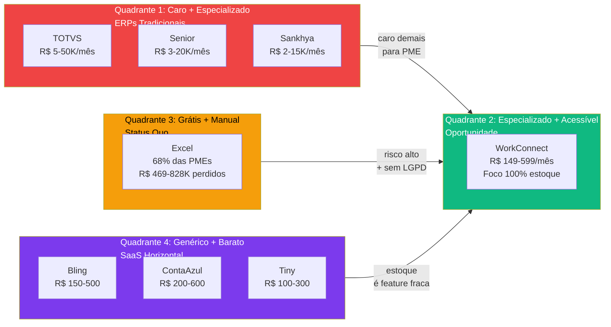
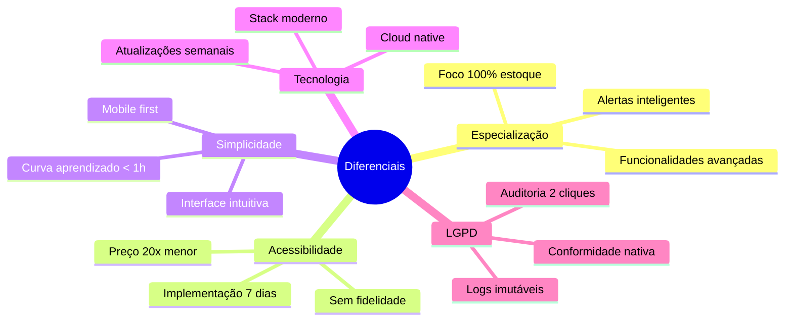
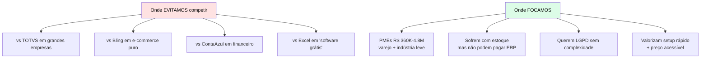
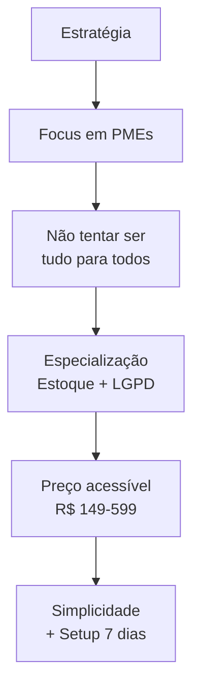
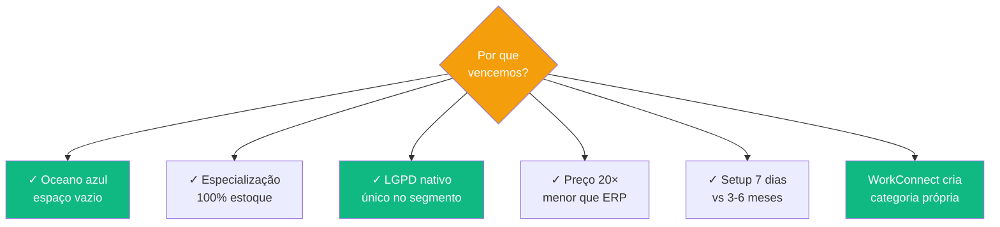

# Análise Concorrência

> **TL;DR** · O mercado está polarizado: **TOTVS/SAP** (caro + complexo) ou **Excel** (grátis + arriscado). WorkConnect ocupa o **espaço vazio** entre eles — **especialização em estoque** + **preço de PME** + **LGPD nativo**. Nenhum concorrente joga nesse quadrante hoje. É o **carro popular** entre a Ferrari e a carroça.

:::info Onde estamos no Sequoia Pitch
Este doc responde os slots **Competition** + **Why Us** (Edge) da Sequoia pitch structure. É a evidência de que WorkConnect **não está competindo em mercado vermelho** — está criando **oceano azul** (espaço não disputado).
:::

---

## Layer 1 — O Mercado em 60 Segundos

> **Insight Sequoia:** O mercado **não tem** um player especializado + acessível. É um **oceano azul** — WorkConnect cria o espaço em vez de disputar mercado vermelho.

---

## Layer 2 — Mapa Competitivo Detalhado

**Posicionamento claro:**
- **TOTVS, Senior, Sankhya** — quadrante 1 (alto preço, alta especialização, mas só para grandes)
- **ContaAzul, Bling, Tiny** — quadrante 4 (acessível, mas generalista — estoque é feature fraca)
- **Excel** — quadrante 3 (grátis, mas zero controle + risco LGPD)
- **WorkConnect** — quadrante 2 (especializado **e** acessível)

---

## Layer 3 — Concorrentes por Categoria

### 1. ERPs Tradicionais (Premium)

| Concorrente | Público | Preço | Forte | Fraco |
|-------------|---------|-------|-------|-------|
| **TOTVS** | Grandes | R$ 5K-50K/mês | Marca, recursos | Complexo, caro, 3-6 meses implantação |
| **Senior** | Médias | R$ 3K-20K/mês | Maturidade | Caro, curva de aprendizado |
| **Sankhya** | Médias | R$ 2K-15K/mês | Segmento industrial | Complexo |

**Por que WorkConnect ganha deles no segmento PME:**
- 20× mais barato
- Setup em 7 dias vs. 3-6 meses
- Sem necessidade de consultor de implantação
- UX intuitiva vs. ERP tradicional

### 2. SaaS Horizontal (Genéricos)

| Concorrente | Público | Preço | Forte | Fraco |
|-------------|---------|-------|-------|-------|
| **ContaAzul** | PMEs | R$ 200-600/mês | Vendas + estoque | Estoque é **básico** (foco é financeiro) |
| **Bling** | PMEs | R$ 150-500/mês | E-commerce | Estoque **limitado** (foco é NFe e loja virtual) |
| **Tiny** | Micro | R$ 100-300/mês | Preço | Recursos limitados, suporte fraco |

**Por que WorkConnect ganha deles no segmento PME:**
- Especialização: somos **100% estoque** vs. eles que fazem "tudo menos estoque"
- Alertas inteligentes de validade, lote, curva ABC — features que eles não têm
- LGPD nativo: auditoria granular que concorrentes horizontais não implementam

### 3. Status Quo Manual

| Solução | Uso | Forte | Fraco |
|---------|-----|-------|-------|
| **Excel/Planilha** | 68% PMEs | "Grátis", flexível | Manual, erro humano, sem LGPD |

**Por que WorkConnect ganha do Excel:**
- Zero digitação manual (captura por código de barras)
- 91% menos ruptura (alertas proativos)
- LGPD em conformidade (auditoria em 2 cliques)
- ROI 150% no ano 1 (cliente recupera o investimento no payback de 4 meses)

---

## Layer 4 — Análise SWOT dos Principais Concorrentes

### TOTVS (concorrente "declarado" mas em outro segmento)

| Tipo | Análise |
|------|---------|
| **Força** | Marca forte, mercado estabelecido, recursos completos, base instalada |
| **Fraqueza** | Caro (20× WorkConnect), complexo, implementação 3-6 meses |
| **Oportunidade para WC** | PMEs precisam de versão simplificada — TOTVS não consegue descer de preço sem canibalizar |
| **Ameaça** | Se TOTVS lançar versão lite (improvável), WorkConnect perde narrativa |

### Bling (concorrente "prático" para e-commerce)

| Tipo | Análise |
|------|---------|
| **Força** | Forte em NFe, e-commerce (integra com Mercado Livre, Shopee) |
| **Fraqueza** | Estoque é feature acessória — foco é NFe + loja virtual |
| **Oportunidade para WC** | PME que não é e-commerce fica órfã; Bling não cobre indústria/varejo físico |
| **Ameaça** | Bling poderia adicionar módulo de estoque avançado (mas histórico mostra que não faz) |

### Excel (concorrente "padrão" — 68% das PMEs)

| Tipo | Análise |
|------|---------|
| **Força** | "Grátis", familiar, dono controla tudo |
| **Fraqueza** | Não escala, propenso a erro, sem LGPD, sem alertas |
| **Oportunidade para WC** | R$ 469-828K/ano perdidos é a dor concreta — mensagem "pare de perder dinheiro em planilha" ressoa |
| **Ameaça** | Nenhuma — Excel não vai virar SaaS especializado |

---

## Layer 5 — Diferenciais Competitivos do WorkConnect

### Os 5 Pilares do Diferencial

### Matriz de Diferenciação (WorkConnect vs Mercado)

| Característica | WorkConnect | TOTVS | ContaAzul | Bling | Excel |
|----------------|:-----------:|:-----:|:---------:|:-----:|:----:|
| **Especialização estoque** | ⭐⭐⭐⭐⭐ | ⭐⭐ | ⭐⭐ | ⭐⭐ | ⭐ |
| **Preço acessível** | ⭐⭐⭐⭐⭐ | ⭐ | ⭐⭐⭐ | ⭐⭐⭐⭐ | ⭐⭐⭐⭐⭐ |
| **Facilidade uso** | ⭐⭐⭐⭐⭐ | ⭐⭐ | ⭐⭐⭐ | ⭐⭐⭐⭐ | ⭐⭐ |
| **LGPD nativo** | ⭐⭐⭐⭐⭐ | ⭐⭐⭐ | ⭐⭐ | ⭐⭐ | ⭐ |
| **Mobilidade** | ⭐⭐⭐⭐⭐ | ⭐⭐⭐ | ⭐⭐⭐⭐ | ⭐⭐⭐⭐ | ⭐ |
| **Automação** | ⭐⭐⭐⭐⭐ | ⭐⭐⭐⭐ | ⭐⭐⭐ | ⭐⭐⭐ | ⭐ |
| **Setup < 7 dias** | ⭐⭐⭐⭐⭐ | ⭐ | ⭐⭐⭐⭐ | ⭐⭐⭐⭐ | ⭐⭐⭐⭐⭐ |
| **Curva aprendizado** | ⭐⭐⭐⭐⭐ | ⭐⭐ | ⭐⭐⭐ | ⭐⭐⭐ | ⭐⭐⭐ |

**Onde WorkConnect é claramente superior:**
1. **Especialização em estoque** — ninguém chega perto
2. **LGPD nativo** — nenhum concorrente tem auditoria granular
3. **Setup em 7 dias** — TOTVS leva 3-6 meses
4. **Preço** — 20× menor que ERP tradicional

---

## Layer 6 — Estratégia Competitiva (Blue Ocean)

### Onde WorkConnect Não Está Competindo

### Estratégia de Focus (Michael Porter)

---

## Layer 7 — Resposta a Movimentos dos Concorrentes

| Se o concorrente... | WorkConnect responde... |
|---------------------|------------------------|
| Baixar preço (Bling → R$ 99) | Reforçar valor agregado (LGPD + especialização) |
| Adicionar features (ContaAzul → estoque+) | Aprofundar especialização (curva ABC, lote, validade) |
| Focar em UX (Bling → redesign) | Continuar investindo em mobile-first + dark mode |
| Copiar modelo (TOTVS → ERP lite) | Competir em nicho (PMEs que **não querem** ERP, mesmo lite) |
| Entrar via parceria (Bling + contadores) | Ser o **player default** dos contadores (Carlos persona) |

---

## Síntese Executiva

---

## Próximo Passo na Narrativa

| Se você quer... | Vá para |
|-----------------|---------|
| Entender **o plano de ataque** para capturar esse oceano azul | [Go-to-Market →](./go-to-market) |
| Ver **o business model** que sustenta essa vantagem | [BM Canvas →](./bmc-canvas) |
| Conhecer **as personas** que vão migrar para WorkConnect | [Personas →](./personas) |
| Aprofundar **a estratégia de produto** | [PM Canvas →](./pm-canvas) |

---

## Referências

- **Blue Ocean Strategy** — W. Chan Kim & Renée Mauborgne
- **Competitive Strategy** — Michael Porter (Focus strategy)
- **Positioning** — Ries & Trout
- **Sequoia pitch structure** — Competition slot
- **WorkConnect** — Análise competitiva interna (2024-2025)