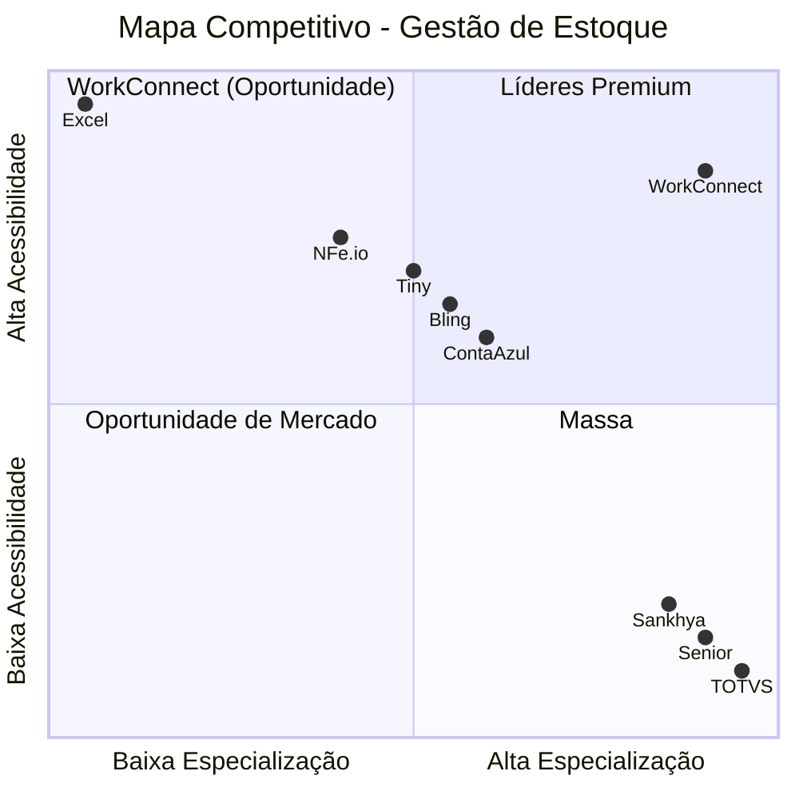
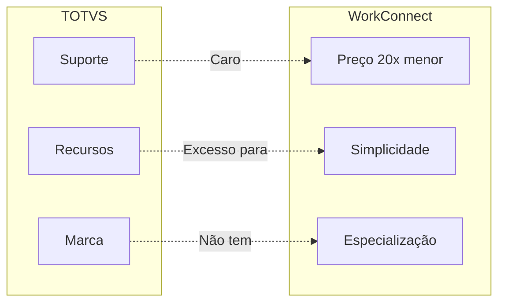
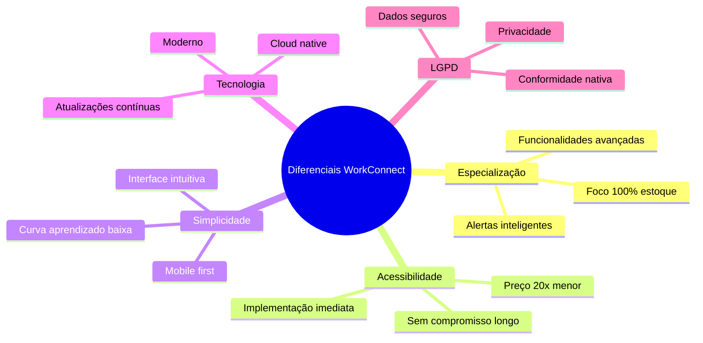
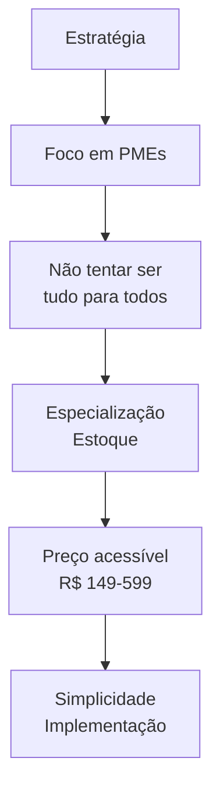

# Análise Concorrencial

## Visão Geral

Esta seção apresenta a análise competitiva completa do WorkConnect, identificando concorrentes diretos e indiretos, suas forças e fraquezas, e o posicionamento estratégico.

---

## Mapa Competitivo

### Visão Geral do Mercado

---

## Concorrentes por Categoria

### 1. ERPs Tradicionais

| Concorrente | Público | Preço | Forte | Fraco |
|-------------|---------|-------|-------|-------|
| **TOTVS** | Grandes | R$ 5K-50K | Marca, recursos | Complexo, caro |
| **Senior** | Médias | R$ 3K-20K | Maturidade | Caro |
| **Sankhya** | Médias | R$ 2K-15K | Segmento | Complexo |

### 2. Sistemas de Gestão

| Concorrente | Público | Preço | Forte | Fraco |
|-------------|---------|-------|-------|-------|
| **ContaAzul** | PMEs | R$ 200-600/mês | Vendas+estoque | Estoque básico |
| **Bling** | PMEs | R$ 150-500/mês | E-commerce | Estoque limitado |
| **Tiny** | Micro | R$ 100-300/mês | Preço | Recursos |

### 3. Planilhas (Status Quo)

| Solução | Uso | Forte | Fraco |
|---------|-----|-------|-------|
| **Excel** | 68% PMEs | Grátis, flexível | Manual, erro |

---

## Análise SWOTT de Concorrentes

### TOTVS

| Tipo | Análise |
|------|---------|
| **Força** | Marca forte, mercado estabelecido, recursos completos |
| **Fraqueza** | Caro, complexo, implementation longa |
| **Oportunidade** | PMEs precisam de versão simplificada |
| **Ameaça** | Perde espaço para SaaS moderno |

### WorkConnect vs TOTVS

---

## Diferenciais Competitivos

### Vantagens do WorkConnect

### Matriz de Diferenciação

| Característica | WorkConnect | TOTVS | ContaAzul | Bling | Excel |
|----------------|-------------|-------|-----------|-------|-------|
| **Especialização estoque** | ⭐⭐⭐⭐⭐ | ⭐⭐ | ⭐⭐ | ⭐⭐ | ⭐ |
| **Preço acessível** | ⭐⭐⭐⭐⭐ | ⭐ | ⭐⭐⭐ | ⭐⭐⭐⭐ | ⭐⭐⭐⭐⭐ |
| **Facilidade uso** | ⭐⭐⭐⭐⭐ | ⭐⭐ | ⭐⭐⭐ | ⭐⭐⭐⭐ | ⭐⭐ |
| **LGPD** | ⭐⭐⭐⭐⭐ | ⭐⭐⭐ | ⭐⭐ | ⭐⭐ | ⭐ |
| **Mobilidade** | ⭐⭐⭐⭐⭐ | ⭐⭐⭐ | ⭐⭐⭐⭐ | ⭐⭐⭐⭐ | ⭐ |
| **Automação** | ⭐⭐⭐⭐⭐ | ⭐⭐⭐⭐ | ⭐⭐⭐ | ⭐⭐⭐ | ⭐ |

---

## Estratégias Competitivas

### Estratégia de Focus

### Resposta a Concorrentes

| Se o concorrente... | WorkConnect responde... |
|--------------------|----------------------|
| Baixa preço | Valor agregado maior |
| Muitos recursos | Foco e simplicidade |
| Complexo | Intuitivo e rápido |
| Lento | Atualizações ágeis |

---

## Próximos Passos

Continue explorando:

- [Go-to-Market](./go-to-market) - Estratégia de entrada
- [BM Canvas](./bmc-canvas) - Modelo de negócio
- [Personas](./personas) - Perfis de clientes

---

## Referências

- **Análise de Mercado** - Dados internos
- **Benchmark Concorrentes** - Pesquisa detalhada
- **WorkConnect** - Diferenciação estratégica
