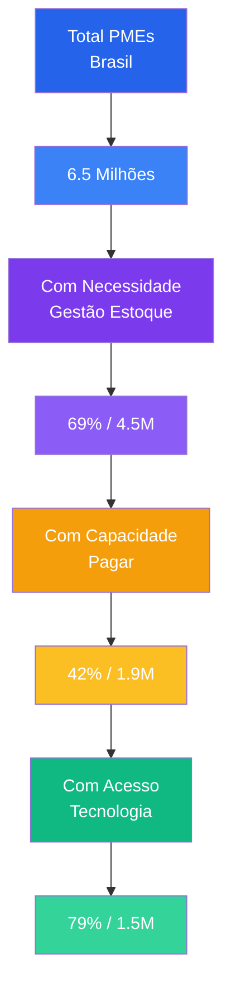
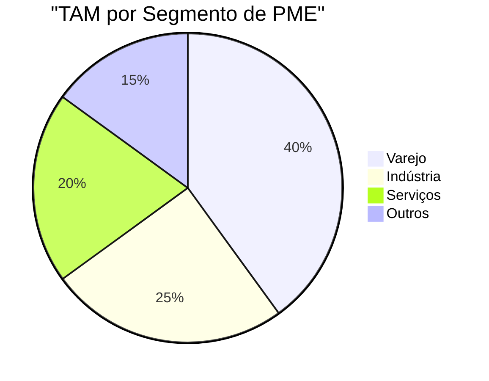
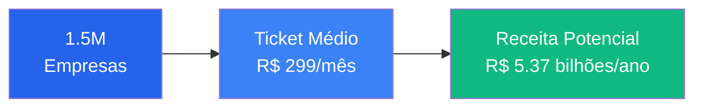
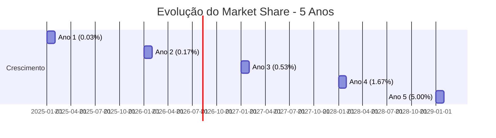
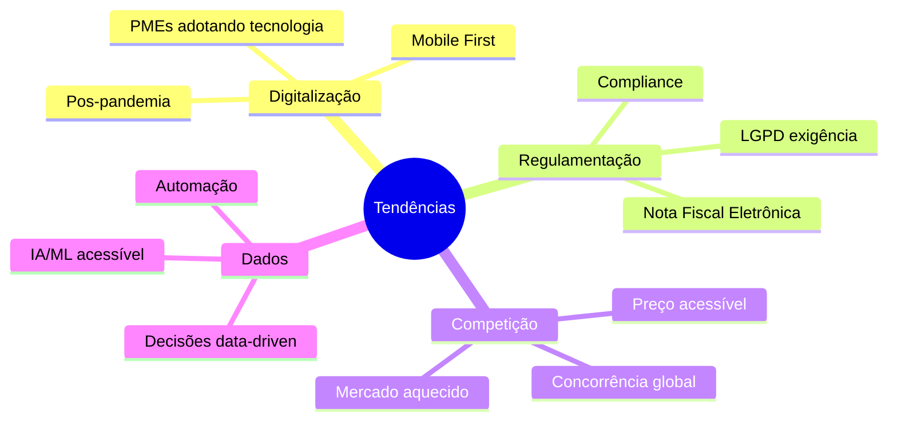
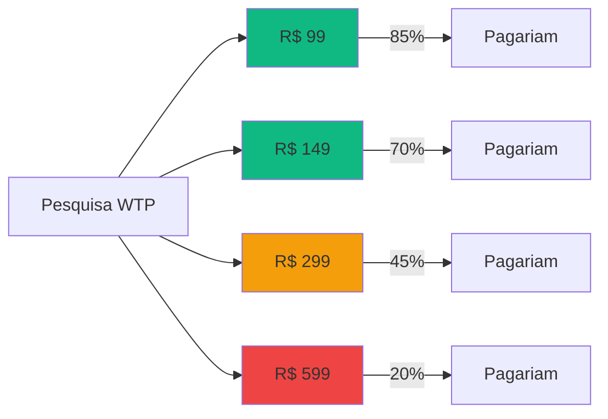

# Análise de Mercado

## Visão Geral

Esta seção apresenta a análise detalhada do mercado de gestão de estoque para Pequenas e Médias Empresas (PMEs) no Brasil, incluindo o dimensionamento da oportunidade de negócio (TAM, SAM, SOM).

:::info Fonte de Dados
Dados baseados em pesquisas SEBRAE, IBGE e análises de mercado de 2024-2025.
:::

---

## Mercado de PMEs no Brasil

### Panorama Geral



### Classificação de PMEs (SEBRAE)

| Categoria | Faturamento Anual | Funcionários | % do PIB |
|-----------|-------------------|--------------|----------|
| **Microempresa** | Até R$ 360.000 | 1-9 | ~27% |
| **Pequena Empresa** | R$ 360K - R$ 4.8M | 10-49 | ~21% |
| **Média Empresa** | R$ 4.8M - R$ 300M | 50-99 | ~18% |
| **Total PMEs** | - | - | **~66% do PIB** |

---

## TAM - Total Addressable Market

### Definição

O **TAM** representa o mercado total potencial se 100% do mercado-alvo fosse atendido.

### Cálculo do TAM

| Componente | Valor |
|------------|-------|
| Total de PMEs no Brasil | 6.5 milhões |
| PMEs com necessidade de gestão de estoque | 69% = 4.5 milhões |
| Faturamento médio por PME | R$ 1.2 milhão/ano |
| Investimento médio em TI (anual) | 2-5% do faturamento |
| **TAM Anual** | **R$ 108 - 270 bilhões** |

### Detalhamento por Segmento



---

## SAM - Serviceable Available Market

### Definição

O **SAM** representa o segmento do mercado que a empresa pode efetivamente atender considerando seu modelo de negócio e capacidade de entrega.

### Critérios de Segmentação

| Critério | Descrição | Impacto |
|----------|-----------|---------|
| **Faturamento** | R$ 360K - R$ 4.8M/ano | PMEs com capacidade de pago |
| **Problema de Estoque** | 68% enfrentam o problema | Mercado relevante |
| **Acesso à Internet** | 79% têm acesso | Viabilidade técnica |
| **Localização** | Capitais e regiões metropolitanas | Prioridade inicial |

### Cálculo do SAM

| Etapa | Quantidade |
|-------|------------|
| PMEs com faturamento R$ 360K - R$ 4.8M | 2.8 milhões |
| PMEs com problemas de estoque (68%) | 1.9 milhões |
| PMEs com acesso à tecnologia (79%) | 1.5 milhões |
| **SAM** | **1.5 milhões de empresas** |

### SAM em Receita Anual



---

## SOM - Serviceable Obtainable Market

### Definição

O **SOM** representa a parcela do mercado que a empresa realisticamente pode capturar em um horizonte de tempo específico.

### Premissas do Modelo

| Premissa | Valor | Justificativa |
|----------|-------|---------------|
| **Horizonte** | 5 anos | Prazo para consolidação |
| **Market Share Alvo** | 5% | Conservative para SaaS B2B |
| **Taxa de Conversão** | 3% | Benchmark SaaS B2B |
| **Churn Mensal** | 5% | Média para PMEs |
| **Upsell Rate** | 15% | Evolução para planos maiores |

### Projeção de Captura de Mercado

| Ano | Clientes | Market Share | MRR | Receita Anual |
|-----|----------|--------------|-----|---------------|
| **1** | 500 | 0.03% | R$ 149.500 | R$ 1.8M |
| **2** | 2.500 | 0.17% | R$ 747.500 | R$ 9.0M |
| **3** | 8.000 | 0.53% | R$ 2.392.000 | R$ 28.7M |
| **4** | 25.000 | 1.67% | R$ 7.475.000 | R$ 89.7M |
| **5** | 75.000 | 5.00% | R$ 22.425.000 | R$ 269.1M |

### Crescimento do SOM



---

## Análise Setorial

### Setores-Alvo

#### Varejo

| Métrica | Valor |
|---------|-------|
| **Estabelecimentos** | ~2.5 milhões |
| **Faturamento médio** | R$ 180K/ano |
| **Problemas principais** | Giro rápido, sazonalidade |
| **Necessidade** | Controle em tempo real |

#### Indústria Leve

| Métrica | Valor |
|---------|-------|
| **Empresas** | ~200 mil |
| **Faturamento médio** | R$ 2.4M/ano |
| **Problemas principais** | Lote, rastreabilidade |
| **Necessidade** | Controle de matéria-prima |

#### Serviços

| Métrica | Valor |
|---------|-------|
| **Empresas** | ~1.8 milhões |
| **Faturamento médio** | R$ 120K/ano |
| **Problemas principais** | Insumos, ferramentas |
| **Necessidade** | Reposição preventiva |

---

## Tendências de Mercado

### Drivers de Crescimento



### Oportunidades Identificadas

| Oportunidade | Tamanho | Prazo |
|-------------|---------|--------|
| **PMEs digitalizando** | +40% desde 2020 | Contínuo |
| **Migração de Excel** | 68% usam planilhas | 3-5 anos |
| **Sistemas legados** | 12% têm ERP | 5-10 anos |
| **Mobile** | 60% acesso mobile | 2-3 anos |

---

## Análise de Preço

### Disposição a Pagar



### Tabela de Preços

| Plano | Preço | % PMEs que pagariam | Oportunidade |
|-------|-------|---------------------|-------------|
| **Básico** | R$ 149/mês | 70% | Volume |
| **Profissional** | R$ 299/mês | 45% | Crescimento |
| **Enterprise** | R$ 599/mês | 20% | Premium |

---

## Concorrência de Mercado

### Players Atuais

```mermaid
quadrantChart
    title Mapa Competitivo - Gestão de Estoque
    x-axis Baixa Especialização --> Alta Especialização
    y-axis Baixa Acessibilidade --> Alta Acessibilidade
    
    quadrant-1 "Especializados Premium"
    quadrant-2 "WorkConnect (Oportunidade)"
    quadrant-3 "Excel/Manual"
    quadrant-4 "Genéricos Acessíveis"
    
    "ERPs Enterprise": [0.9, 0.1]
    "Sankhya": [0.8, 0.3]
    "Totvs": [0.85, 0.2]
    "ContaAzul": [0.5, 0.7]
    "Bling": [0.45, 0.75]
    "Excel": [0.0, 1.0]
    "WorkConnect": [0.9, 0.85]
```

---

## Projeções Financeiras

### Cenário Conservador

| Ano | Receita | Margem Bruta | Margem Líquida |
|-----|---------|--------------|-----------------|
| 1 | R$ 1.8M | 70% | 10% |
| 2 | R$ 9.0M | 72% | 15% |
| 3 | R$ 28.7M | 75% | 20% |
| 4 | R$ 89.7M | 78% | 25% |
| 5 | R$ 269.1M | 80% | 30% |

### Ponto de Equilíbrio

| Métrica | Valor |
|---------|-------|
| **Custos Fixos Mensais** | R$ 17.300 |
| **Ticket Médio** | R$ 299 |
| **Clientes para Equilíbrio** | **58 clientes** |

---

## Próximos Passos

Continue explorando:

- [Personas](./personas) - Perfis detalhados de clientes
- [Proposta de Valor](./proposta-valor) - Value Proposition Canvas
- [BM Canvas](./bmc-canvas) - Modelo de negócio

---

## Referências

- **SEBRAE** - Estatísticas de PMEs no Brasil
- **IBGE** - Pesquisa Anual de Serviços
- **Benchmark SaaS** - Métricas de mercado
- **WorkConnect** - Análise interna
