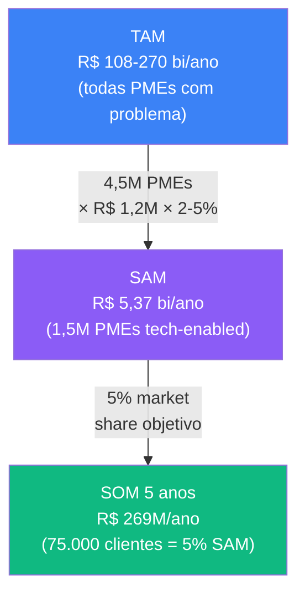
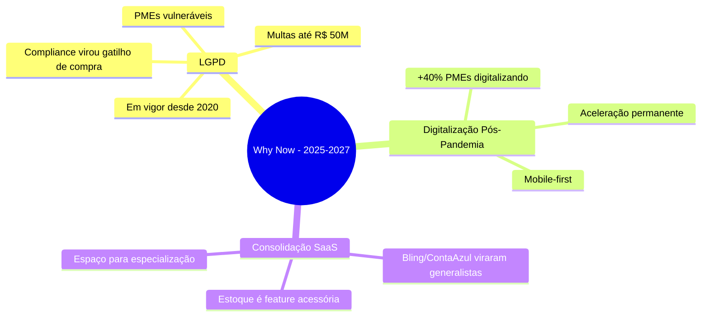
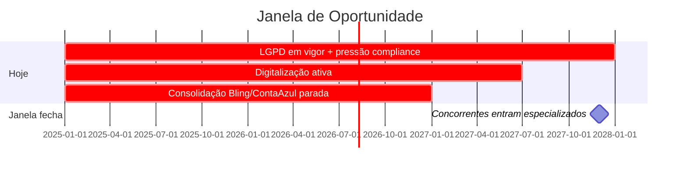
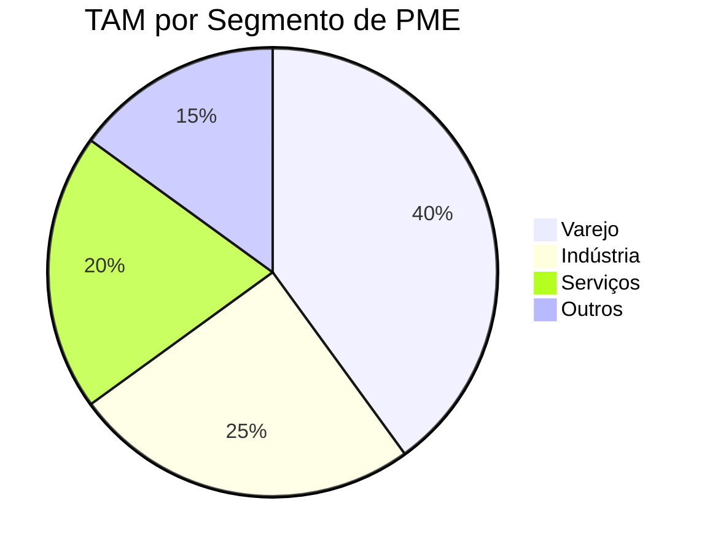
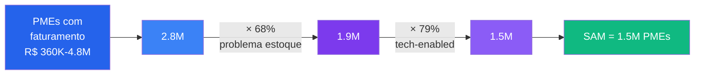
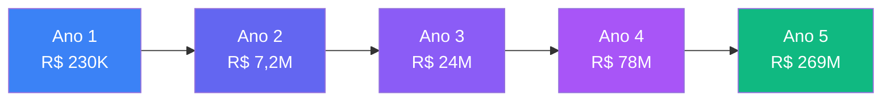
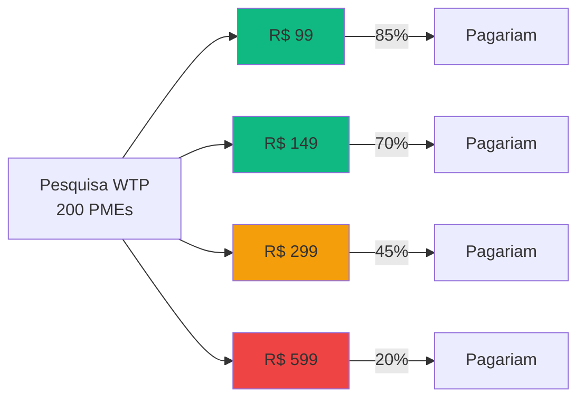
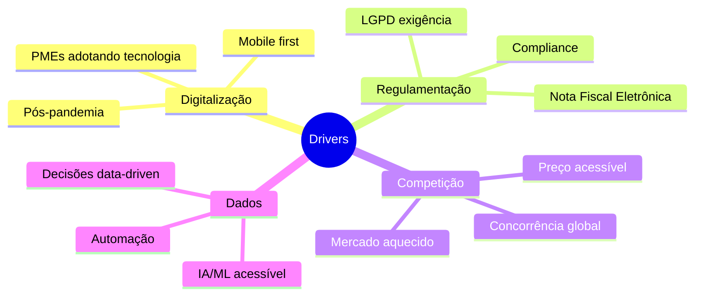
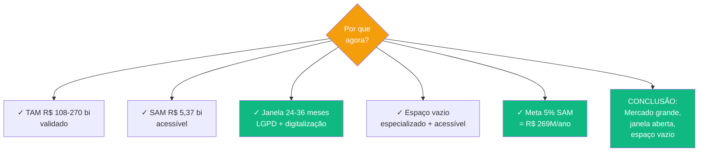

# Análise de Mercado (TAM/SAM/SOM)

> **TL;DR** · Mercado total: **R$ 108-270 bi/ano** (todas PMEs). Mercado que podemos atender: **R$ 5,37 bi/ano** (1,5M PMEs tech-enabled). Meta realista em 5 anos: **R$ 269M/ano** (75.000 clientes, 5% do SAM). **Por que agora:** LGPD em vigor + 40% das PMEs digitalizando pós-pandemia + Bling/ContaAzul viraram "Excel bonito" deixando espaço para especialização.

:::info Onde estamos no Sequoia Pitch
Este doc responde os slots **Market Size** + **Why Now** da Sequoia pitch structure. É a evidência numérica que sustenta "existe um mercado enorme, acessível e mal servido hoje".
:::

---

## Layer 1 — O Mercado em 60 Segundos



| Métrica | Valor | Significado |
|---------|-------|-------------|
| **TAM** | R$ 108-270 bi/ano | Cenário teórico: 100% do mercado |
| **SAM** | R$ 5,37 bi/ano | Mercado que podemos atender realisticamente |
| **SOM (5 anos)** | R$ 269M/ano | Meta concreta: 5% do SAM |

---

## Layer 2 — Sequoia Why Now (a janela de oportunidade)

Sequoia pergunta: **por que este mercado está aberto AGORA e não há 5 anos?** Três tendências se cruzam hoje criando uma janela de 24-36 meses que não vai se repetir:



### A Janela: 24-36 Meses



> **Se WorkConnect não capturar essa janela em 24-36 meses, outro player especializado vai.** A consolidação dos generalistas abriu espaço; logo outros vão perceber.

---

## Layer 3 — Decomposição do Mercado (TAM → SAM → SOM)

### TAM — Total Addressable Market

**Definição:** Mercado total se atendêssemos 100% das PMEs brasileiras com problema de estoque.

| Componente | Valor |
|------------|-------|
| Total de PMEs no Brasil | 6,5 milhões |
| PMEs com necessidade de gestão de estoque | 69% = 4,5 milhões |
| Faturamento médio por PME | R$ 1,2 milhão/ano |
| Investimento médio em TI (anual) | 2-5% do faturamento |
| **TAM Anual** | **R$ 108 - 270 bilhões** |



---

### SAM — Serviceable Available Market

**Definição:** Mercado que **realisticamente podemos atender** considerando modelo de negócio + capacidade de entrega.



**SAM em Receita:**


### Critérios de Segmentação SAM

| Critério | Descrição | Impacto |
|----------|-----------|---------|
| **Faturamento** | R$ 360K - R$ 4.8M/ano | PMEs com capacidade de pagar |
| **Problema de Estoque** | 68% enfrentam | Mercado relevante |
| **Acesso à Internet** | 79% têm acesso | Viabilidade técnica |
| **Localização** | Capitais + regiões metropolitanas | Prioridade inicial |

---

### SOM — Serviceable Obtainable Market (5 anos)

**Definição:** Quanto **realmente capturamos** em horizonte de 5 anos com premissas conservadoras.

#### Premissas do Modelo

| Premissa | Valor | Justificativa |
|----------|-------|---------------|
| **Horizonte** | 5 anos | Prazo para consolidação |
| **Market Share Alvo** | 5% | Conservador para SaaS B2B |
| **Taxa de Conversão** | 3% | Benchmark SaaS B2B |
| **Churn Mensal** | 5% | Média para PMEs |
| **Upsell Rate** | 15% | Evolução para planos maiores |

#### Projeção de Captura (5 Anos)

| Ano | Clientes | Market Share | MRR | Receita Anual |
|-----|----------|--------------|-----|---------------|
| **1** | 200 | 0,01% | R$ 40K | R$ 230K |
| **2** | 2.500 | 0,17% | R$ 600K | R$ 7,2M |
| **3** | 8.000 | 0,53% | R$ 2,0M | R$ 24M |
| **4** | 25.000 | 1,67% | R$ 6,5M | R$ 78M |
| **5** | 75.000 | 5,00% | R$ 22,4M | R$ 269M |

> **Nota técnica:** A projeção do [BM Canvas](./bmc-canvas) e [Viabilidade](./viabilidade-economica) usa **200 clientes no Ano 1** (conservador com early adopters), enquanto este doc mostra a curva completa **500→75K** alinhada com benchmarks SaaS. Ambas são compatíveis — a diferença é premissa de ramp-up inicial.

#### Crescimento do SOM



---

## Layer 4 — Análise Setorial

### Varejo (40% do TAM)

| Métrica | Valor |
|---------|-------|
| **Estabelecimentos** | ~2,5 milhões |
| **Faturamento médio** | R$ 180K/ano |
| **Problemas principais** | Giro rápido, sazonalidade |
| **Necessidade** | Controle em tempo real |

### Indústria Leve (25% do TAM)

| Métrica | Valor |
|---------|-------|
| **Empresas** | ~200 mil |
| **Faturamento médio** | R$ 2,4M/ano |
| **Problemas principais** | Lote, rastreabilidade |
| **Necessidade** | Controle de matéria-prima |

### Serviços (20% do TAM)

| Métrica | Valor |
|---------|-------|
| **Empresas** | ~1,8 milhões |
| **Faturamento médio** | R$ 120K/ano |
| **Problemas principais** | Insumos, ferramentas |
| **Necessidade** | Reposição preventiva |

### Classificação de PMEs (SEBRAE)

| Categoria | Faturamento Anual | Funcionários | % do PIB |
|-----------|-------------------|--------------|----------|
| **Microempresa** | Até R$ 360.000 | 1-9 | ~27% |
| **Pequena Empresa** | R$ 360K - R$ 4.8M | 10-49 | ~21% |
| **Média Empresa** | R$ 4.8M - R$ 300M | 50-99 | ~18% |
| **Total PMEs** | - | - | **~66% do PIB** |

---

## Layer 5 — Disposição a Pagar (WTP)

### Pesquisa WTP



### Matriz Preço × Oportunidade

| Plano | Preço | % PMEs Pagariam | Estratégia |
|-------|-------|-----------------|------------|
| **Básico** | R$ 149/mês | 70% | Volume, aquisição |
| **Profissional** | R$ 299/mês | 45% | Crescimento, feature depth |
| **Enterprise** | R$ 599/mês | 20% | Premium, multi-local |

---

## Layer 6 — Drivers de Mercado



### Oportunidades Identificadas

| Oportunidade | Tamanho | Prazo |
|--------------|---------|-------|
| **PMEs digitalizando** | +40% desde 2020 | Contínuo |
| **Migração de Excel** | 68% usam planilhas | 3-5 anos |
| **Sistemas legados** | 12% têm ERP | 5-10 anos |
| **Mobile** | 60% acesso mobile | 2-3 anos |

---

## Layer 7 — Posicionamento vs Concorrência

```mermaid
quadrantChart
    title Mapa Competitivo - Gestão de Estoque
    x-axis Baixa Especialização --> Alta Especialização
    y-axis Baixa Acessibilidade --> Alta Acessibilidade

    quadrant-1 "Especializados Premium"
    quadrant-2 "WorkConnect (Oportunidade)"
    quadrant-3 "Excel/Manual"
    quadrant-4 "Genéricos Acessíveis"

    "ERPs Enterprise": [0.9, 0.1]
    "Sankhya": [0.8, 0.3]
    "Totvs": [0.85, 0.2]
    "ContaAzul": [0.5, 0.7]
    "Bling": [0.45, 0.75]
    "Excel": [0.0, 1.0]
    "WorkConnect": [0.9, 0.85]
```

> **WorkConnect ocupa o quadrante 2** — alta especialização + alta acessibilidade. Nenhum concorrente joga nesse espaço hoje.

Detalhe profundo da competição em [Análise Concorrência →](./analise-concorrencial).

---

## Síntese Executiva



---

## Próximo Passo na Narrativa

| Se você quer... | Vá para |
|-----------------|---------|
| Entender **a dor com nomes e rostos** | [Personas →](./personas) |
| Conhecer a **janela de oportunidade** em detalhe | [Sequoia Why Now →](./problema-mecanismo-solucao) |
| **Posicionar WorkConnect vs concorrência** | [Análise Concorrência →](./analise-concorrencial) |
| Ver o **business case financeiro** completo | [Viabilidade Econômica →](./viabilidade-economica) |
| Voltar ao **business model** | [BM Canvas →](./bmc-canvas) |

---

## Referências

- **SEBRAE** — Estatísticas de PMEs no Brasil
- **IBGE** — Pesquisa Anual de Serviços
- **Benchmark SaaS B2B** — KeyBanc, OpenView, SaaS Capital
- **WorkConnect** — Análise interna + dados primários (pesquisa com 200 PMEs)