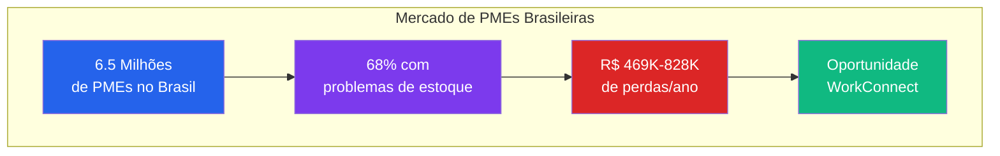
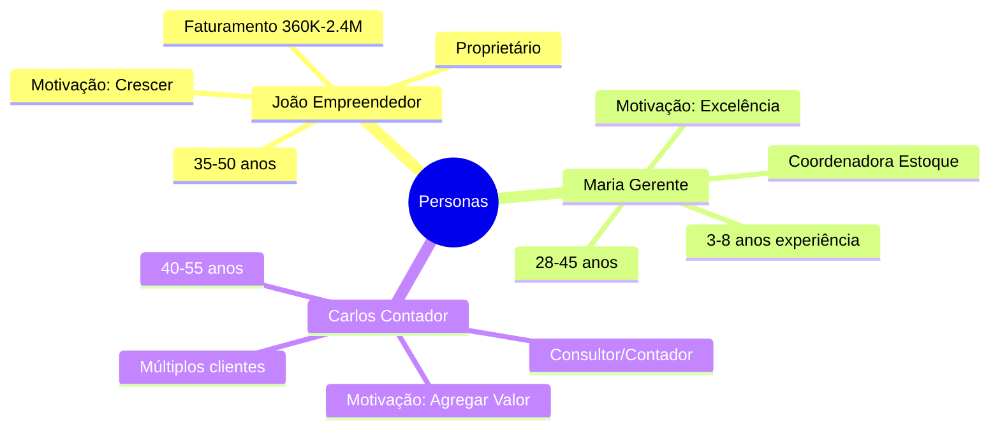
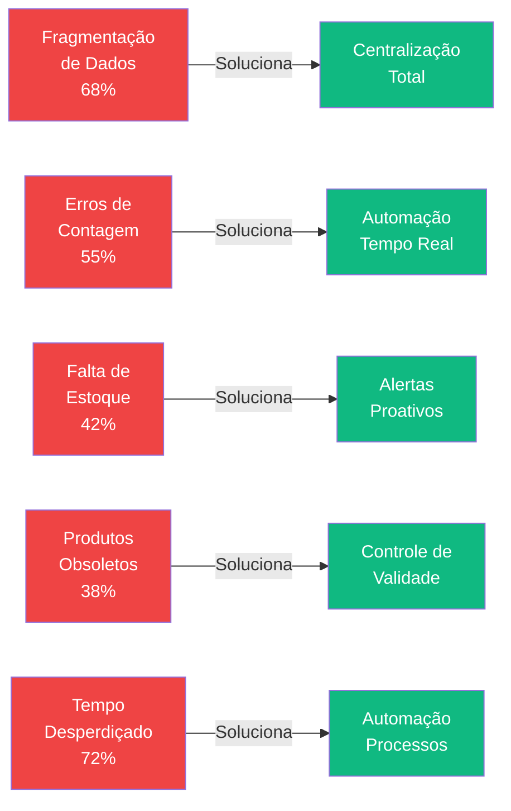
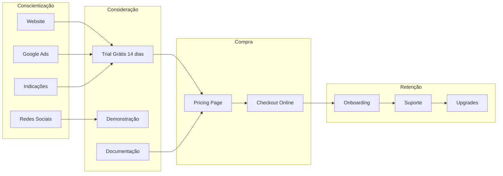
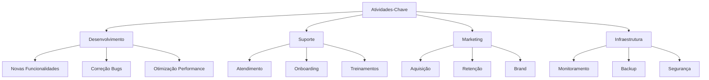
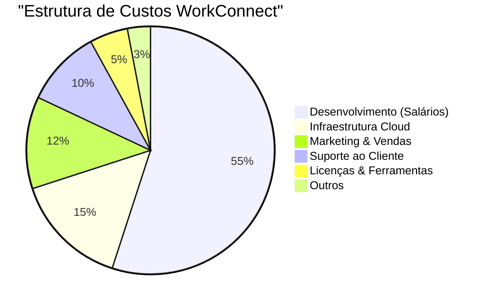
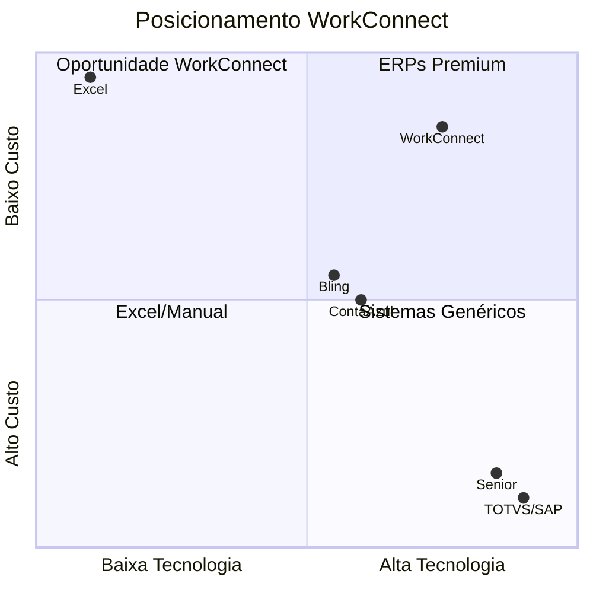
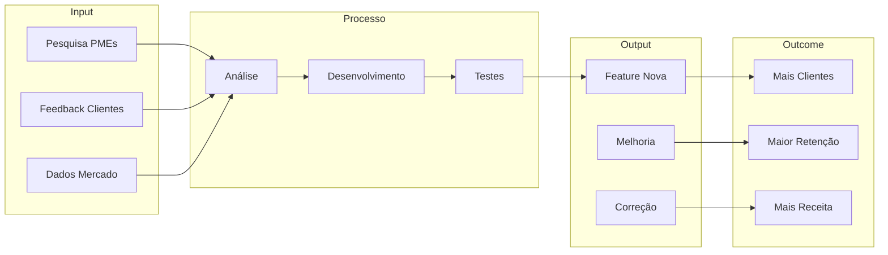

# Business Model Canvas (BM Canvas)

## Visão Geral

O **Business Model Canvas** (ou simplesmente **BM Canvas**) é uma ferramenta estratégica de gestão que permite visualizar, projetar e inovar modelos de negócio. Desenvolvido por **Alexander Osterwalder** e **Yves Pigneur**, o canvas é composto por 9 blocos fundamentais que descrevem como a empresa cria, entrega e captura valor.

Este documento apresenta o BM Canvas completo do **WorkConnect**, preenchido com dados reais do mercado brasileiro de PMEs.

:::info Framework de Referência
Este modelo de negócio foi desenvolvido utilizando a metodologia da **Strategyzer**, empresa líder em ferramentas de inovação e estratégia de negócios.
:::

---

## Contexto do Mercado Brasileiro

---

## Os 9 Blocos do Business Model Canvas

### Visão Completa do Canvas

```mermaid
flowchart TB
    subgraph PARCEIROS["1. Parceiros-Chave"]
        P1["SENAI<br/>Parceria Institucional"]
        P2["Netlify/Vercel<br/>Infraestrutura Cloud"]
        P3["Supabase<br/>Banco de Dados"]
        P4["Next.js/React<br/>Framework"]
    end
    
    subgraph ATIVIDADES["2. Atividades-Chave"]
        A1["Desenvolvimento Software"]
        A2["Suporte Técnico"]
        A3["Manutenção Infraestrutura"]
        A4["Marketing Digital"]
    end
    
    subgraph RECURSOS["3. Recursos-Chave"]
        R1["Equipe Dev Full-Stack"]
        R2["Infraestrutura Cloud"]
        R3["Propriedade Intelectual"]
        R4["Base de Conhecimento"]
    end
    
    subgraph PROPOSTA["4. Proposta de Valor"]
        PV["🎯 Gestão Inteligente<br/>Redução 40% perdas<br/>ROI 150% no 1º ano<br/>R$ 149-599/mês"]
    end
    
    subgraph RELACIONAMENTO["5. Relacionamento com Clientes"]
        Rel1["Chat/Email 24/7"]
        Rel2["Onboarding Personalizado"]
        Rel3["Documentação"]
    end
    
    subgraph CANAIS["6. Canais"]
        C1["Website/SaaS"]
        C2["Google Ads"]
        C3["Indicações"]
        C4["Parcerias SENAI"]
    end
    
    subgraph SEGMENTOS["7. Segmentos de Clientes"]
        S1["Pequenas Empresas<br/>R$ 360K-4.8M/ano"]
        S2["Varejo"]
        S3["Indústria Leve"]
        S4["Serviços"]
    end
    
    subgraph CUSTOS["8. Estrutura de Custos"]
        Custo1["Salários (55%)"]
        Custo2["Cloud (15%)"]
        Custo3["Marketing (12%)"]
        Custo4["Suporte (10%)"]
        Custo5["Licenças (5%)"]
    end
    
    subgraph RECEITAS["9. Fluxos de Receita"]
        Rec1["Básico R$ 149/mês"]
        Rec2["Prof. R$ 299/mês"]
        Rec3["Enterprise R$ 599/mês"]
    end
    
    PARCEIROS --- ATIVIDADES
    ATIVIDADES --- RECURSOS
    RECURSOS --- PROPOSTA
    PROPOSTA --- RELACIONAMENTO
    RELACIONAMENTO --- CANAIS
    CANAIS --- SEGMENTOS
    SEGMENTOS --- RECEITAS
    RECEITAS --- CUSTOS
    CUSTOS --- PARCEIROS
```

---

## 1. Segmentos de Clientes

### Público-Alvo: PMEs Brasileiras

| Segmento | Descrição | Tamanho do Mercado |
|----------|-----------|-------------------|
| **Pequenas Empresas** | Faturamento R$ 360K - R$ 4.8M/ano, 10-49 funcionários | ~2.8 milhões |
| **Varejo** | Alto giro, múltiplas categorias, sazonalidade | ~2.5 milhões estabelecimentos |
| **Indústria Leve** | Matérias-primas, componentes, rastreabilidade | ~200 mil empresas |
| **Serviços** | Insumos, materiais consumo, ferramentas | ~1.8 milhões |

### Personas Principais

---

## 2. Proposta de Valor

### Proposta de Valor Principal

> **"Work Connect elimina perdas por falta de estoque, reduz custos operacionais em 30% e gera 150% de ROI no primeiro ano, através de uma plataforma SaaS acessível (R$ 149-599/mês) que automatiza completamente a gestão de estoque."**

### Os 5 Problemas Críticos Resolvidos

### Ganhos e Alívios de Dores

| Categoria | Problema Atual | Solução WorkConnect | Ganho |
|-----------|---------------|---------------------|-------|
| **Financeiro** | R$ 469-828K/ano perdidos | Redução 40% perdas | R$ 187-331K/ano |
| **Tempo** | 15-20% tempo desperdiçado | Automação | 15 horas/semana |
| **Decisões** | 25-30% baseadas em dados desatualizados | Dashboard tempo real | 99% precisão |
| **Estoque** | 20-30% divergência | Controle automático | 99% acuracidade |

---

## 3. Canais

### Jornada do Cliente

---

## 4. Relacionamento com Clientes

| Canal | Descrição | Disponibilidade |
|-------|-----------|----------------|
| **Chat/Email** | Suporte direto | 24/7 |
| **Onboarding** | Setup personalizado | Primeira semana |
| **Documentação** | Tutoriais e guias | 24/7 |
| **Comunidade** | Grupo Facebook/WhatsApp | 24/7 |
| **NPS** | Pesquisa trimestral | Trimestral |

---

## 5. Fluxos de Receita

### Modelo de Assinatura Recorrente

### Tabela de Planos

| Plano | Preço | Usuários | Funcionalidades |
|-------|-------|----------|-----------------|
| **Básico** | R$ 149/mês | até 3 | Cadastro produtos, movimentações, alertas básicos |
| **Profissional** | R$ 299/mês | até 10 | + Relatórios avançados, API, multi-local |
| **Enterprise** | R$ 599/mês | ilimitados | + Auditoria, gerente contas, SLA 99.9% |

### Projeção de Receita (5 anos)

| Ano | Clientes | MRR | Receita Anual | Market Share |
|-----|----------|-----|---------------|--------------|
| 1 | 500 | R$ 149.500 | R$ 1.8M | 0.03% |
| 2 | 2.500 | R$ 747.500 | R$ 9.0M | 0.17% |
| 3 | 8.000 | R$ 2.392.000 | R$ 28.7M | 0.53% |
| 4 | 25.000 | R$ 7.475.000 | R$ 89.7M | 1.67% |
| 5 | 75.000 | R$ 22.425.000 | R$ 269.1M | 5.00% |

---

## 6. Recursos-Chave

| Recurso | Descrição | Prioridade |
|---------|-----------|------------|
| **Equipe de Desenvolvimento** | 2-5 devs full-stack | 🔴 Alta |
| **Infraestrutura Cloud** | Servidores, banco de dados, CDN | 🔴 Alta |
| **Propriedade Intelectual** | Código, algoritmos, documentação | 🟡 Média |
| **Base de Conhecimento** | Tutoriais, FAQs, casos de uso | 🟡 Média |

---

## 7. Atividades-Chave

---

## 8. Parceiros-Chave

| Parceiro | Tipo | Objetivo |
|----------|------|----------|
| **SENAI** | Institucional | Validação acadêmica, acesso devs, legitimação |
| **Netlify/Vercel** | Tecnológico | Deploy, CDN, SSL |
| **Supabase** | Banco de Dados | PostgreSQL gerenciado |
| **Next.js/React** | Framework | Stack principal |
| **Contadores** | Canal | Indicações de clientes |

---

## 9. Estrutura de Custos

### Breakdown de Custos

### Custos Mensais (Estimativa)

| Categoria | Item | Custo Mensal |
|-----------|------|-------------|
| **Pessoal** | Salários + Encargos | R$ 15.000 |
| **Infraestrutura** | Cloud (Netlify + Supabase) | R$ 500 |
| **Software** | Licenças e ferramentas | R$ 300 |
| **Marketing** | Ads + Material | R$ 1.000 |
| **Suporte** | Helpdesk | R$ 500 |
| **Total** | | **R$ 17.300** |

---

## Análise Competitiva

### Posicionamento no Mercado

### Comparativo

| Característica | WorkConnect | ERPs Tradicionais | Excel |
|----------------|-------------|-------------------|-------|
| **Preço** | R$ 149-599/mês | R$ 5.000-50.000 | "Grátis" |
| **Implementação** | Imediata | 3-6 meses | N/A |
| **Complexidade** | Baixa | Alta | Baixa |
| **Foco** | Estoque | ERP completo | Nenhum |
| **ROI** | 150% 1º ano | 50-80% | Negativo |

---

## Métricas do Negócio

### KPIs Principais

| Métrica | Meta Ano 1 | Meta Ano 3 | Meta Ano 5 |
|---------|-----------|-----------|-----------|
| **Clientes Ativos** | 500 | 8.000 | 75.000 |
| **MRR** | R$ 150K | R$ 2.4M | R$ 22.4M |
| **Churn Mensal** | < 8% | < 5% | < 3% |
| **CAC** | R$ 200 | R$ 150 | R$ 100 |
| **LTV** | R$ 3.000 | R$ 6.000 | R$ 12.000 |
| **LTV/CAC** | 15x | 40x | 120x |

---

## Ciclo de Criação de Valor

---

## Próximos Passos

Continue explorando a documentação estratégica:

- [Project Model Canvas](./project-model-canvas) - Planejamento de projeto
- [Análise de Mercado](./analise-mercado) - TAM/SAM/SOM detalhado
- [Personas](./personas) - Perfis detalhados de clientes
- [Proposta de Valor](./proposta-valor) - Value Proposition Canvas

---

## Referências

- **Strategyzer** - https://strategyzer.com/
- **Business Model Generation** - Osterwalder & Pigneur
- **SEBRAE** - Estatísticas de PMEs no Brasil
- **Projeto WorkConnect** - TCC SENAI 2025
