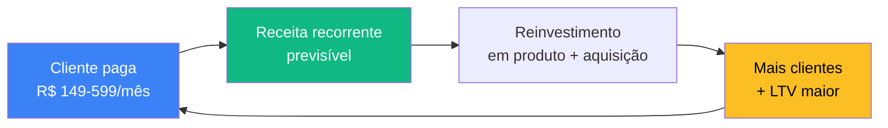
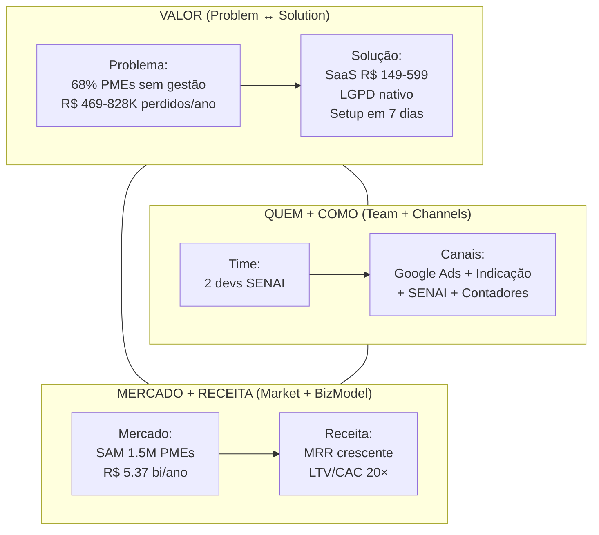
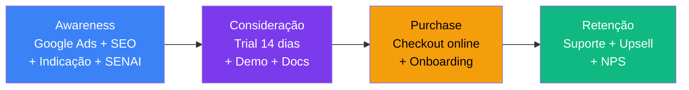
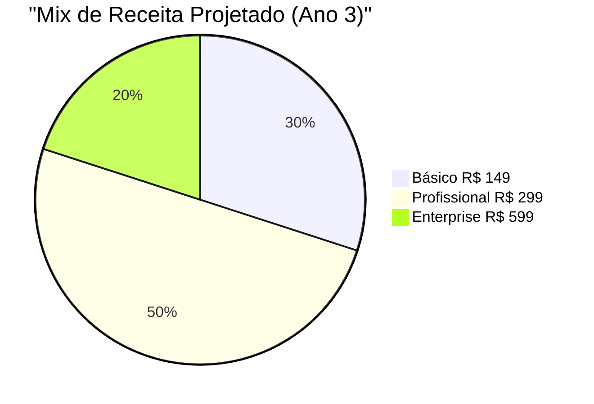
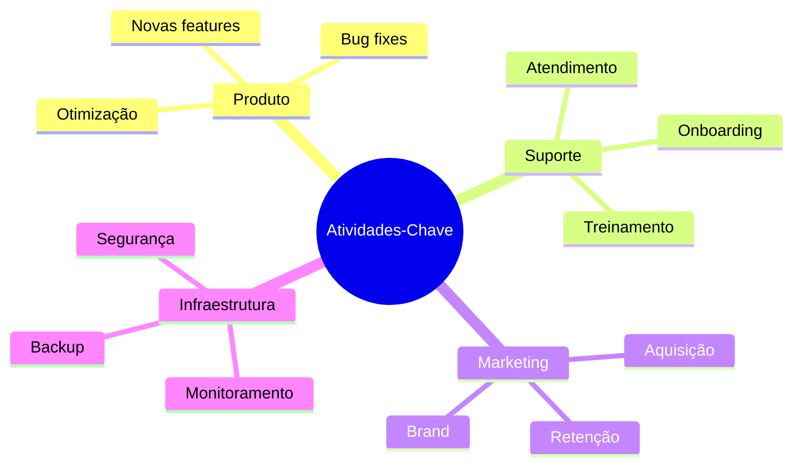
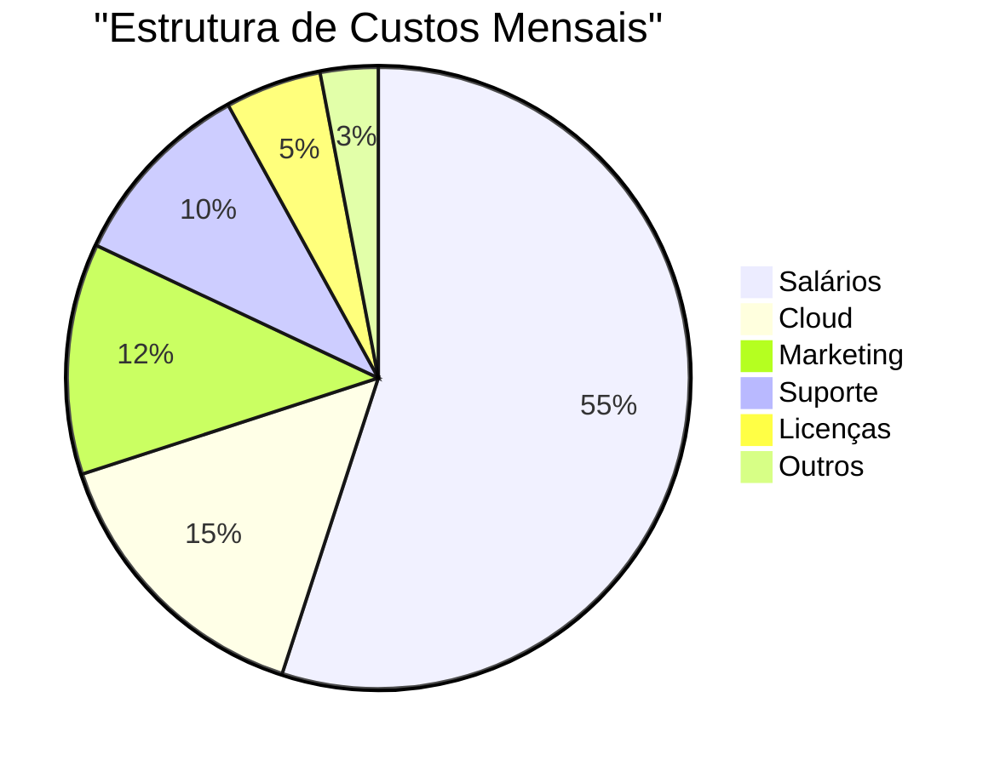
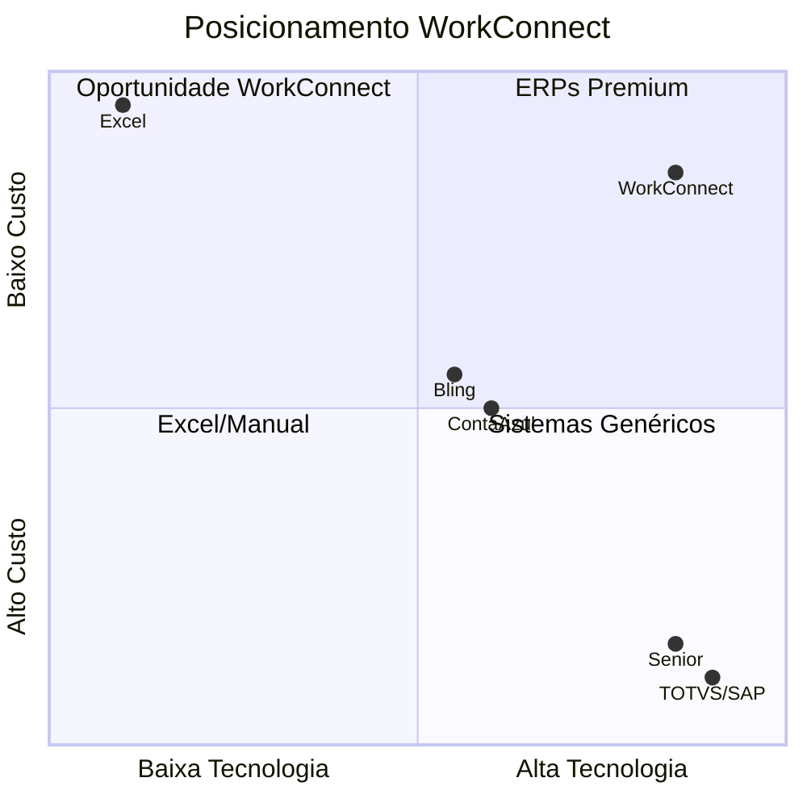

# Business Model Canvas (BM Canvas)

> **TL;DR** · WorkConnect é uma **SaaS B2B** que reduz em 40% as perdas de estoque das PMEs brasileiras. **3 planos** (R$ 149 / R$ 299 / R$ 599/mês). Mercado endereçável: **R$ 5,37 bi/ano**. LTV/CAC: **20×**. Payback: **4 meses**. Time de **2 devs full-stack SENAI**. Status: **MVP pronto, beta em curso**.

:::info Onde estamos no Sequoia Pitch
Este doc consolida o **Business Model Canvas** (Osterwalder) + serve como **one-page summary** do pitch Sequoia/Y Combinator. Os 9 blocos abaixo respondem todas as perguntas-chave que banca/investidor faz nos primeiros 5 minutos.
:::

---

## Layer 1 — Sequoia One-Page Summary (leia em 60s)

| Sequoia Slot | Resposta WorkConnect |
|--------------|----------------------|
| **Purpose** | SaaS de gestão de estoque para PMEs com governança LGPD nativa |
| **Problem** | 68% das PMEs perdem R$ 469-828K/ano por estoque desorganizado (detalhe em [PMS](./problema-mecanismo-solucao)) |
| **Solution** | Sistema especializado em estoque, 7 dias para começar, R$ 149/mês |
| **Why now** | LGPD em vigor + digitalização pós-pandemia + Bling/ContaAzul viraram "Excel bonito" |
| **Market** | SAM: 1,5M PMEs tech-enabled (R$ 5,37 bi/ano) · SOM 5 anos: R$ 269M (detalhe em [Mercado](./analise-mercado)) |
| **Competition** | Único player focado 100% em estoque de PME com preço acessível + LGPD nativo (detalhe em [Concorrência](./analise-concorrencial)) |
| **Business model** | Assinatura recorrente 3 planos, ARPU R$ 200 (ano 1) → R$ 314 (ano 5) |
| **Traction** | 10 beta testers ativos, NPS em construção (detalhe em [Viabilidade](./viabilidade-economica)) |
| **Team** | 2 devs full-stack SENAI, parceria institucional (detalhe em [PMC](./project-model-canvas)) |
| **Ask** | R$ 15K seed (já captado) → meta R$ 200K Series-Angel para escala 18 meses |

---

## Layer 2 — Sequoia Skeleton Visual (1 tela)

---

## Layer 3 — Os 9 Blocos do BMC (Deep Dive)

> *Seção clássica do Alexander Osterwalder, expandida com dados reais do mercado brasileiro e do projeto.*

### Visão Geral do Canvas

```mermaid
flowchart TB
    subgraph PARC["1. Parceiros-Chave"]
        P1[SENAI]
        P2[Netlify/Vercel]
        P3[Supabase]
    end

    subgraph ATIV["2. Atividades-Chave"]
        A1[Desenvolvimento]
        A2[Suporte]
        A3[Marketing]
    end

    subgraph REC["3. Recursos-Chave"]
        R1[Time 2 devs]
        R2[Cloud infra]
        R3[IP + base conhecimento]
    end

    subgraph PV["4. Proposta de Valor"]
        PV1[40% menos perdas<br/>ROI 150% ano 1<br/>R$ 149-599/mês]
    end

    subgraph REL["5. Relacionamento"]
        REL1[Chat 24/7]
        REL2[Onboarding]
        REL3[NPS trimestral]
    end

    subgraph CAN["6. Canais"]
        CAN1[Website]
        CAN2[Google Ads]
        CAN3[Indicação]
        CAN4[SENAI]
    end

    subgraph SEG["7. Segmentos"]
        SEG1[PMEs R$ 360K-4.8M]
        SEG2[Varejo]
        SEG3[Indústria leve]
    end

    subgraph CUS["8. Custos"]
        CUS1[Salários 55%]
        CUS2[Cloud 15%]
        CUS3[Marketing 12%]
    end

    subgraph REV["9. Receitas"]
        REV1[Básico R$ 149]
        REV2[Pro R$ 299]
        REV3[Ent R$ 599]
    end

    PARC --- ATIV
    ATIV --- REC
    REC --- PV
    PV --- REL
    REL --- CAN
    CAN --- SEG
    SEG --- REV
    REV --- CUS
    CUS --- PARC
```

### 1. Segmentos de Clientes (Quem paga)

| Segmento | Tamanho | Por que paga |
|----------|---------|--------------|
| **Pequenas Empresas** (R$ 360K-4.8M/ano) | ~2.8M | Crescer sem perder vendas por ruptura |
| **Varejo** | ~2.5M | Giro rápido + sazonalidade = precisa controle em tempo real |
| **Indústria Leve** | ~200K | Lote + rastreabilidade = precisa controle de matéria-prima |
| **Serviços** | ~1.8M | Insumos + ferramentas = precisa reposição preventiva |

Detalhe profundo em [Personas](./personas).

### 2. Proposta de Valor (Por que escolhem a gente)

> *"WorkConnect elimina perdas por falta de estoque, reduz custos operacionais em 30% e gera 150% de ROI no primeiro ano, através de uma plataforma SaaS acessível (R$ 149-599/mês) que automatiza completamente a gestão de estoque."*

**5 problemas críticos resolvidos** (detalhe em [PMS](./problema-mecanismo-solucao)):

| # | Problema | % PMEs | Solução WorkConnect | Ganho |
|---|----------|--------|---------------------|-------|
| 1 | Fragmentação | 68% | Centralização total | R$ 1.2-2.4K/mês economizados |
| 2 | Erros humanos | 55% | Automação tempo real | 99% acuracidade |
| 3 | Ruptura | 42% | Alertas proativos | R$ 360-600K/ano recuperados |
| 4 | Obsolescência | 38% | Controle de validade | R$ 40-70K liberados |
| 5 | Tempo manual | 72% | Automação processos | 15h/semana recuperadas |

### 3. Canais (Como chegam até nós)

### 4. Relacionamento (Como cuidamos)

| Canal | Tipo | Disponibilidade |
|-------|------|----------------|
| Chat/email | Suporte direto | 24/7 |
| Onboarding | Setup guiado | Primeira semana |
| Documentação | Self-service | 24/7 |
| NPS | Pesquisa | Trimestral |

### 5. Fluxos de Receita (Quanto + Como)

| Plano | Preço | Usuários | Para quem |
|-------|-------|----------|-----------|
| **Básico** | R$ 149/mês | até 3 | Microempresa começando |
| **Profissional** | R$ 299/mês | até 10 | PME com equipe |
| **Enterprise** | R$ 599/mês | ilimitados | Média empresa, multi-local |

### 6. Recursos-Chave (O que precisamos ter)

| Recurso | Tipo | Onde está |
|---------|------|-----------|
| Time de desenvolvimento | Humano | 2 devs SENAI |
| Infra cloud | Técnico | Netlify + Supabase |
| Propriedade intelectual | Intelectual | Código + algoritmos |
| Base de conhecimento | Humano | Tutoriais + casos |

### 7. Atividades-Chave (O que fazemos todo dia)

### 8. Parceiros-Chave (Quem nos ajuda)

| Parceiro | Tipo | Valor que entrega |
|----------|------|-------------------|
| **SENAI** | Institucional | Validação acadêmica + devs + credibilidade |
| **Netlify/Vercel** | Cloud | Deploy + CDN + SSL |
| **Supabase** | Banco | PostgreSQL gerenciado |
| **Next.js/React** | Framework | Stack moderno |
| **Contadores** | Canal | Indicações qualificadas |

### 9. Estrutura de Custos (Onde o dinheiro sai)

**Total mensal:** R$ 17.300 (detalhe completo em [Viabilidade](./viabilidade-economica))

---

## KPIs Principais (resumo executivo)

| Métrica | Ano 1 | Ano 3 | Ano 5 |
|---------|-------|-------|-------|
| **Clientes Ativos** | 200 | 8.000 | 75.000 |
| **MRR** | R$ 40K | R$ 2.4M | R$ 22.4M |
| **Churn Mensal** | < 8% | < 5% | < 3% |
| **CAC** | R$ 200 | R$ 150 | R$ 100 |
| **LTV** | R$ 4.000 | R$ 6.250 | R$ 10.467 |
| **LTV/CAC** | **20×** | **42×** | **105×** |

---

## Posicionamento Competitivo (resumo, detalhe em [Concorrência](./analise-concorrencial))

**Comparativo-chave:**

| Característica | WorkConnect | ERPs | Excel |
|----------------|-------------|------|-------|
| Preço | R$ 149-599/mês | R$ 5K-50K | "Grátis" |
| Implantação | 7 dias | 3-6 meses | N/A |
| Foco | Estoque | Tudo | Nada |
| ROI 1º ano | **150-1.430%** | 50-80% | Negativo |

---

## Próximo Passo na Narrativa

Você acabou de ler o **business model completo**. Aprofunde em:

| Se você quer... | Vá para |
|-----------------|---------|
| Entender a **janela de oportunidade** (LGPD + digitalização) | [Análise de Mercado →](./analise-mercado) |
| Conhecer os **3 heróis** que vão usar o produto | [Personas →](./personas) |
| Ver o **cálculo financeiro** detalhado (P&L, payback, valuation) | [Viabilidade Econômica →](./viabilidade-economica) |
| Entender o **plano de ataque** fase a fase | [Go-to-Market →](./go-to-market) |

---

## Referências

- **Business Model Generation** — Osterwalder & Pigneur
- **Strategyzer** — https://strategyzer.com/
- **Sequoia Capital pitch structure** — Y Combinator, a16z
- **SEBRAE** — Estatísticas de PMEs no Brasil
- **Projeto WorkConnect** — TCC SENAI 2025