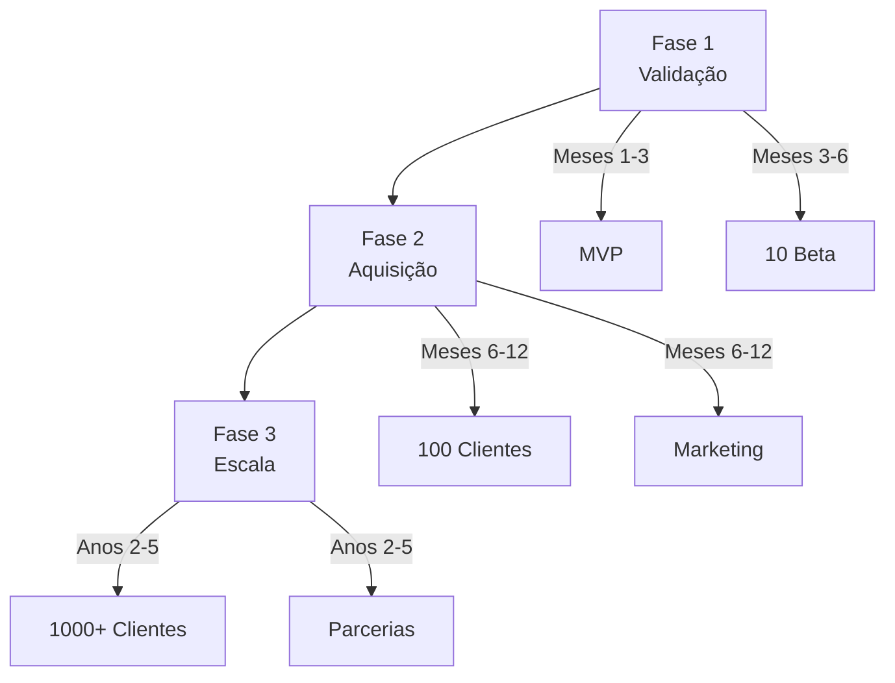
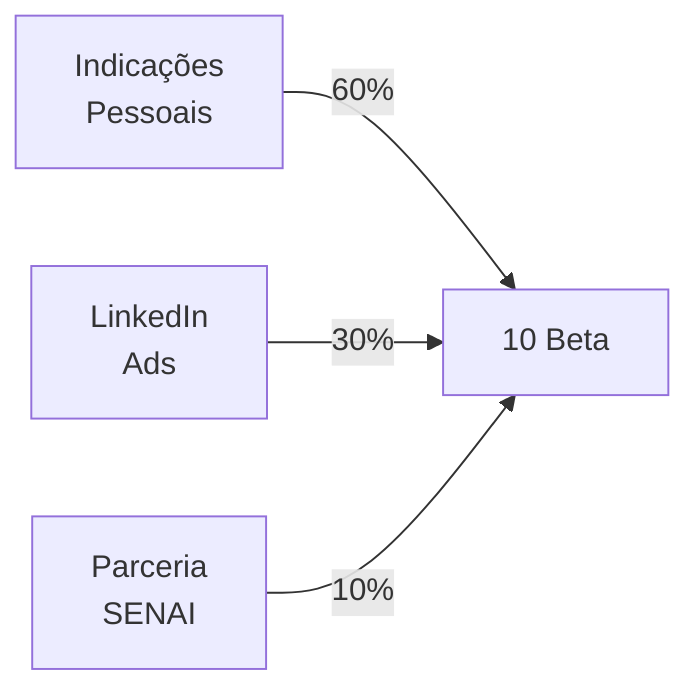
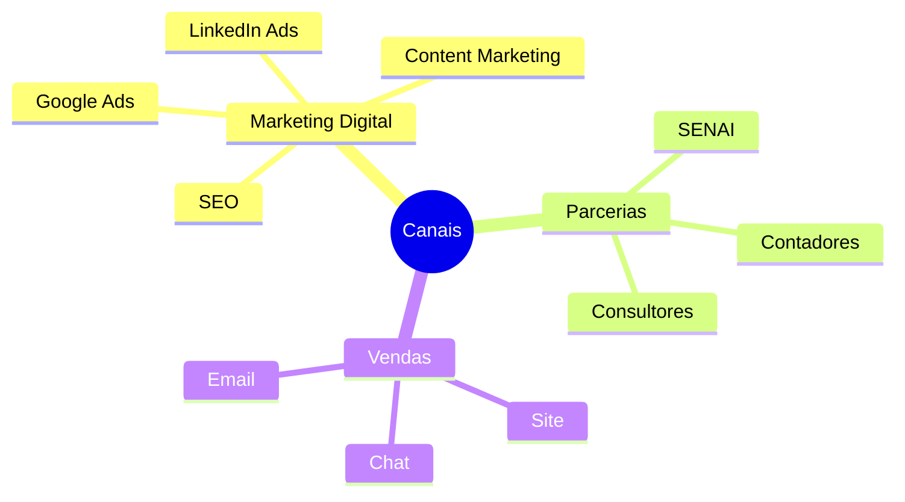
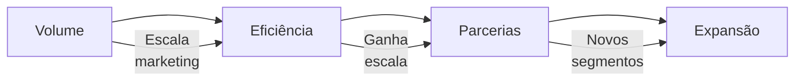
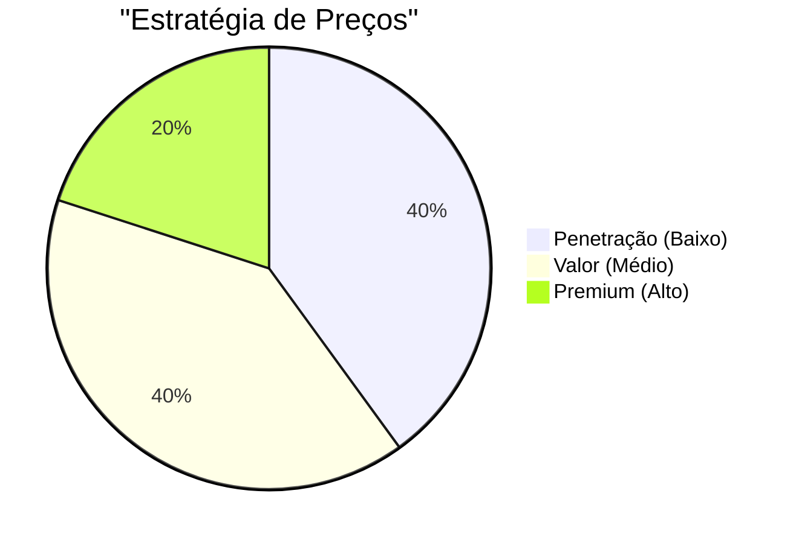
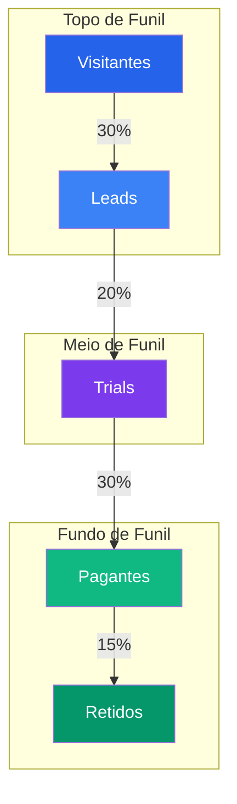
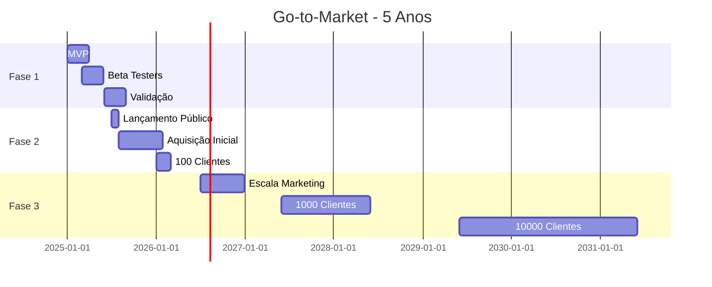

# Go-to-Market (GTM)

## Visão Geral

Esta seção apresenta a estratégia completa de Go-to-Market do WorkConnect, definindo como我们将进入市场并获取客户。

---

## Estratégia de Entrada no Mercado

### Abordagem em Fases

---

## Fase 1: Validação (Meses 1-6)

### Objetivos

| Meta | Target | Métrica |
|------|--------|---------|
| Validar produto | 10 beta testers | Feedback |
| Calibrar precificação | 3 planos | Conversão |
| Ajustar features | Priorização | Uso |

### Canais de Validação

### Táticas

| Tática | Descrição | Investimento |
|--------|-----------|--------------|
| Beta gratuito | 10 empresas selecionadas | Tempo |
| Pesquisa contínua | Entrevistas quinzenais | Tempo |
| Ajuste de preço | Testes A/B | Zero |

---

## Fase 2: Aquisição (Meses 6-12)

### Objetivos

| Meta | Target | Métrica |
|------|--------|---------|
| Clientes pagos | 100 | MRR |
| CAC | R$ 200 | Custo aquisição |
| Conversão trial | > 25% | Taxa |

### Canais de Aquisição

### Investimento em Marketing

| Canal | % Budget | Valor Mensal |
|-------|----------|--------------|
| Google Ads | 40% | R$ 4.000 |
| LinkedIn | 25% | R$ 2.500 |
| Content | 20% | R$ 2.000 |
| SEO | 15% | R$ 1.500 |
| **Total** | 100% | **R$ 10.000** |

---

## Fase 3: Escala (Anos 2-5)

### Objetivos

| Meta | Ano 2 | Ano 3 | Ano 5 |
|------|-------|-------|-------|
| Clientes | 2.500 | 8.000 | 75.000 |
| MRR | R$ 750K | R$ 2.4M | R$ 22M |
| CAC | R$ 150 | R$ 120 | R$ 100 |

### Estratégia de Escala

---

## Precificação

### Estratégia de Preços

### Planos

| Plano | Preço | Usuários | Ideal para |
|-------|-------|----------|------------|
| **Básico** | R$ 149/mês | até 3 | Micro empresas |
| **Profissional** | R$ 299/mês | até 10 | Pequenas |
| **Enterprise** | R$ 599/mês | ilimitados | Médias |

### Evolução de Preços

| Ano | Ajuste | Justificativa |
|-----|--------|---------------|
| 1 | Base | Validar mercado |
| 2 | +10% | Demanda aumenta |
| 3 | +15% | Valor comprovado |
| 5 | +20% | Líder mercado |

---

## Funil de Vendas

### Funil Detalhado

### Conversão

| Etapa | Conversão | Tempo |
|-------|-----------|-------|
| Visitante → Lead | 30% | Instantâneo |
| Lead → Trial | 20% | 7 dias |
| Trial → Pago | 30% | 14 dias |
| Retido | 85% | Mensal |

---

## Operações

### Estrutura de Time

| Função | Fase 1 | Fase 2 | Fase 3 |
|--------|--------|--------|--------|
| Desenvolvedor | 2 | 3 | 5 |
| Marketing | 0 | 1 | 3 |
| Vendas | 0 | 1 | 2 |
| Suporte | 0 | 1 | 2 |

### Ferramentas

| Função | Ferramenta |
|--------|------------|
| CRM | HubSpot Free |
| Email | Mailchimp |
| Analytics | GA4 |
| Ads | Google/LinkedIn |
| Suporte | Chat |

---

## Métricas e KPIs

### KPIs Principais

| KPI | Fórmula | Target Ano 1 |
|-----|---------|--------------|
| **CAC** | Marketing + Vendas / Clientes | R$ 200 |
| **LTV** | Ticket × 1/Churn | R$ 3.000 |
| **LTV/CAC** | LTV / CAC | 15x |
| **MRR** | Clientes × Ticket | R$ 150K |
| **Churn** | Cancelados / Total | < 8% |
| **NPS** | Pesquisa | > 40 |

---

## Cronograma de Execução

---

## Próximos Passos

- [BM Canvas](./bmc-canvas) - Modelo de negócio
- [Análise de Mercado](./analise-mercado) - TAM/SAM/SOM
- [Personas](./personas) - Perfis detalhados

---

## Referências

- **SaaS Metrics** - David Skok
- **Traction** - Gabriel Weinberg
- **Play Bigger** - Al Ramadan
- **WorkConnect** - Estratégia interna
