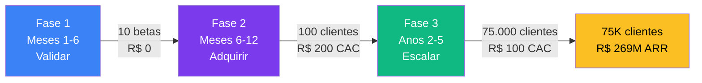
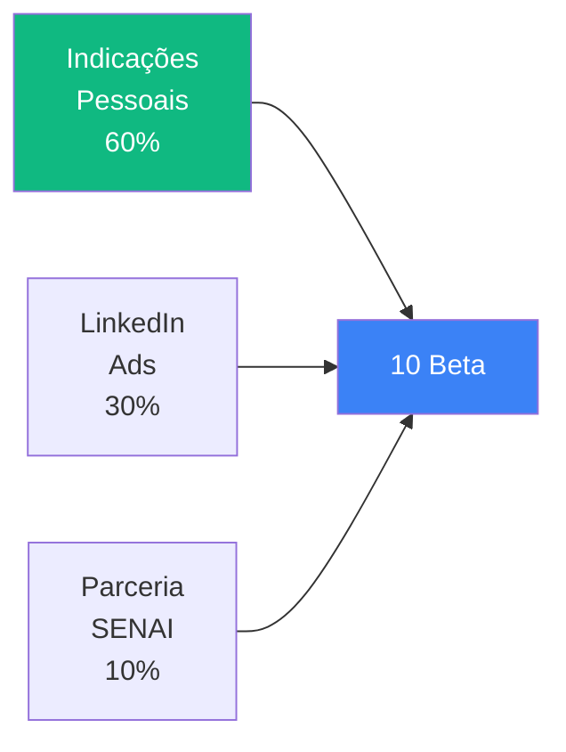
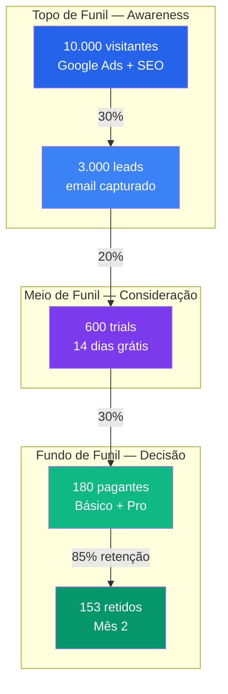
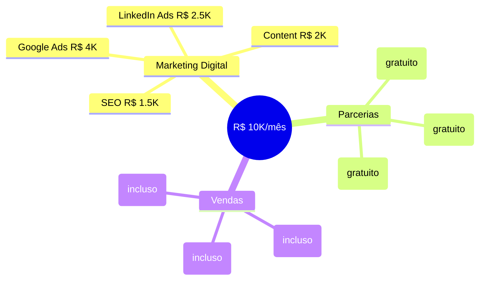
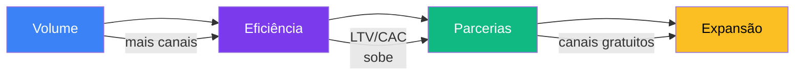
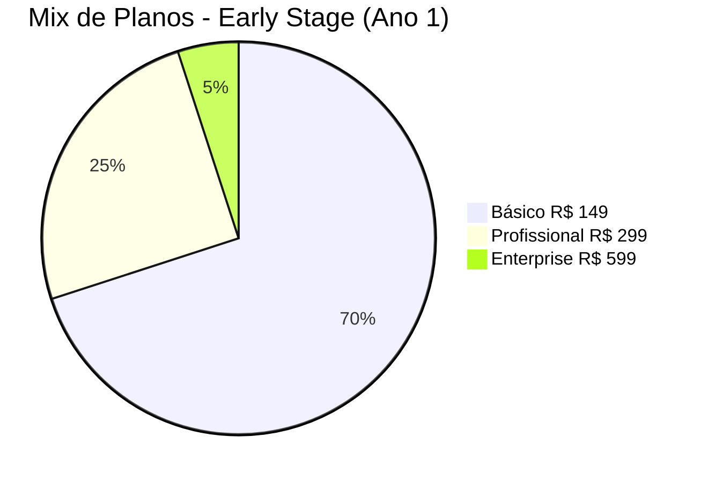
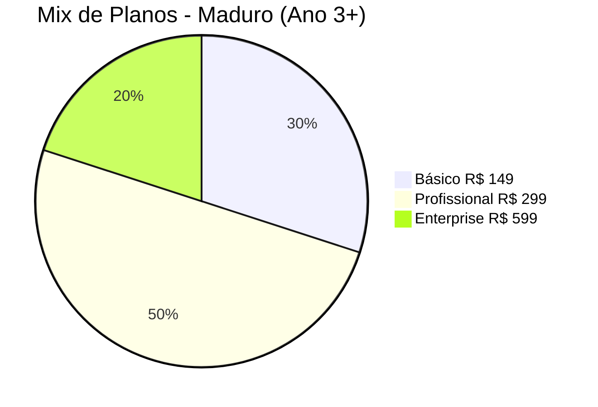
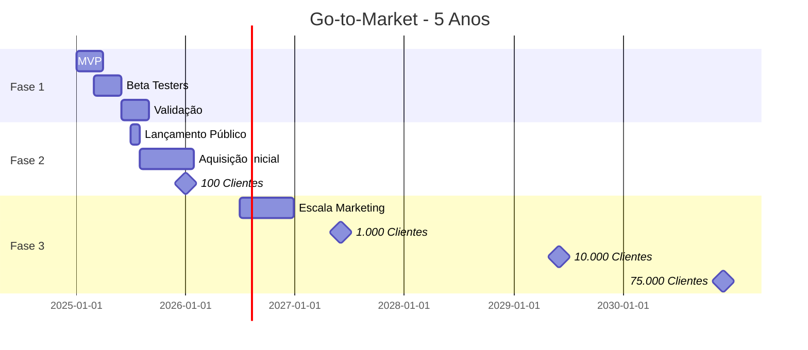
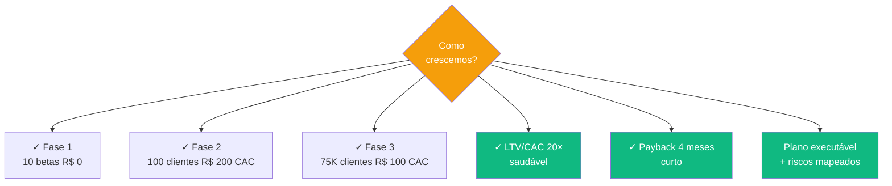

# Go-to-Market (GTM)

> **TL;DR** · **3 fases, 5 anos, R$ 269M/ano de receita.** Fase 1 (M1-6): validar com 10 betas. Fase 2 (M6-12): adquirir 100 clientes via Google Ads + LinkedIn + contadores. Fase 3 (A2-5): escalar para 75.000 via canais + parcerias. **CAC R$ 200, LTV R$ 4.000, payback 4 meses.**

:::info Onde estamos no Sequoia Pitch
Este doc responde o slot **Traction + Plan** da Sequoia pitch structure. É o **"como capturamos o mercado"** — Sequoia pergunta: *"qual é seu plano concreto para chegar aos primeiros 100 clientes?"*
:::

---

## Layer 1 — O Plano em 60 Segundos

---

## Layer 2 — StoryBrand Call-to-Action (Por Persona)

StoryBrand separa **CTA direto** (alta conversão) de **CTA transicional** (baixo risco). WorkConnect usa os dois para cada persona:

| Persona | CTA Transicional (Topo de Funil) | CTA Direto (Fundo de Funil) |
|---------|----------------------------------|----------------------------|
| **João** (dono PME) | "Veja o vídeo de 2 min mostrando como reduzir ruptura em 91%" | "Comece teste grátis de 14 dias — sem cartão" |
| **Maria** (gerente) | "Baixe o checklist de 5 sintomas de estoque desorganizado" | "Agende demo de 15 min com nosso time" |
| **Carlos** (contador) | "Veja como o programa de parceiros funciona" | "Cadastre-se como parceiro — 30% comissão" |

---

## Layer 3 — Fase 1: Validação (Meses 1-6)

### Objetivos

| Meta | Target | Métrica |
|------|--------|---------|
| Validar produto | 10 beta testers | Feedback qualitativo |
| Calibrar precificação | 3 planos | Conversão trial→pago |
| Ajustar features | Priorização P0/P1 | Uso por feature |

### Canais de Validação (Zero custo)

### Táticas-Chave

| Tática | Descrição | Investimento |
|--------|-----------|--------------|
| **Beta gratuito** | 10 empresas selecionadas a dedo | Tempo |
| **Entrevistas quinzenais** | 30 min com cada beta | Tempo |
| **NPS + CSAT semanal** | Medir satisfação continuamente | Tempo |
| **Teste de preço A/B** | 3 níveis de preço diferentes | Zero |

---

## Layer 4 — Fase 2: Aquisição (Meses 6-12)

### Objetivos

| Meta | Target | Métrica |
|------|--------|---------|
| **Clientes pagos** | 100 (até M12) | MRR |
| **CAC** | R$ 200 | Custo / cliente |
| **Conversão trial** | > 25% | Taxa |
| **Churn mensal** | < 5% | Retenção |

### Funil de Aquisição (TOFU → MOFU → BOFU)

### Canais de Aquisição (Mix Mensal R$ 10K)

### Investimento Detalhado em Marketing

| Canal | % Budget | Valor Mensal | CAC Esperado |
|-------|----------|--------------|--------------|
| **Google Ads** | 40% | R$ 4.000 | R$ 200 |
| **LinkedIn Ads** | 25% | R$ 2.500 | R$ 250 |
| **Content Marketing** | 20% | R$ 2.000 | R$ 62 |
| **SEO + Orgânico** | 15% | R$ 1.500 | R$ 62 |
| **Total** | 100% | **R$ 10.000** | **R$ 163 (média)** |

---

## Layer 5 — Fase 3: Escala (Anos 2-5)

### Crescimento Ano a Ano

| Métrica | Ano 1 | Ano 2 | Ano 3 | Ano 5 |
|---------|:-----:|:-----:|:-----:|:-----:|
| **Clientes** | 100 | 2.500 | 8.000 | 75.000 |
| **MRR** | R$ 20K | R$ 600K | R$ 2.0M | R$ 22.4M |
| **CAC** | R$ 200 | R$ 150 | R$ 120 | R$ 100 |
| **Time total** | 3 | 8 | 18 | 45 |

### Estratégia de Escala (4 Movimentos)

### 4 Movimentos-Chave da Escala

| Movimento | Quando | Como |
|-----------|--------|------|
| **Volume** | Ano 2 | Escalar Google Ads + abrir canal de conteúdo |
| **Eficiência** | Ano 3 | Reduzir CAC de R$ 200 para R$ 120 com SEO + indicação |
| **Parcerias** | Ano 3-4 | Programa de contadores (Carlos) gera 30% dos leads |
| **Expansão** | Ano 4-5 | Novos segmentos (indústria, serviços) + novos planos |

---

## Layer 6 — Estratégia de Preços

### Mix de Planos Projetado

### Tabela de Planos

| Plano | Preço | Usuários | Ideal Para | % Mix (Mês 12) |
|-------|-------|----------|------------|:--------------:|
| **Básico** | R$ 149/mês | até 3 | Micro empresa | 70% |
| **Profissional** | R$ 299/mês | até 10 | PME com equipe | 25% |
| **Enterprise** | R$ 599/mês | ilimitados | Média multi-local | 5% |

### Evolução de Preços ao Longo do Tempo

| Ano | Ajuste | Justificativa |
|-----|--------|---------------|
| 1 | Preço base | Validar willingness to pay |
| 2 | +10% | Demanda validada |
| 3 | +15% | Valor comprovado pelos cases |
| 5 | +20% | Líder de mercado estabelecido |

---

## Layer 7 — Estrutura do Time

### Headcount por Fase

| Função | Fase 1 | Fase 2 | Fase 3 (Ano 3) |
|--------|:------:|:------:|:--------------:|
| **Desenvolvedor** | 2 | 3 | 5 |
| **Marketing** | 0 | 1 | 3 |
| **Vendas** | 0 | 1 | 2 |
| **Suporte** | 0 | 1 | 2 |
| **TOTAL** | 2 | 6 | 12 |

> Ver cronograma completo de execução e marcos em [Project Model Canvas →](./project-model-canvas).

---

## Layer 8 — KPIs Norte (Métricas de Sucesso)

| KPI | Fórmula | Target Ano 1 | Benchmark SaaS |
|-----|---------|:------------:|:--------------:|
| **CAC** | Marketing + Vendas / Clientes | R$ 200 | R$ 200-400 |
| **LTV** | ARPU × 1/Churn mensal | R$ 4.000 | R$ 3.000-6.000 |
| **LTV/CAC** | LTV / CAC | **20×** | >3× |
| **MRR Mês 12** | Clientes × Ticket | R$ 20K | R$ 15-50K |
| **Churn mensal** | Cancelados / Total | < 5% | < 5% |
| **NPS** | Pesquisa | > 50 | > 40 |
| **Conversão trial** | Trials → Pagos | > 25% | > 20% |

---

## Layer 9 — Cronograma Visual

---

## Layer 10 — Riscos do Plano e Mitigações

| Risco | Probabilidade | Impacto | Mitigação |
|-------|:-------------:|:-------:|-----------|
| CAC ficar acima de R$ 300 | Média | Alto | Pivotar para canais orgânicos (SEO + indicação) |
| Churn > 8% mensal | Média | Alto | Onboarding reforçado + check-in semanal nos 90 primeiros dias |
| Concorrente entrar com preço menor | Baixa | Médio | Reforçar valor agregado (LGPD + especialização) |
| Beta travar feedback negativo | Baixa | Alto | Ajustar escopo antes do lançamento público |
| Demora no cadastro de produto | Alta | Médio | Importação via planilha + código de barras |

---

## Síntese Executiva

---

## Próximo Passo na Narrativa

| Se você quer... | Vá para |
|-----------------|---------|
| Entender **quem somos** (time, execução) | [Project Model Canvas →](./project-model-canvas) |
| Ver a **viabilidade financeira** do plano | [Viabilidade Econômica →](./viabilidade-economica) |
| Conhecer **a estratégia de produto** (o que construímos) | [PM Canvas →](./pm-canvas) |
| Voltar à **narrativa central** do pitch | [Problema → Mecanismo → Solução →](./problema-mecanismo-solucao) |

---

## Referências

- **SaaS Metrics 2.0** — David Skok (Matrix Partners)
- **Traction** — Gabriel Weinberg (19 canais testáveis)
- **Play Bigger** — Al Ramadan (categoria novos)
- **Building a StoryBrand** — Donald Miller (CTA framework)
- **WorkConnect** — Estratégia interna (2025)