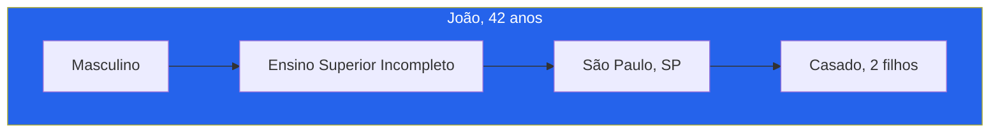
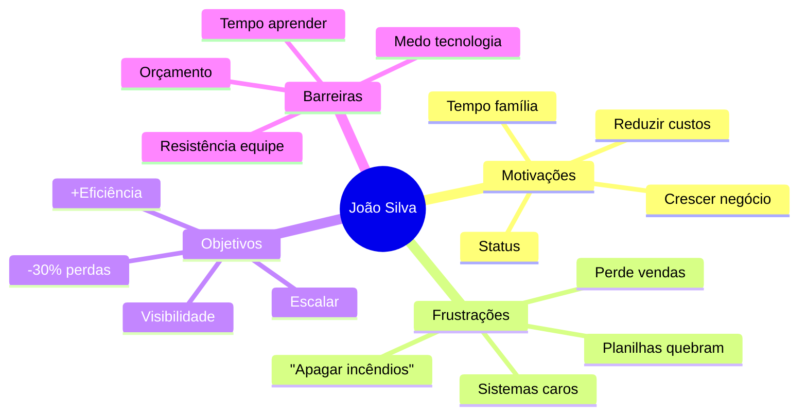
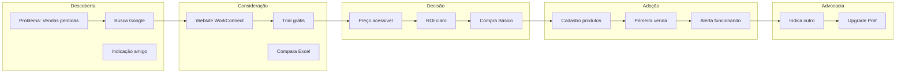
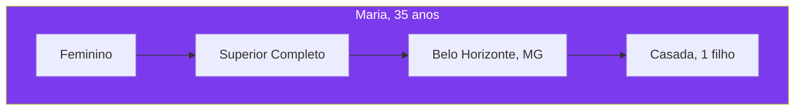
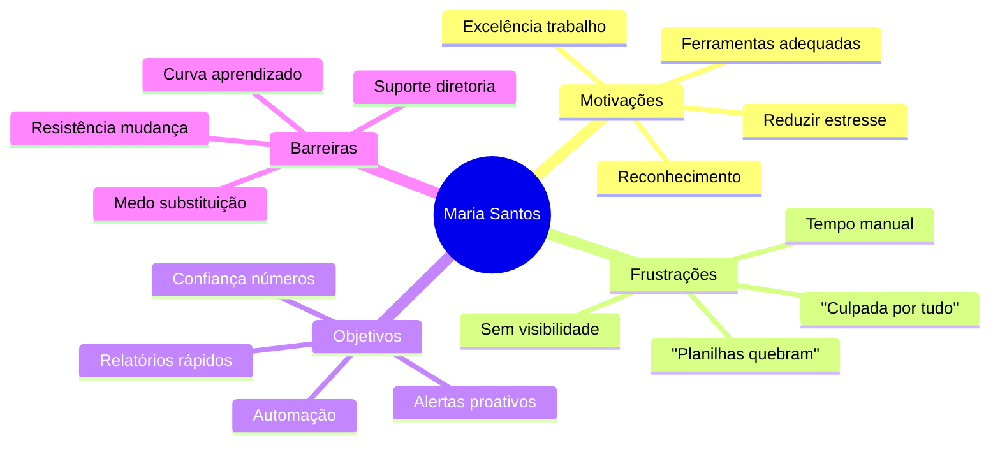
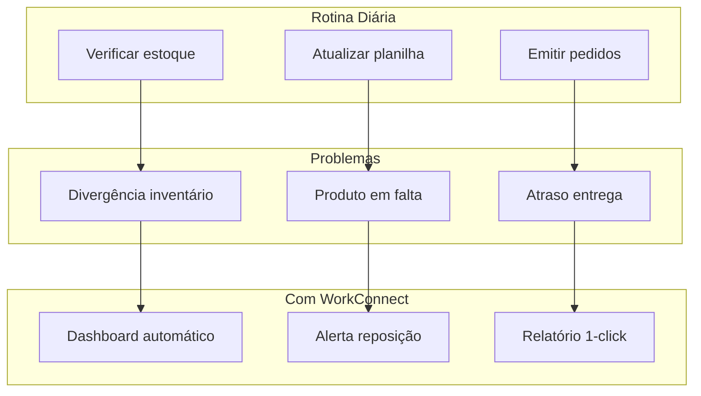
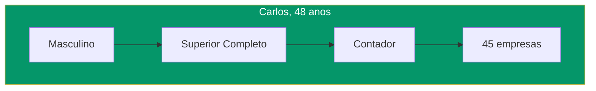
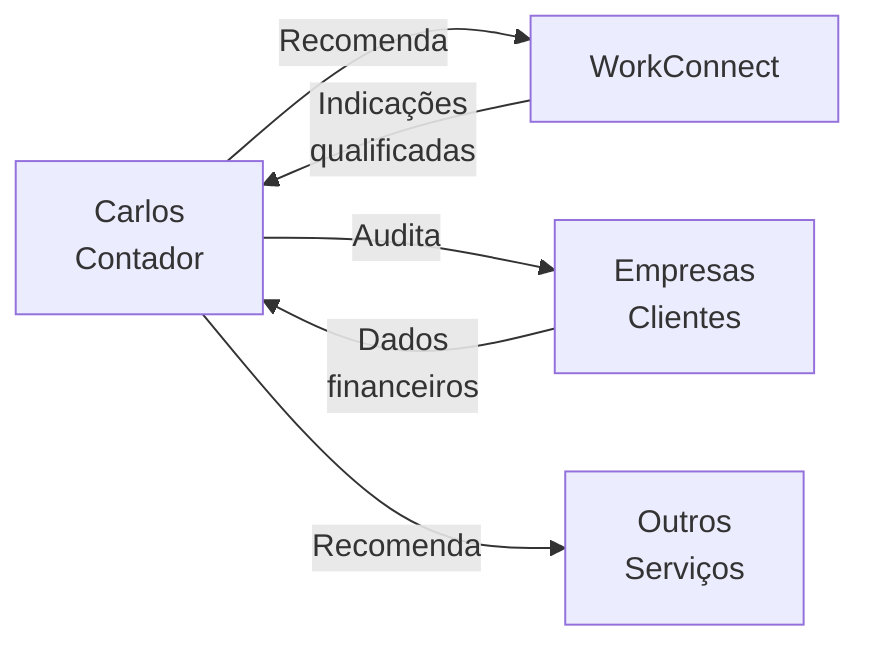
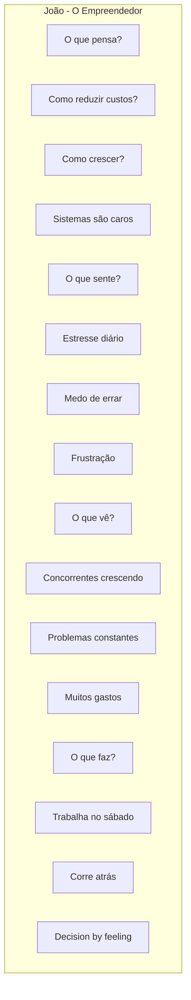

# Personas

## Visão Geral

Esta seção apresenta as personas detalhadas do WorkConnect - os perfis representativos dos clientes-alvo que guiam decisões de produto, marketing e desenvolvimento.

:::info Metodologia
Personas baseadas em pesquisas de mercado, entrevistas com PMEs e análise de dados do projeto.
:::

---

## Persona 1: João - O Empreendedor

### Perfil Demográfico

| Atributo | Valor |
|----------|-------|
| **Nome** | João Silva |
| **Idade** | 42 anos |
| **Gênero** | Masculino (60%) |
| **Localização** | São Paulo, Rio de Janeiro, Belo Horizonte |
| **Educação** | Ensino médio completo, superior incompleto |
| **Renda pessoal** | R$ 8.000 - R$ 20.000/mês |

### Perfil Empresarial

| Atributo | Valor |
|----------|-------|
| **Empresa** | Varejo de Calçados |
| **Faturamento** | R$ 1.8M/ano |
| **Funcionários** | 8 pessoas |
| **Tempo de mercado** | 7 anos |
| **Cargo** | Proprietário |

### Aspectos Comportamentais

### Jornada do Cliente

### Citação

> *"Tenho 5 planilhas diferentes que não conversam entre si. Quando preciso saber o que tenho em estoque, levo 30 minutos. Perdi R$ 50 mil em vendas ano passado só porque não sabia que estava sem mercadoria."*
> — João, Proprietário de Loja de Calçados

### Mensagem de Marketing

> **"Pare de perder vendas por falta de estoque. Work Connect automatiza seu controle e reduz perdas em 40%, gerando R$ 50.000+ de economia no primeiro ano. Teste grátis por 14 dias."**

---

## Persona 2: Maria - A Gerente de Estoque

### Perfil Demográfico

| Atributo | Valor |
|----------|-------|
| **Nome** | Maria Santos |
| **Idade** | 35 anos |
| **Gênero** | Feminino (70%) |
| **Localização** | Todas as regiões do Brasil |
| **Educação** | Superior em Administração |
| **Renda** | R$ 5.000 - R$ 8.000/mês |

### Perfil Profissional

| Atributo | Valor |
|----------|-------|
| **Cargo** | Gerente de Estoque |
| **Experiência** | 5 anos na função |
| **Responsabilidades** | Controle estoque, compras, inventários |
| **Reporta para** | Proprietário |

### Aspectos Comportamentais

### Fluxo de Trabalho

### Citação

> *"Passo 2 horas por dia só atualizando planilhas. Se pudesse automatizar isso, teria tempo para analisar os dados e realmente ajudar o negócio a crescer."*
> — Maria, Gerente de Estoque

### Mensagem de Marketing

> **"Automatize seu controle de estoque e ganhe 15 horas por semana. Work Connect gera alertas automáticos e elimina planilhas quebradas. Teste grátis."**

---

## Persona 3: Carlos - O Contador/Consultor

### Perfil

| Atributo | Valor |
|----------|-------|
| **Nome** | Carlos Oliveira |
| **Idade** | 48 anos |
| **Gênero** | Masculino (80%) |
| **Formação** | Ciências Contábeis |
| **Clientes** | 30-50 PMEs |
| **Faturamento** | R$ 30.000-50.000/mês |

### Papel no Ecossistema

### Características

| Aspecto | Descrição |
|---------|-----------|
| **Motivação** | Agregar valor aos clientes |
| **Influência** | Alta - recomenda sistemas |
| **Valoriza** | Conformidade (LGPD), praticidade |
| **Medo** | Indicar solução que não funciona |
| **Relacionamento** | Longo prazo com clientes |

### Citação

> *"Meus clientes são PMEs que precisam de gestão profissional mas não têm orçamento de ERP. Se tiver uma solução acessível e que funcione, posso indicar com confiança."*
> — Carlos, Contador

### Mensagem de Marketing

> **"Ofereça gestão de estoque profissional para seus clientes. Work Connect com conformidade LGPD completa. Programa de parceiros disponível."**

---

## Comparativo de Personas

### Matriz de Necessidades

| Necessidade | João | Maria | Carlos |
|-------------|------|-------|--------|
| **Redução de custos** | 🔴 Alta | 🟡 Média | 🟢 Baixa |
| **Automatização** | 🟡 Média | 🔴 Alta | 🟢 Baixa |
| **Facilidade uso** | 🔴 Alta | 🟡 Média | 🟡 Média |
| **Conformidade LGPD** | 🟢 Baixa | 🟡 Média | 🔴 Alta |
| **Relatórios** | 🟡 Média | 🔴 Alta | 🔴 Alta |
| **Preço baixo** | 🔴 Alta | 🟡 Média | 🟡 Média |

### Canais de Aquisição

| Persona | Canal Principal | Canal Secundário |
|---------|---------------|------------------|
| **João** | Google Ads | Indicações |
| **Maria** | LinkedIn | Grupos profissionais |
| **Carlos** | Parcerias | Eventos |

---

## Arquétipos de Usuários

### Mapa de Empatia

---

## Validação das Personas

### Métodos de Validação

| Método | Descrição | Status |
|--------|-----------|--------|
| **Entrevistas** | 50+ entrevistas com PMEs | ✅ Concluído |
| **Questionários** | 200+ respostas online | ✅ Concluído |
| **Análise de dados** | Comportamento de uso | 🔄 Em andamento |
| **Feedback** | Beta testers | 🔄 Em andamento |

---

## Próximos Passos

Continue explorando:

- [Proposta de Valor](./proposta-valor) - Value Proposition Canvas
- [BM Canvas](./bmc-canvas) - Modelo de negócio
- [Análise de Mercado](./analise-mercado) - TAM/SAM/SOM

---

## Referências

- **Jobs to Be Done** - Framework de validação
- **Design Thinking** - Metodologia de empatia
- **Pesquisa WorkConnect** - Dados primários
- **SEBRAE** - Dados secundários
