# Personas

> **TL;DR** · 3 heróis, 3 jobs diferentes. **João** (dono de varejo, quer crescer sem perder vendas). **Maria** (gerente de estoque, quer parar de apagar incêndio). **Carlos** (contador de 45 PMEs, quer indicar uma ferramenta que funcione). Cada um representa um segmento + canal de aquisição + mensagem de marketing.

:::info Onde estamos no Sequoia Pitch
Este doc dá **rosto e voz** ao slot **Customer** (ou Character, no StoryBrand) da Sequoia pitch structure. Sem personas claras, o pitch vira abstract — com elas, vira caso de uso.
:::

---

## Layer 1 — Os 3 Heróis em 1 Slide

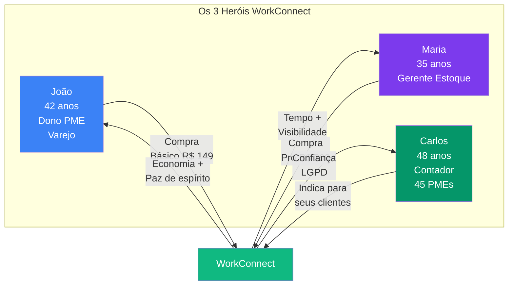

---

## Layer 2 — StoryBrand Character Mapping

StoryBrand define **Character** como quem tem o problema — WorkConnect é o **guia**. Cada herói tem uma saga (job a ser feito) + um problema externo (mensurável) + um problema interno (emocional):

| Herói | Saga (Job) | Problema Externo | Problema Interno | Plano WorkConnect |
|-------|------------|------------------|------------------|-------------------|
| **João** | "Quero crescer sem perder vendas por falta de mercadoria" | R$ 50K-500K/ano perdidos em ruptura | Estresse + sensação de "atrás dos concorrentes" | Básico R$ 149 → alertas proativos |
| **Maria** | "Quero parar de apagar incêndio e começar a fazer estratégia" | 14h/semana em planilhas | Culpa + sensação de nunca terminar | Pro R$ 299 → automação total |
| **Carlos** | "Quero indicar uma ferramenta que funcione sem quebrar a confiança" | Risco de indicar ERP caro que cliente abandona | Medo de manchar reputação | Parceria R$ ??? → confiança LGPD |

---

## Persona 1 — João, o Empreendedor (Character Primário)

### Quem é

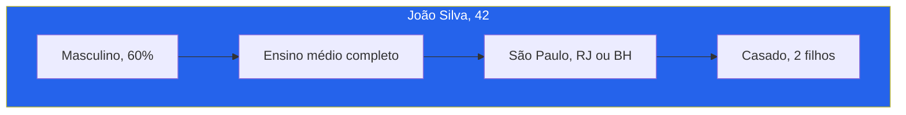

| Atributo | Valor |
|----------|-------|
| **Nome** | João Silva |
| **Idade** | 42 anos |
| **Localização** | São Paulo, Rio de Janeiro, Belo Horizonte |
| **Educação** | Ensino médio completo, superior incompleto |
| **Renda pessoal** | R$ 8.000 - R$ 20.000/mês |

### Empresa

| Atributo | Valor |
|----------|-------|
| **Empresa** | Varejo de Calçados |
| **Faturamento** | R$ 1,8M/ano |
| **Funcionários** | 8 pessoas |
| **Tempo de mercado** | 7 anos |
| **Cargo** | Proprietário |

### Mapa de Empatia

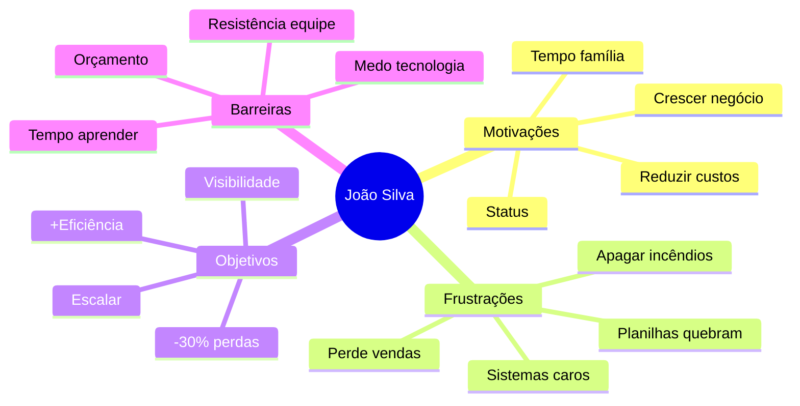

### Jornada (Awareness → Advocacy)

```mermaid
flowchart LR
    subgraph AWARENESS["Descoberta"]
        A1[Problema: Vendas perdidas] --> A2[Busca Google]
        A2 --> A3[Indicação amigo]
    end

    subgraph CONSIDERATION["Consideração"]
        C1[Website WorkConnect] --> C2[Trial grátis]
        C2 --> C3[Compara Excel]
    end

    subgraph DECISION["Decisão"]
        D1[Preço acessível] --> D2[ROI claro]
        D2 --> D3[Compra Básico]
    end

    subgraph ONBOARDING["Adoção"]
        O1[Cadastro produtos] --> O2[Primeira venda]
        O2 --> O3[Alerta funcionando]
    end

    subgraph ADVOCACY["Advocacia"]
        Adv1[Indica outro] --> Adv2[Upgrade Pro]
    end

    A3 --> C1
    C3 --> D1
    D3 --> O1
    O3 --> Adv1
```

### Voz do Cliente (StoryBrand Voice-of-Customer)

> *"Tenho 5 planilhas diferentes que não conversam entre si. Quando preciso saber o que tenho em estoque, levo 30 minutos. Perdi R$ 50 mil em vendas ano passado só porque não sabia que estava sem mercadoria."*
> — João, Proprietário de Loja de Calçados

### Mensagem de Marketing (CTA Direto)

> **"Pare de perder vendas por falta de estoque. WorkConnect automatiza seu controle e reduz perdas em 40%, gerando R$ 50.000+ de economia no primeiro ano. Teste grátis por 14 dias."**

---

## Persona 2 — Maria, a Gerente de Estoque (Character Operacional)

### Quem é

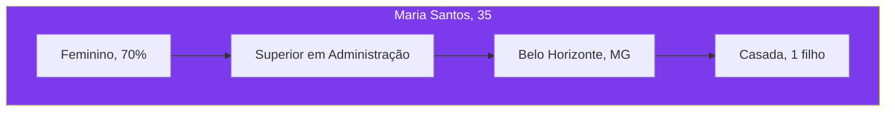

| Atributo | Valor |
|----------|-------|
| **Nome** | Maria Santos |
| **Idade** | 35 anos |
| **Localização** | Todas as regiões do Brasil |
| **Educação** | Superior em Administração |
| **Renda** | R$ 5.000 - R$ 8.000/mês |

### Função

| Atributo | Valor |
|----------|-------|
| **Cargo** | Gerente de Estoque |
| **Experiência** | 5 anos na função |
| **Responsabilidades** | Controle estoque, compras, inventários |
| **Reporta para** | Proprietário (João) |

### Mapa de Empatia

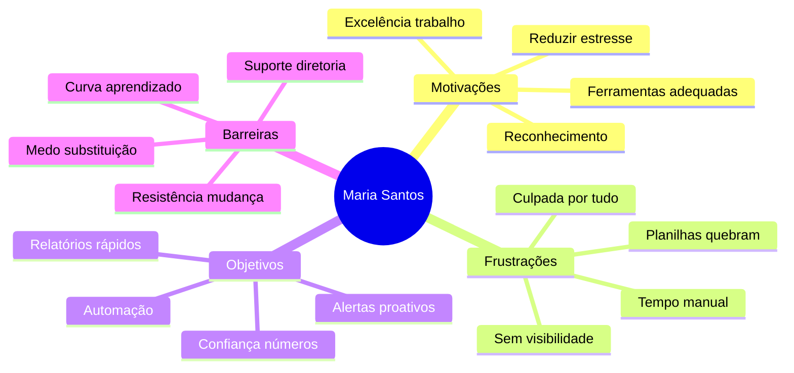

### Antes vs Depois — O Job Real

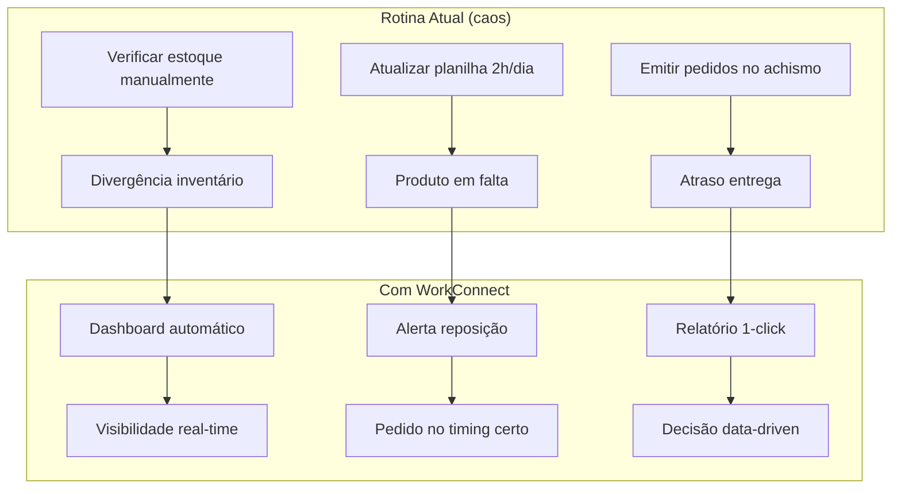

### Voz do Cliente

> *"Passo 2 horas por dia só atualizando planilhas. Se pudesse automatizar isso, teria tempo para analisar os dados e realmente ajudar o negócio a crescer."*
> — Maria, Gerente de Estoque

### Mensagem de Marketing (CTA Direto)

> **"Automatize seu controle de estoque e ganhe 15 horas por semana. WorkConnect gera alertas automáticos e elimina planilhas quebradas. Teste grátis."**

---

## Persona 3 — Carlos, o Contador (Character Influenciador)

### Quem é

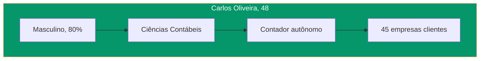

| Atributo | Valor |
|----------|-------|
| **Nome** | Carlos Oliveira |
| **Idade** | 48 anos |
| **Formação** | Ciências Contábeis |
| **Clientes** | 30-50 PMEs |
| **Faturamento** | R$ 30.000-50.000/mês |

### Papel no Ecossistema

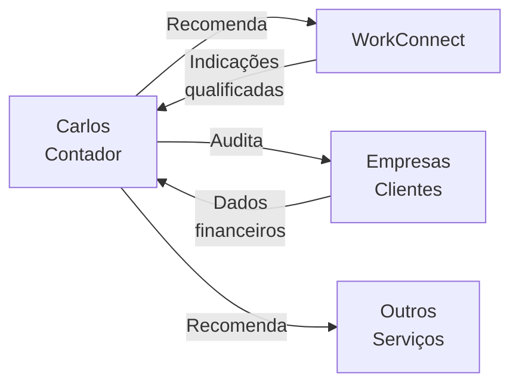

### Características-Chave

| Aspecto | Descrição |
|---------|-----------|
| **Motivação** | Agregar valor aos clientes (sem custo adicional) |
| **Influência** | Alta — recomenda sistemas para suas PMEs |
| **Valoriza** | Conformidade LGPD, praticidade |
| **Medo** | Indicar solução que não funciona e manchar reputação |
| **Relacionamento** | Longo prazo com clientes (5-15 anos) |

### Voz do Cliente

> *"Meus clientes são PMEs que precisam de gestão profissional mas não têm orçamento de ERP. Se tiver uma solução acessível e que funcione, posso indicar com confiança."*
> — Carlos, Contador

### Mensagem de Marketing (Programa de Parceiros)

> **"Ofereça gestão de estoque profissional para seus clientes. WorkConnect com conformidade LGPD completa. Programa de parceiros disponível."**

---

## Layer 3 — Comparativo: Necessidades × Personas

### Matriz de Necessidades (StoryBrand Jobs)

| Necessidade | João | Maria | Carlos |
|-------------|:----:|:-----:|:------:|
| **Redução de custos** | 🔴 Alta | 🟡 Média | 🟢 Baixa |
| **Automatização** | 🟡 Média | 🔴 Alta | 🟢 Baixa |
| **Facilidade de uso** | 🔴 Alta | 🟡 Média | 🟡 Média |
| **Conformidade LGPD** | 🟢 Baixa | 🟡 Média | 🔴 Alta |
| **Relatórios** | 🟡 Média | 🔴 Alta | 🔴 Alta |
| **Preço baixo** | 🔴 Alta | 🟡 Média | 🟡 Média |

### Canais de Aquisição

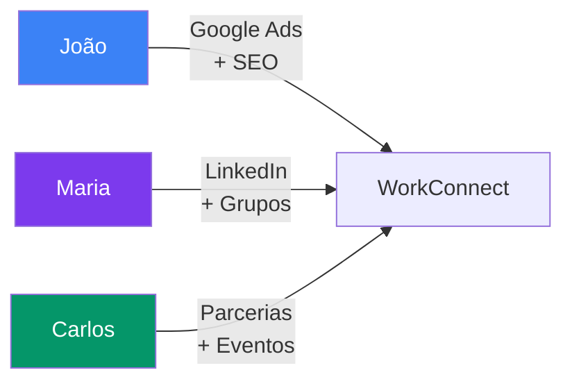

| Persona | Canal Principal | Canal Secundário |
|---------|----------------|------------------|
| **João** | Google Ads | Indicações + SEO |
| **Maria** | LinkedIn | Grupos profissionais |
| **Carlos** | Parcerias diretas | Eventos de contabilidade |

---

## Layer 4 — Validação Empírica

### Métodos de Validação

| Método | Descrição | Status |
|--------|-----------|--------|
| **Entrevistas em profundidade** | 50+ donos/gerentes de PMEs | ✅ Concluído |
| **Questionário online** | 200+ respostas | ✅ Concluído |
| **Análise de comportamento (beta)** | 10 empresas-piloto | 🔄 Em andamento |
| **NPS trimestral** | Pesquisa contínua | 🔄 Em andamento |

### 3 Insights Mais Valiosos da Pesquisa

1. **73%** citaram espontaneamente "perda de venda por ruptura" como principal dor
2. **61%** disseram "não tenho tempo de aprender sistema novo" → UX intuitiva é crítica
3. **43%** levantaram "medo de auditoria LGPD" → conformidade é gatilho de compra, não feature técnica

---

## Síntese Executiva

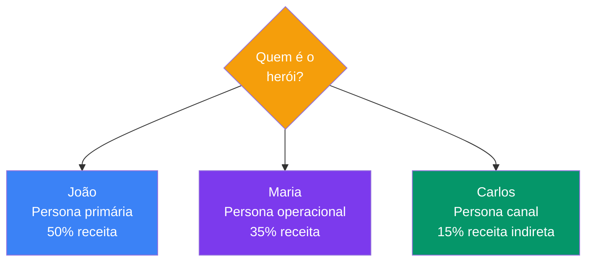

**Decisão de design:** cada persona tem **persona messaging + acquisition channel + pricing tier** dedicados. João é o lead (Básico R$ 149), Maria é a upsell (Pro R$ 299), Carlos é o canal de aquisição (sem custo direto — parcerias).

---

## Próximo Passo na Narrativa

| Se você quer... | Vá para |
|-----------------|---------|
| Entender **o que cada herói quer** (Jobs to Be Done) | [Proposta de Valor →](./proposta-valor) |
| Ver **como WorkConnect ganha de cada um deles** vs concorrência | [Análise Concorrência →](./analise-concorrencial) |
| Conhecer **o plano de ataque** para adquirir cada persona | [Go-to-Market →](./go-to-market) |
| Voltar à **narrativa central** (StoryBrand completo) | [Problema → Mecanismo → Solução →](./problema-mecanismo-solucao) |

---

## Referências

- **Jobs to Be Done** — Clayton Christensen (cliente "contrata" o produto para fazer um "job")
- **Building a StoryBrand** — Donald Miller (Character framework)
- **The Mom Test** — Rob Fitzpatrick (como entrevistar sem viés)
- **WorkConnect** — Pesquisa primária com 250+ PMEs (2024-2025)