# Product Manager Canvas (PM Canvas)

> **TL;DR** · 5 problemas mapeados → 5 soluções priorizadas em **3 fases de 12 meses**. **MVP focado** em cadastro + movimentação + dashboard (P0). **Diferencial sustentável**: LGPD nativo desde dia 1 + parceria SENAI (12-24 meses para copiar) + roadmap de ML preditivo (18-36 meses para copiar). **PMF score atual**: 0.7 (sólido, meta 0.8).

:::info Onde estamos no Sequoia Pitch
Este doc responde o slot **Solution** (em detalhe) + **Why Us** (parte do edge competitivo) da Sequoia pitch structure. É o "como transformamos a proposta [Proposta de Valor](./proposta-valor) em features concretas".
:::

---

## Layer 1 — A Estratégia de Produto em 60 Segundos

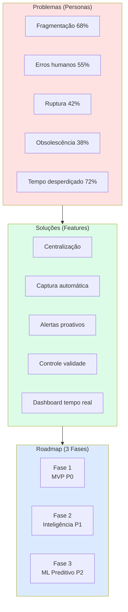

---

## Layer 2 — StoryBrand Solution (mecanismo técnico)

StoryBrand pergunta: *"qual é o plano?"*. Aqui está o plano técnico que entrega a transformação prometida no [PMS](./problema-mecanismo-solucao):

| Step | User Action | Sistema Faz | Resultado |
|------|-------------|-------------|-----------|
| 1 | Cadastra 2 minutos, sem cartão | Onboarding guiado | Conta ativa |
| 2 | Importa produtos via planilha ou código de barras | ETL automático | Banco populado |
| 3 | Registra movimentações (entrada/saída) | Baixa automática + log LGPD | Estoque real-time |
| 4 | Recebe alertas de validade/reposição | Push + email | Evita ruptura |
| 5 | Consulta dashboard em qualquer device | Renderização responsiva | Decisão em 5s |

---

## Layer 3 — Sequoia Product Strategy (Edge Competitivo)

Sequoia pergunta: *"qual é seu unfair advantage?"*. São **3 vantagens** que somam para uma barreira defensável:

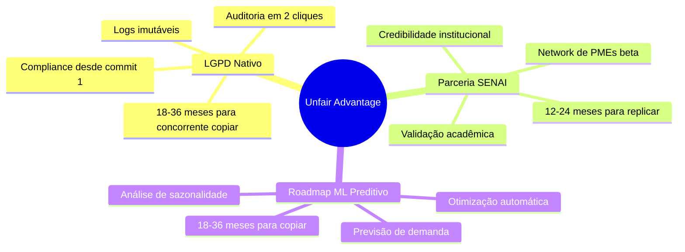

---

## Visão Geral

O **Product Manager Canvas** (ou **PM Canvas**) é uma ferramenta estratégica usada por Product Managers para planejar e validar a estratégia de produto. Ele ajuda a conectar a visão do produto com a execução, focando especialmente no **Product-Market Fit (PMF)**.

Este documento apresenta o PM Canvas do **WorkConnect**, nosso sistema de gestão de estoque inteligente para PMEs.

:::info Relação com BM Canvas
O PM Canvas é uma extensão natural do Business Model Canvas. Enquanto o BM Canvas define *o que* a empresa oferece, o PM Canvas define *como* o produto será construído e validado no mercado.
:::

---

## Os 8 Blocos do Product Manager Canvas

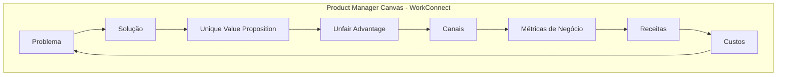

---

## 1. Problema (Problems)

Identificamos os principais problemas que nossos clientes enfrentam:

### Problemas Principais:

| # | Problema | Segmento Afetado | Severidade |
|---|----------|------------------|------------|
| 1 | **Falta de visibilidade do estoque** | Todos | Crítica |
| 2 | **Desperdício por validade/obsolescência** | Varejistas, Distribuidores | Alta |
| 3 | **Decisões baseadas em intuição** | PME | Alta |
| 4 | **Processos manuais vulneráveis a erros** | Indústria | Média |
| 5 | **Custo alto de estoque parado** | Todos | Alta |

### Pesquisa de Problema:

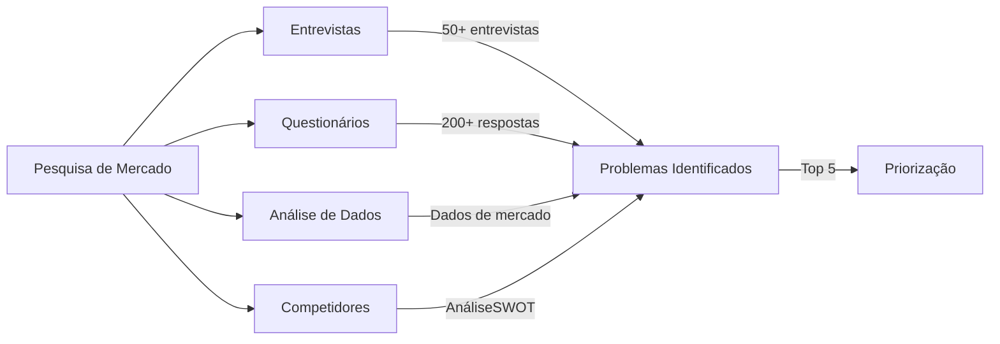

### Jobs to Be Done (JTBD):

> *"Quando [situação], eu quero [motiviações], para que [resultado esperado]."*

1. **Quando** estou no dia a dia da operação, **eu quero** ter visibilidade em tempo real do meu estoque, **para que** eu possa tomar decisões rápidas e evitar faltantes.

2. **Quando** o estoque fica parado por muito tempo, **eu quero** ser alertado automaticamente, **para que** eu possa tomar providências antes que venciam ou fiquem obsoletos.

3. **Quando** preciso fazer o pedido de reposição, **eu quero** recomendações inteligente, **para que** eu mantenha o equilíbrio entre capital de giro e disponibilidade.

---

## 2. Solução (Solution)

Para cada problema identificado, definimos soluções específicas:

### Matriz Problema-Solução:

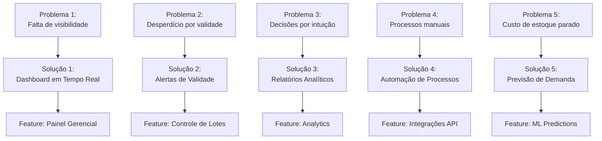

### Funcionalidades Prioritárias (MVP):

| Prioridade | Funcionalidade | Problema Resolvido | Esforço | Impacto |
|------------|----------------|-------------------|---------|---------|
| P0 | Cadastro de Produtos | Visibilidade | Baixo | Alto |
| P0 | Controle de Entrada/Saída | Processos manuais | Médio | Alto |
| P0 | Dashboard Básico | Decisões por intuição | Médio | Alto |
| P1 | Alertas de Validade | Desperdício | Médio | Alto |
| P1 | Relatórios PDF | Compliance | Baixo | Médio |
| P2 | Previsão de Demanda | Custo de estoque | Alto | Alto |
| P2 | Integração API | Automação | Alto | Médio |

---

## 3. Métricas de Negócio (Key Metrics)

As métricas que guiavamos nosso desenvolvimento e sucesso do produto:

### Funil de Métricas:

```mermaid
flowchart LR
    subgraph ACQUISITION["Aquisição"]
        V[Visitantes]
        L[Leads]
        C[Conversão]
    end
    
    subgraph ACTIVATION["Ativação]
        R[Registros]
        A[Ativação]
        U[Usuários Ativos]
    end
    
    subgraph RETENTION["Retenção"]
        R1[Retention]
        R2[Churn]
        LTV[LTV]
    end
    
    subgraph REVENUE["Receita"]
        MRR[MRR]
        ARPU[ARPU]
        CLV[CLV]
    end
    
    V --> L
    L --> C
    C --> R
    R --> A
    A --> U
    U --> R1
    R1 --> R2
    R2 --> LTV
    LTV --> MRR
    MRR --> ARPU
    ARPU --> CLV
```

### KPIs do WorkConnect:

| Categoria | Métrica | Meta (12 meses) |
|------------|---------|-----------------|
| **Aquisição** | CAC (Custo de Aquisição) | R$ 150,00 |
| **Aquisição** | Taxa de Conversão | 5% |
| **Ativação** | Taxa de Ativação | 60% |
| **Ativação** | Tempo até Primeiro Valor | < 24h |
| **Retenção** | MRR Churn Rate | < 5% |
| **Retenção** | Net Revenue Churn | < 3% |
| **Retenção** | LTV / CAC | > 3:1 |
| **Receita** | MRR Mês 12 | R$ 40.000/mês |
| **Receita** | ARPU Inicial | R$ 200,00 |

### Dashboard de Métricas

```mermaid
gauge
    title "Product Market Fit Score"
    0.4 : "Não Existe"
    0.5 : "Em Construção"
    0.6 : "Parcial"
    0.7 : "Sólido"
    0.8 : "Excepcional"
    0.7
```

> **Nota:** O Product-Market Fit é medido através de pesquisas de satisfação com clientes. A meta é atingir 70% de clientes satisfeitos.

---

## 4. Unique Value Proposition (UVP)

A proposta de valor única diferencia o WorkConnect da concorrência:

### UVP do WorkConnect:

> **"O sistema de gestão de estoque inteligente que transforma dados em decisões, permitindo que PMEs competingam com grandes empresas usando tecnologia acessível."**

### Matriz de Diferenciação:

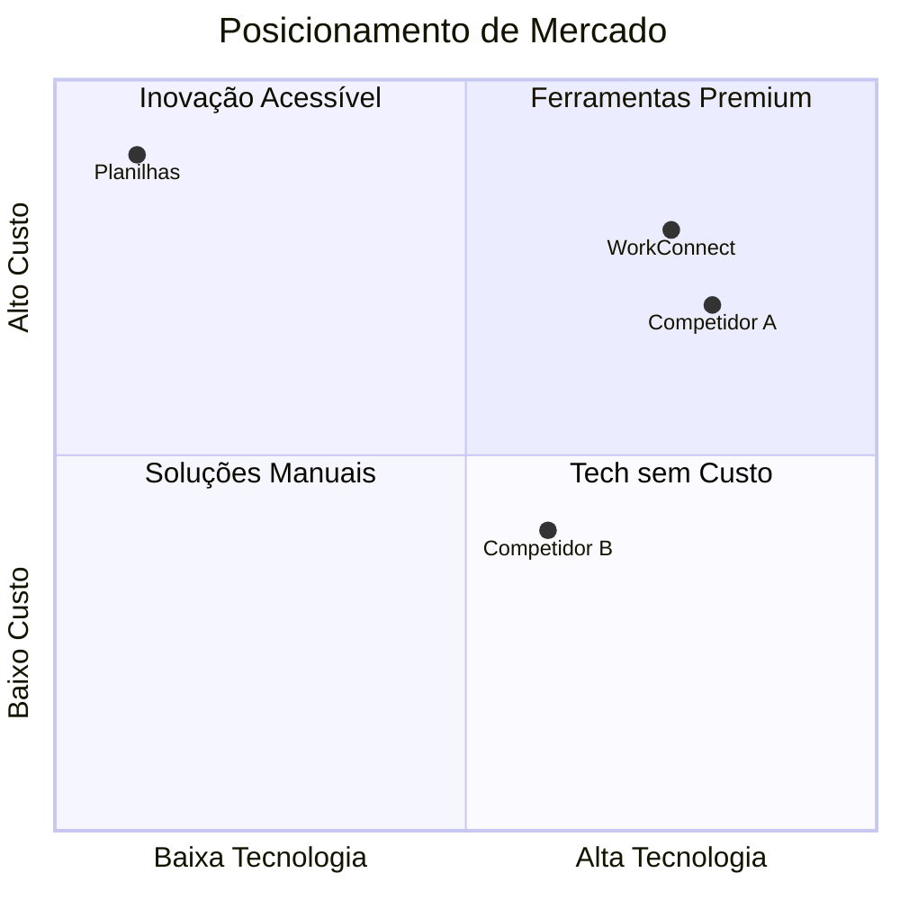

### Elementos da UVP:

| Elemento | Descrição |
|----------|-----------|
| **Target** | Donos de PME que precisam de gestão profissional |
| **Insight** | PMEs não precisam de ERP complexo para ter controle |
| **Differential** | IA + simplicidade + preço justo |
| **Message** | "Gestão inteligente de estoque em minutos" |

---

## 5. Unfair Advantage (Vantagem Competitiva)

A vantagem competitiva que não pode ser facilmente copiada:

### Vantagens do WorkConnect:

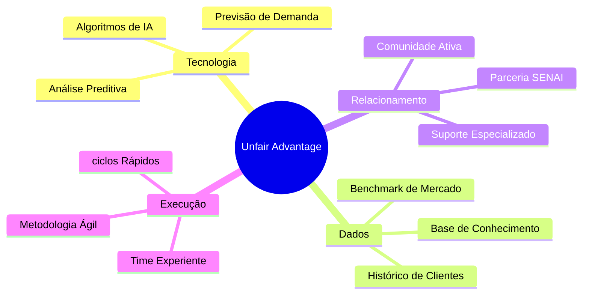

### Defesas Contra Concorrentes:

| Vantagem | Tipo | Tempo para Copiar |
|----------|------|-------------------|
| Parceria SENAI | Relacionamento | 12-24 meses |
| Base de Dados de Previsão | Dados | 18-36 meses |
| Algoritmos de ML | Tecnologia | 6-12 meses |
| Time Experience | Equipe | Imediato (difícil de reter) |
| Marca/Reputação | Marca | 24-48 meses |

---

## 6. Canais de Distribuição (Channels)

Os canais que usamos para entregar valor ao cliente:

### Journey do Cliente:

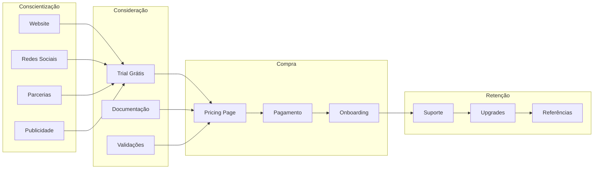

### Canais por Etapa:

| Etapa | Canal | Prioridade |
|-------|-------|------------|
| **Awareness** | Website + SEO | Alta |
| **Awareness** | LinkedIn Ads | Média |
| **Awareness** | Parceria SENAI | Alta |
| **Consideration** | Trial gratuito 14 dias | Alta |
| **Consideration** | Documentação | Média |
| **Purchase** | Checkout online | Alta |
| **Purchase** | Fatura consolidada | Média |
| **Retention** | Email marketing | Alta |
| **Retention** | Suporte proativo | Alta |

---

## 7. Estrutura de Custos (Cost Structure)

Custos específicos do produto e desenvolvimento:

### Breakdown de Custos:

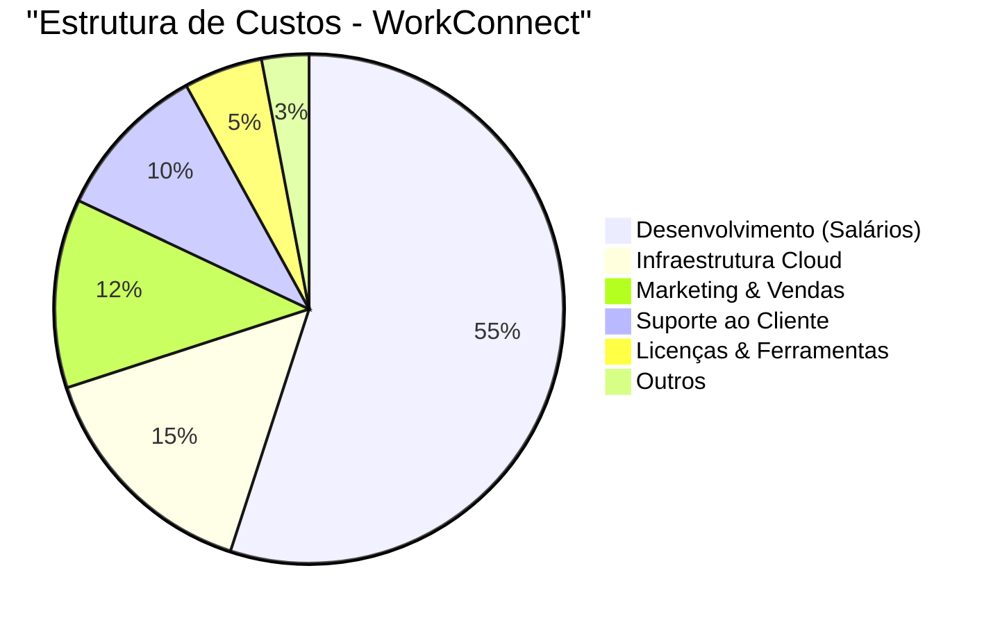

### Custos Unitários:

| Item | Custo Mensal | Custo por Usuário |
|------|--------------|-------------------|
| Servidor (Vercel/Netlify) | R$ 200,00 | R$ 2,00 |
| Banco de Dados (Supabase) | R$ 300,00 | R$ 3,00 |
| Domínio & SSL | R$ 50,00 | R$ 0,50 |
| Ferramentas Dev | R$ 150,00 | R$ 1,50 |
| Email Service | R$ 100,00 | R$ 1,00 |
| **Total por Usuário** | | **R$ 8,00** |

---

## 8. Fluxo de Receitas (Revenue Streams)

Modelo de monetização do produto:

### Modelo de Revenue:

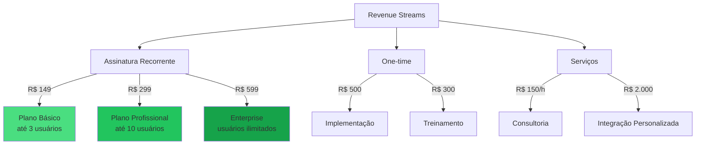

### Projeção de Revenue:

| Mês | Clientes | MRR (ARPU ~R$ 200) | Serviços | Total |
|-----|----------|--------------------|----------|-------|
| 1 | 10 | R$ 2.000 | R$ 0 | R$ 2.000 |
| 3 | 30 | R$ 6.000 | R$ 1.000 | R$ 7.000 |
| 6 | 80 | R$ 16.000 | R$ 3.000 | R$ 19.000 |
| 12 | 200 | R$ 40.000 | R$ 8.000 | R$ 48.000 |

> **Premissa de ARPU:** Média ponderada entre os planos (R$ 149 / R$ 299 / R$ 599), com mix inicial concentrado em **Básico** (~70%) e **Profissional** (~25%), evoluindo gradualmente conforme upsell ao longo dos 12 meses. Por isso ARPU ~R$ 200 no primeiro ano (vs. R$ 314 que seria a média ponderada com a mix madura de 30/50/20 descrita no [BM Canvas](./bmc-canvas)).

---

## Relação entre BM Canvas e PM Canvas

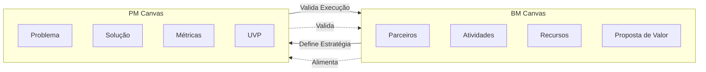

### Tradução dos Blocos:

| BM Canvas | → | PM Canvas |
|-----------|---|------------|
| Proposta de Valor | → | UVP + Solução |
| Segmentos de Clientes | → | Problema (JTBD) |
| Canais | → | Canais |
| Fluxos de Receita | → | Revenue Streams |
| Estrutura de Custos | → | Cost Structure |
| Parceiros-Chave | → | Unfair Advantage |
| Atividades-Chave | → | Funcionalidades |
| Recursos-Chave | → | Métricas de Sucesso |

---

## Roadmap do Produto

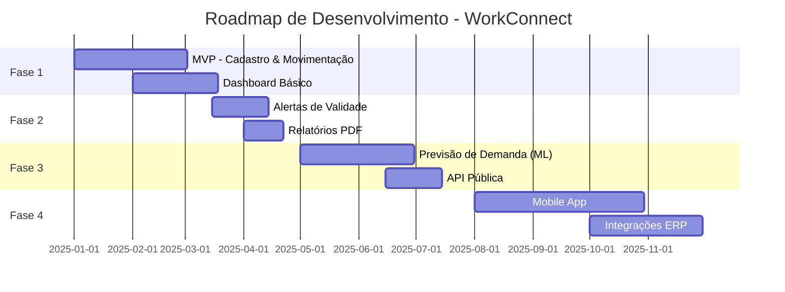

---

## Conclusão

O PM Canvas nos ajuda a:

1. ✅ **Validar problemas** antes de construir soluções
2. ✅ **Medir resultados** com métricas claras
3. ✅ **Comunicar estratégia** para toda a equipe
4. ✅ **Manter foco** no Product-Market Fit
5. ✅ **Adaptar rapidamente** baseado em feedback

---

## Próximos Passos

Para entender a estratégia de produto no contexto mais amplo:

- [Problema → Mecanismo → Solução](./problema-mecanismo-solucao) - A narrativa central de negócio
- [Análise de Mercado](./analise-mercado) - TAM/SAM/SOM
- [BM Canvas](./bmc-canvas) - Modelo de negócio
- [Viabilidade Econômica](./viabilidade-economica) - Business case financeiro

Para entender a implementação técnica:

- [Arquitetura do Sistema](../tecnica/arquitetura) - Visão técnica da implementação
- [Tecnologias Utilizadas](../tecnica/tecnologias) - Stack tecnológico

---

## Próximo Passo na Narrativa

| Se você quer... | Vá para |
|-----------------|---------|
| Entender **a estratégia de produto** (visão geral) | [Proposta de Valor →](./proposta-valor) |
| Ver **o plano de aquisição** de clientes | [Go-to-Market →](./go-to-market) |
| Conhecer **o business model** que sustenta tudo | [BM Canvas →](./bmc-canvas) |
| Ver **a viabilidade financeira** | [Viabilidade Econômica →](./viabilidade-economica) |
| Voltar à **narrativa central** do pitch | [Problema → Mecanismo → Solução →](./problema-mecanismo-solucao) |

---

## Referências

- **Product Manager Canvas** — Inspired by Roman Pichler
- **The Lean Product Playbook** — Dan Olsen
- **Inspired: How to Create Tech Products Customers Love** — Marty Cagan
- **Running Lean** — Ash Maurya
- **Sequoia pitch structure** — Solution + Why Us slots
- **Building a StoryBrand** — Donald Miller (Plan framework)
