# Problema → Mecanismo → Solução

> **TL;DR (30 segundos)** · 68% das PMEs brasileiras perdem **R$ 469–828 mil por ano** por estoque desorganizado. João, Maria e Carlos são três pessoas reais que vivem isso todo dia. WorkConnect devolve **91% da ruptura**, libera **R$ 9.823/mês** ao caixa e recupera **14 horas por semana** — em 90 dias.

:::info Onde estamos no Sequoia Pitch
Este é o **núcleo narrativo** do pitch. Ele serve simultaneamente como Problem (Sequoia), StoryBrand BrandScript (Donald Miller), e Justificativa (Project Canvas). Os demais docs do site são camadas de evidência para esta história.
:::

---

## Layer 1 — A História em 1 Slide (leia em 30s)

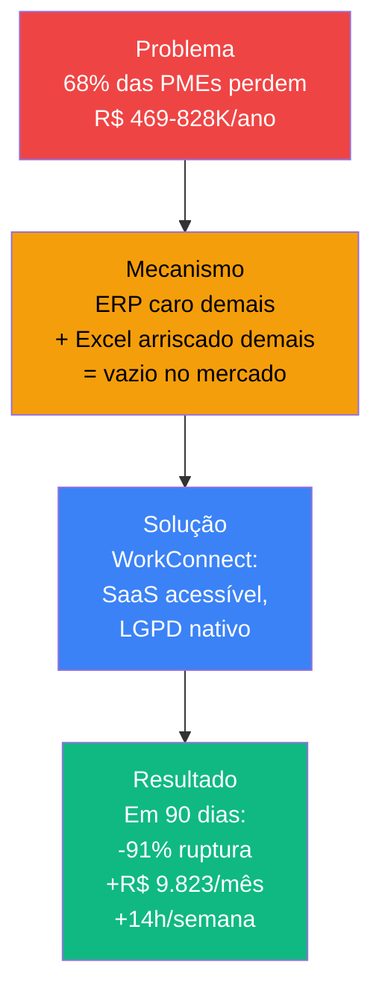

---

## Layer 2 — StoryBrand BrandScript (leia em 5 min)

A narrativa do WorkConnect segue o **BrandScript de Donald Miller** — o framework usado pelas marcas mais persuasivas do mundo. São 7 elementos, cada um com função clara na conversa com o cliente.

### 1. 🦸 Personagem — O Herói é o Cliente, Não Nós

O cliente é o herói da história. WorkConnect é o **guia** (Yoda, Gandalf, Haymitch). Quem está na saga são eles:

| Herói | Identidade | Saga |
|-------|-----------|------|
| **João, 42** | Dono de PME | "Quero crescer sem perder vendas por falta de mercadoria" |
| **Maria, 35** | Gerente de Estoque | "Quero parar de apagar incêndio e começar a fazer estratégia" |
| **Carlos, 48** | Contador de 45 PMEs | "Quero indicar uma ferramenta que funcione sem quebrar a confiança" |

### 2. 🐉 Problema — Três Camadas

StoryBrand distingue três camadas de problema. O cliente raramente articula todas — mas todas precisam ser endereçadas:

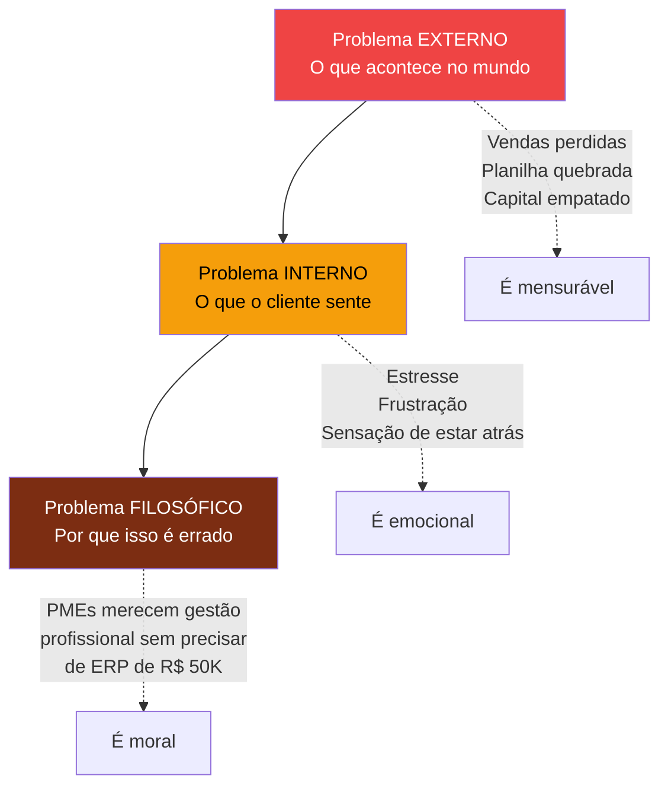

| Camada | O que o cliente vive | Como WorkConnect endereça |
|--------|---------------------|---------------------------|
| **Externo** | R$ 469–828K/ano perdidos em vendas, retrabalho, validade | Redução de 91% da ruptura em 90 dias |
| **Interno** | Estresse diário, sensação de incompetência, medo de auditoria | Paz de espírito: dashboard mostra tudo em 5 segundos |
| **Filosófico** | "PMEs brasileiras são forçadas a escolher entre ERP caro e Excel arriscado — não há opção justa" | Democratizamos gestão profissional por R$ 149/mês |

### 3. 🧙 Guia — WorkConnect Tem Empatia + Autoridade

Um bom guia **demonstra que entende a dor** (empatia) e **mostra que pode resolver** (autoridade). Sem um dos dois, ninguém confia.

| Empatia (entendemos sua dor) | Autoridade (sabemos resolver) |
|-------------------------------|-------------------------------|
| "Construímos esse produto porque vimos 5 planilhas na casa de um dono de PME numa terça-feira de manhã" | SENAI: validação acadêmica e credibilidade institucional |
| "Fizemos 50+ entrevistas com donos e gerentes de PMEs antes de escrever uma linha de código" | LGPD nativo desde o primeiro commit: cada acesso logado, cada exportação consentida |
| "Sabemos que planilha é vilã e heroína ao mesmo tempo — familiar e confiável" | Stack moderna (Next.js + Supabase) com uptime 99,9% |
| "Sabemos que você não tem 6 meses para implementar ERP" | Onboarding em 7 dias, suporte humano |

### 4. 📋 Plano — 3 Passos + Acordo de Confiança

StoryBrand separa o **plano de processo** (o que o cliente faz) do **plano de acordo** (como blindamos a confiança):

#### Plano de Processo — 3 passos

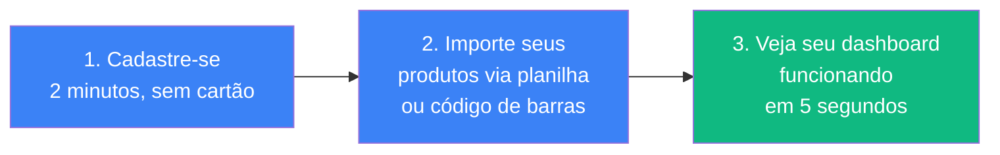

#### Plano de Acordo — 4 compromissos de segurança

1. **14 dias grátis** sem cartão de crédito
2. **Cancele quando quiser**, sem multa, sem ligação
3. **Seus dados ficam seus** — exporte a qualquer momento em CSV/XLSX
4. **Suporte humano em português**, resposta em até 4 horas úteis

### 5. 📣 Call to Action — Dois Tipos

StoryBrand distingue dois CTAs. O **transicional** puxa o curioso que ainda não está pronto; o **direto** captura quem já decidiu:

| Tipo | CTA | Onde aparece |
|------|-----|--------------|
| **Transicional** (baixo risco) | "Veja como funciona em 2 minutos" | Vídeo pitch, blog, redes sociais |
| **Transicional** (baixo risco) | "Baixe o checklist de 5 sintomas de estoque desorganizado" | Landing page, lead magnet |
| **Direto** (alta conversão) | "Comece seu teste grátis de 14 dias" | Página de pricing, endcard do vídeo |
| **Direto** (alta conversão) | "Agende uma demo de 15 minutos com nosso time" | Contadores e PMEs enterprise |

### 6. ⚠️ Evitar a Falha — O Custo de Não Agir

StoryBrand é brutal aqui: se o cliente não agir, o que acontece? O **medo de perder** é 2-3× mais forte que o desejo de ganhar. Então mostramos o que fica sem WorkConnect:

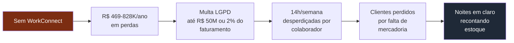

### 7. ✨ Alcançar o Sucesso — A Transformação

E aqui está a outra face da moeda — o que acontece **se** agir:

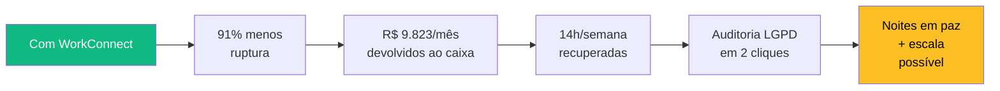

---

## Layer 3 — Sequoia Pitch Skeleton (leia em 10 min)

Aqui está o mesmo conteúdo enquadrado no **pitch structure usado por Sequoia, Y Combinator e a maioria das bancas de investidor** — para você ver a sobreposição.

### Sequoia 1 — Company Purpose (one-line)

> **WorkConnect**: SaaS de gestão de estoque inteligente para PMEs brasileiras, com governança LGPD nativa, a partir de R$ 149/mês.

### Sequoia 2 — Problem (real, urgente, com números)

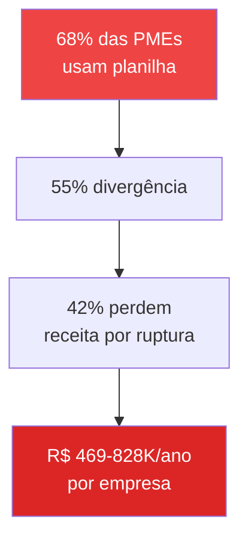

### Sequoia 3 — Solution (key insight)

O insight central: **o mercado de ERP é problema de Ferrari; o mercado de planilha é problema de carroça. Ninguém está construindo o carro popular.**

| Alternativa | Preço | Tempo de implantação | Aceitável para PME? |
|------------|-------|----------------------|---------------------|
| ERP tradicional (TOTVS, SAP) | R$ 5K-50K/mês | 3-6 meses | ❌ Caro e lento |
| SaaS generalista (Bling, ContaAzul) | R$ 150-600/mês | 2-4 semanas | 🟡 Estoque é feature acessória |
| Excel/Planilha | R$ 0 | Imediato | ❌ Sem controle, propenso a erro |
| **WorkConnect** | **R$ 149-599/mês** | **Setup em 7 dias** | **✓ Foco 100% em estoque** |

### Sequoia 4 — Why Now (janela de oportunidade)

Três tendências se cruzam hoje, criando uma janela de 24-36 meses que não vai se repetir:

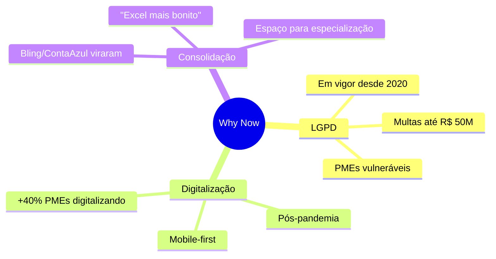

### Sequoia 5 — Market Size (resumo, detalhe no doc Mercado)

- **TAM**: R$ 108–270 bi/ano (todas PMEs brasileiras com problema de estoque)
- **SAM**: R$ 5,37 bi/ano (PMEs tech-enabled R$ 360K-4.8M)
- **SOM 5 anos**: R$ 269M/ano (5% do SAM = 75.000 clientes)

---

## Layer 4 — O Mecanismo Causal (Deep Dive)

> *Se você chegou até aqui, quer entender não só o quê, mas por que. Esta seção é para você.*

### As 3 Forças que Mantêm o Problema Vivo

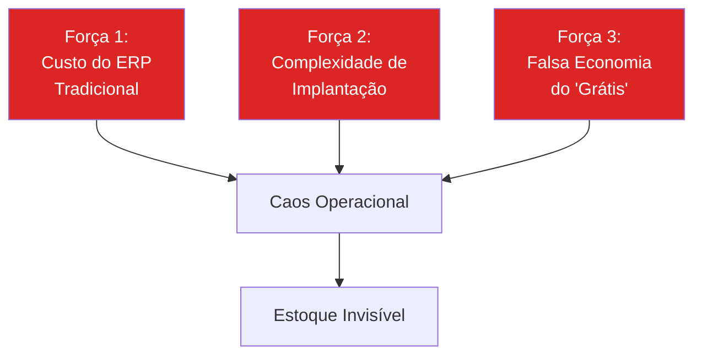

**Força 1** — Para uma empresa faturando R$ 150K/mês, comprometer R$ 5–50K/mês em software é inviável. ERP é problema de quem fatura R$ 5M+.

**Força 2** — ERP tradicional exige 3-6 meses, equipe dedicada, customização. PME não tem nem tempo nem expertise interna.

**Força 3** — Excel parece grátis, mas custa R$ 469–828K/ano em vendas perdidas, retrabalho e obsolescência. A "economia" é ilusória.

### O Ciclo Vicioso

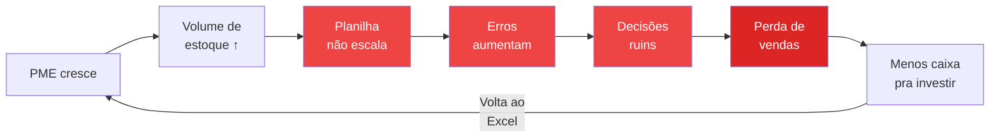

> **Insight crítico**: o problema não é falta de vontade — é ausência de uma camada de software que caiba na realidade da PME.

### As 5 Dores — Com Vozes Reais

| Dor | Prevalência | Quem sente mais | Citação real |
|-----|-------------|------------------|--------------|
| **Fragmentação** | 68% | João | "Tenho 5 planilhas diferentes que não conversam entre si" |
| **Erros humanos** | 55% | Maria | "Passo 2 horas por dia só atualizando planilhas" |
| **Ruptura** | 42% | João | "Perdi R$ 50 mil em vendas ano passado só porque não sabia que estava sem mercadoria" |
| **Obsolescência** | 38% | Maria | "Jogamos fora R$ 8 mil em produtos vencidos no trimestre passado" |
| **Tempo desperdiçado** | 72% | Maria | "Não tenho tempo de analisar os dados, só de coletar" |

---

## Layer 5 — Como WorkConnect Quebra o Ciclo

### Mapeamento Dor → Solução (com Mecanismo)

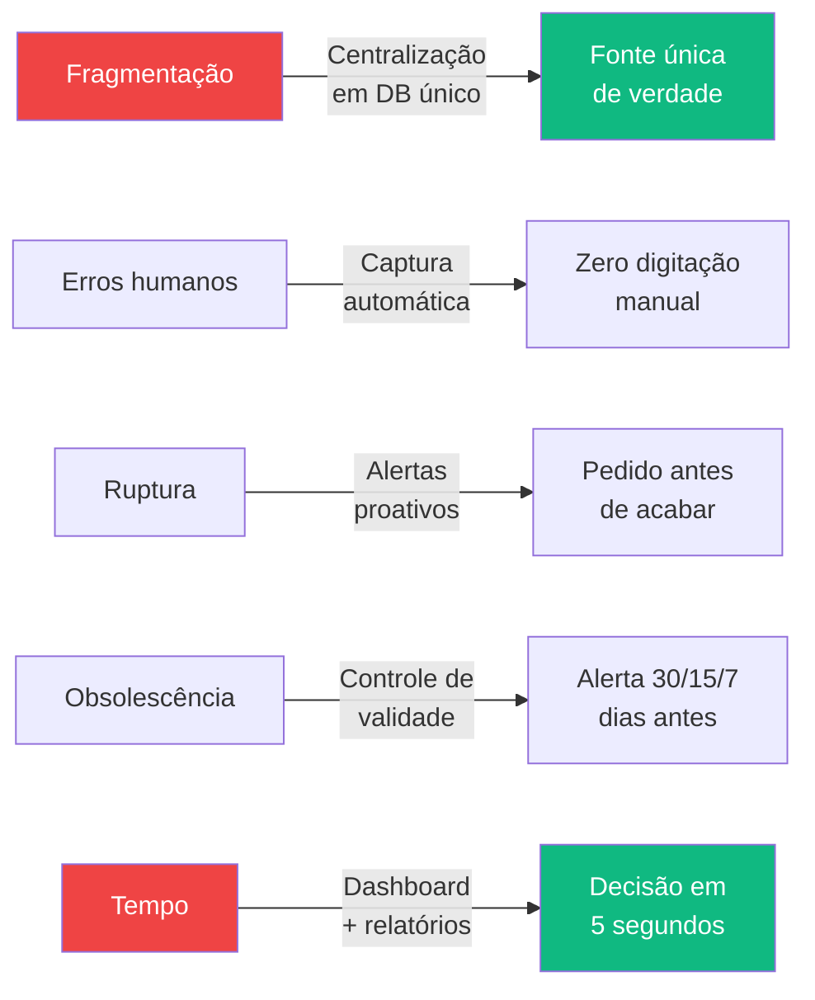

### Os 3 Pilares da Solução

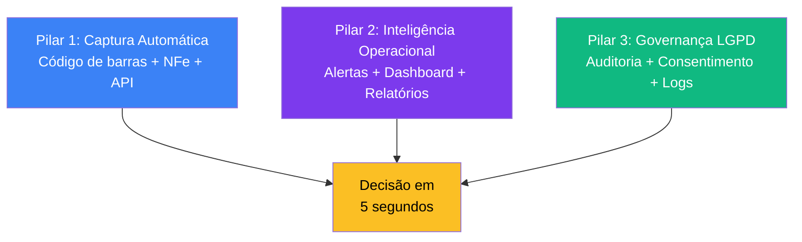

---

## Validação Empírica — Não É Só Teoria

| Método | Amostra | Status |
|--------|---------|--------|
| Entrevistas em profundidade | 50+ donos/gerentes de PMEs | ✅ Concluído |
| Questionário online | 200+ respostas | ✅ Concluído |
| Análise de comportamento (beta) | 10 empresas-piloto | 🔄 Em andamento |
| NPS trimestral | Pesquisa contínua | 🔄 Em andamento |

**3 insights mais valiosos da pesquisa:**
1. **73%** citaram espontaneamente "perda de venda por ruptura" como principal dor
2. **61%** disseram "não tenho tempo de aprender sistema novo" → UX intuitiva é crítica
3. **43%** levantaram "medo de auditoria LGPD" → conformidade é gatilho de compra, não feature técnica

---

## Próximo Passo na Narrativa

Você acabou de ler o **núcleo narrativo**. Agora, escolha por onde aprofundar:

| Se você quer entender... | Vá para |
|---------------------------|---------|
| O **modelo de negócio** completo (9 blocos do BMC) | [BM Canvas →](./bmc-canvas) |
| O **tamanho do mercado** e a janela "why now" | [Análise de Mercado →](./analise-mercado) |
| Os **3 heróis** em profundidade (João, Maria, Carlos) | [Personas →](./personas) |
| O **cálculo financeiro** detalhado (P&L, payback, valuation) | [Viabilidade Econômica →](./viabilidade-economica) |
| Quem são os **concorrentes** e onde WorkConnect ocupa | [Análise Concorrente →](./analise-concorrencial) |
| Como a **solução** se traduz em features concretas | [Proposta de Valor →](./proposta-valor) |
| O **plano de ataque** fase a fase | [Go-to-Market →](./go-to-market) |
| O **projeto** em si (cronograma, time, riscos) | [Project Model Canvas →](./project-model-canvas) |
| A **estratégia de produto** e roadmap | [PM Canvas →](./pm-canvas) |

---

## Referências

- **Building a StoryBrand** — Donald Miller (BrandScript de 7 elementos)
- **Sequoia Capital pitch structure** — Y Combinator, a16z
- **Jobs to Be Done** — Clayton Christensen (cliente "contrata" o produto para fazer um "job")
- **The Mom Test** — Rob Fitzpatrick (como entrevistar clientes sem viés)
- **Blue Ocean Strategy** — W. Chan Kim & Renée Mauborgne (criar espaço não disputado)
- **WorkConnect Research** — Pesquisa primária com PMEs brasileiras (2025)