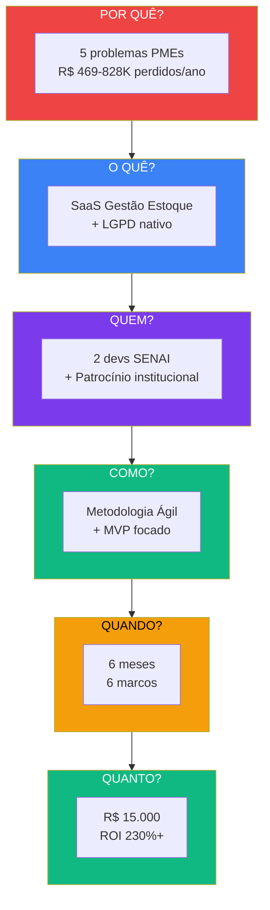
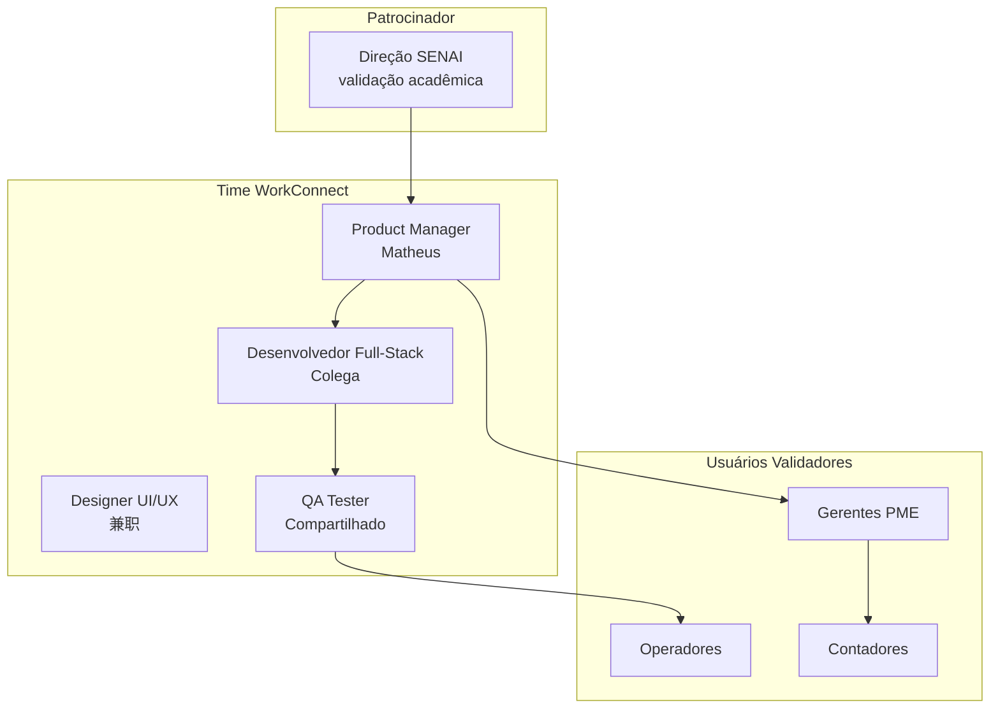
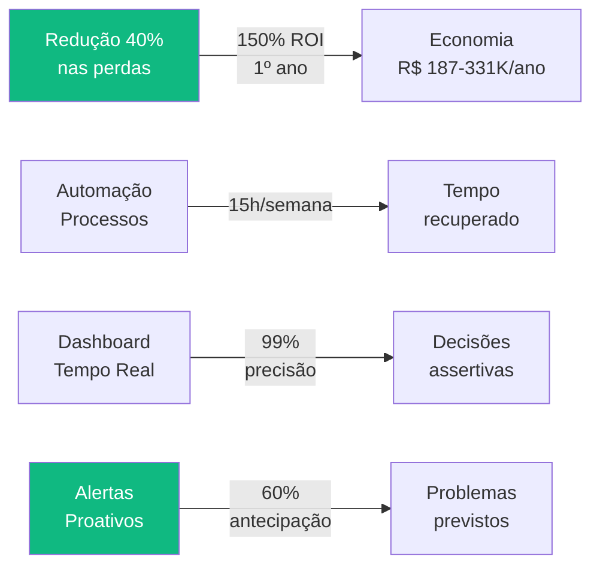
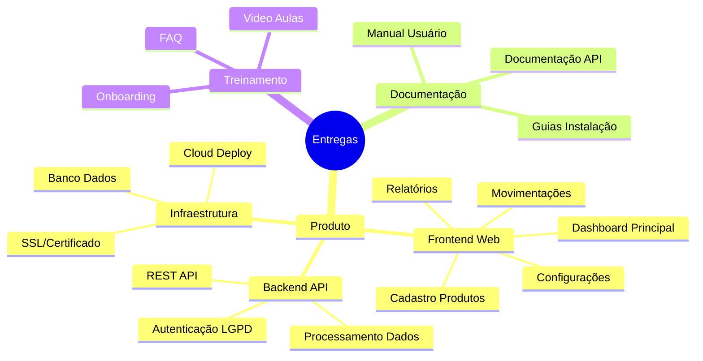
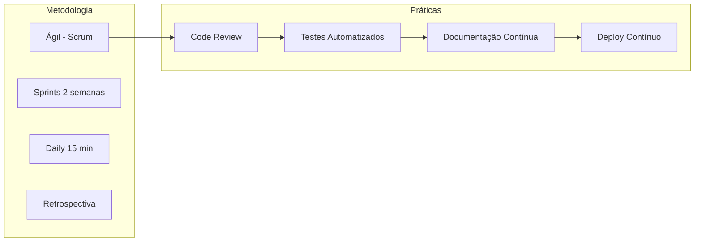
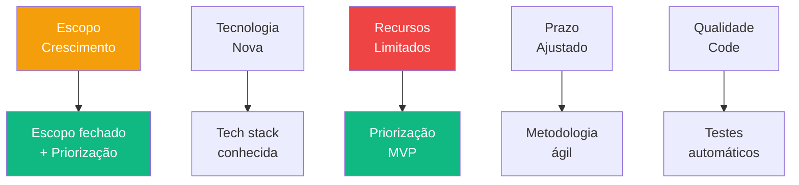
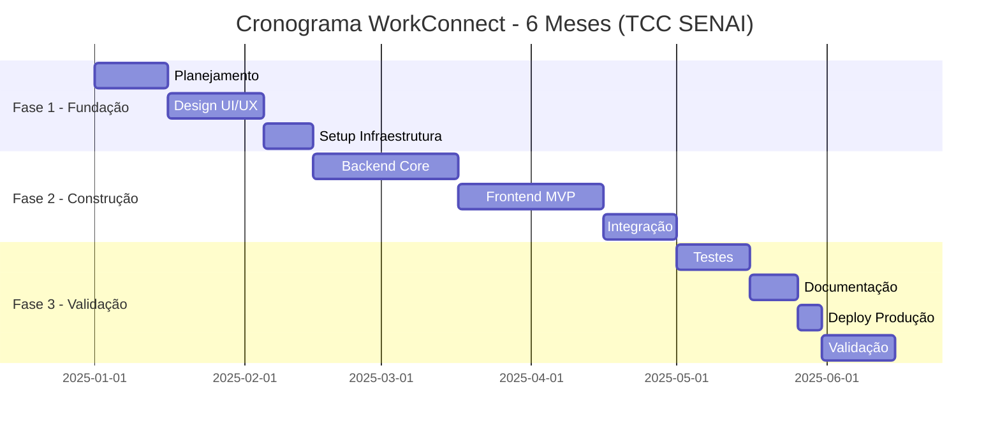
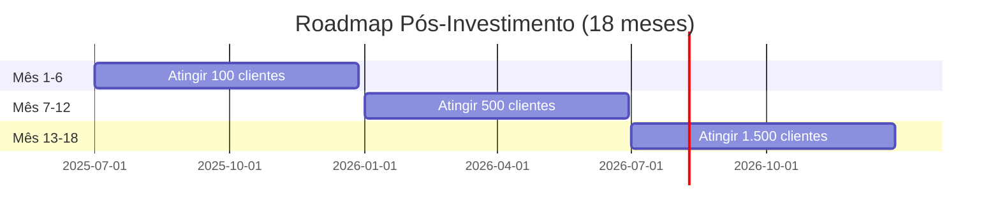
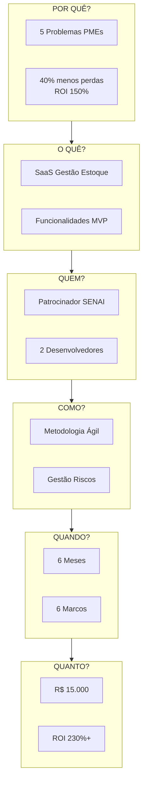
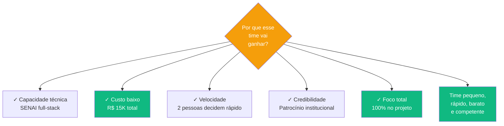

# Project Model Canvas (PMC)

> **TL;DR** · 2 devs SENAI full-stack, **R$ 15K de investimento**, **6 meses para MVP**, **metodologia Scrum**. **Perguntas que o PMC responde:** Por quê? (5 problemas PMEs). O quê? (SaaS gestão estoque). Quem? (time + stakeholders). Como? (ágil + MVP). Quando? (6 meses / 6 marcos). Quanto? (R$ 15K → ROI 230%+).

:::info Onde estamos no Sequoia Pitch
Este doc responde os slots **Team** + **Ask** da Sequoia pitch structure. Sequoia pergunta: *"quem são vocês e por que vão ganhar?"* + *"o que precisam para executar?"*
:::

---

## Layer 1 — O Projeto em 60 Segundos

---

## Layer 2 — Sequoia Team (Quem Somos)

Sequoia investe em **times**, não em ideias. A pergunta que fazemos aqui: **por que esse time vai ganhar?**

| Atributo | Resposta | Evidência |
|----------|----------|-----------|
| **Capacidade técnica** | 2 devs full-stack SENAI | Stack moderno dominado |
| **Credibilidade** | Patrocínio institucional SENAI | Validação acadêmica + network |
| **Foco** | 100% no projeto (TCC) | Sem distração de outros jobs |
| **Velocidade** | Time pequeno = decisões rápidas | 2 pessoas, zero burocracia |
| **Custo** | Bootstrap-friendly | Salários compatíveis com early-stage |

### Papéis e Alocação

| Papel | Responsabilidade | Alocação |
|-------|-----------------|:--------:|
| **Patrocinador (SENAI)** | Recursos, aprovação estratégica | 10% |
| **Product Manager** | Roadmap, priorização, stakeholder management | 100% |
| **Desenvolvedor Full-Stack** | Frontend + backend + infra | 100% |
| **Designer UI/UX** | Interface, experiência | 30% |
| **QA Tester** | Qualidade, testes | 20% |

---

## Layer 3 — Por Quê? Justificativa (o Problema)

### Os 5 Problemas Críticos das PMEs

| Problema | Prevalência | Impacto Financeiro |
|----------|:-----------:|-------------------|
| **Fragmentação de Dados** | 68% | R$ 1,2K-2,4K/mês |
| **Erros de Contagem** | 55% | R$ 6K-32K/ano |
| **Falta de Estoque (Ruptura)** | 42% | R$ 360K-600K/ano |
| **Produtos Obsoletos** | 38% | R$ 40K-70K imobilizados |
| **Tempo Desperdiçado** | 72% | R$ 48K-96K/ano |

> Detalhe completo em [Problema → Mecanismo → Solução →](./problema-mecanismo-solucao).

### Benefícios da Solução

---

## Layer 4 — O Quê? Escopo

### Produto Final

**WorkConnect** — SaaS de Gestão de Estoque Inteligente para PMEs brasileiras, com governança LGPD nativa.

### Requisitos por Prioridade

| Categoria | Requisito | Prioridade |
|-----------|-----------|:----------:|
| **Cadastro** | Produtos, categorias, fornecedores | 🔴 Alta |
| **Movimentação** | Entrada/saída com controle de lote | 🔴 Alta |
| **Alertas** | Reposição, validade, estoque mínimo | 🔴 Alta |
| **Relatórios** | Dashboard, inventário, custos | 🟡 Média |
| **Usuários** | Multi-usuário com roles | 🟡 Média |
| **API** | Integração com sistemas externos | 🟢 Baixa |

### Entregas (Deliverables)

> Detalhe da estratégia de produto em [PM Canvas →](./pm-canvas).

---

## Layer 5 — Como? Execução (Metodologia)

### Stack Tecnológico

### Premissas do Projeto

| # | Premissa | Impacto |
|---|----------|:-------:|
| P1 | Equipe técnica disponível | 🔴 Crítico |
| P2 | Acesso à internet estável | 🟡 Alto |
| P3 | Hardware adequado | 🟢 Médio |
| P4 | Universidade SENAI para validação | 🟢 Médio |
| P5 | Acesso a PMEs para testes | 🟡 Alto |

### Restrições

| # | Restrição | Mitigação |
|---|-----------|-----------|
| R1 | Orçamento limitado (TCC) | Priorizar funcionalidades MVP |
| R2 | Prazo acadêmico (6 meses) | Escopo fechado em 3 fases |
| R3 | Equipe reduzida (2 pessoas) | Automatização + priorização |
| R4 | Sem investimento externo | Bootstrap com R$ 15K |

### Riscos e Mitigações

---

## Layer 6 — Quando? Cronograma (6 Meses)

### Roadmap Visual

### Os 6 Marcos (Milestones)

| Marco | Data | Critério de Sucesso |
|-------|------|---------------------|
| **M1** Kickoff | 15/01 | Equipe alinhada, escopo definido |
| **M2** Design Finalizado | 15/02 | Todas as telas aprovadas |
| **M3** MVP Funcional | 30/03 | Core features funcionando |
| **M4** Alpha Release | 15/04 | Testes internos concluídos |
| **M5** Beta Release | 15/05 | 10 usuários testando |
| **M6** Lançamento | 30/06 | Sistema em produção |

---

## Layer 7 — Quanto? Orçamento

### Distribuição do Investimento

### Detalhamento de Custos

| Categoria | Item | Custo Unitário | Qtd | Total |
|-----------|------|---------------:|:---:|------:|
| **Infraestrutura** | Vercel Pro | R$ 200/mês | 6 | R$ 1.200 |
| **Infraestrutura** | Supabase Pro | R$ 250/mês | 6 | R$ 1.500 |
| **Ferramentas** | Domínio + SSL | R$ 200/ano | 1 | R$ 200 |
| **Ferramentas** | GitHub Pro | R$ 600/ano | 1 | R$ 600 |
| **Hardware** | Notebooks | R$ 4.000 | 2 | R$ 8.000 |
| **Marketing** | Anúncios beta | R$ 500/mês | 3 | R$ 1.500 |
| **Contingência** | Imprevistos | — | — | R$ 2.000 |
| **TOTAL** | | | | **R$ 15.000** |

### Retorno Esperado

| Métrica | Valor |
|---------|-------|
| **Investimento Inicial** | R$ 15.000 |
| **Receita Ano 1 (projeção)** | R$ 50.000 - R$ 180.000 |
| **ROI Estimado** | 230% - 1.100% |
| **Payback** | ~4 meses |

> Detalhe completo em [Viabilidade Econômica →](./viabilidade-economica).

---

## Layer 8 — Sequoia Ask (O que Precisamos)

Sequoia termina o pitch com **Ask** — o que pedimos e por quê:

| Necessidade | Hoje | Solicitado | Uso |
|-------------|:----:|:----------:|-----|
| **Seed money** | R$ 15K (já captado) | R$ 200K Series-Angel | Escala 18 meses |
| **Mentoria** | — | Conexões com SaaS B2B Brasil | Estratégia GTM |
| **Beta partners** | 10 atuais | 100 PMEs pagantes | Validação Product-Market Fit |
| **Indicações contadores** | — | Programa de parceiros | Canal de aquisição #1 |

### Próximos 18 Meses com Investimento Series-Angel

---

## Layer 9 — Matriz Resumo do PMC

---

## Síntese Executiva

---

## Próximo Passo na Narrativa

| Se você quer... | Vá para |
|-----------------|---------|
| Entender **a estratégia de produto** que vamos construir | [PM Canvas →](./pm-canvas) |
| Ver **o business model** completo | [BM Canvas →](./bmc-canvas) |
| Conhecer **o plano de aquisição** de clientes | [Go-to-Market →](./go-to-market) |
| Aprofundar **a viabilidade financeira** | [Viabilidade Econômica →](./viabilidade-economica) |
| Voltar à **narrativa central** | [Problema → Mecanismo → Solução →](./problema-mecanismo-solucao) |

---

## Referências

- **Project Model Canvas** — José Finocchio Jr.
- **Sequoia pitch structure** — Team + Ask slots
- **Metodologia Ágil** — Scrum / Kanban
- **WorkConnect** — TCC SENAI 2025