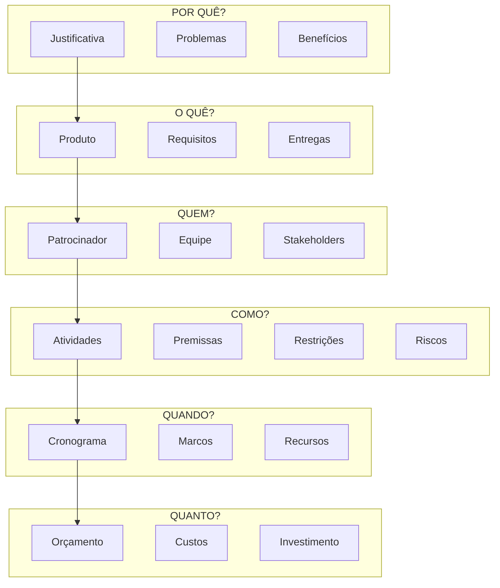
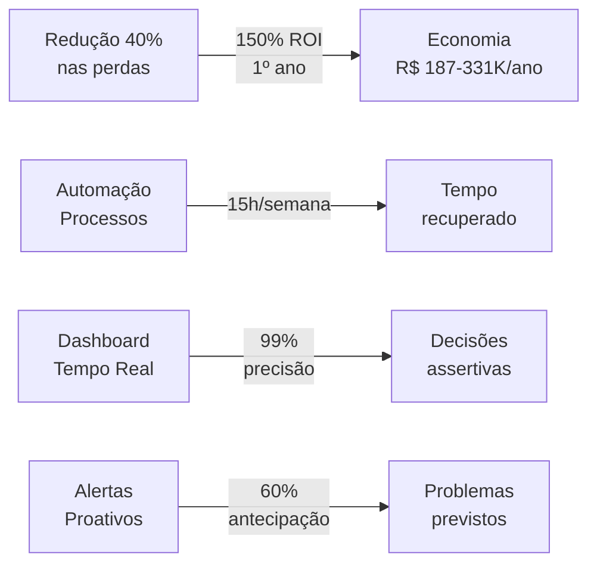
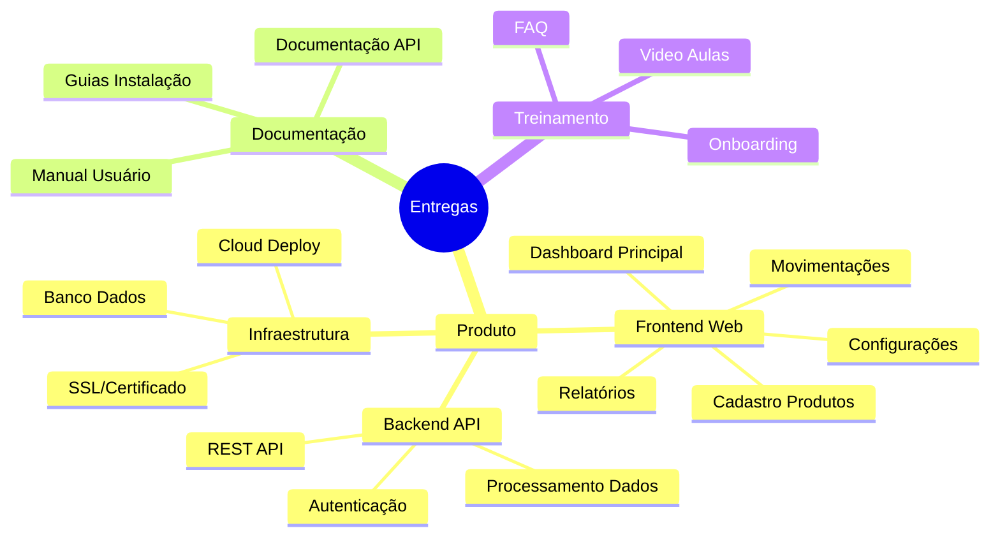
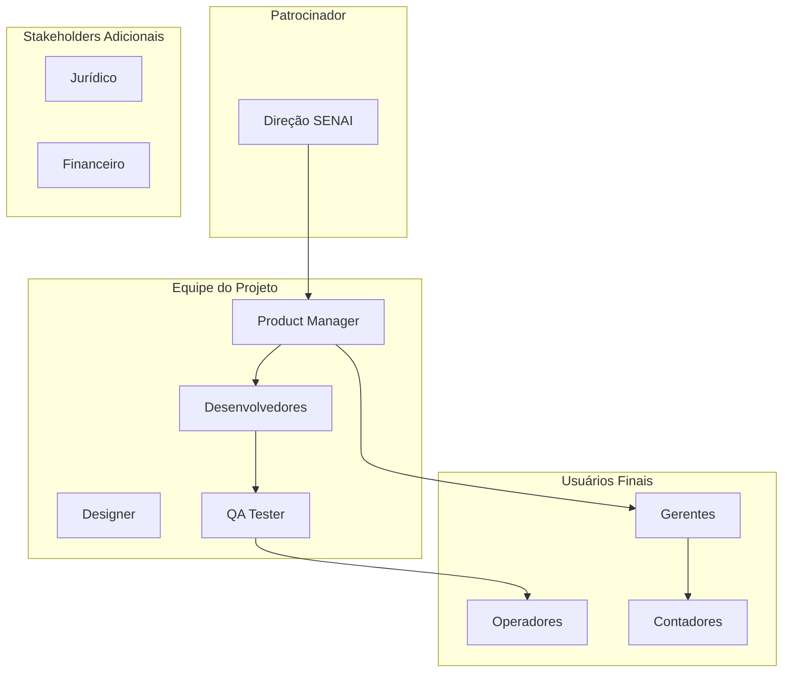
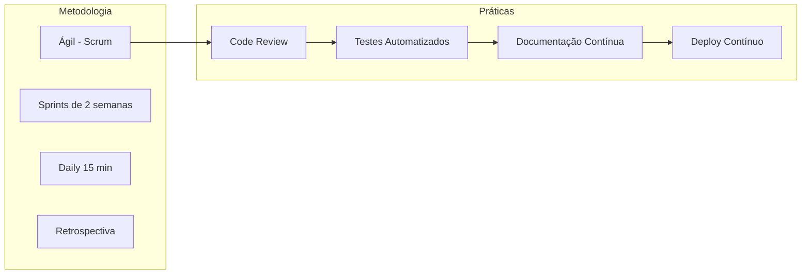
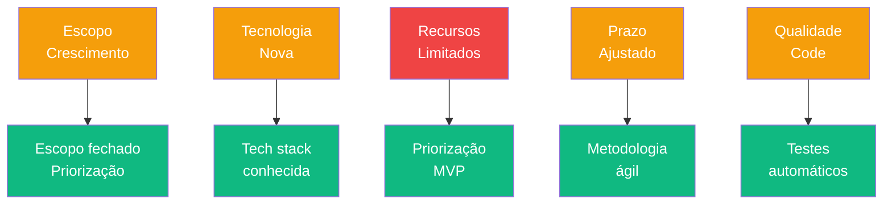
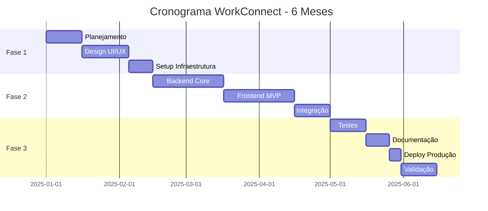
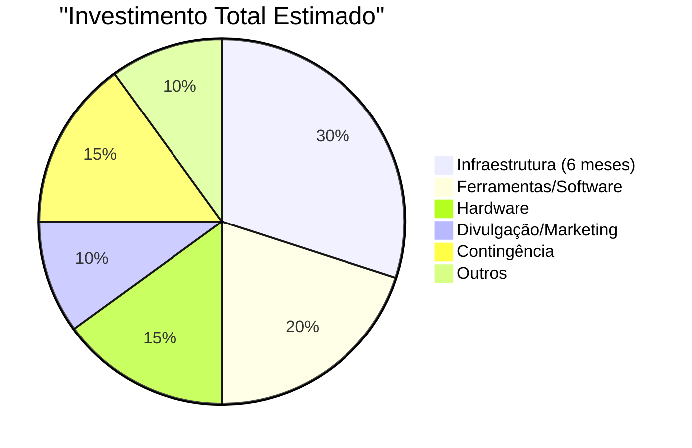

# Project Model Canvas (PMC)

## Visão Geral

O **Project Model Canvas** (ou **PMC**) é uma ferramenta de planejamento de projetos criada por **José Finocchio Jr.** que permite organizar, visualizar e comunicar o plano de um projeto em uma única página. Diferente do PMBOK ou metodologias tradicionais, o PMC foca no alinhamento rápido entre stakeholders usando post-its ou blocos visuais.

Este documento apresenta o PMC completo do projeto **WorkConnect** - Sistema de Gestão de Estoque Inteligente para PMEs.

:::info Metodologia
Baseado na metodologia **Project Model Canvas** de José Finocchio Jr., apresentada no livro "Guia Definitivo do Project Model Canvas".
:::

---

## Os 13 Blocos do Project Model Canvas

### Visão Completa do Projeto



---

## 1. Por Quê? - Justificativa

### Problema Central

PMEs brasileiras enfrentam **5 problemas críticos** de gestão de estoque:

| Problema | Prevalência | Impacto Financeiro |
|----------|-------------|-------------------|
| Fragmentação de Dados | 68% | R$ 1.2K-2.4K/mês |
| Erros de Contagem | 55% | R$ 6K-32K/ano |
| Falta de Estoque | 42% | R$ 360K-600K/ano |
| Produtos Obsoletos | 38% | R$ 40K-70K imobilizados |
| Tempo Desperdiçado | 72% | R$ 48K-96K/ano |

### Benefícios Esperados



---

## 2. O Quê? - Escopo

### Produto Final

**WorkConnect** - Sistema SaaS de Gestão de Estoque Inteligente para PMEs brasileiras

### Requisitos Principais

| Categoria | Requisito | Prioridade |
|-----------|-----------|------------|
| **Cadastro** | Produtos, categorias, fornecedores | 🔴 Alta |
| **Movimentação** | Entrada/saída com controle de lote | 🔴 Alta |
| **Alertas** | Reposição, validade, estoque mínimo | 🔴 Alta |
| **Relatórios** | Dashboard, inventário, custos | 🟡 Média |
| **Usuários** | Multi-usuário com roles | 🟡 Média |
| **API** | Integração com sistemas externos | 🟢 Baixa |

### Entregas (Deliverables)



---

## 3. Quem? - Stakeholders

### Estrutura de Stakeholders



### Papéis e Responsabilidades

| Papel | Responsabilidade | Alocação |
|-------|-----------------|----------|
| **Patrocinador** | Recursos, aprovação estratégica | 10% |
| **Product Manager** | Roadmap, priorização, stakeholder management | 100% |
| **Desenvolvedor Full-Stack** | Desenvolvimento frontend/backend | 100% |
| **Designer UI/UX** | Interface, experiência do usuário | 30% |
| **QA Tester** | Testes, qualidade | 20% |

---

## 4. Como? - Execução

### Abordagem de Execução



### Premissas

| Premissa | Descrição | Impacto |
|----------|-----------|---------|
| **P1** | Equipe técnica disponível | Crítico |
| **P2** | Acesso à internet estável | Alto |
| **P3** | Hardware adequado para desenvolvimento | Médio |
| **P4** | Universidade disponíveis para validação | Médio |
| **P5** | Acesso a PMEs para testes | Alto |

### Restrições

| Restrição | Descrição | Mitigação |
|-----------|-----------|-----------|
| **R1** | Orçamento limitado (TCC) | Priorizar funcionalidades MVP |
| **R2** | Prazo acadêmico (6 meses) | Escopo fechado |
| **R3** | Equipe reduzida (1-2 pessoas) | Automatização |
| **R4** | Sem investimento externo | Bootstrap |

### Riscos e Mitigações



---

## 5. Quando? - Cronograma

### Roadmap do Projeto



### Marcos (Milestones)

| Marco | Data | Critério de Sucesso |
|-------|------|---------------------|
| **M1** Kickoff | 15/01 | Equipe alinhada, escopo definido |
| **M2** Design Finalizado | 15/02 | Todas as telas aprovadas |
| **M3** MVP Funcional | 30/03 | Core features funcionando |
| **M4** Alpha Release | 15/04 | Testes internos concluídos |
| **M5** Beta Release | 15/05 | 10 usuários testando |
| **M6** Lançamento | 30/06 | Sistema em produção |

---

## 6. Quanto? - Custos

### Orçamento Total



### Detalhamento de Custos

| Categoria | Item | Custo Unitário | Quantidade | Total |
|-----------|------|----------------|------------|-------|
| **Infraestrutura** | Cloud (Vercel Pro) | R$ 200/mês | 6 | R$ 1.200 |
| **Infraestrutura** | Supabase Pro | R$ 250/mês | 6 | R$ 1.500 |
| **Ferramentas** | Domínio + SSL | R$ 200/ano | 1 | R$ 200 |
| **Ferramentas** | GitHub Pro | R$ 600/ano | 1 | R$ 600 |
| **Hardware** | Notebook | R$ 4.000 | 2 | R$ 8.000 |
| **Marketing** | Anúncios | R$ 500/mês | 3 | R$ 1.500 |
| **Contingência** | Imprevistos | - | - | R$ 2.000 |
| **TOTAL** | | | | **R$ 15.000** |

### Retorno Esperado

| Métrica | Valor |
|---------|-------|
| **Investimento Inicial** | R$ 15.000 |
| **Receita Ano 1 (projeção)** | R$ 50.000 - R$ 180.000 |
| **ROI Estimado** | 230% - 1100% |

---

## Matriz de Resumo PMC

```mermaid
blockDiagram
    block JUSTIFICATIVA["POR QUÊ?"]
        direction LR
        block PROBLEMAS["5 Problemas PMEs"]
        block BENEFICIOS["40% menos perdas<br/>ROI 150%"]
    end
    
    block ESCOPO["O QUÊ?"]
        direction LR
        block PRODUTO["SaaS Gestão Estoque"]
        block MVP["Funcionalidades MVP"]
    end
    
    block EQUIPE["QUEM?"]
        direction LR
        block PATROCINADOR["Patrocinador SENAI"]
        block TIME["1-2 Desenvolvedores"]
    end
    
    block EXECUCAO["COMO?"]
        direction LR
        block AGIL["Metodologia Ágil"]
        block RISCO["Gestão Riscos"]
    end
    
    block CRONO["QUANDO?"]
        direction LR
        block MESES["6 Meses"]
        block MARCOS["6 Marcos"]
    end
    
    block ORCAMENTO["QUANTO?"]
        direction LR
        block INVEST["R$ 15.000"]
        block RETORNO["ROI 230%+"]
    end
    
    JUSTIFICATIVA --> ESCOPO
    ESCOPO --> EQUIPE
    EQUIPE --> EXECUCAO
    EXECUCAO --> CRONO
    CRONO --> ORCAMENTO
```

---

## Próximos Passos

Continue explorando:

- [Análise de Mercado](./analise-mercado) - Oportunidade de mercado
- [Personas](./personas) - Perfis de clientes
- [BM Canvas](./bmc-canvas) - Modelo de negócio

---

## Referências

- **Project Model Canvas** - José Finocchio Jr.
- **Guia Definitivo do Project Model Canvas** - Project Builder
- **Metodologia Ágil** - Scrum / Kanban
- **WorkConnect** - TCC SENAI 2025
