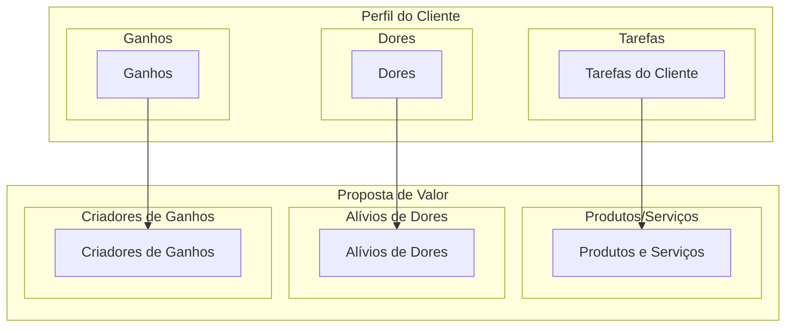
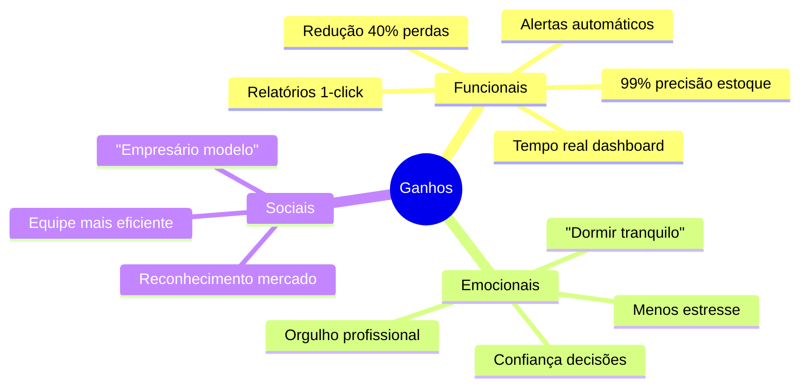
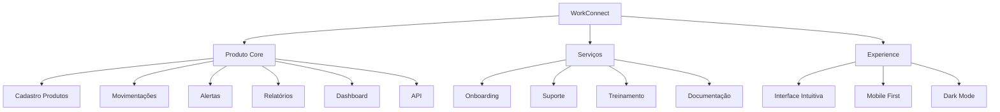
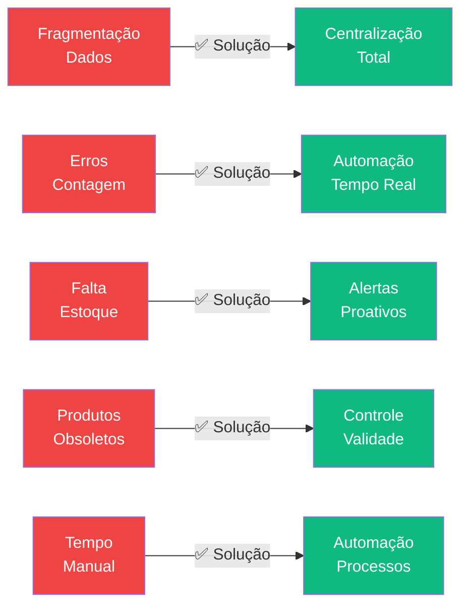
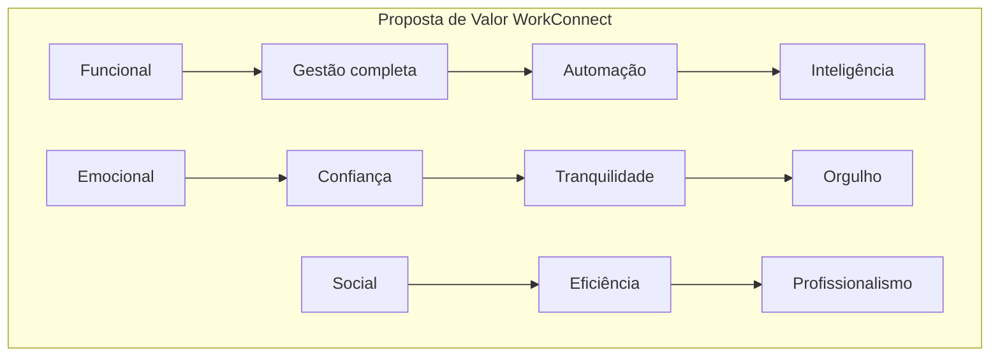
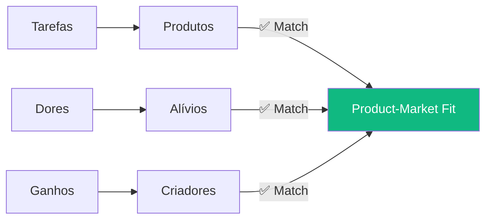

# Proposta de Valor

## Visão Geral

A **Proposta de Valor** é o elemento central do Business Model Canvas que descreve como criamos valor para nossos clientes. Esta seção detalha o **Value Proposition Canvas** completo do WorkConnect.

:::info Framework
Baseado no Value Proposition Canvas de Alexander Osterwalder.
:::

---

## Value Proposition Canvas

### Visão Geral

---

## 1. Perfil do Cliente

### Tarefas do Cliente (Jobs to Be Done)

#### Tarefas Funcionais

| Tarefa | Descrição | Frequência |
|--------|-----------|------------|
| **Controle de estoque** | Saber quantidade atual de cada produto | Diária |
| **Registrar vendas** | Baixa de estoque após venda | Diária |
| **Controlar compras** | Registrar entradas de mercadorias | Semanal |
| **Fazer inventário** | Conferir estoque físico | Mensal |
| **Gerar relatórios** | Extrair dados para decisões | Semanal |
| **Alertas de reposição** | Saber quando comprar mais | Contínua |

#### Tarefas Sociais

| Tarefa | Descrição |
|--------|-----------|
| **Appearing professional** | Passar imagem de empresa organizada |
| **Being respected** | Ser reconhecido como empresário competente |
| **Being efficient** | Mostrar eficiência para equipe |

#### Tarefas Emocionais

| Tarefa | Descrição |
|--------|-----------|
| **Peace of mind** | Dormir tranquilo sobre o estoque |
| **Reduce stress** | Menos preocupações no dia a dia |
| **Confidence** | Confiança nas decisões |

---

## 2. Dores do Cliente

### Dores Intensivas

### Tabela de Dores

| # | Dor | Intensidade | Frequência | Impacto |
|---|-----|-------------|-----------|---------|
| 1 | Perder vendas por falta | 🔴 Crítica | 42% | R$ 360-600K/ano |
| 2 | Divergência inventário | 🔴 Alta | 55% | 20-30% |
| 3 | Tempo manual | 🔴 Alta | 72% | 15-20% tempo |
| 4 | Produtos obsoletos | 🟠 Média | 38% | R$ 40-70K |
| 5 | Planilhas quebram | 🟠 Média | 68% | Erros diários |
| 6 | Não confiar nos dados | 🟡 Baixa | 55% | Decisões ruins |

### Dores por Categoria

#### Dores Funcionais

- ❌ Perder 15-25% da receita por falta de estoque
- ❌ Ter 20-30% de divergência no inventário
- ❌ Gastar 15-20% do tempo em processos manuais
- ❌ Não confiar nos números das planilhas
- ❌ Fazer inventários físicos caros e demorados

#### Dores Emocionais

- ❌ Estresse constante com problemas de estoque
- ❌ Frustração com sistemas caros e complexos
- ❌ Sensação de estar sempre "atrás"
- ❌ Medo de tomar decisões erradas

#### Dores Sociais

- ❌ Parecer desorganizado para funcionários
- ❌ Ser superado por concorrentes
- ❌ Não parecer "profissional"

---

## 3. Ganhos do Cliente

### Ganhos Esperados

### Tabela de Ganhos

| # | Ganho | Importância | Medição |
|---|-------|-------------|---------|
| 1 | Redução 40% perdas | 🔴 Crítica | R$ economizado |
| 2 | 15h/semana recuperadas | 🔴 Alta | Tempo livre |
| 3 | 99% precisão | 🔴 Alta | Inventário |
| 4 | Dashboard tempo real | 🟡 Média | Tempo decisão |
| 5 | Alertas proativos | 🟡 Média | Problemas evitados |
| 6 | Relatórios automáticos | 🟢 Baixa | Tempo geração |

---

## 4. Produtos e Serviços

### Oferta WorkConnect

### Detalhamento

| Categoria | Item | Descrição |
|-----------|------|-----------|
| **Core** | Gestão de produtos | Cadastro completo com SKU, código barras |
| **Core** | Movimentações | Entrada/saída com controle de lote |
| **Core** | Categorias | Organização hierárquica |
| **Core** | Fornecedores | Cadastro e histórico |
| **Core** | Alertas | Reposição, validade, mínimo |
| **Core** | Relatórios | Dashboard, inventário, custos |
| **Serviços** | Onboarding | Setup assistido primeiro uso |
| **Serviços** | Suporte | Chat/email 24/7 |
| **Serviços** | Treinamento | Vídeos e documentação |

---

## 5. Alívios de Dores

### Como WorkConnect Alivia as Dores

### Mapeamento Dores → Soluções

| Dor | Solução WorkConnect | Como Alivia |
|-----|---------------------|-------------|
| Fragmentação dados | Sistema centralizado | Tudo em um lugar |
| Erros contagem | Automação entradas/saídas | Elimina erro humano |
| Falta estoque | Alertas proativos | Antecipa problema |
| Produtos obsoletos | Controle de validade | Alerta antecipado |
| Tempo manual | Automação processos | 15h/semana liberadas |
| Planilhas quebram | Sistema robusto | Funciona sempre |

---

## 6. Criadores de Ganhos

### Como WorkConnect Cria Ganhos

| Ganho | Criador | Evidência |
|-------|--------|-----------|
| 99% precisão | Controle automatizado | Benchmark do mercado |
| 40% menos perdas | Alertas + dashboards | Caso cliente |
| 15h/semana | Automação | Cálculo interno |
| Decisões assertivas | Dashboard tempo real | Feedback clientes |
| ROI 150% | Cálculo baseado em dados | Projeção Financeira |

### Matriz de Valor

---

## 7. Fit entre Proposta e Cliente

### Validação

### Métricas de Fit

| Métrica | Target | Status |
|---------|--------|--------|
| Taxa conversão trial → pago | > 25% | 🔄 Validando |
| Time to value | < 7 dias | 🔄 Validando |
| NPS | > 50 | 🔄 Validando |
| Churn | < 5% | 🔄 Validando |

---

## Comparativo de Valor

### Matriz Valor/Preço

| Solução | Valor Percebido | Preço | Ratio |
|---------|----------------|-------|-------|
| **WorkConnect** | ⭐⭐⭐⭐⭐ Alto | R$ 149-599/mês |Excelente |
| ERPs Tradicionais | ⭐⭐⭐⭐ Alto | R$ 5K-50K | Ruim |
| Sistemas Genéricos | ⭐⭐⭐ Médio | R$ 200-800/mês | Regular |
| Excel | ⭐ Baixo | "Grátis" | Péssimo |

---

## Próximos Passos

Continue explorando:

- [BM Canvas](./bmc-canvas) - Modelo de negócio completo
- [Análise Concorrencial](./analise-concorrencial) - Posicionamento
- [Go-to-Market](./go-to-market) - Estratégia de entrada

---

## Referências

- **Value Proposition Canvas** - Alexander Osterwalder
- **Lean Customer Validation** -ash Maurya
- **Jobs to Be Done** - Clayton Christensen
- **WorkConnect Research** - Dados primários
