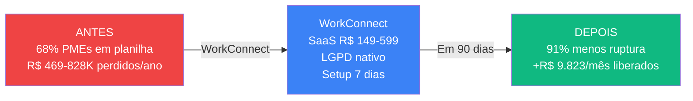
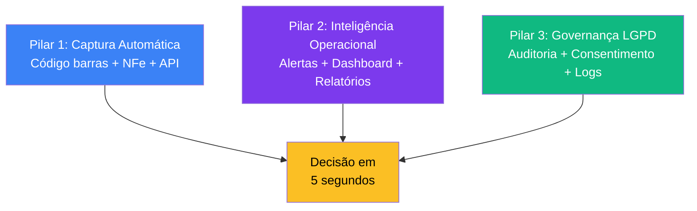
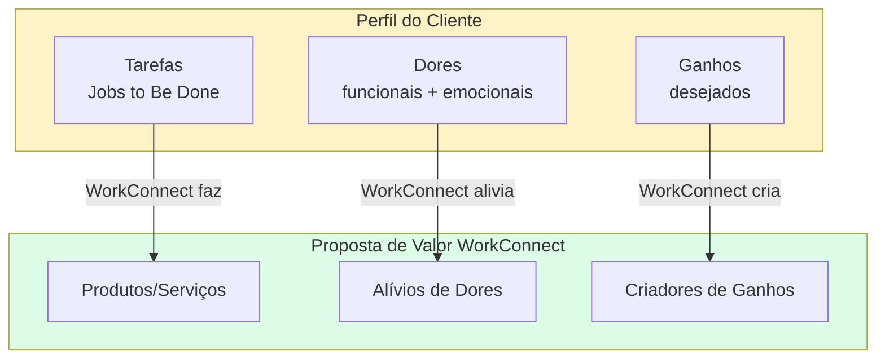
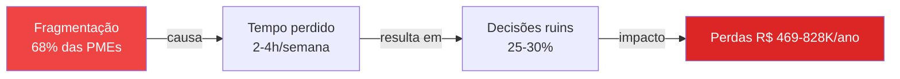
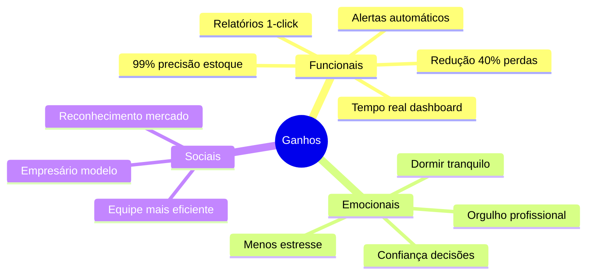
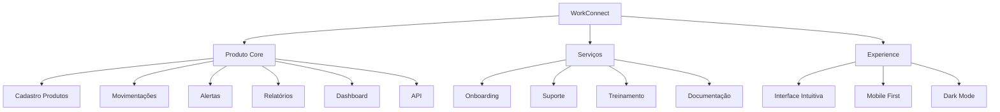
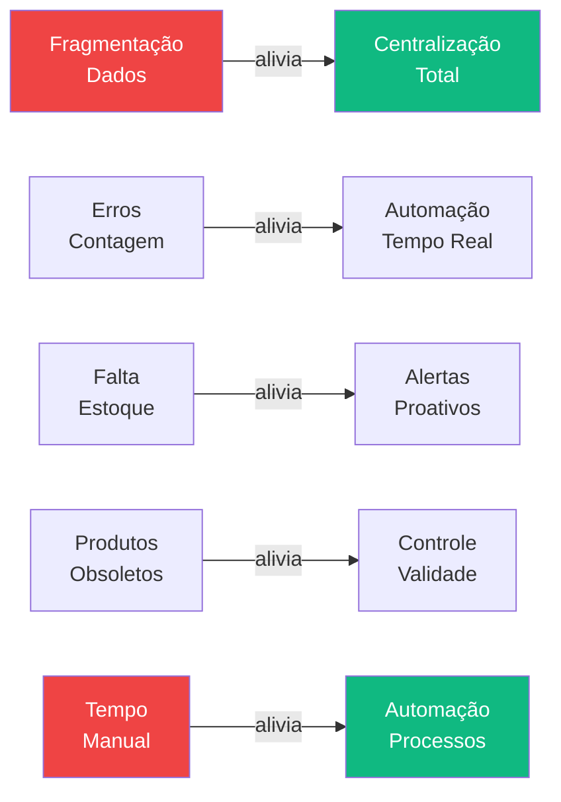
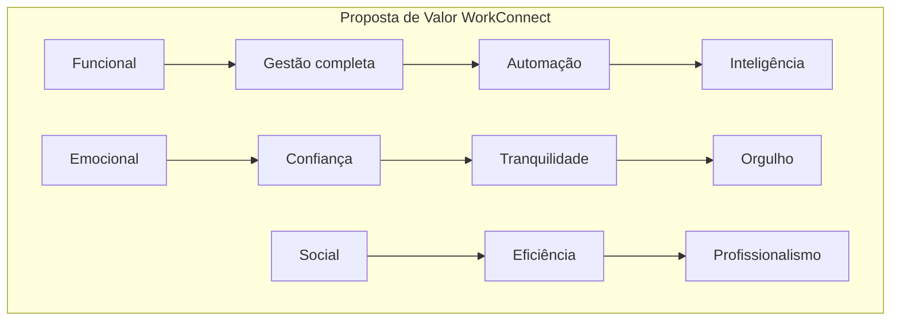
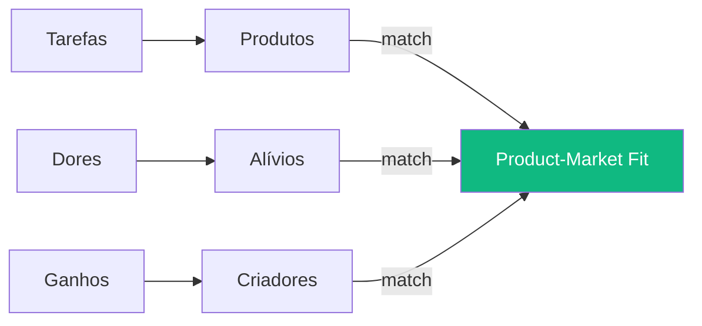
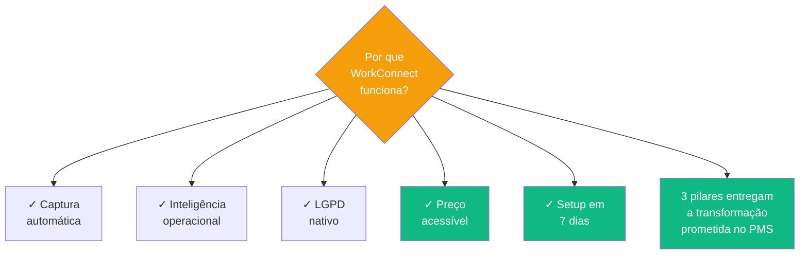

# Proposta de Valor

> **TL;DR** · WorkConnect entrega **40% menos perdas** + **15h/semana recuperadas** + **99% de precisão** + **LGPD nativo** — tudo por **R$ 149-599/mês**. O **insight central** (Sequoia): o mercado de ERP é problema de Ferrari; o de planilha é problema de carroça. Ninguém está construindo o **carro popular** — gestão profissional ao preço de PME.

:::info Onde estamos no Sequoia Pitch
Este doc responde os slots **Solution** + **Why Now** (parcial) da Sequoia pitch structure. É o "como entregamos a transformação prometida no PMS" + a evidência do fit produto-mercado.
:::

---

## Layer 1 — A Proposta em 60 Segundos

### A Promessa (one-liner)

> *"WorkConnect elimina perdas por falta de estoque, reduz custos operacionais em 30% e gera 150% de ROI no primeiro ano, através de uma plataforma SaaS acessível (R$ 149-599/mês) que automatiza completamente a gestão de estoque."*

---

## Layer 2 — Sequoia Solution (3 Pilares)

O Sequoia pitch pergunta: **qual é o seu insight fundamental?** Para WorkConnect, são 3 pilares que entregam a transformação:

### Por que Cada Pilar Importa

| Pilar | Resolve | Mecanismo |
|-------|---------|-----------|
| **Captura automática** | 55% de erros humanos + 68% de fragmentação | Substitui digitação manual por leitura óptica + integração |
| **Inteligência operacional** | 42% perdem receita por ruptura | Antecipa pedido antes de acabar + dashboards em 5s |
| **Governança LGPD** | Multa até R$ 50M | Auditoria em 2 cliques, logs imutáveis, consentimento granular |

---

## Layer 3 — Value Proposition Canvas (Osterwalder)

### Visão Geral

---

## 4. Perfil do Cliente

### Tarefas (Jobs to Be Done)

#### Tarefas Funcionais

| Tarefa | Descrição | Frequência |
|--------|-----------|------------|
| **Controle de estoque** | Saber quantidade atual de cada produto | Diária |
| **Registrar vendas** | Baixa de estoque após venda | Diária |
| **Controlar compras** | Registrar entradas de mercadorias | Semanal |
| **Fazer inventário** | Conferir estoque físico | Mensal |
| **Gerar relatórios** | Extrair dados para decisões | Semanal |
| **Alertas de reposição** | Saber quando comprar mais | Contínua |

#### Tarefas Sociais

| Tarefa | Descrição |
|--------|-----------|
| **Appearing professional** | Passar imagem de empresa organizada |
| **Being respected** | Ser reconhecido como empresário competente |
| **Being efficient** | Mostrar eficiência para equipe |

#### Tarefas Emocionais

| Tarefa | Descrição |
|--------|-----------|
| **Peace of mind** | Dormir tranquilo sobre o estoque |
| **Reduce stress** | Menos preocupações no dia a dia |
| **Confidence** | Confiança nas decisões |

---

## 5. Dores do Cliente

### Cadeia Causal

### Tabela de Dores (intensidade × frequência × impacto)

| # | Dor | Intensidade | Frequência | Impacto |
|---|-----|:-----------:|:----------:|---------|
| 1 | Perder vendas por falta | 🔴 Crítica | 42% | R$ 360-600K/ano |
| 2 | Divergência inventário | 🔴 Alta | 55% | 20-30% |
| 3 | Tempo manual | 🔴 Alta | 72% | 15-20% tempo |
| 4 | Produtos obsoletos | 🟠 Média | 38% | R$ 40-70K |
| 5 | Planilhas quebram | 🟠 Média | 68% | Erros diários |
| 6 | Não confiar nos dados | 🟡 Baixa | 55% | Decisões ruins |

### Dores por Categoria

**Funcionais:**
- ❌ Perder 15-25% da receita por falta de estoque
- ❌ Ter 20-30% de divergência no inventário
- ❌ Gastar 15-20% do tempo em processos manuais
- ❌ Não confiar nos números das planilhas
- ❌ Fazer inventários físicos caros e demorados

**Emocionais:**
- ❌ Estresse constante com problemas de estoque
- ❌ Frustração com sistemas caros e complexos
- ❌ Sensação de estar sempre "atrás"
- ❌ Medo de tomar decisões erradas

**Sociais:**
- ❌ Parecer desorganizado para funcionários
- ❌ Ser superado por concorrentes
- ❌ Não parecer "profissional"

---

## 6. Ganhos Esperados

| # | Ganho | Importância | Medição |
|---|-------|:-----------:|---------|
| 1 | Redução 40% perdas | 🔴 Crítica | R$ economizado |
| 2 | 15h/semana recuperadas | 🔴 Alta | Tempo livre |
| 3 | 99% precisão | 🔴 Alta | Inventário |
| 4 | Dashboard tempo real | 🟡 Média | Tempo decisão |
| 5 | Alertas proativos | 🟡 Média | Problemas evitados |
| 6 | Relatórios automáticos | 🟢 Baixa | Tempo geração |

---

## 7. Produtos e Serviços (a Oferta)

### Mapa da Oferta

### Detalhamento dos Itens

| Categoria | Item | Descrição |
|-----------|------|-----------|
| **Core** | Gestão de produtos | Cadastro completo com SKU, código barras |
| **Core** | Movimentações | Entrada/saída com controle de lote |
| **Core** | Categorias | Organização hierárquica |
| **Core** | Fornecedores | Cadastro e histórico |
| **Core** | Alertas | Reposição, validade, mínimo |
| **Core** | Relatórios | Dashboard, inventário, custos |
| **Serviços** | Onboarding | Setup assistido primeiro uso |
| **Serviços** | Suporte | Chat/email 24/7 |
| **Serviços** | Treinamento | Vídeos e documentação |

---

## 8. Alívios de Dores (Dor → Solução)

### Mapeamento Detalhado

| Dor | Solução WorkConnect | Como Alivia |
|-----|---------------------|-------------|
| Fragmentação dados | Sistema centralizado | Tudo em um lugar |
| Erros contagem | Automação entradas/saídas | Elimina erro humano |
| Falta estoque | Alertas proativos | Antecipa problema |
| Produtos obsoletos | Controle de validade | Alerta antecipado |
| Tempo manual | Automação processos | 15h/semana liberadas |
| Planilhas quebram | Sistema robusto | Funciona sempre |

---

## 9. Criadores de Ganhos

| Ganho | Criador | Evidência |
|-------|--------|-----------|
| 99% precisão | Controle automatizado | Benchmark do mercado |
| 40% menos perdas | Alertas + dashboards | Caso cliente |
| 15h/semana | Automação | Cálculo interno |
| Decisões assertivas | Dashboard tempo real | Feedback clientes |
| ROI 150% | Cálculo baseado em dados | [Projeção Financeira](./viabilidade-economica) |

### Matriz de Valor (3 dimensões)

---

## 10. Comparativo de Valor (Matriz Valor × Preço)

| Solução | Valor Percebido | Preço | Ratio |
|---------|:---------------:|:-----:|:-----:|
| **WorkConnect** | ⭐⭐⭐⭐⭐ Alto | R$ 149-599/mês | **Excelente** |
| ERPs Tradicionais | ⭐⭐⭐⭐ Alto | R$ 5K-50K | Ruim |
| Sistemas Genéricos | ⭐⭐⭐ Médio | R$ 200-800/mês | Regular |
| Excel | ⭐ Baixo | "Grátis" | Péssimo |

---

## 11. Validação do Product-Market Fit

### Como Validamos

### Métricas de Fit

| Métrica | Target | Status |
|---------|:------:|:------:|
| Taxa conversão trial → pago | > 25% | 🔄 Validando |
| Time to value | < 7 dias | 🔄 Validando |
| NPS | > 50 | 🔄 Validando |
| Churn mensal | < 5% | 🔄 Validando |

---

## Síntese Executiva

---

## Próximo Passo na Narrativa

| Se você quer... | Vá para |
|-----------------|---------|
| Entender **quem ganha de WorkConnect** vs concorrência | [Análise Concorrência →](./analise-concorrencial) |
| Ver o **modelo de negócio** completo | [BM Canvas →](./bmc-canvas) |
| Aprofundar em **Jobs to Be Done** dos heróis | [Personas →](./personas) |
| Conhecer **como vendemos** (plano de ataque) | [Go-to-Market →](./go-to-market) |

---

## Referências

- **Value Proposition Canvas** — Alexander Osterwalder
- **Lean Customer Validation** — Ash Maurya
- **Jobs to Be Done** — Clayton Christensen
- **Sequoia pitch structure** — Purpose/Problem/Solution
- **WorkConnect** — Pesquisa primária com 250+ PMEs (2024-2025)