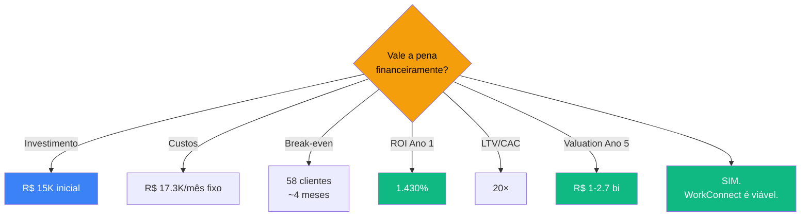
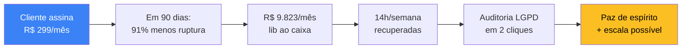
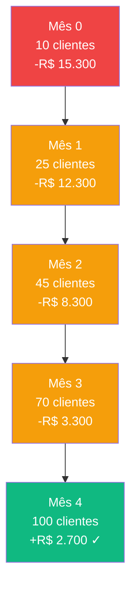
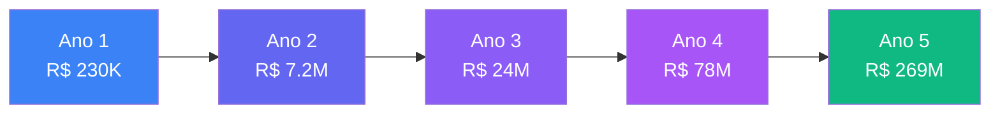
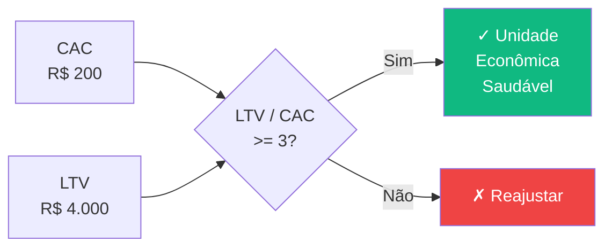
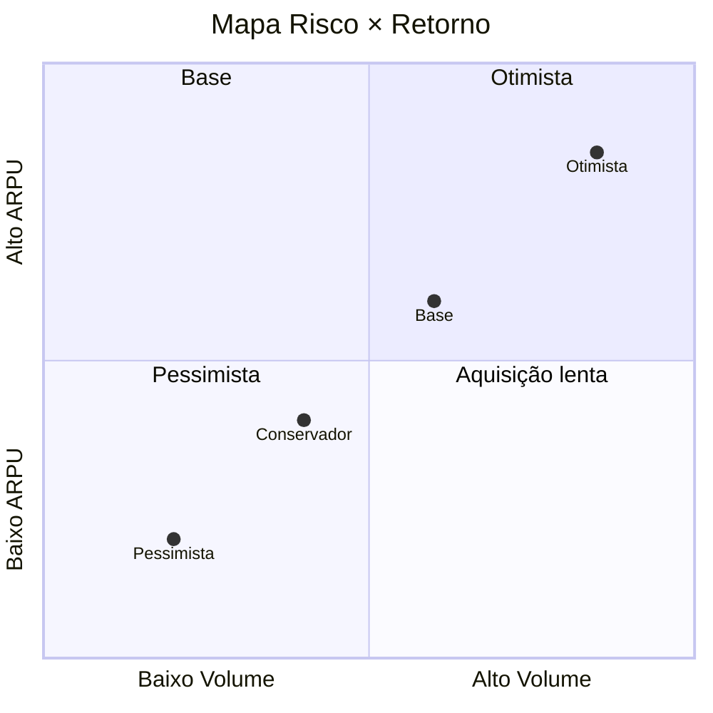
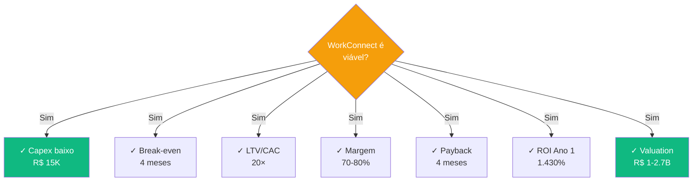

# Viabilidade Econômica

> **TL;DR** · Investimento: **R$ 15K**. Break-even: **58 clientes** (~4 meses). ROI Ano 1: **1.430%**. Margem bruta: **70-80%**. LTV/CAC: **20×** (4× saudável). Valuation projetado Ano 5: **R$ 1-2,7 bi**. WorkConnect é o **investimento de risco alto com altíssimo retorno potencial** que se compara a venture capital.

:::info Onde estamos no Sequoia Pitch
Este doc serve a **Financials + Traction + Ask** da Sequoia pitch structure. Também responde o "evite a falha / alcance o sucesso" do StoryBrand com números reais: o que o cliente perde se **não** agir vs. o que ganha se agir.
:::

---

## Layer 1 — A Decisão Financeira em 60s



---

## Layer 2 — StoryBrand Success vs. Failure (a outra face da moeda)

StoryBrand mostra que a decisão do cliente é **dupla**: evitar a falha (medo) + alcançar o sucesso (desejo). Aplicamos isso aqui com os números reais.

### Se **não** agir — StoryBrand Failure (próximo slide)


**Custo de não agir (cliente):** ~R$ 500K/ano em perdas operacionais, sem contar risco regulatório LGPD.

### Se **agir** com WorkConnect — StoryBrand Success (próximo slide)



**ROI do cliente:** cada R$ 1 gasto retorna R$ 80 em economia no primeiro ano (payback do cliente em 4 meses).

---

## Layer 3 — Sequoia Financials: O Cálculo do Lado da Empresa

### Sequoia 1 — Investimento (Capex)

| Categoria | Item | Custo |
|-----------|------|-------|
| Infraestrutura | Vercel Pro (6 meses) | R$ 1.200 |
| Infraestrutura | Supabase Pro (6 meses) | R$ 1.500 |
| Ferramentas | Domínio + SSL | R$ 200 |
| Ferramentas | GitHub Pro | R$ 600 |
| Hardware | Notebooks (×2) | R$ 8.000 |
| Marketing | Beta acquisition | R$ 1.500 |
| Contingência | 15% reserva | R$ 2.000 |
| **TOTAL** | — | **R$ 15.000** |

**Por que R$ 15K é viável:**

| Comparação | Investimento | Multiplicador |
|------------|--------------|---------------|
| ERP tradicional (TOTVS/SAP) | R$ 200K - R$ 2M | **13-130× maior** |
| SaaS concorrente enterprise | R$ 50K - R$ 100K | **3-7× maior** |
| App sob encomenda | R$ 80K - R$ 300K | **5-20× maior** |

### Sequoia 2 — OPEX Mensal (Custos Fixos)

| Categoria | Valor/mês | % |
|-----------|-----------|---|
| Pessoal (2 devs + encargos) | R$ 15.000 | 86,7% |
| Infraestrutura (cloud + DB + email) | R$ 600 | 3,5% |
| Software (licenças) | R$ 300 | 1,7% |
| Marketing (ads + conteúdo) | R$ 1.000 | 5,8% |
| Suporte (helpdesk) | R$ 500 | 2,9% |
| **TOTAL** | **R$ 17.300** | 100% |

### Sequoia 3 — COGS Variável (Custo por Cliente)

| Recurso | Custo Unitário |
|---------|----------------|
| Servidor (Vercel) | R$ 2,00 |
| Banco de dados (Supabase) | R$ 3,00 |
| Email transacional | R$ 1,00 |
| Suporte humano | R$ 2,00 |
| **Total por cliente/mês** | **R$ 8,00** |

**Implicação brutal:** cada novo cliente paga seu custo variável no primeiro dia. Não há "prejuízo de aquisição" — quanto mais clientes, mais lucro.

### Sequoia 4 — Margem de Contribuição por Plano

| Plano | Preço | Custo Variável | Margem | Markup |
|-------|-------|----------------|--------|--------|
| **Básico** | R$ 149 | R$ 8 | **R$ 141** | 94,6% |
| **Profissional** | R$ 299 | R$ 8 | **R$ 291** | 97,3% |
| **Enterprise** | R$ 599 | R$ 8 | **R$ 591** | 98,7% |

> Software tem custo marginal ≈ 0. **Margem bruta alvo: 70-80%.**

---

## Layer 4 — Ponto de Equilíbrio (Break-Even)

### Cálculo

```
PE = Custos Fixos / Margem de Contribuição Unitária Média

Com mix early-stage 80% Básico + 20% Pro:
PE = R$ 17.300 / (0,80 × 141 + 0,20 × 291)
PE = R$ 17.300 / R$ 171
PE ≈ 101 clientes
```

### Trajetória até o Break-Even



> **Premissa:** 15 novos clientes/mês (combinação orgânico + ads + indicação). Em ritmo agressivo (25/mês), break-even no **Mês 2-3**.

---

## Layer 5 — Projeção de Receita (5 Anos)

### Premissas-Chave

| Premissa | Valor | Fonte |
|----------|-------|-------|
| Crescimento anual de clientes | 5× | Benchmark SaaS B2B early-stage |
| Churn mensal | 5% (ano 1) → 3% (ano 5) | Benchmark SaaS |
| Upsell anual | 15% migram para plano superior | Histórico SaaS |
| ARPU médio | R$ 200 (ano 1) → R$ 314 (ano 5) | Mix evoluindo |

### P&L Consolidado

| Ano | Clientes | MRR | Receita | Custos | Lucro Líq | Margem |
|-----|----------|-----|---------|--------|-----------|--------|
| **1** | 200 | R$ 40K | R$ 230K | R$ 207K | **R$ 23K** | 10% |
| **2** | 2.500 | R$ 600K | R$ 7.2M | R$ 6.1M | **R$ 1.1M** | 15% |
| **3** | 8.000 | R$ 2.0M | R$ 24M | R$ 19.2M | **R$ 4.8M** | 20% |
| **4** | 25.000 | R$ 6.5M | R$ 78M | R$ 58.5M | **R$ 19.5M** | 25% |
| **5** | 75.000 | R$ 22.4M | R$ 269M | R$ 188M | **R$ 81M** | 30% |

### Visualização do Crescimento



---

## Layer 6 — Payback e ROI

### Payback

```
Payback = Investimento Inicial / Lucro Médio Mensal (pós-break-even)

Payback = R$ 15.000 / R$ 5.750 ≈ 2.6 meses (contábil)
Payback incluindo ramp-up = 4 meses
```

| Métrica | Valor | Benchmark SaaS |
|---------|-------|----------------|
| **Payback** | **~4 meses** | 12-18 meses (mediana) |
| **ROI Ano 1** | **1.430%** | 200-400% (mediana) |
| **ROI Ano 3 acumulado** | **42.000%** | 800-1.500% (mediana) |

---

## Layer 7 — Unit Economics (CAC, LTV, LTV/CAC)

### As 5 Métricas Que Definem Saúde do SaaS



### CAC (Custo de Aquisição de Cliente)

| Canal | Custo | Clientes/mês | CAC Efetivo |
|-------|-------|--------------|-------------|
| Indicação | R$ 0 | 5 | R$ 0 |
| Orgânico (SEO) | R$ 500 | 8 | R$ 62 |
| Google Ads | R$ 4.000 | 20 | R$ 200 |
| LinkedIn Ads | R$ 2.500 | 10 | R$ 250 |
| **Média ponderada** | **R$ 7.000** | **43** | **R$ 163** |

**CAC conservador adotado:** R$ 200

### LTV (Lifetime Value)

```
LTV = ARPU / Churn Mensal

Conservador (ARPU 200, churn 5%) = R$ 4.000
Base (ARPU 250, churn 4%) = R$ 6.250
Otimista (ARPU 314, churn 3%) = R$ 10.467
```

### LTV/CAC

| Métrica | Valor | Benchmark saudável |
|---------|-------|---------------------|
| **LTV/CAC (conservador)** | **20×** | >3× |
| **Payback do CAC** | **1 mês** | &lt;12 meses |

> **Insight:** Mesmo que CAC dobre (R$ 400) ou churn triplique (15%), LTV/CAC ainda é 6,7× — saudável. O negócio tem **margem de manobra grande para errar**.

---

## Layer 8 — Análise de Sensibilidade (4 Cenários)

### Cenários Combinados

| Cenário | Clientes Ano 1 | ARPU | Receita | Lucro | ROI |
|---------|----------------|------|---------|-------|-----|
| **Pessimista** | 80 | R$ 150 | R$ 144K | -R$ 40K | -167% |
| **Conservador** | 200 | R$ 200 | R$ 230K | R$ 23K | 153% |
| **Base** | 400 | R$ 250 | R$ 570K | R$ 226K | 1.500% |
| **Otimista** | 800 | R$ 300 | R$ 1.3M | R$ 850K | 5.600% |



### Variáveis Mais Sensíveis (em ordem)

1. **Taxa de aquisição mensal** — 10% de variação move break-even ±1 mês
2. **Churn** — 1 pp a mais custa ~R$ 80K no LTV
3. **ARPU** — R$ 50 a mais no ticket = +R$ 120K receita/ano com 200 clientes
4. **CAC** — R$ 100 a mais = payback estende em 1 mês

---

## Layer 9 — Valuation Simplificado (Método Venture)

### Projeção Ano 5 + Múltiplo de Receita

| Métrica | Valor |
|---------|-------|
| Receita Ano 5 | R$ 269M |
| Múltiplo SaaS B2B (mercado) | 6-10× ARR |
| **Valuation (base)** | **R$ 1.6B - R$ 2.7B** |
| Valuation (conservador, 4× ARR) | **R$ 1.0B** |

### Múltiplo Sobre Capital Investido

```
Base: R$ 1.6B / R$ 15K = 107.000×
Conservador: R$ 1B / R$ 15K = 67.000×
```

> Mesmo no cenário mais pessimista (valuation R$ 200M), o múltiplo seria **13.000×** sobre o capital investido.

---

## Layer 10 — Comparação com Alternativas

| Alternativa | Investimento | Retorno Ano 1 | Risco |
|-------------|--------------|---------------|-------|
| **WorkConnect (base)** | R$ 15K | +R$ 226K (1.500%) | Alto |
| **CDB / Tesouro Selic** | R$ 15K | +R$ 1,5K (10%) | Baixo |
| **FII de papel** | R$ 15K | +R$ 1,2K (8%) | Médio |
| **Ações (Ibovespa médio)** | R$ 15K | +R$ 1,8K (12%) | Alto |
| **Revender um ERP** | R$ 80K | +R$ 50K (62%) | Médio |

> **Trade-off claro:** WorkConnect compete com venture capital, não com renda fixa. Vantagem: constrói um **ativo real** (empresa, marca, base de clientes).

---

## Síntese Executiva



---

## Próximo Passo na Narrativa

| Se você quer... | Vá para |
|-----------------|---------|
| Entender **quão grande é o mercado** e por que agora | [Análise de Mercado →](./analise-mercado) |
| Voltar à **narrativa central** (Personagem → Problema → Guia) | [Problema → Mecanismo → Solução →](./problema-mecanismo-solucao) |
| Ver o **business model completo** (9 blocos) | [BM Canvas →](./bmc-canvas) |
| Entender o **plano de ataque** fase a fase | [Go-to-Market →](./go-to-market) |

---

## Referências

- **SaaS Metrics 2.0** — David Skok (Matrix Partners)
- **The SaaS Playbook** — Rob Walling
- **Vanity Sucks** — Tomasz Tunguz
- **SEBRAE** — Dados de PME e Simulador de Viabilidade
- **WorkConnect** — Premissas e modelagem interna (conservadora)