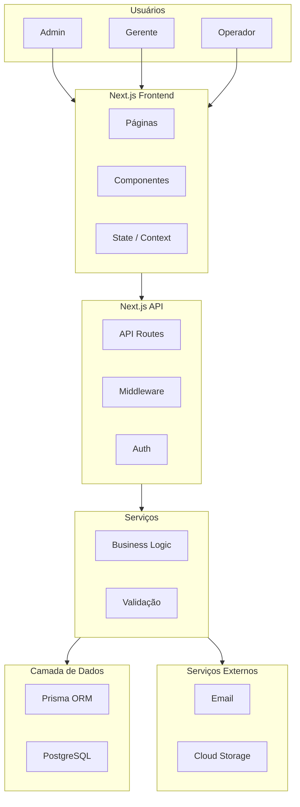
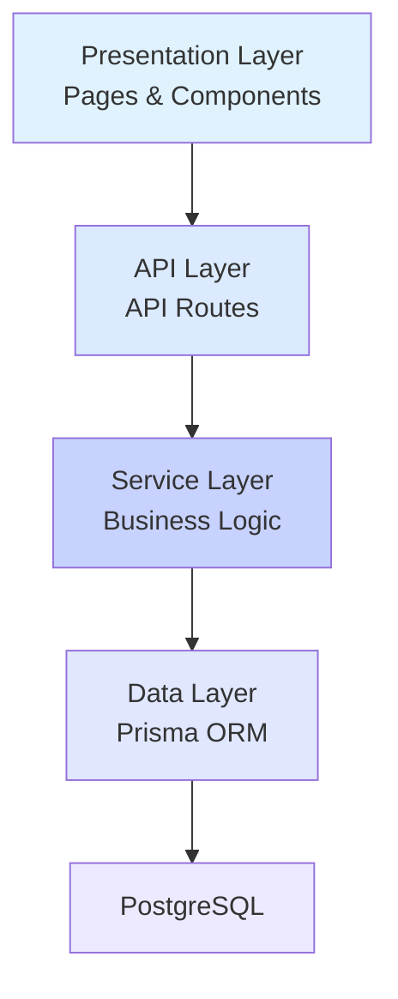
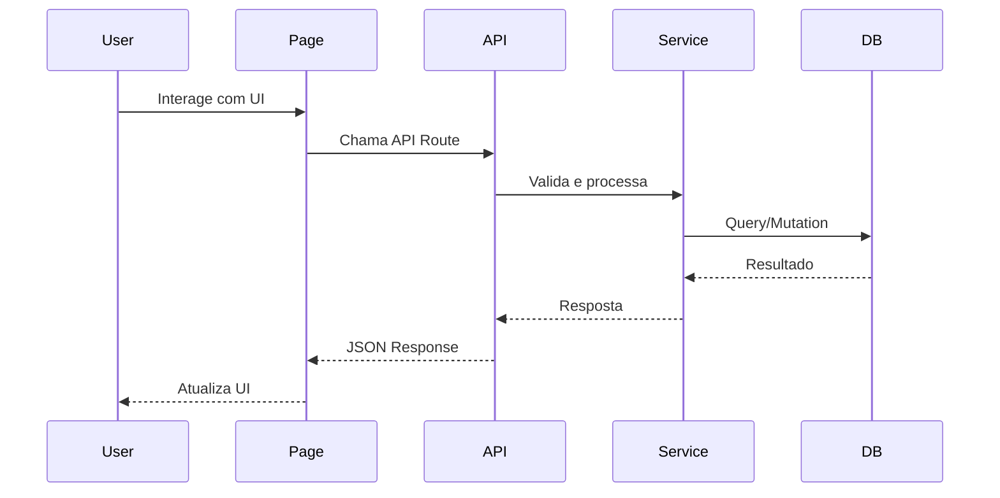
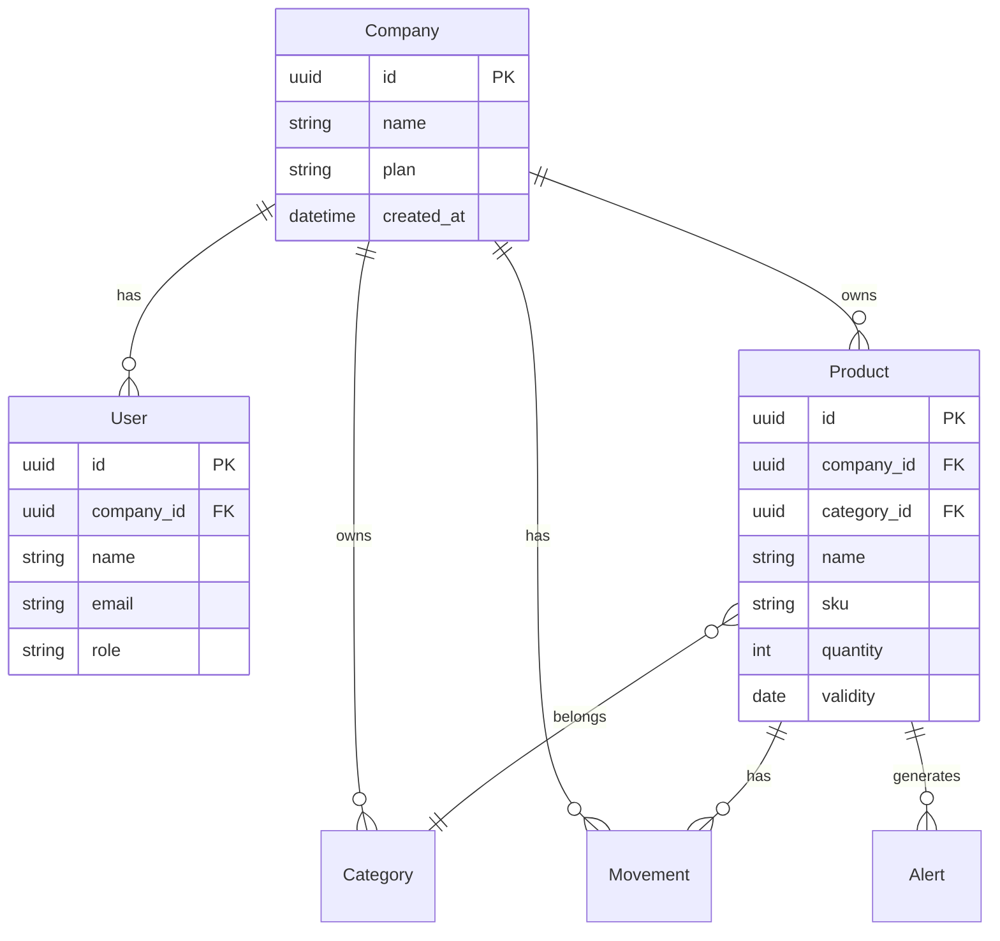
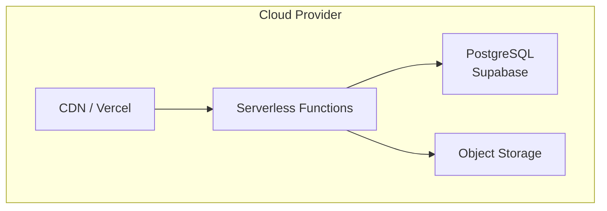
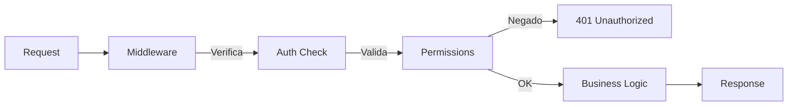

# Arquitetura do Sistema

## Visão Geral da Arquitetura

O WorkConnect segue uma arquitetura moderna baseada em **Next.js** com separação clara de responsabilidades.

## Arquitetura de Alto Nível



## Padrão de Camadas



### Descrição das Camadas

| Camada | Responsabilidade | Exemplos |
|--------|------------------|----------|
| **Presentation** | UI, renderização, interação | Pages, Components, Hooks |
| **API** | HTTP, autenticação, rate limiting | API Routes, Middleware |
| **Service** | Lógica de negócio, validação | Services, Validators |
| **Data** | Acesso ao banco, queries | Prisma, Repositories |

## Estrutura de Diretórios

```
src/
├── app/                    # Next.js App Router
│   ├── (auth)/           # Rotas de autenticação
│   ├── (dashboard)/      # Rotas protegidas
│   ├── api/              # API Routes
│   └── layout.tsx        # Layout root
├── components/            # Componentes React
│   ├── ui/              # Componentes base
│   ├── forms/           # Formulários
│   └── charts/          # Gráficos
├── lib/                  # Utilitários
│   ├── db.ts            # Conexão Prisma
│   ├── auth.ts         # Config Auth
│   └── utils.ts        # Funções helpers
├── services/             # Lógica de negócio
├── types/               # TypeScript types
└── styles/              # Estilos globais
```

## Fluxo de Dados



## Design Patterns Utilizados

### 1. Repository Pattern

```typescript
// Exemplo simplificado
interface ProductRepository {
  findAll(): Promise<Product[]>;
  findById(id: string): Promise<Product | null>;
  create(data: CreateProductDTO): Promise<Product>;
  update(id: string, data: UpdateProductDTO): Promise<Product>;
  delete(id: string): Promise<void>;
}
```

### 2. Service Layer

```typescript
// Exemplo simplificado
class ProductService {
  constructor(private repository: ProductRepository) {}
  
  async createProduct(data: CreateProductDTO) {
    const validated = this.validate(data);
    return this.repository.create(validated);
  }
}
```

### 3. Factory Pattern

```typescript
// Exemplo simplificado
class AlertFactory {
  static createAlert(type: AlertType, data: AlertData): Alert {
    switch (type) {
      case 'VALIDITY':
        return new ValidityAlert(data);
      case 'STOCK':
        return new StockAlert(data);
      // ...
    }
  }
}
```

## Database Schema (Simplificado)



## Infraestrutura



## Segurança



## Próximos Passos

- [Tecnologias Utilizadas](./tecnologias) - Detalhes da stack
- [BM Canvas](../estrategia/bmc-canvas) - Modelo de negócio
