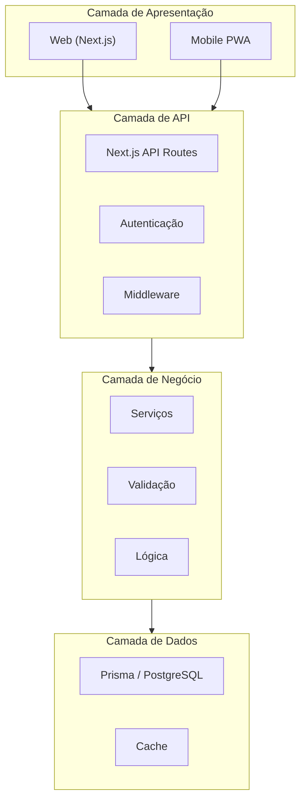

# Introdução Técnica

## Visão Geral

Esta seção apresenta a documentação técnica do **WorkConnect**, incluindo arquitetura, tecnologias utilizadas e detalhes de implementação.

## Objetivos desta Documentação

1. **Facilitar a contribuição** de novos desenvolvedores
2. **Documentar decisões técnicas** (ADRs)
3. **Guiar a implementação** de novas funcionalidades
4. **Manter a consistência** do código

## Estrutura Técnica



## Stack Tecnológico

| Componente | Tecnologia | Versão |
|------------|------------|--------|
| Frontend | Next.js | 14+ |
| Backend | Next.js API | 14+ |
| Database | PostgreSQL | 15+ |
| ORM | Prisma | 5.x |
| Styling | Tailwind CSS | 3.x |
| Auth | NextAuth.js | 5.x |
| Deploy | Vercel/Netlify | - |

## Quick Links

- [Arquitetura do Sistema](./arquitetura)
- [Tecnologias Utilizadas](./tecnologias)
- [BM Canvas](../estrategia/bmc-canvas)
- [PM Canvas](../estrategia/pm-canvas)

## Requisitos para Desenvolvimento

```bash
# Node.js
node --version  # >= 18.x

# Package Manager
npm --version   # >= 9.x

# Banco de Dados
postgresql      # >= 15.x
```

## Próximos Passos

Explore a [Arquitetura do Sistema](./arquitetura) para entender como os componentes se comunicam.
