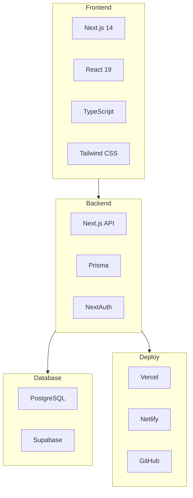
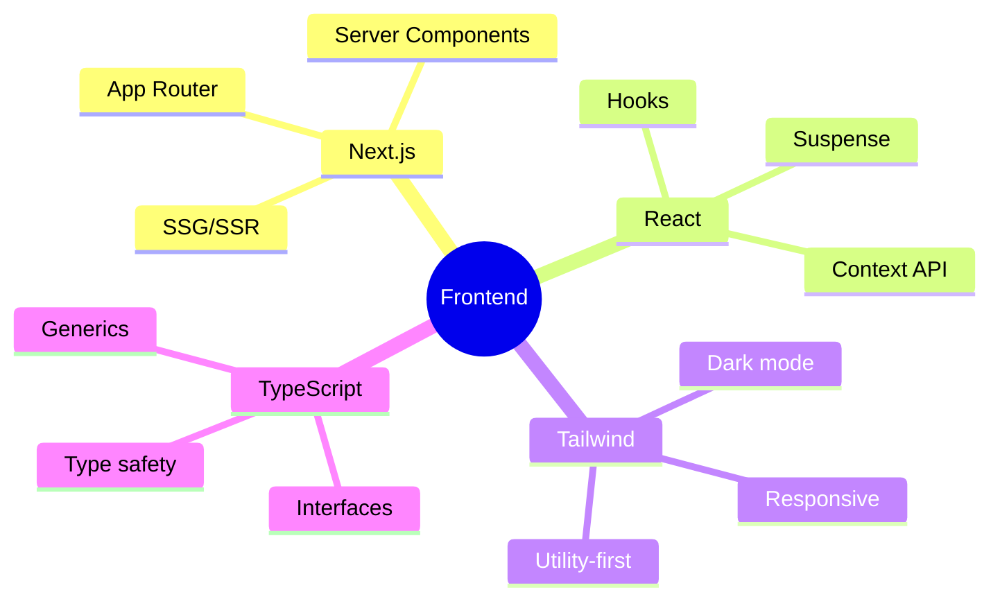
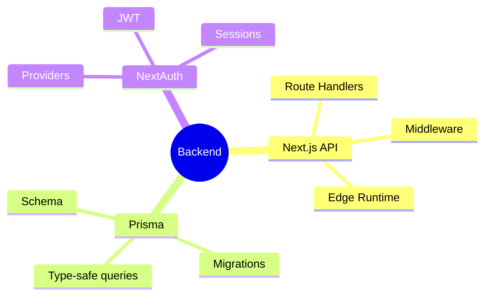
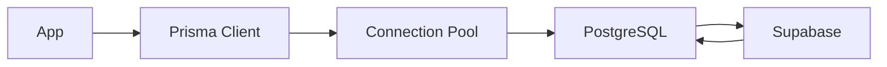
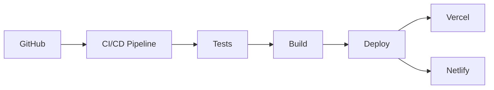
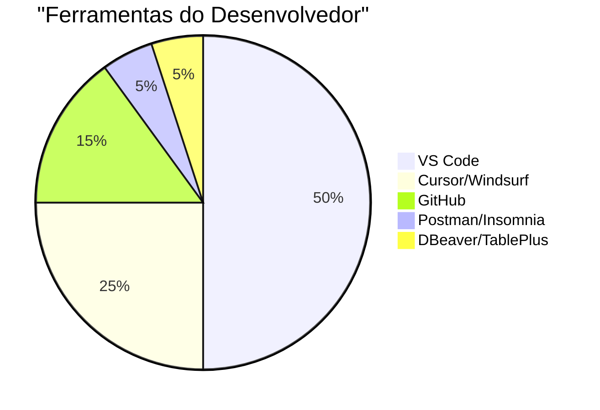

# Tecnologias Utilizadas

## Visão Geral do Stack



## Tabela de Tecnologias

| Categoria | Tecnologia | Versão | Descrição |
|-----------|------------|--------|------------|
| **Framework** | Next.js | 14.x | React full-stack |
| **Linguagem** | TypeScript | 5.x | Tipagem estática |
| **UI** | Tailwind CSS | 3.x | Utility-first CSS |
| **Database** | PostgreSQL | 15+ | Banco relacional |
| **ORM** | Prisma | 5.x | ORM type-safe |
| **Auth** | NextAuth.js | 4.x | Autenticação |
| **Forms** | React Hook Form | 7.x | Gerenciamento forms |
| **Validation** | Zod | 3.x | Schema validation |
| **Charts** | Chart.js/Recharts | 4.x | Visualização dados |
| **Icons** | Lucide React | 0.x | Ícones |

## Detalhes por Camada

### Frontend



#### Componentes UI

| Biblioteca | Uso |
|------------|-----|
| **Radix UI** | Componentes acessíveis |
| **Headless UI** | Componentes sem estilo |
| **Framer Motion** | Animações |
| **React Query** | Data fetching |

### Backend



### Database



#### Modelos Principais

| Modelo | Descrição |
|--------|-----------|
| **Company** | Empresa/Organização |
| **User** | Usuários do sistema |
| **Product** | Produtos do estoque |
| **Category** | Categorias de produtos |
| **Movement** | Movimentações (entrada/saída) |
| **Alert** | Alertas do sistema |
| **Report** | Relatórios gerados |

### Deploy



## Ferramentas de Desenvolvimento



| Categoria | Ferramenta |
|-----------|------------|
| **IDE** | VS Code, Cursor |
| **Versionamento** | Git + GitHub |
| **API Client** | Postman, Insomnia |
| **DB Client** | DBeaver, TablePlus |
| **Terminal** | PowerShell, Windows Terminal |
| **Browser** | Chrome DevTools |

## Bibliotecas Auxiliares

### Utils & Helpers

| Biblioteca | Uso |
|------------|-----|
| **date-fns** | Manipulação de datas |
| **clsx** | Condicional classes |
| **tailwind-merge** | Merge Tailwind classes |
| **lodash** | Utilitários JS |
| **uuid** | Geração de IDs |

### UI Components

| Biblioteca | Uso |
|------------|-----|
| **react-hot-toast** | Notificações toast |
| **react-select** | Select dropdowns |
| **react-dropzone** | Upload de arquivos |
| **recharts** | Gráficos |

## Ambiente de Desenvolvimento

```bash
# Variáveis de ambiente necessárias
DATABASE_URL=postgresql://...
NEXTAUTH_SECRET=...
NEXTAUTH_URL=http://localhost:3000

# Scripts disponíveis
npm run dev          # Desenvolvimento
npm run build        # Build produção
npm run lint        # Verificar código
npm run db:push     # Sync Prisma
npm run db:studio   # Studio Prisma
```

## Padrões de Código

### ESLint + Prettier

```json
{
  "extends": [
    "next/core-web-vitals",
    "prettier"
  ],
  "rules": {
    "@typescript-eslint/no-unused-vars": "error",
    "react-hooks/exhaustive-deps": "warn"
  }
}
```

### Conventional Commits

```bash
# Exemplos de commits
git commit -m "feat: add product inventory tracking"
git commit -m "fix: resolve stock alert calculation"
git commit -m "docs: update API documentation"
```

## Próximos Passos

- [Introdução Técnica](./intro) - Overview do sistema
- [Arquitetura](./arquitetura) - Detalhes arquiteturais
- [BM Canvas](../estrategia/bmc-canvas) - Modelo de negócio
