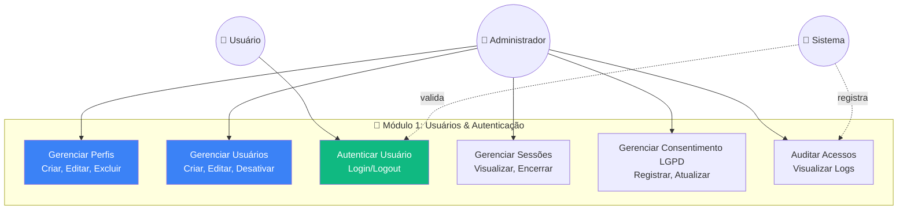
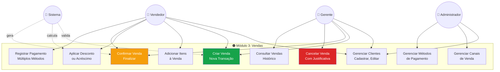
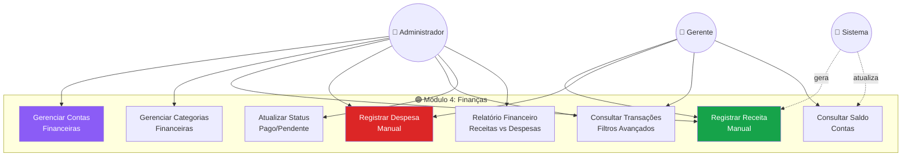
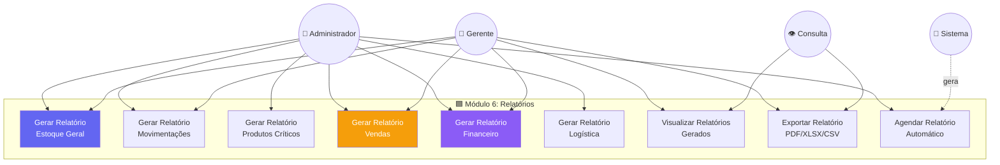
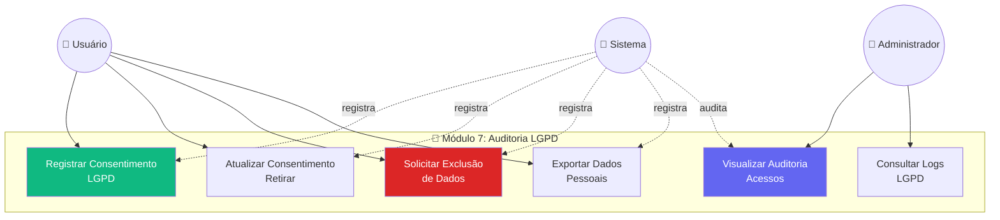

# WorkConnect - Diagrama de Casos de Uso
## Diagrama Completo de Casos de Uso do Sistema

---

## Visão Geral

Este diagrama representa todos os **casos de uso** do WorkConnect, organizados por módulos e atores.

**Total de Casos de Uso:** 50+  
**Total de Atores:** 5  
**Total de Módulos:** 7

---

## Diagrama Geral do Sistema

```mermaid
graph TB
    subgraph "WorkConnect - Sistema Completo"
        subgraph M1["🔵 Módulo 1: Usuários & Autenticação"]
            UC1A[Gerenciar Usuários]
            UC1B[Gerenciar Perfis]
            UC1C[Autenticar Usuário]
        end
        
        subgraph M2["🟢 Módulo 2: Inventário"]
            UC2A[Gerenciar Produtos]
            UC2B[Gerenciar Categorias]
            UC2C[Gerenciar Fornecedores]
            UC2D[Gerenciar Movimentações]
            UC2E[Gerenciar Alertas]
        end
        
        subgraph M3["🟠 Módulo 3: Vendas"]
            UC3A[Gerenciar Clientes]
            UC3B[Processar Vendas]
            UC3C[Gerenciar Pagamentos]
        end
        
        subgraph M4["🟣 Módulo 4: Finanças"]
            UC4A[Gerenciar Contas]
            UC4B[Gerenciar Transações]
            UC4C[Gerenciar Categorias Financeiras]
        end
        
        subgraph M5["🔴 Módulo 5: Logística"]
            UC5A[Gerenciar Pedidos]
            UC5B[Gerenciar Envios]
            UC5C[Gerenciar Rotas]
        end
        
        subgraph M6["🟦 Módulo 6: Relatórios"]
            UC6A[Gerar Relatórios]
            UC6B[Visualizar Relatórios]
        end
        
        subgraph M7["🔴 Módulo 7: Auditoria LGPD"]
            UC7A[Auditar Acessos]
            UC7B[Gerenciar Consentimentos]
        end
    end
    
    Admin((👤 Administrador))
    Gerente((👔 Gerente))
    Operador((👷 Operador))
    Consulta((👁️ Consulta))
    Vendedor((💼 Vendedor))
    Sistema((🤖 Sistema<br/>Automático))
    
    Admin --> UC1A
    Admin --> UC1B
    Admin --> UC2A
    Admin --> UC2B
    Admin --> UC2C
    Admin --> UC3A
    Admin --> UC4A
    Admin --> UC4B
    Admin --> UC5A
    Admin --> UC6A
    Admin --> UC7A
    Admin --> UC7B
    
    Gerente --> UC2A
    Gerente --> UC2D
    Gerente --> UC2E
    Gerente --> UC3B
    Gerente --> UC4B
    Gerente --> UC5A
    Gerente --> UC6A
    
    Operador --> UC2D
    Operador --> UC5A
    
    Consulta --> UC6B
    
    Vendedor --> UC3A
    Vendedor --> UC3B
    Vendedor --> UC3C
    
    Sistema -.->|automático| UC2E
    Sistema -.->|calcula| UC2A
    Sistema -.->|gera| UC4B
    
    style Admin fill:#dc2626,color:#fff
    style Gerente fill:#f59e0b,color:#fff
    style Operador fill:#3b82f6,color:#fff
    style Consulta fill:#10b981,color:#fff
    style Vendedor fill:#8b5cf6,color:#fff
    style Sistema fill:#6366f1,color:#fff
    
    style M1 fill:#3b82f6,color:#fff
    style M2 fill:#10b981,color:#fff
    style M3 fill:#f59e0b,color:#fff
    style M4 fill:#8b5cf6,color:#fff
    style M5 fill:#ec4899,color:#fff
    style M6 fill:#6366f1,color:#fff
    style M7 fill:#ef4444,color:#fff
```



---

## Módulo 1: Usuários & Autenticação



---

## Módulo 2: Inventário (Estoque)

```mermaid
graph TB
    Admin((👤 Administrador))
    Gerente((👔 Gerente))
    Operador((👷 Operador))
    Sistema((🤖 Sistema))
    
    subgraph "🟢 Módulo 2: Inventário"
        UC201[Gerenciar Categorias<br/>Hierárquicas]
        UC202[Cadastrar Produto]
        UC203[Editar Produto]
        UC204[Excluir Produto<br/>Soft Delete]
        UC205[Buscar Produto<br/>Código ou Nome]
        UC206[Definir Níveis<br/>Mínimo/Máximo]
        UC207[Visualizar Histórico<br/>do Produto]
        UC208[Gerenciar Fornecedores<br/>Cadastrar, Vincular]
        UC209[Registrar Entrada<br/>Compra/Devolução]
        UC210[Registrar Saída<br/>Venda/Perda]
        UC211[Ajustar Inventário<br/>Correções]
        UC212[Consultar Movimentações<br/>Histórico Completo]
        UC213[Visualizar Alertas<br/>Reposição]
        UC214[Resolver Alerta<br/>Marcar como Resolvido]
        UC215[Gerenciar Armazéns<br/>Cadastrar, Atualizar]
    end
    
    Admin --> UC201
    Admin --> UC202
    Admin --> UC203
    Admin --> UC204
    Admin --> UC206
    Admin --> UC208
    Admin --> UC211
    Admin --> UC215
    
    Gerente --> UC202
    Gerente --> UC203
    Gerente --> UC205
    Gerente --> UC207
    Gerente --> UC209
    Gerente --> UC210
    Gerente --> UC212
    Gerente --> UC213
    Gerente --> UC214
    
    Operador --> UC209
    Operador --> UC210
    Operador --> UC212
    
    Sistema -.->|calcula| UC206
    Sistema -.->|gera| UC213
    Sistema -.->|atualiza| UC202
    
    style UC202 fill:#16a34a,color:#fff
    style UC206 fill:#f59e0b,color:#fff
    style UC213 fill:#dc2626,color:#fff
```



---

## Módulo 3: Vendas



---

## Módulo 4: Finanças



---

## Módulo 5: Logística

```mermaid
graph TB
    Admin((👤 Administrador))
    Gerente((👔 Gerente))
    Operador((👷 Operador))
    Sistema((🤖 Sistema))
    
    subgraph "🔴 Módulo 5: Logística"
        UC501[Gerenciar Armazéns<br/>Cadastrar, Atualizar]
        UC502[Criar Pedido<br/>Logístico]
        UC503[Adicionar Itens<br/>ao Pedido]
        UC504[Separar Itens<br/>Fulfillment]
        UC505[Empacotar Pedido<br/>Preparar Envio]
        UC506[Criar Envio<br/>Rastreamento]
        UC507[Vincular Transportadora<br/>ou Rota]
        UC508[Atualizar Status<br/>Envio]
        UC509[Gerenciar Rotas<br/>Criar, Atualizar]
        UC510[Gerenciar Motoristas<br/>Cadastrar, Atualizar]
        UC511[Gerenciar Transportadoras<br/>Cadastrar, Atualizar]
        UC512[Consultar Pedidos<br/>Status e Histórico]
    end
    
    Admin --> UC501
    Admin --> UC509
    Admin --> UC510
    Admin --> UC511
    
    Gerente --> UC502
    Gerente --> UC505
    Gerente --> UC506
    Gerente --> UC512
    
    Operador --> UC503
    Operador --> UC504
    Operador --> UC508
    
    Sistema -.->|gera| UC502
    Sistema -.->|atualiza| UC504
    
    style UC502 fill:#16a34a,color:#fff
    style UC504 fill:#f59e0b,color:#fff
    style UC506 fill:#3b82f6,color:#fff
```



---

## Módulo 6: Relatórios



---

## Módulo 7: Auditoria LGPD



---

## Legenda

### Atores

- **👤 Administrador** - Acesso total ao sistema
- **👔 Gerente** - Acesso gerencial aos módulos
- **👷 Operador** - Acesso operacional limitado
- **👁️ Consulta** - Acesso somente leitura
- **💼 Vendedor** - Acesso ao módulo de vendas
- **🤖 Sistema** - Processos automáticos

### Tipos de Relacionamento

- **→** : Associação (ator executa caso de uso)
- **-.->** : Associação automática (sistema executa automaticamente)

### Cores por Módulo

- **🔵 Módulo 1 (Usuários):** Azul (#3b82f6)
- **🟢 Módulo 2 (Inventário):** Verde (#10b981)
- **🟠 Módulo 3 (Vendas):** Laranja (#f59e0b)
- **🟣 Módulo 4 (Finanças):** Roxo (#8b5cf6)
- **🔴 Módulo 5 (Logística):** Rosa (#ec4899)
- **🟦 Módulo 6 (Relatórios):** Índigo (#6366f1)
- **🔴 Módulo 7 (Auditoria):** Vermelho (#ef4444)

---

## Resumo de Casos de Uso por Módulo

### Módulo 1: Usuários & Autenticação
- **Total:** 6 casos de uso
- **Atores:** Administrador, Usuário, Sistema

### Módulo 2: Inventário
- **Total:** 15 casos de uso
- **Atores:** Administrador, Gerente, Operador, Sistema

### Módulo 3: Vendas
- **Total:** 10 casos de uso
- **Atores:** Administrador, Gerente, Vendedor, Sistema

### Módulo 4: Finanças
- **Total:** 8 casos de uso
- **Atores:** Administrador, Gerente, Sistema

### Módulo 5: Logística
- **Total:** 12 casos de uso
- **Atores:** Administrador, Gerente, Operador, Sistema

### Módulo 6: Relatórios
- **Total:** 9 casos de uso
- **Atores:** Administrador, Gerente, Consulta, Sistema

### Módulo 7: Auditoria LGPD
- **Total:** 6 casos de uso
- **Atores:** Administrador, Usuário, Sistema

**Total Geral:** 66 casos de uso

---

## Fluxos Principais

### Fluxo: Venda Completa

```
1. Vendedor → Criar Venda (UC302)
2. Vendedor → Adicionar Itens (UC303)
3. Vendedor → Aplicar Desconto (UC304)
4. Vendedor → Confirmar Venda (UC305)
   │
   ├─► Sistema → Gerar Movimentação de Estoque (automático)
   │
   ├─► Vendedor → Registrar Pagamento (UC307)
   │   │
   │   └─► Sistema → Gerar Transação Financeira (automático)
   │
   └─► Sistema → Gerar Pedido Logístico (automático)
       │
       └─► Operador → Separar Itens (UC504)
```

### Fluxo: Reposição de Estoque

```
1. Sistema → Gerar Alerta de Reposição (automático - UC213)
2. Gerente → Visualizar Alertas (UC213)
3. Gerente → Registrar Entrada (UC209)
   │
   ├─► Sistema → Atualizar Quantidade (automático)
   │
   └─► Sistema → Recalcular Status (automático)
```

---

**Versão:** 1.0.0  
**Data:** 2025-01-12  
**Autor:** WorkConnect Development Team

**Referências:**
- [Modelo Conceitual Completo](../models/MODELO_CONCEITUAL_COMPLETO.md)
- [Modelo Lógico Completo](../models/MODELO_LOGICO_COMPLETO.md)

