# WorkConnect - ERD Conceitual
## Diagrama Entidade-Relacionamento do Modelo Conceitual

---

## Visão Geral

Este diagrama representa o **modelo conceitual** do WorkConnect, mostrando todas as entidades e seus relacionamentos sem detalhes técnicos de implementação.

**Total de Entidades:** 30+  
**Total de Relacionamentos:** 50+  
**Módulos:** 7

---

## Diagrama Completo

```mermaid
erDiagram
    %% ============================================
    %% MÓDULO 1: USUÁRIOS & AUTENTICAÇÃO
    %% ============================================
    PERFIL ||--o{ USUARIO : "tem"
    USUARIO ||--o{ SESSAO : "possui"
    
    PERFIL {
        bigint id PK
        string nome UK
        json permissoes
        timestamp data_criacao
    }
    
    USUARIO {
        bigint id PK
        string nome
        string email UK
        string hash_senha
        bigint perfil_id FK
        boolean ativo
        boolean consentimento_lgpd
        timestamp data_consentimento
        timestamp data_exclusao_solicitada
    }
    
    SESSAO {
        bigint id PK
        bigint usuario_id FK
        string token UK
        string ip_address
        timestamp data_expiracao
        boolean ativo
    }
    
    %% ============================================
    %% MÓDULO 2: INVENTÁRIO (ESTOQUE)
    %% ============================================
    CATEGORIA ||--o{ CATEGORIA : "subcategoria"
    CATEGORIA ||--o{ PRODUTO : "classifica"
    PRODUTO }o--o{ FORNECEDOR : "fornecido_por"
    PRODUTO ||--o{ MOVIMENTACAO_ESTOQUE : "tem"
    PRODUTO ||--o{ ALERTA_REPOSICAO : "gera"
    USUARIO ||--o{ MOVIMENTACAO_ESTOQUE : "cria"
    ARMAZEM ||--o{ PRODUTO : "armazena"
    
    CATEGORIA {
        bigint id PK
        string nome
        string descricao
        bigint categoria_pai_id FK
        boolean ativo
    }
    
    PRODUTO {
        bigint id PK
        string codigo UK
        string nome
        bigint categoria_id FK
        int quantidade_atual
        int quantidade_minima
        int quantidade_maxima
        decimal preco_aquisicao
        decimal preco_venda
        decimal custo_medio_ponderado
        string status
        bigint armazem_id FK
        boolean ativo
    }
    
    FORNECEDOR {
        bigint id PK
        string razao_social
        string cnpj UK
        string email
        string telefone
        int tempo_medio_entrega_dias
        decimal avaliacao
        boolean ativo
    }
    
    PRODUTO_FORNECEDOR {
        bigint id PK
        bigint produto_id FK
        bigint fornecedor_id FK
        decimal preco_atual
        int prioridade
    }
    
    MOVIMENTACAO_ESTOQUE {
        bigint id PK
        bigint produto_id FK
        bigint usuario_id FK
        string tipo
        int quantidade
        decimal preco_unitario
        bigint venda_id FK
        timestamp data_hora
    }
    
    ALERTA_REPOSICAO {
        bigint id PK
        bigint produto_id FK
        int quantidade_sugerida
        string prioridade
        boolean visualizado
        timestamp data_alerta
    }
    
    ARMAZEM {
        bigint id PK
        string nome
        string endereco
        int capacidade
        int capacidade_atual
        bigint responsavel_id FK
        boolean ativo
    }
    
    %% ============================================
    %% MÓDULO 3: VENDAS
    %% ============================================
    CLIENTE ||--o{ VENDA : "faz"
    USUARIO ||--o{ VENDA : "vende"
    CANAL_VENDA ||--o{ VENDA : "usa"
    VENDA ||--o{ VENDA_ITEM : "contem"
    PRODUTO ||--o{ VENDA_ITEM : "vendido_em"
    VENDA ||--o{ PAGAMENTO : "tem"
    METODO_PAGAMENTO ||--o{ PAGAMENTO : "usado_em"
    VENDA ||--o| MOVIMENTACAO_ESTOQUE : "gera"
    
    CLIENTE {
        bigint id PK
        string nome
        string tipo
        string cpf UK
        string cnpj UK
        string email
        string telefone
        boolean ativo
    }
    
    CANAL_VENDA {
        bigint id PK
        string nome UK
        string tipo
        boolean ativo
    }
    
    VENDA {
        bigint id PK
        string numero_venda UK
        bigint cliente_id FK
        bigint usuario_id FK
        bigint canal_venda_id FK
        decimal subtotal
        decimal desconto
        decimal total
        string status
        timestamp data_venda
    }
    
    VENDA_ITEM {
        bigint id PK
        bigint venda_id FK
        bigint produto_id FK
        int quantidade
        decimal preco_unitario
        decimal desconto
        decimal total_item
    }
    
    METODO_PAGAMENTO {
        bigint id PK
        string nome UK
        string tipo
        boolean ativo
    }
    
    PAGAMENTO {
        bigint id PK
        bigint venda_id FK
        bigint metodo_pagamento_id FK
        decimal valor
        string status
        timestamp data_pagamento
    }
    
    %% ============================================
    %% MÓDULO 4: FINANÇAS
    %% ============================================
    CATEGORIA_FINANCEIRA ||--o{ CATEGORIA_FINANCEIRA : "subcategoria"
    CONTA_FINANCEIRA ||--o{ TRANSACAO_FINANCEIRA : "tem"
    CATEGORIA_FINANCEIRA ||--o{ TRANSACAO_FINANCEIRA : "classifica"
    VENDA ||--o| TRANSACAO_FINANCEIRA : "gera"
    FORNECEDOR ||--o{ TRANSACAO_FINANCEIRA : "relacionado_em"
    USUARIO ||--o{ TRANSACAO_FINANCEIRA : "cria"
    
    CATEGORIA_FINANCEIRA {
        bigint id PK
        string nome
        string tipo
        bigint categoria_pai_id FK
        boolean ativo
    }
    
    CONTA_FINANCEIRA {
        bigint id PK
        string nome
        string tipo
        decimal saldo_inicial
        decimal saldo_atual
        boolean ativo
    }
    
    TRANSACAO_FINANCEIRA {
        bigint id PK
        bigint conta_financeira_id FK
        bigint categoria_financeira_id FK
        string tipo
        decimal valor
        string status
        bigint venda_id FK
        bigint fornecedor_id FK
        bigint usuario_id FK
        date data_transacao
    }
    
    %% ============================================
    %% MÓDULO 5: LOGÍSTICA
    %% ============================================
    ARMAZEM ||--o{ PEDIDO : "atende"
    CLIENTE ||--o{ PEDIDO : "recebe"
    VENDA ||--o| PEDIDO : "gera"
    PEDIDO ||--o{ PEDIDO_ITEM : "contem"
    PRODUTO ||--o{ PEDIDO_ITEM : "solicitado_em"
    PEDIDO ||--|| ENVIO : "tem"
    TRANSPORTADORA ||--o{ ENVIO : "transporta"
    ROTA ||--o{ ENVIO : "inclui"
    MOTORISTA ||--o{ ROTA : "dirige"
    USUARIO ||--o{ PEDIDO : "cria"
    
    TRANSPORTADORA {
        bigint id PK
        string razao_social
        string cnpj UK
        string telefone
        boolean ativo
    }
    
    MOTORISTA {
        bigint id PK
        string nome
        string cpf UK
        string cnh
        string telefone
        boolean ativo
    }
    
    PEDIDO {
        bigint id PK
        string numero_pedido UK
        bigint venda_id FK
        bigint cliente_id FK
        bigint armazem_id FK
        string status
        string prioridade
        bigint usuario_id FK
        timestamp data_pedido
    }
    
    PEDIDO_ITEM {
        bigint id PK
        bigint pedido_id FK
        bigint produto_id FK
        int quantidade
        int quantidade_separada
    }
    
    ROTA {
        bigint id PK
        string nome
        bigint motorista_id FK
        string status
        int total_paradas
        int paradas_concluidas
        date data_rota
    }
    
    ENVIO {
        bigint id PK
        bigint pedido_id FK
        bigint transportadora_id FK
        bigint rota_id FK
        string codigo_rastreamento
        string status
        date data_envio
        date data_entrega
    }
    
    %% ============================================
    %% MÓDULO 6: RELATÓRIOS
    %% ============================================
    USUARIO ||--o{ RELATORIO : "gera"
    
    RELATORIO {
        bigint id PK
        bigint usuario_id FK
        string titulo
        string tipo
        date periodo_inicio
        date periodo_fim
        string formato
        json parametros
        timestamp data_geracao
    }
    
    %% ============================================
    %% MÓDULO 7: AUDITORIA LGPD
    %% ============================================
    USUARIO ||--o{ AUDITORIA_LGPD : "tem"
    
    AUDITORIA_LGPD {
        bigint id PK
        bigint usuario_id FK
        string acao
        timestamp data_hora
        string ip_origem
        text dados_acessados
    }
```

---

## Legenda

### Tipos de Relacionamento

- **||--o{** : One-to-Many (1:N) - Um para muitos
- **}o--o{** : Many-to-Many (N:M) - Muitos para muitos
- **||--||** : One-to-One (1:1) - Um para um
- **||--o|** : One-to-One opcional (1:0..1) - Um para zero ou um

### Símbolos de Atributos

- **PK** : Primary Key (Chave Primária)
- **FK** : Foreign Key (Chave Estrangeira)
- **UK** : Unique Key (Chave Única)

### Cores por Módulo

- **Módulo 1 (Usuários):** Azul (#3b82f6)
- **Módulo 2 (Inventário):** Verde (#10b981)
- **Módulo 3 (Vendas):** Laranja (#f59e0b)
- **Módulo 4 (Finanças):** Roxo (#8b5cf6)
- **Módulo 5 (Logística):** Rosa (#ec4899)
- **Módulo 6 (Relatórios):** Índigo (#6366f1)
- **Módulo 7 (Auditoria):** Vermelho (#ef4444)

---

## Relacionamentos Principais

### Hierárquicos (Self-Referencing)

1. **CATEGORIA → CATEGORIA** - Categorias podem ter subcategorias
2. **CATEGORIA_FINANCEIRA → CATEGORIA_FINANCEIRA** - Categorias financeiras podem ter subcategorias

### Many-to-Many

1. **PRODUTO ↔ FORNECEDOR** - Implementado via tabela PRODUTO_FORNECEDOR

### One-to-One

1. **VENDA → PEDIDO** (opcional) - Uma venda pode gerar um pedido
2. **VENDA → MOVIMENTACAO_ESTOQUE** (opcional) - Uma venda pode gerar uma movimentação
3. **VENDA → TRANSACAO_FINANCEIRA** (opcional) - Uma venda pode gerar uma transação financeira
4. **PEDIDO → ENVIO** - Um pedido tem um envio

### One-to-Many Principais

1. **PERFIL → USUARIO** - Um perfil pode ter muitos usuários
2. **CATEGORIA → PRODUTO** - Uma categoria pode ter muitos produtos
3. **PRODUTO → MOVIMENTACAO_ESTOQUE** - Um produto pode ter muitas movimentações
4. **VENDA → VENDA_ITEM** - Uma venda pode ter muitos itens
5. **CLIENTE → VENDA** - Um cliente pode fazer muitas vendas
6. **CONTA_FINANCEIRA → TRANSACAO_FINANCEIRA** - Uma conta pode ter muitas transações
7. **PEDIDO → PEDIDO_ITEM** - Um pedido pode ter muitos itens

---

## Notas Importantes

### Integridade Referencial

- **RESTRICT:** Maioria dos relacionamentos (preserva integridade)
- **CASCADE:** Relacionamentos dependentes (ex: VENDA → VENDA_ITEM)
- **SET NULL:** Relacionamentos opcionais (preserva histórico)

### Regras de Negócio

- Todos os relacionamentos respeitam regras de negócio definidas
- Validações são aplicadas através de constraints no modelo lógico
- Triggers automáticos mantêm campos calculados atualizados

---

**Versão:** 1.0.0  
**Data:** 2025-01-12  
**Autor:** WorkConnect Development Team

**Referências:**
- [Modelo Conceitual Completo](../models/MODELO_CONCEITUAL_COMPLETO.md)
- [Modelo Lógico Completo](../models/MODELO_LOGICO_COMPLETO.md)

